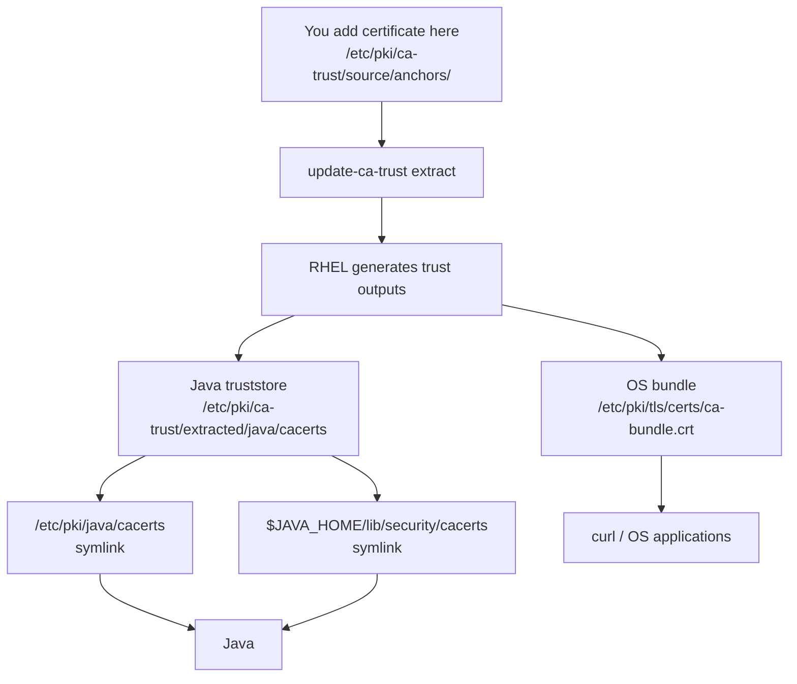
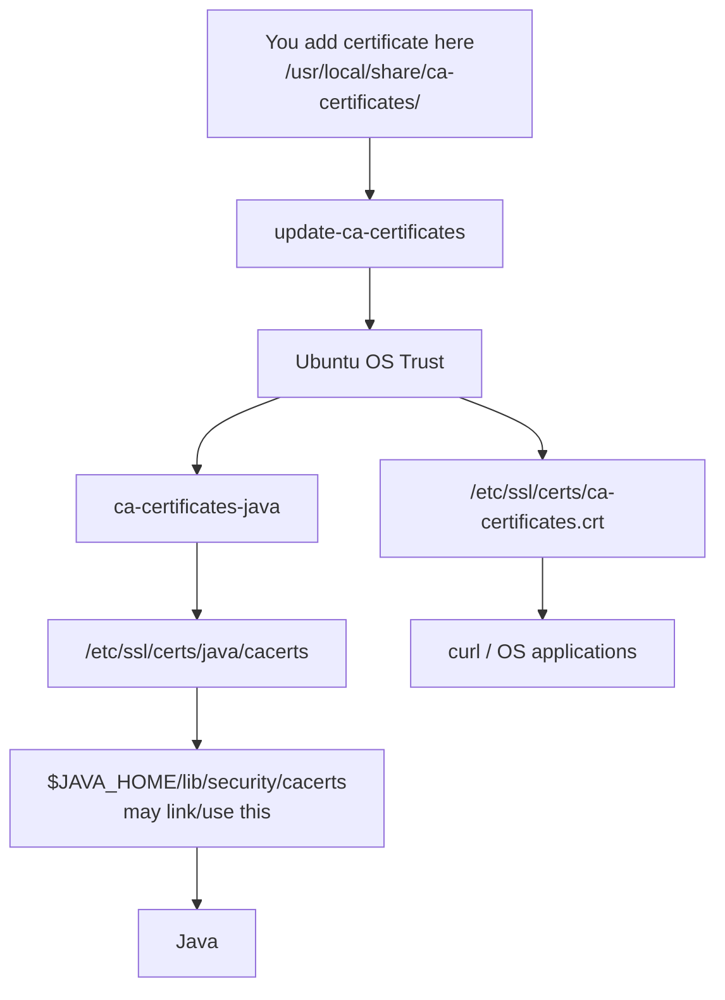
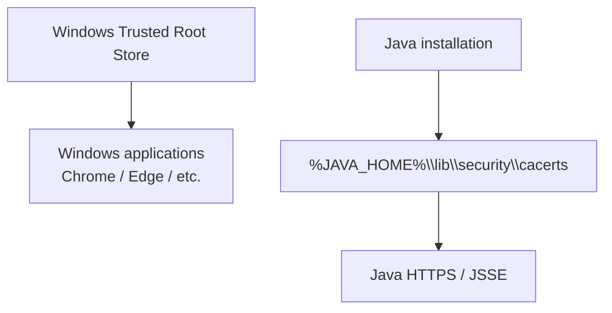
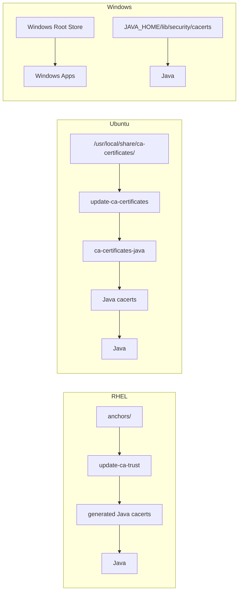

# Java Truststore Integration by OS

The cleanest way is to think in terms of

**“input trust source → generated Java truststore → Java reads it.”**

## 1. RHEL / OpenShift

In your environment, you observed:

```text
/etc/pki/java/cacerts
    -> /etc/pki/ca-trust/extracted/java/cacerts

$JAVA_HOME/lib/security/cacerts
    -> /etc/pki/ca-trust/extracted/java/cacerts
```

So both Java paths point to the **same generated truststore**.



So if you do:

```bash
cp company-root.crt \
  /etc/pki/ca-trust/source/anchors/

update-ca-trust extract
```

RHEL regenerates both the normal OS trust and the Java-compatible truststore. Red Hat recommends managing Java trust this way and identifies `/etc/pki/java/cacerts` as the global Java trust-anchor repository. ([Red Hat Docs](https://docs.redhat.com/en/documentation/red_hat_build_of_openjdk/17/html/configuring_red_hat_build_of_openjdk_17_on_rhel_with_fips/openjdk-default-fips-configuration?utm_source=chatgpt.com "Chapter 3. FIPS automation in Red Hat build of OpenJDK 17 | Configuring Red Hat build of OpenJDK 17 on RHEL with FIPS | Red Hat build of OpenJDK | 17 | Red Hat Documentation"))

### Important

Java is **not reading**:

```text
/etc/pki/ca-trust/source/anchors/
```

directly.

Instead:

```text
anchors
   ↓
update-ca-trust
   ↓
generated Java cacerts
   ↓
Java
```

---

## 2. Ubuntu / Debian

Same idea, different paths.

You put your certificate here:

```text
/usr/local/share/ca-certificates/
```

Then:

```bash
sudo update-ca-certificates
```

Ubuntu generates its OS trust:

```text
/etc/ssl/certs/
/etc/ssl/certs/ca-certificates.crt
```

If `ca-certificates-java` is installed, it also maintains:

```text
/etc/ssl/certs/java/cacerts
```

Ubuntu tooling can then make a packaged JVM's `cacerts` point to this system-managed Java truststore. ([Ubuntu Manpages](https://manpages.ubuntu.com/manpages/questing/man1/make-jpkg.1.html?utm_source=chatgpt.com "Ubuntu Manpage: make-jpkg - builds Debian packages from Java binary distributions"))



Check your actual JDK:

```bash
readlink -f "$JAVA_HOME/lib/security/cacerts"
```

If you get:

```text
/etc/ssl/certs/java/cacerts
```

then that Java installation is integrated with Ubuntu's system certificate management.

---

## 3. Windows

Windows is different.

There is a native Windows trust store:

```text
Windows
└── Trusted Root Certification Authorities
```

Browsers and many Windows-native applications use it.

But a normal Java installation usually still has:

```text
%JAVA_HOME%\lib\security\cacerts
```

as its default JSSE truststore. Java's normal truststore search ultimately falls back to `java.home/lib/security/cacerts`. ([Oracle Documentation](https://docs.oracle.com/en/java/javase/18/security/java-secure-socket-extension-jsse-reference-guide.html?utm_source=chatgpt.com "Java Secure Socket Extension (JSSE) Reference Guide"))



So unlike your RHEL setup, don't normally assume:

```text
Windows Trusted Root
       ↓ automatically
Java cacerts
```

Java does provide the `Windows-ROOT` keystore type through the Windows `SunMSCAPI` provider, so Java applications can explicitly access the native Windows certificate store, but that is not the same as the ordinary default `cacerts` behavior. ([Oracle Documentation](https://docs.oracle.com/en/java/javase/26/security/oracle-providers.html?utm_source=chatgpt.com "JDK Providers Documentation"))

---

## The difference in one diagram



## What to remember

|OS|Where you normally add corporate CA|What happens for Java|
|---|---|---|
|**RHEL**|`/etc/pki/ca-trust/source/anchors/`|`update-ca-trust` generates Java `cacerts`; JDK often symlinks to it|
|**Ubuntu**|`/usr/local/share/ca-certificates/`|`update-ca-certificates` + `ca-certificates-java` maintains Java `cacerts`|
|**Windows**|Windows Trusted Root store|Java normally still has its own `JAVA_HOME\lib\security\cacerts`|

For your RHEL container specifically, the mental model is simply:

```text
anchors/
   ↓
update-ca-trust extract
   ↓
ONE generated Java cacerts
   ↑                    ↑
/etc/pki/java/cacerts   $JAVA_HOME/lib/security/cacerts
       both point here
```

That is why adding a CA through the RHEL trust mechanism makes it available to both `curl` and the distro-integrated Java runtime, through different generated trust outputs.