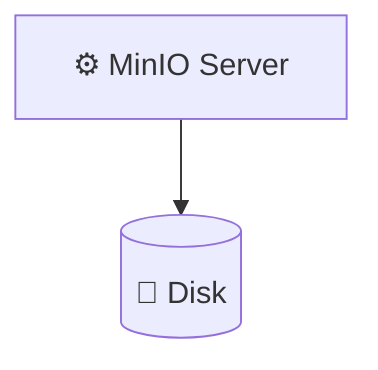
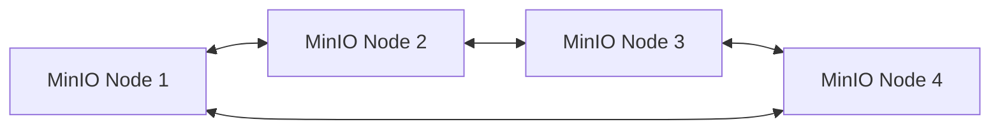
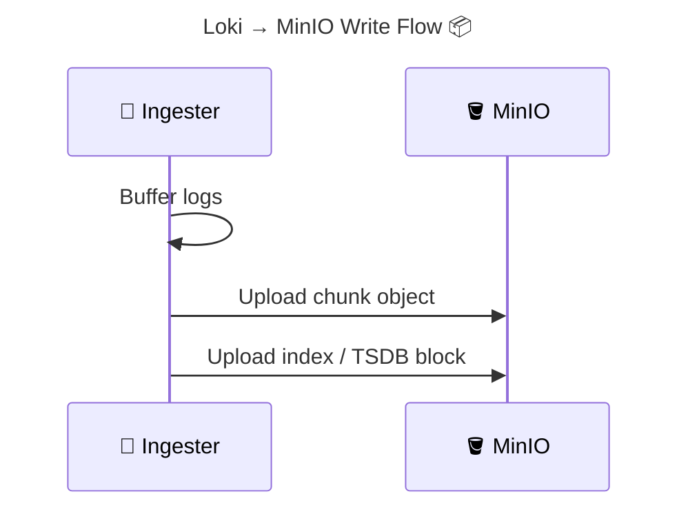
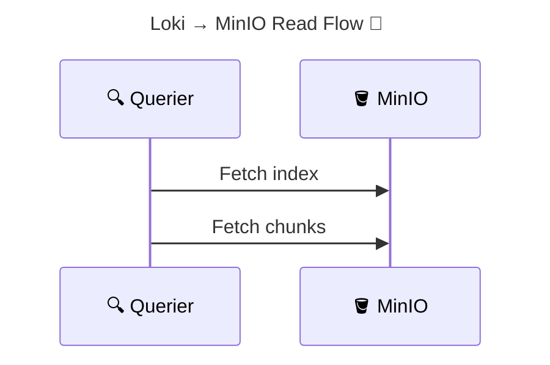

Below is a **complete, system-level explanation of MinIO**, written in the **same structured, mental-model style** as your Loki, Alloy, and LogQL topics—focused on **why it exists, how it works, and why Loki depends on it**.

---

# 🧠 **MinIO Internals** (_S3-Compatible Object Storage, Explained for Loki Users_)

> **MinIO** is a **high-performance, S3-compatible object storage system** designed to run **anywhere** (Kubernetes, VMs, bare metal).
> It provides the **same API semantics as Amazon S3**, but under **your control**, making it ideal as a backend for **Grafana Loki**.

---


---

## 🧠 One-Sentence Mental Model (Critical)

> **MinIO is “S3 that you own”: same API, same behavior, zero cloud lock-in.**

If you understand S3, you already understand MinIO.

---

## 🔴 **Problem: Why Loki Needs Object Storage**

Loki is built on one hard assumption:

> **Logs must be stored cheaply, durably, and at infinite scale.**

Traditional filesystems fail because:

- Disks are finite
- Scaling is manual
- Replication is complex

Object storage solves this—and MinIO lets you run it **yourself**.

---

## 🟢 **What MinIO Is (and Is NOT)**

### ✅ MinIO IS:

- Object storage (S3 API)
- Horizontally scalable
- Erasure-coded
- Kubernetes-native
- High-throughput

### ❌ MinIO is NOT:

- A filesystem (POSIX)
- A block store
- A database
- A cache

---

## ⚙️ **Core Concepts (You Must Know These)**

### 1️⃣ Objects

An **object** = data + metadata + unique key

```
logs/prod/app/api/2025/01/01/chunk.gz
```

---

### 2️⃣ Buckets

A **bucket** = top-level namespace

Examples:

- `loki-chunks`
- `loki-index`
- `loki-admin`

Buckets are like **databases**, not folders.

---

### 3️⃣ Keys (Paths)

Keys **look** like directories, but they’re just strings.

There is **no real hierarchy**.

---

## 🧱 **MinIO Architecture (Single vs Distributed)**

---

### 🟥 Single-Node (Dev / Test)

<div align="center" style="background-color:#1f2a2aff;border-radius:10px;border:2px solid">



</div>

- Simple
- No HA
- Not production-safe

---

### 🟢 Distributed MinIO (Production)

<div align="center" style="background-color:#232b2dff;border-radius:10px;border:2px solid">



</div>

- Erasure coding
- Node failure tolerance
- Horizontal scale
- Kubernetes-friendly

---

## 🧠 **Erasure Coding (Why MinIO Is Safe)**

Instead of full replicas, MinIO uses **erasure coding**:

| Concept       | Meaning               |
| ------------- | --------------------- |
| Data shards   | Actual data           |
| Parity shards | Recovery info         |
| Result        | Lose nodes, keep data |

Example:

- 4 data + 2 parity
- Can lose **2 disks** without data loss

This is **why MinIO is used in production**.

---

## 🔐 **Security Model**

MinIO uses **S3-style security**:

- Access Key (username)
- Secret Key (password)
- Bucket policies
- IAM-like rules

Example (Loki):

```yaml
accessKey: minioadmin
secretKey: minioadmin123
```

---

## 🌐 **S3 Compatibility (Why Loki Works with MinIO)**

Loki speaks **S3 API**, not “AWS”.

So Loki does:

```text
PUT /bucket/object
GET /bucket/object
LIST /bucket
```

MinIO implements **the same API**.

👉 Loki doesn’t care if it’s:

- AWS S3
- MinIO
- Ceph RGW

---

## 🧠 **How Loki Uses MinIO (Very Important)**

Loki stores **two things**:

| Data                | Stored As |
| ------------------- | --------- |
| Log chunks          | Objects   |
| Index / TSDB blocks | Objects   |

Example bucket layout:

```
loki-chunks/
  fake/
  index/
  tsdb/
```

MinIO is **the source of truth**.

---

## ✍️ **Write Flow: Loki → MinIO**

<div align="center" style="background-color:#232b2dff;border-radius:10px;border:2px solid">



</div>

---

## 📖 **Read Flow: Loki → MinIO**

<div align="center" style="background-color:#232b2dff;border-radius:10px;border:2px solid">



</div>

---

## 🧠 **Why MinIO Is Perfect for Loki**

| Requirement     | MinIO |
| --------------- | ----- |
| Cheap storage   | ✅    |
| High throughput | ✅    |
| HA              | ✅    |
| Kubernetes      | ✅    |
| S3 API          | ✅    |
| Self-hosted     | ✅    |

---

## 🔴 **Common MinIO Misconceptions**

| Myth                          | Reality                           |
| ----------------------------- | --------------------------------- |
| MinIO is slow                 | ❌ (often faster than S3 on-prem) |
| MinIO is not production-ready | ❌                                |
| MinIO is just for testing     | ❌                                |
| MinIO stores files            | ❌ (objects only)                 |

---

## 🧠 **Operational Best Practices (Important)**

### ✅ For Loki:

- Use **distributed MinIO**
- Separate buckets for:

  - chunks
  - index / TSDB

- Enable versioning (optional)
- Monitor disk IO

### ❌ Avoid:

- Single-node MinIO in prod
- Mixing workloads in same bucket
- Running without persistence

---

## 🧠 Memorization Block

### 🔑 Mnemonic: **B-O-K-E**

| Letter | Meaning        |
| ------ | -------------- |
| **B**  | Buckets        |
| **O**  | Objects        |
| **K**  | Keys (paths)   |
| **E**  | Erasure coding |

If Loki loses data → check **E** first.

---

## 🧠 Final Mental Stack (Your Full System)

```
Pods
 → Alloy (collect)
 → Loki (index labels)
 → MinIO (store objects)
 → Grafana (query)
```

Each layer has **one job only**.

---

## 🧠 Final Takeaway

- MinIO is not “extra”
- It is **foundational** for Loki
- S3 compatibility = freedom
- Erasure coding = safety
- Kubernetes-native = scale

> **If Loki is the brain, MinIO is the long-term memory.**

---

## 🔜 Perfect Next Topics (Natural Continuation)

Based on everything you’ve learned, the best next deep dives are:

1. **Loki retention & compactor internals (how data is deleted)**
2. **MinIO vs AWS S3 vs Azure Blob (practical comparison)**
3. **MinIO deployment patterns in Kubernetes (StatefulSet deep dive)**
4. **Bucket layout & performance tuning for Loki**
5. **Failure scenarios: disk loss, node loss, recovery**

Tell me which one you want next.
