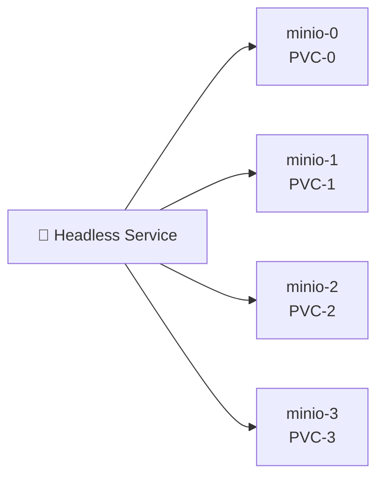
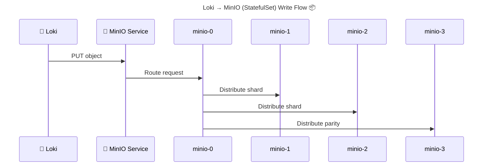

# 🧠 **MinIO Deployment Patterns in Kubernetes**

## (_StatefulSet Deep Dive – How Production MinIO Really Works_)

> In Kubernetes, **MinIO** must be deployed as a **stateful distributed system**, not a stateless app.
> That makes **StatefulSet + PersistentVolumes** the **only correct production pattern**.

---


---

## 🧠 One-Sentence Mental Model (Critical)

> **MinIO on Kubernetes behaves like a distributed database, not like an app — StatefulSet gives it identity, storage, and stability.**

If you forget everything else, remember this.

---

## 🔴 **Why Deployment Pattern Matters (Very Important)**

MinIO is responsible for:

- **Durable storage**
- **Erasure coding**
- **Object integrity**
- **Serving Loki’s only source of truth**

If MinIO loses disks or identities → **Loki data is gone**.

So:

> **How MinIO is deployed = how safe your logs are**

---

## 🧩 **MinIO Deployment Options in Kubernetes**

Let’s be explicit.

| Pattern               | Valid? | Why                       |
| --------------------- | ------ | ------------------------- |
| Deployment + emptyDir | ❌     | Data loss on restart      |
| Deployment + PVC      | ❌     | Pod identity not stable   |
| StatefulSet + PVC     | ✅     | Stable identity + storage |
| External MinIO (VMs)  | ✅     | Outside cluster           |

For **in-cluster production MinIO** → **StatefulSet only**.

---

## 🟥 **Anti-Pattern: Deployment (Why It’s Wrong)**

```yaml
kind: Deployment
```

### ❌ Problems:

- Pod names change
- Volumes can remount incorrectly
- MinIO nodes lose identity
- Erasure sets break
- Cluster corruption possible

> **Never deploy MinIO as a Deployment in prod.**

---

## 🟢 **Correct Pattern: StatefulSet**

### Why StatefulSet Works

StatefulSet guarantees:

- Stable pod names (`minio-0`, `minio-1`)
- Stable network identity
- Stable volume attachment
- Ordered startup (important)

This matches **MinIO’s internal assumptions**.

---

## 🧱 **Canonical MinIO StatefulSet Architecture**

<div align="center" style="background-color:#232b2dff;border-radius:10px;border:2px solid">



</div>

---

## 🧠 **Key Kubernetes Primitives (Must Know)**

### 1️⃣ Headless Service

```yaml
clusterIP: None
```

Purpose:

- DNS entries per pod
- Enables peer discovery
- Required for distributed MinIO

MinIO nodes discover each other as:

```ini
minio-0.minio.logging.svc.cluster.local
```

---

### 2️⃣ StatefulSet

```yaml
kind: StatefulSet
replicas: 4
```

Guarantees:

- Stable ordinal indices
- Predictable scaling
- Safe rolling updates

---

### 3️⃣ PersistentVolumeClaims

Each pod gets **its own disk**:

```yaml
volumeClaimTemplates:
  - name: data
```

Result:

```ini
minio-0 → pvc-minio-0
minio-1 → pvc-minio-1
```

---

## 🧠 **Why Even Numbers Matter (Erasure Coding Rule)**

MinIO requires:

- **Minimum 4 drives**
- **Even number of nodes**

Typical setups:

- 4 nodes (recommended minimum)
- 8 nodes
- 16 nodes

Why?

> Erasure coding requires balanced data + parity shards.

---

## 🧠 **Erasure Coding in Kubernetes Context**

Example (4 nodes):

| Node    | Role          |
| ------- | ------------- |
| minio-0 | Data + parity |
| minio-1 | Data + parity |
| minio-2 | Data + parity |
| minio-3 | Data + parity |

MinIO can lose:

- 1–2 nodes (depending on config)
- Still serve data safely

---

## ✍️ **Write Flow (MinIO on K8s)**

<div align="center" style="background-color:#232b2dff;border-radius:10px;border:2px solid">



</div>

---

## 🔐 **StorageClass Considerations (Critical)**

### Recommended:

- SSD-backed storage
- ReadWriteOnce (RWO)
- Low latency

### Avoid:

- Network filesystems (NFS)
- Slow HDDs
- Shared volumes

> **MinIO expects real disks, not shared filesystems.**

---

## 🧠 **Scaling MinIO in Kubernetes**

### ❌ Vertical scaling

- Increasing CPU/memory only
- Limited benefit

### ✅ Horizontal scaling

- Increase StatefulSet replicas
- Add disks (PVCs)

Scaling rules:

- Always scale by **even numbers**
- Never remove disks casually
- Let MinIO rebalance

---

## 🔴 **Failure Scenarios (This Is Why StatefulSet Matters)**

### Scenario 1️⃣ Pod Restart

- Pod name stays the same
- PVC reattaches
- MinIO rejoins cluster
  ✅ Safe

---

### Scenario 2️⃣ Node Failure

- Pod rescheduled
- Same PVC remounted
- Erasure coding handles loss
  ✅ Safe

---

### Scenario 3️⃣ PVC Loss

- Disk gone permanently
- Depends on parity
  ⚠️ Risky if multiple losses

---

## 🧠 **Why Loki + MinIO Is a Perfect Match**

| Loki Needs        | MinIO Provides |
| ----------------- | -------------- |
| Object storage    | ✅             |
| HA                | ✅             |
| Kubernetes-native | ✅             |
| S3 API            | ✅             |
| Cheap scaling     | ✅             |

But **only if MinIO is deployed correctly**.

---

## 🔴 **Common Mistakes (Very Important)**

| Mistake            | Result           |
| ------------------ | ---------------- |
| Using Deployment   | Data corruption  |
| Single-node MinIO  | No HA            |
| Too few disks      | Write failures   |
| Wrong StorageClass | Poor performance |
| Sharing volumes    | Data loss        |

---

## 🧠 Memorization Block

### 🔑 Mnemonic: **S-H-P-E**

| Letter | Meaning            |
| ------ | ------------------ |
| **S**  | StatefulSet        |
| **H**  | Headless service   |
| **P**  | Persistent volumes |
| **E**  | Erasure coding     |

If MinIO breaks → check **S-H-P-E**.

---

## 🧠 Final Takeaway (Very Important)

- MinIO ≠ stateless service
- Kubernetes ≠ automatic safety
- StatefulSet gives MinIO:

  - Identity
  - Storage
  - Stability

- Loki depends on MinIO **100%**

> **If MinIO is misdeployed, Loki is lying to you about durability.**

---

## 🔜 Perfect Next Topics (Logical Continuation)

Based on your stack, the most valuable next deep dives are:

1. **MinIO vs AWS S3 vs Azure Blob (Loki-focused comparison)**
2. **MinIO bucket layout & performance tuning for Loki**
3. **Loki retention & compactor internals**
4. **Failure recovery: replacing a MinIO node safely**
5. **Full production MinIO Helm values explained**

Tell me which one you want next.
