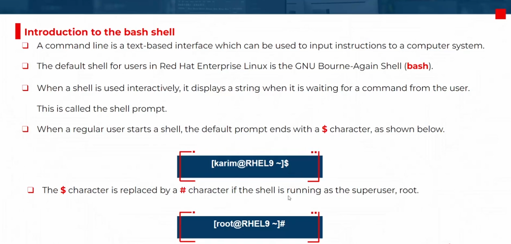
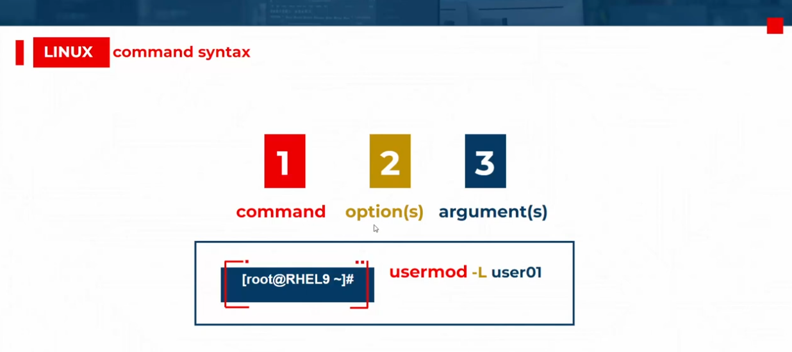

# Access Command Line

<div style="text-align: center">
  
</div>

---

<div style="text-align: center">
  
</div>

---

## Most Common Command

### 1. `ls`

> Lists the contents of a directory

```bash
# List the contents of the current directory
ls

# List the contents of a specific directory
ls /path/to/directory

# List the contents of the current directory in a long format
ls -l

# List the contents of the current directory including hidden files and directories
ls -a

# List the contents of the current directory in a long format, including hidden files and directories
ls -la
```

### 2. `tree`

> Lists the contents of a directory in a tree-like format

```bash
# List the contents of the current directory in a tree-like format
tree

# List the contents of the current directory in a tree-like format for only level 1
tree -L 1
```

### 3. `which`

> Displays the full path of a command

```bash
# Display the full path of the `ls` command
which ls
```

### 4. `data`

> Displays the current date and time  
> (+) sign specifies a format string for the date command.

```bash
date
# Sat Jul 19 23:11:14 EEST 2025

date +%X
# 07/19/25

date +%R
# 11:11:24 PM
```

> 🚨 it can also be used by the super user to set the system clock.

### 5. `passwd`

> Changes a user's own password

```bash
passwd

# changing password for user <user-name>

# Current password: <old-password>
# New password: <new-password>
# Retype new password: <new-password>

# passwd: all authentication tokens updated successfully.
```

> 🚨 the super user can use the `passwd` command to change other users's passwords.

### 6. `file`

> scans the beginning of the file's contents and displays what type it is.  
> the files to be classified are passed as arguments to the command.

```bash
file /etc/passwd
# /etc/passwd: ASCII text

file /home
# /home: directory
```

### 7. `cat`

> view the contents of files

```bash
cat /etc/passwd

cat file1 file2
```

### 8. `less`

> Display one page of a file at a time and lets you scroll at your leisure.

- **up or down**: to scroll up or down in the file
- **space**: for jum to nex page
- **/**: used to search with specific patter

```bash
# display the entire file contents with pagination
less /etc/passwd
```

### 9. `head` and `tail`

> Display the beginning and end of a file, respectively (10 lines of the file).  
> `-n` option allows a different number of lines to be specified.

```bash
# display the first 2 lines
head -n 2 /etc/passwd
```

```bash
# display the last 3 lines
tail -n 3 /etc/passwd
```

### 10. `history`

> Displays a list of previously executed commands prefixed with their command number.  
> (!) is a meta character that is used to expand previously executed commands without re-typing them.  
> `-c` option allows the history to be cleared.

```bash
# expand the commands history with execution number
history
```

```bash
# execute 14'th command
!14
```

```bash
# execute the last command
!!
```

> 🚨 CTRL + R : search for a specific string in the command history

## Terminal shortcuts

### **`TAB` Completion**

> It is a feature that allows you to automatically complete commands or file names as you type them.  
> if the characters typed are not unique, pressing twice tab will display a list of all possible completions.

### **(`\`) Continue the command on the next line**

> It is a feature that allows you to continue a command on the next line by typing a backslash (`\`) at the end of the current line.

```bash
# continue the command on the next line
ls \
-a \
-l
```

### Terminal Keyboard Shortcuts

#### 1. `Ctrl + L`: clear the terminal screen

#### 2. `Ctrl + C`: terminate a running process

#### 3. `Ctrl + Z`: suspend a running process

#### 4. `Ctrl + D`: exit the terminal

#### 5. `Ctrl + K`: delete the text from the cursor to the end of the line

#### 6. `Ctrl + U`: delete the text from the cursor to the beginning of the line

#### 7. `Ctrl + Alt + Backspace`: Delete the word before the cursor

#### 8. `Ctrl + A`: move the cursor to the beginning of the line

#### 9. `Ctrl + E`: move the cursor to the end of the line

#### 10. `Ctrl + R`: search for a specific string in the history

#### 11. `Ctrl + Shift + C`: Copy the current line

#### 12. `Ctrl + Shift + V`: Paste the copied line
