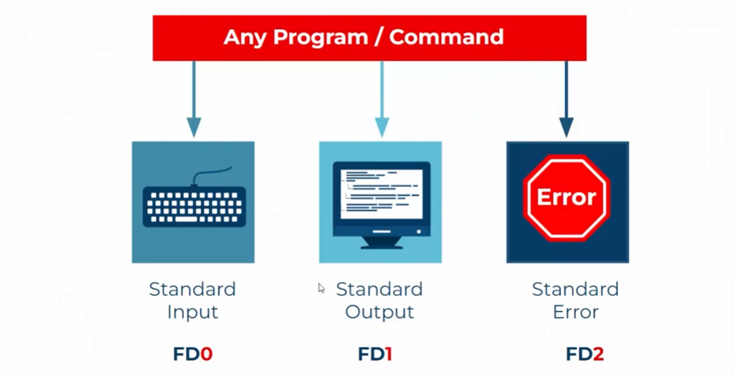
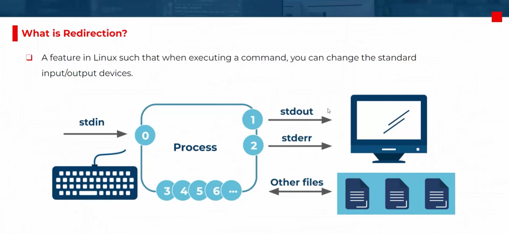
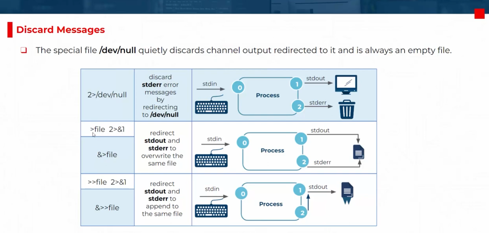
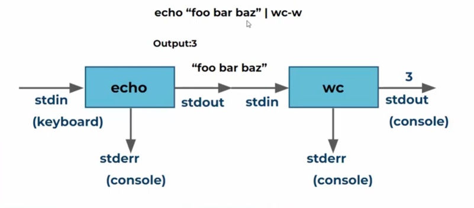

# 📖 Working with Text Files

## 📩 Input Output Redirection

> A feature in linux such that when executing a command, you can change the standard input/output devices.

| Stream   | Description               | File Descriptor |
| -------- | ------------------------- | --------------- |
| `stdin`  | Standard input (keyboard) | `0`             |
| `stdout` | Standard output (screen)  | `1`             |
| `stderr` | Standard error (screen)   | `2`             |

---

<div style="text-align: center">
  
</div>

---

<div style="text-align: center">
  
</div>

---

### 📌 Common Redirection Operators

| Operator      | Purpose                             | Example Usage                     |
| ------------- | ----------------------------------- | --------------------------------- |
| `>`           | Redirect **stdout**, overwrite file | `ls > files.txt`                  |
| `>>`          | Redirect **stdout**, append to file | `echo "new" >> log.txt`           |
| `<`           | Redirect **stdin** from a file      | `sort < names.txt`                |
| `1>`          | Explicitly redirect **stdout**      | `ls 1> output.txt`                |
| `2>`          | Redirect **stderr**                 | `ls /fakepath 2> error.txt`       |
| `2>>`         | Append **stderr** to file           | `ls /fakepath 2>> error.log`      |
| `2>/dev/null` | Discard **stderr** (ignore errors)  | `find / -name passwd 2>/dev/null` |
| `&>`          | Redirect both **stdout and stderr** | `command &> all_output.txt`       |
| `2>&1`        | Merge **stderr** into **stdout**    | `ls /fakepath > output.txt 2>&1`  |

---

<div style="text-align: center">
  
</div>

---

### 🧪 Practical Examples

#### ✅ Redirect stdout to a file

```bash
# Saves the output of `ls` into `list.txt`.
ls > list.txt
```

#### ✅ Redirect stderr to a file

```bash
# Saves the error message into `error.txt`.
ls /notfound 2> error.txt
```

#### ✅ Redirect both stdout and stderr

```bash
# Combines both outputs into `all.txt`.
ls /etc /notfound > all.txt 2>&1
```

#### ✅ Ignore errors completely

```bash
# Suppresses permission errors and shows only valid results.
find / -name passwd 2>/dev/null
```

#### ✅ Append output instead of overwriting

```bash
echo "New log entry" >> log.txt
```

---

### 🧠 Bonus Tip

You can also use redirection with file descriptors in scripts:

```bash
# This sends output to file descriptor 3, which is tied to `output.txt`.
exec 3>output.txt
echo "Hello" >&3
```

---

## 🪈 Piping

> Piping uses the `|` symbol to **connect commands**, passing the **stdout** (standard output) of one command as the **stdin** (standard input) of the next.

```bash
command1 | command2 | command3
```

Each command runs **simultaneously**, and data flows **left to right**.

---

<div style="text-align: center">
  
</div>

<div style="text-align: center">
  
</div>

---

### 🧪 Practical Examples

#### 1. **Filter Files with `grep`**

```bash
# Lists only `.txt` files from the current directory.
ls -l | grep ".txt"
```

#### 2. **Count Files**

```bash
# Counts how many files are in the directory.
ls | wc -l
```

#### 3. **Sort and Remove Duplicates**

```bash
# Sorts names and removes duplicates.
cat names.txt | sort | uniq
```

#### 4. **View Long Output Page-by-Page**

```bash
# Lets you scroll through the output interactively.
ls -l /usr/bin | less
```

#### 5. **Combine with Redirection**

```bash
# Saves filtered output to a file.
ls | grep "config" > config_files.txt
```

---

### 🧠 Why Use Pipes?

- **Efficiency**: No need for intermediate files.
- **Modularity**: Each command does one job well.
- **Automation**: Perfect for chaining tasks in scripts.

---

### ⚠️ Tips

- You can chain **multiple commands**.
- Use `tee` to **split output** to both screen and file:

  ```bash
  ls | tee files.txt
  ```

- Combine with `cut`, `awk`, `sed`, `sort`, `uniq`, `wc`, etc. for powerful workflows.

---
