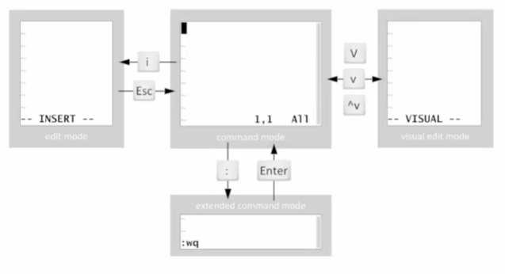
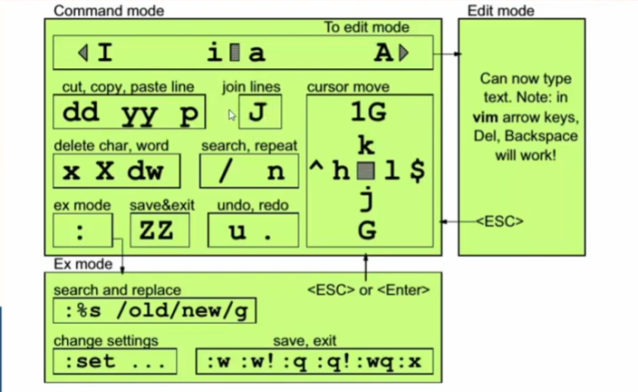

# 📘 `vi` Editor

The `vi` editor is a **powerful terminal-based text editor** available by default on nearly all UNIX-like systems. It's lightweight, fast, and critical for system configuration when GUI tools are unavailable (e.g., in SSH).

> **Fun Fact:** `vi` stands for **Visual Interface**, and it's the basis for `vim`, which stands for **Vi IMproved**.

---

<div style="text-align: center">
  
</div>

---

## 🧭 vi Editor Modes

There are **3 main modes** in `vi`:

| Mode             | Description                                               |
| ---------------- | --------------------------------------------------------- |
| **Normal Mode**  | Default mode – for moving around, deleting, copying, etc. |
| **Insert Mode**  | For inserting/typing new text into the file               |
| **Command Mode** | For saving, quitting, searching, and more (`:` commands)  |

---

## 🚪 How to Open vi

```bash
vi filename
```

- Opens `filename` in the editor.
- If it doesn’t exist, a new file will be created when you save.

---

## 🚦 Mode Navigation

| Action                      | Keystroke |
| --------------------------- | --------- |
| Start editing (insert mode) | `i`       |
| Append after cursor         | `a`       |
| Append at end of line       | `A`       |
| Insert at beginning of line | `I`       |
| Open new line below         | `o`       |
| Open new line above         | `O`       |
| Return to normal mode       | `Esc`     |
| Enter command mode          | `:`       |

---

## ✍️ Insert Mode

When you're in **Insert Mode**, you can type text just like in any text editor.

To enter insert mode:

- `i` → insert before cursor
- `a` → insert after cursor
- `o` → open new line below

**Return to Normal Mode by pressing `Esc`.**

---

## ⌨️ Normal Mode Commands

### 🧭 Cursor Movement

| Key         | Action                  |
| ----------- | ----------------------- |
| `h`         | Move left               |
| `l`         | Move right              |
| `j`         | Move down               |
| `k`         | Move up                 |
| `0`         | Beginning of line       |
| `$`         | End of line             |
| `w`         | Next word               |
| `b`         | Previous word           |
| `G`         | Go to end of file       |
| `gg`        | Go to beginning of file |
| `:<number>` | Go to specific line     |

---

### ✂️ Editing Text

| Command    | Action                        |
| ---------- | ----------------------------- |
| `x`        | Delete character under cursor |
| `dd`       | Delete entire line            |
| `d$`       | Delete to end of line         |
| `D`        | Same as `d$`                  |
| `dw`       | Delete word                   |
| `yy`       | Copy (yank) line              |
| `yw`       | Copy word                     |
| `p`        | Paste after cursor            |
| `P`        | Paste before cursor           |
| `u`        | Undo last change              |
| `Ctrl + r` | Redo last undo                |

---

## 🔎 Searching

In **Normal Mode**:

| Command | Description                |
| ------- | -------------------------- |
| `/word` | Search forward for “word”  |
| `?word` | Search backward for “word” |
| `n`     | Next occurrence            |
| `N`     | Previous occurrence        |

---

## 💾 Saving and Exiting (Command Mode)

Enter command mode by pressing `:` in Normal mode.

| Command       | Description         |
| ------------- | ------------------- |
| `:w`          | Save (write)        |
| `:q`          | Quit                |
| `:wq` or `ZZ` | Save and quit       |
| `:q!`         | Quit without saving |
| `:x`          | Same as `:wq`       |

---

## 🔄 Replace / Substitute

Use **command mode** (`:`) for text replacement.

### 📝 Replace text on a line:

```bash
:s/old/new/
# Replace first occurrence of 'old' with 'new' in the current line
```

### 🔁 Replace all on a line:

```bash
:s/old/new/g
```

### 🌍 Replace in whole file:

```bash
:%s/old/new/g
# % means "all lines"
```

---

## 🧰 Useful Tricks

### 🧵 Show line numbers:

```bash
:set number
```

### 🙈 Hide line numbers:

```bash
:set nonumber
```

### 🔄 Enable/disable text wrapping:

```bash
:set wrap      # Enable
:set nowrap    # Disable
```

### 📄 Read another file into the current file:

```bash
:r /etc/hosts
```

---

## 🧪 Practice Tip

Try this:

```bash
vi demo.txt
# Press i to insert
# Type: Hello Linux World
# Press Esc
# Type: :wq
```

Now check:

```bash
cat demo.txt
```

---

## 💡 vi vs vim

| Feature             | `vi` | `vim` (Vi IMproved) |
| ------------------- | ---- | ------------------- |
| Basic editing       | ✅   | ✅                  |
| Syntax highlighting | ❌   | ✅                  |
| Undo/redo levels    | 1    | Unlimited           |
| Plugins & themes    | ❌   | ✅                  |

If available, always prefer `vim`. To install:

```bash
sudo dnf install vim
```

---

## 🧠 Summary Cheat Sheet

```bash
i      → insert mode
Esc    → normal mode
:      → command mode
:w     → save
:q     → quit
:wq    → save & quit
:q!    → quit without saving
dd     → delete line
yy     → copy line
p      → paste
/word  → search forward
n      → next match
```

---

<div style="text-align: center">
  
</div>

---
