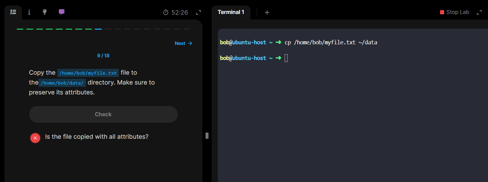

# Questions

## 🔴 Q1



### ❌ What's Missing

The command lacks the `-p` (preserve) option.

- Without `-p`, the copied file will:
  - Get a **new timestamp** (modification and access times).
  - Lose its **original permissions** (e.g., executable bit, read/write flags).
  - Potentially lose **ownership info** (depending on user privileges).

---

### ✅ Correct Command

To preserve attributes like timestamps and permissions, use:

```bash
cp -p /home/bob/myFile.txt ./data
```

- `-p` stands for **preserve**:
  - Keeps **mode**, **ownership**, and **timestamps**.
  - Ensures the copied file is as close as possible to the original.

---

### 🧠 Bonus Tip

If you're copying **directories recursively** and want to preserve everything (including symlinks and extended attributes), use:

```bash
cp -a /source/dir /destination/
```

- `-a` = archive mode = `-dpR` + more
