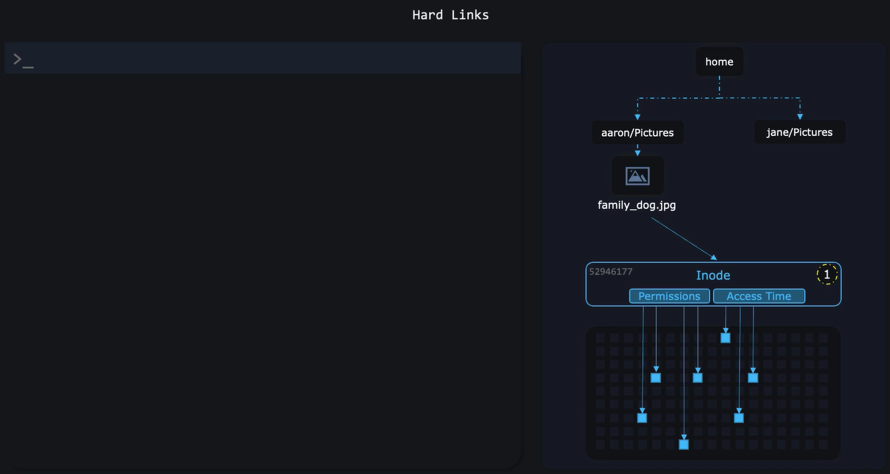
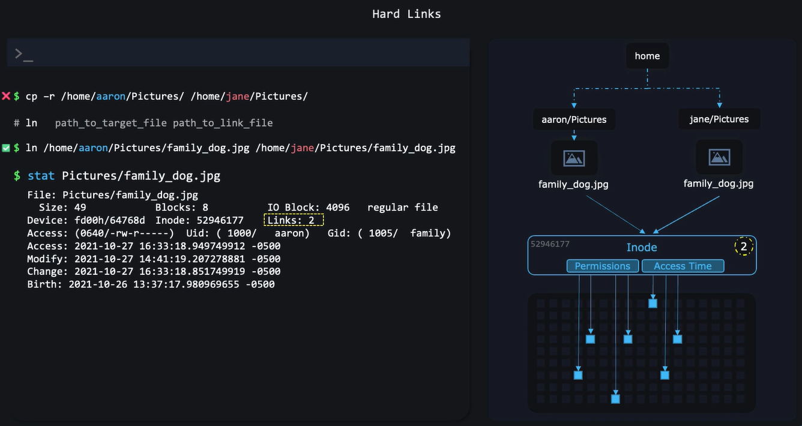
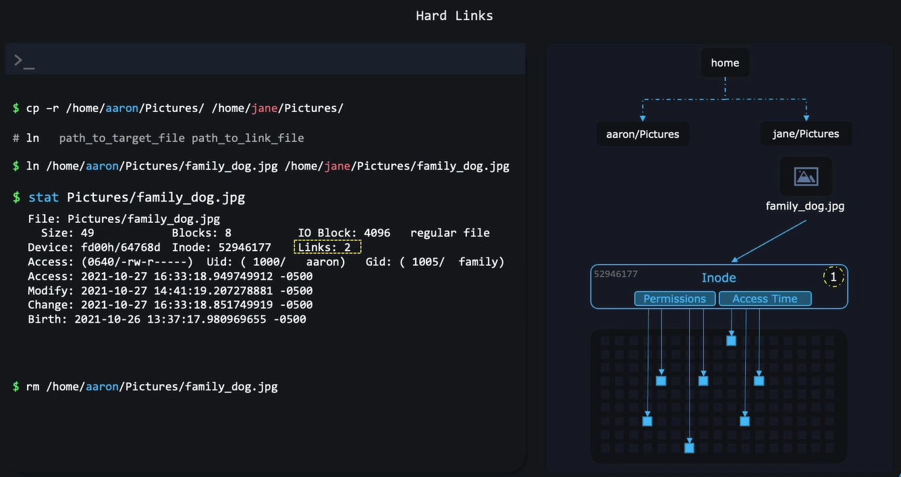
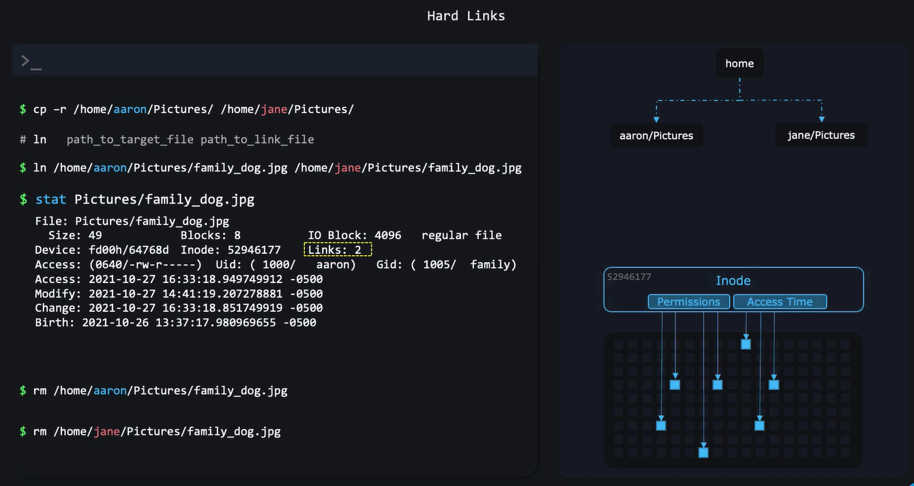
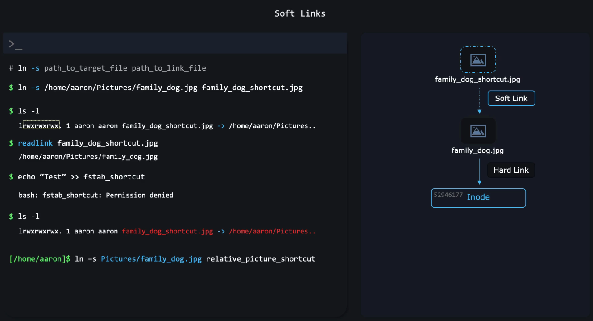
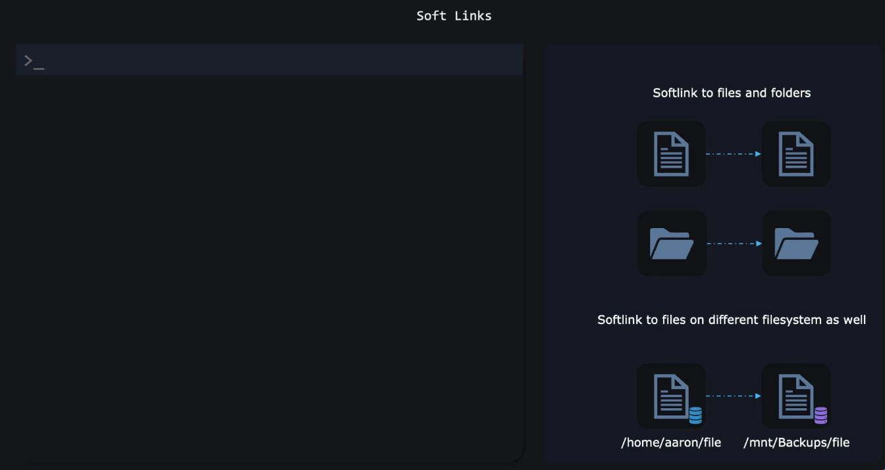

# 🔗 **Linux Links**

In Linux, a **file is not the name you see**.

A file is actually:

- **An inode** → contains the _real_ data (metadata + disk blocks)
- **A directory entry** → the name you see, pointing to an inode

Think of it like this:

```ini
Filename  ───────► Inode ───────► File Data on disk
```

A file can have **multiple names** pointing to the _same inode_.

These names are called **links**.

There are two types:

1. 📌 **Hard links**
2. 🧷 **Soft links (symbolic links)**

Let’s break them down.

---

## 📌 **1. Hard Links** — The Real Twins 👯‍♂️

A **hard link** is a _direct pointer_ to the same inode as the original file.

Meaning:

- ✔ Both files share the same data
- ✔ Deleting one does NOT delete the data
- ✔ They are 100% equal — no “original vs copy”
- ✔ Cannot hard-link to directories
- ✔ Cannot hard-link across filesystems

---

### 🟦 Create a hard link

```bash
ln original.txt hardlink.txt
```

---

### 🟦 Verify using `ls -li`

Use `-i` to show inode numbers.

#### ▶️ Example

```bash
ls -li
```

#### 📤 Expected Output

```text
12345 -rw-r--r-- 2 user user  20 Jan 20 10:00 original.txt
12345 -rw-r--r-- 2 user user  20 Jan 20 10:00 hardlink.txt
```

Notice:

- **Same inode number (`12345`)**
- **Link count is 2**
- Both point to the _exact same file_

---

### 🟦 Modify one — both change

```bash
echo "Hello" >> original.txt
cat hardlink.txt
```

#### 📤 Output

```text
Hello
```

Because they share the same data block.

---

### 🟦 Delete the “original”

```bash
rm original.txt
cat hardlink.txt
```

#### 📤 Output

```text
Hello
```

The file still exists through `hardlink.txt`.

> 💡 Hard links make data _immortal_ unless **all** links are removed.

---

### ⚙️ **Hard Link Internals**

inode is like and object in memory, and file is a pointer to it.  
so you can have more than one point to same object in same object.  
but once all reference removed, then GC will delete the object from memory.(not really delete, just mark as deleted)

#### 🟦 Step 1

<div align="center" style="background-color:#11171F; border-radius: 10px; border: 2px solid">
    
</div>

#### 🟦 Step 2

<div align="center" style="background-color:#11171F; border-radius: 10px; border: 2px solid">
    
</div>

#### 🟦 Step 3

<div align="center" style="background-color:#11171F; border-radius: 10px; border: 2px solid">
    
</div>

#### 🟦 Step 4

<div align="center" style="background-color:#11171F; border-radius: 10px; border: 2px solid">
    
</div>

> Marked as deleted, so os will overwrite new data to it.

### ⚠️ **Hard Links Limitations**

- Hard links are limited to **only files**
- Hard links are limited to **one filesystem**

<div align="center" style="background-color:#11171F; border-radius: 10px; border: 2px solid">
    
</div>

---

## 🧷 **2. Soft Links (Symbolic Links)** — The Shortcut Files 📎

A **soft link** is NOT the same inode.
It is:

- A _separate file_
- That contains a _path_ pointing to the original file
- Very similar to Windows shortcuts

---

<div align="center" style="background-color:#11171F; border-radius: 10px; border: 2px solid">
    
</div>

<div align="center" style="background-color:#11171F; border-radius: 10px; border: 2px solid">
    
</div>

### 🟩 Create a soft link

```bash
ln -s original.txt softlink.txt
```

---

### 🟩 Check with `ls -l`

#### ▶️ Example

```bash
ls -l
```

#### 📤 Expected Output

```text
lrwxrwxrwx 1 user user  13 Jan 20 10:05 softlink.txt -> original.txt
-rw-r--r-- 1 user user  20 Jan 20 10:00 original.txt
```

- The first character `l` means: **this is a link**
- The arrow `->` shows the target

Soft link contains **path**, not data.

---

### 🟩 Modify one — original changes, link reflects it

```bash
echo "New line" >> original.txt
cat softlink.txt
```

#### 📤 Output

```text
New line
```

---

### 🟩 If original file is deleted…

```bash
rm original.txt
cat softlink.txt
```

#### 📤 Output

```text
cat: softlink.txt: No such file or directory
```

The soft link becomes a **broken link** 🔥💔

---

## ⚔️ **Hard Link vs Soft Link**

<div align="center" style="background-color: #255560ff; border-radius: 10px; border: 2px solid">

| Feature                     | Hard Link    | Soft Link (Symbolic)           |
| --------------------------- | ------------ | ------------------------------ |
| Points to                   | inode        | file path                      |
| Breaks if original deleted  | ❌ No        | ✅ Yes                         |
| Link count increases        | ✅ Yes       | ❌ No                          |
| Can link across filesystems | ❌ No        | ✅ Yes                         |
| Works with directories      | ❌ No        | ⚠️ Yes (but not commonly used) |
| Uses extra inode            | ❌ No        | ✅ Yes                         |
| File size                   | Same as file | Size of path (few bytes)       |

</div>

---

## 🧪 **Practical Hands-On Example**

Let’s do everything in one sequence.

---

### 1️⃣ Create a file

```bash
echo "data" > file.txt
```

---

### 2️⃣ Create hard + soft links

```bash
ln file.txt file_hard.txt
ln -s file.txt file_soft.txt
```

---

### 3️⃣ Check inode numbers

```bash
ls -li
```

#### Output:

```text
1001 -rw-r--r-- 2 user user 5 Jan 20 12:00 file.txt
1001 -rw-r--r-- 2 user user 5 Jan 20 12:00 file_hard.txt
1002 lrwxrwxrwx 1 user user 8 Jan 20 12:00 file_soft.txt -> file.txt
```

Observations:

- Hard link → same inode (`1001`)
- Soft link → different inode (`1002`)

---

### 4️⃣ Delete original

```bash
rm file.txt
```

---

### 5️⃣ Test remaining links

#### Hard link

```bash
cat file_hard.txt
```

Output:

```text
data
```

Still works 👌

---

#### Soft link

```bash
cat file_soft.txt
```

Output:

```text
cat: file_soft.txt: No such file or directory
```

Broken 💔

---

## 🎯 **Summary**

- **Hard link** = true clone of the inode
- **Soft link** = shortcut file pointing to a path
- Hard links: reliable, identical twins
- Soft links: lightweight, flexible, but fragile
- Hard links cannot cross filesystems, soft links can
- Deleting original breaks only soft links
