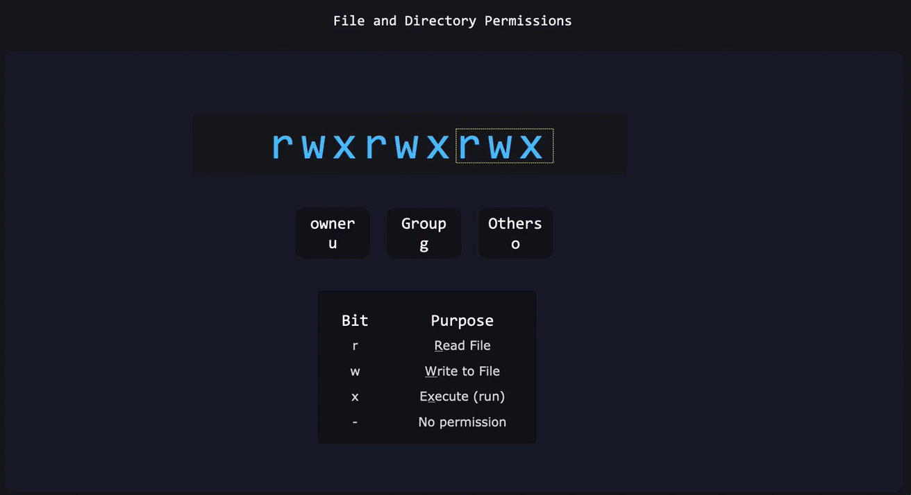
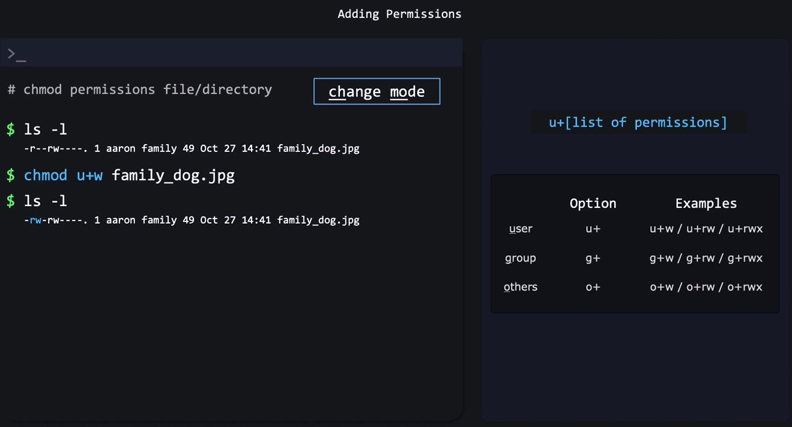

# 🔐 File & Directory Permissions in Linux

Understanding permissions = understanding **who** can do **what** to **which** file or directory.

Every Linux file/directory has:

- **Owner** (user)
- **Group**
- **Permissions** (r, w, x)

Let’s break everything down 💥

---

<div align="center" style="background-color:#11171F; border-radius: 10px; border: 2px solid">
    
</div>

## 🧩 Permission Types (r, w, x)

Permissions appear like this:

```text
-rwxr-xr--
```

Split into groups:

```ini
1st char  | Owner | Group | Others
          | rwx   | r-x   | r--
```

---

### 🔹 Meaning of Each Permission

For **Files**

| Permission | Symbol | Meaning                        |
| ---------- | ------ | ------------------------------ |
| Read       | `r`    | View content (cat, less, open) |
| Write      | `w`    | Modify the file                |
| Execute    | `x`    | Run as a program/script        |

---

For **Directories**

| Permission | Symbol | Meaning                                 |
| ---------- | ------ | --------------------------------------- |
| Read       | `r`    | List files (`ls`)                       |
| Write      | `w`    | Create/delete files inside              |
| Execute    | `x`    | Enter directory (`cd`), access metadata |

> IMPORTANT:
> A directory needs **execute (`x`)** to even _enter_ it.
> A directory needs **write (`w`)** to create/delete files inside it.

---

## 🧲 Viewing Permissions

Use:

```bash
ls -l
```

Example output:

```text
drwxr-x--- 2 user devs 4096 Jan 20 14:22 scripts
-rw-r--r-- 1 user user  120 Jan 20 14:22 notes.txt
```

Breakdown:

```ini
d rwx r-x ---   user  group
│ │   │   │     │     │
│ │   │   │     │     └── Group (devs)
│ │   │   │     └──────── Owner (user)
│ │   │   └────────────── Others permissions
│ │   └────────────────── Group permissions
│ └────────────────────── Owner permissions
└──────────────────────── File type (d = directory, - = file)
```

---

## ➡️ Evaluating Permissions

<div align="center" style="background-color:#11171F; border-radius: 10px; border: 2px solid">
    
</div>

## 🧑‍💻 Changing Permissions — `chmod`

Two ways:

1. **Symbolic mode** → human readable
2. **Numeric mode (octal)** → common in scripts

---

## 🔢 A. Numeric Permissions (Octal)

Each permission has a number:

```ini
r = 4
w = 2
x = 1
```

Add them:

| rwx combo | Value |
| --------- | ----- |
| rwx       | 7     |
| rw-       | 6     |
| r-x       | 5     |
| r--       | 4     |
| --x       | 1     |
| ---       | 0     |

---


---

### 🟦 Example: Give owner rwx, group r-x, others r-x

```bash
chmod 755 script.sh
```

Permissions:

```ini
rwx r-x r-x
```

---

### 🟦 Example: Give owner rw-, group r--, others ---

```bash
chmod 640 notes.txt
```

Permissions:

```ini
rw- r-- ---
```

---

## 🅱️ B. Symbolic Permissions

Syntax:

```bash
chmod who+/-=permission file
```

`who` can be:

| Symbol | Meaning      |
| ------ | ------------ |
| u      | user (owner) |
| g      | group        |
| o      | others       |
| a      | all          |

Permissions: `r`, `w`, `x`

> 📝 When you don’t specify `u`, `g`, `o`, or `a`, the default is `a` **(all)**.

---

<div align="center" style="background-color:#11171F; border-radius: 10px; border: 2px solid">
    
</div>

---

### 🔹 Example 1 — Add execute to owner

```bash
chmod u+x script.sh
```

---

### 🔹 Example 2 — Remove write from group

```bash
chmod g-w data.txt
```

---

### 🔹 Example 3 — Give everyone read permission

```bash
chmod a+r file.txt
```

---

### 🔹 Example 4 — add execute to owner and group and other

```bash
chmod g-w,u+r,o-w data.txt
```

### 🔹 Example 5 — add execute to owner and group

```bash
chmod g-rwx,u+rw,o-r data.txt
```

### 🔹 Example 6 — add execute to owner and group

```bash
chmod g=rwx,u=rw,o=r data.txt
```

---

## 👥 Ownership — `chown` and `chgrp`

Every file has:

- **User owner**
- **Group owner**

---

### 🟦 Change file owner

```bash
sudo chown newuser file.txt
```

---

### 🟦 Change owner and group

```bash
sudo chown newuser:newgroup file.txt
```

---

### 🟦 Change group only

```bash
chgrp devs file.txt
```

---

## 📁 Directory Permission Behavior (Very Important)

### Directory operations require specific permissions:

| Action                 | r   | w   | x   |
| ---------------------- | --- | --- | --- |
| List files (`ls`)      | ✅  | ❌  | ❌  |
| Enter directory (`cd`) | ❌  | ❌  | ✅  |
| Delete files inside    | ❌  | ✅  | ❌  |
| Create files           | ❌  | ✅  | ❌  |
| Rename files           | ❌  | ✅  | ❌  |
| Access file metadata   | ❌  | ❌  | ✅  |

Example:

```bash
chmod 700 private/
```

Means:

- Only owner can enter & list & modify
- Others cannot even _cd_ into it

---

## 🧪 Practical Examples + Outputs

---

### ✔ Example 1 — See permissions

```bash
ls -l
```

Output:

```text
-rw-r--r-- 1 user user  50 Jan 21 notes.txt
```

---

### ✔ Example 2 — Make a script executable

```bash
chmod +x script.sh
```

Check:

```bash
ls -l script.sh
```

Output:

```text
-rwxr-xr-x user user ... script.sh
```

---

### ✔ Example 3 — Lock a file (owner-only)

```bash
chmod 600 secrets.txt
```

Permissions:

```ini
rw-------
```

---

### ✔ Example 4 — Make a directory accessible only to owner

```bash
chmod 700 myfolder
```

```ini
drwx------
```

---

### ✔ Example 5 — Give group access

```bash
chgrp devs project/
chmod 770 project/
```

Result:

```ini
drwxrwx--- user devs project/
```

---

## 🧨 Special Permissions (Bonus)

If you want, I can explain these next:

- **SUID** (execute as file owner)
- **SGID** (execute as group, or create-inherit on dirs)
- **Sticky bit** (`/tmp` behavior: only owner can delete)

Example of sticky bit:

```ini
drwxrwxrwt /tmp
```

Let me know if you want it!

---

## 🎯 Final Summary

- Files & dirs have: **owner**, **group**, **others**
- Permissions:

  - **r**: read
  - **w**: write
  - **x**: execute/enter

- `chmod` changes permissions
- `chown` changes owner
- `chgrp` changes group
- Numeric (755, 644, 600) = fastest for DevOps
- Directory permissions behave differently
