# 🎭 **REGEX = A Language for Describing Patterns**

Think of regex as **the superpower that lets you describe text using rules**, not literal words.

Regex is NOT about searching text.

Regex is about searching **patterns**.

---

<div align="center" style="background-color:#11171F; border-radius: 10px; border: 2px solid">
    
</div>

## 🧠 **The Core Mindset (Never Forget This)**

Regex is made of 4 things:

1. **Characters** (normal letters)
2. **Classes** (sets of characters)
3. **Quantifiers** (how many times)
4. **Anchors** (where in the line)

If you remember these four, you can build any pattern in the world.

---

## 🧩 1. **Normal Characters (Literal Matching)**

These match exactly:

```ini
a   b   c   1   2   3   .   /   =
```

Regex:

```ini
hello
```

Matches:

```ini
hello world
say hello
```

Nothing complicated yet.

---

## 🔮 2. **SPECIAL CHARACTERS — Remember This Story**

Imagine each special regex character is a cartoon superhero with a specific power:

| Symbol | Power             | Memory Trick              |
| ------ | ----------------- | ------------------------- |
| `.`    | Match _anything_  | **Wildcard Joker** 😈     |
| `[]`   | Match one of many | **Character box** 📦      |
| `[^]`  | NOT these         | **Angry box** 😡          |
| `\|`   | OR                | **Alternator** 🔌         |
| `()`   | Grouping          | **Parent trap** 👨‍👩‍👧        |
| `\\`   | Escape            | **The backslash ninja** 🥷 |

You'll never forget them now because of the visuals 😂

---

## 🩳 3. **Character Classes — The Underwear Drawer 🩲**

Think of `[]` as a drawer that contains allowed characters.

```ini
[abc]
```

Means: match **ONE** of these:

- a
- b
- c

---

### **Ranges**

```ini
[a-z]
[A-Z]
[0-9]
```

You just built:

- lowercase letters
- uppercase letters
- digits

---

### **Negation (The Angry Drawer)**

```ini
[^a-z]
```

Means: match ANYTHING _except_ lowercase letters.

Your brain will never forget this now.

---

## 🔥 4. **Quantifiers — The Multipliers**

These tell regex **how many times** something occurs.

| Symbol  | Meaning   | Example                         |
| ------- | --------- | ------------------------------- |
| `*`     | 0 or more | `ab*` → `a`, `ab`, `abbb`       |
| `+`     | 1 or more | `ab+` → `ab`, `abbb`            |
| `?`     | 0 or 1    | `colou?r` → `color` or `colour` |
| `{n}`   | exactly n | `a{3}` → `aaa`                  |
| `{n,}`  | n or more | `a{2,}` → `aa`, `aaa`           |
| `{n,m}` | range     | `a{2,4}` → `aa`, `aaa`, `aaaa`  |

**Memory Trick:**

Think of these like _ordering food_:

- `*` → “keep refilling”
- `+` → “give me at least one”
- `?` → “maybe add sauce”
- `{n}` → “exactly 3 spoons”

---

## 🧲 5. **Anchors — Glue to Attach Patterns**

Anchors do **NOT** match characters.
They match **positions**.

| Anchor | Meaning       | Memory Trick  |
| ------ | ------------- | ------------- |
| `^`    | Start of line | Start of race |
| `$`    | End of line   | Finish line   |
| `\b`   | Word boundary | Between words |
| `\B`   | NOT boundary  | Inside words  |

Examples:

```ini
^ERROR
```

Matches only if line _begins_ with ERROR.

```ini
end$
```

Matches only if line _ends_ with end.

---

## 🧬 6. **Shorthand Character Classes — The DNA of Regex**

| Class | Meaning                          | Memory Trick  |
| ----- | -------------------------------- | ------------- |
| `\d`  | digits 0–9                       | **d = digit** |
| `\w`  | word chars (letters, digits, \_) | **w = word**  |
| `\s`  | whitespace                       | **s = space** |
| `\D`  | NOT digits                       |               |
| `\W`  | NOT word                         |               |
| `\S`  | NOT whitespace                   |               |

Examples:

```ini
\d\d\d
```

Matches any 3-digit number.

```ini
\w+
```

Matches a word.

---

## 🎯 **Putting It All Together — Mini Patterns You'll Never Forget**

### ✔ Match an email (the unforgettable one)

```ini
[A-Za-z0-9._%+-]+@[A-Za-z0-9.-]+\.[A-Za-z]{2,}
```

---

### ✔ Match an IPv4 address

```ini
([0-9]{1,3}\.){3}[0-9]{1,3}
```

Memory trick: **digit up to 3, dot — repeat 3 times — then digit**

---

### ✔ Match a date `YYYY-MM-DD`

```ini
\d{4}-\d{2}-\d{2}
```

Looks EXACTLY like the date.

---

### ✔ Match a URL

```ini
https?://[A-Za-z0-9./_-]+
```

Memory trick:
`s?` means optional “s” → handles http + https.

---

## 🏗️ **REGEX IS LIKE LEGO BLOCKS 🧱**

You can build ANYTHING using:

- character classes
- quantifiers
- anchors
- groups
- alternations
- literals

It’s all LEGO.

Memorize these blocks, and you build ANY pattern.

---

## 🧠 **Regex in Real Life — DevOps Examples**

### ✔ Find IP addresses in logs

```bash
grep -E "([0-9]{1,3}\.){3}[0-9]{1,3}" access.log
```

---

### ✔ Find failed login attempts

```bash
grep -E "Failed|Authentication" auth.log
```

---

### ✔ Extract version numbers

```bash
grep -oE "v[0-9]+\.[0-9]+\.[0-9]+"
```

Output:

```ini
v1.3.7
```

---

### ✔ Validate env variable line

```bash
grep -E "^[A-Z_]+=[A-Za-z0-9_-]+$" .env
```

---

## 🧵 Final Cheat Sheet (Your Style)

| Category        | Syntax   | Meaning           |
| --------------- | -------- | ----------------- |
| Literal         | `hello`  | exact match       |
| Wildcard        | `.`      | any character     |
| Character class | `[a-z]`  | range             |
| Negated class   | `[^x]`   | anything except   |
| Group           | `(text)` | capture           |
| OR              | `a \| b` | alternation       |
| Start           | `^`      | start of line     |
| End             | `$`      | end of line       |
| Zero/more       | `*`      | repeat            |
| One/more        | `+`      | required          |
| Maybe           | `?`      | optional          |
| Exact           | `{n}`    | n times           |
| Range           | `{n,m}`  | n to m            |
| Digit           | `\d`     | 0–9               |
| Word            | `\w`     | letters+digits+\_ |
| Space           | `\s`     | whitespace        |

## `^`

<div align="center" style="background-color:#11171F; border-radius: 10px; border: 2px solid">
    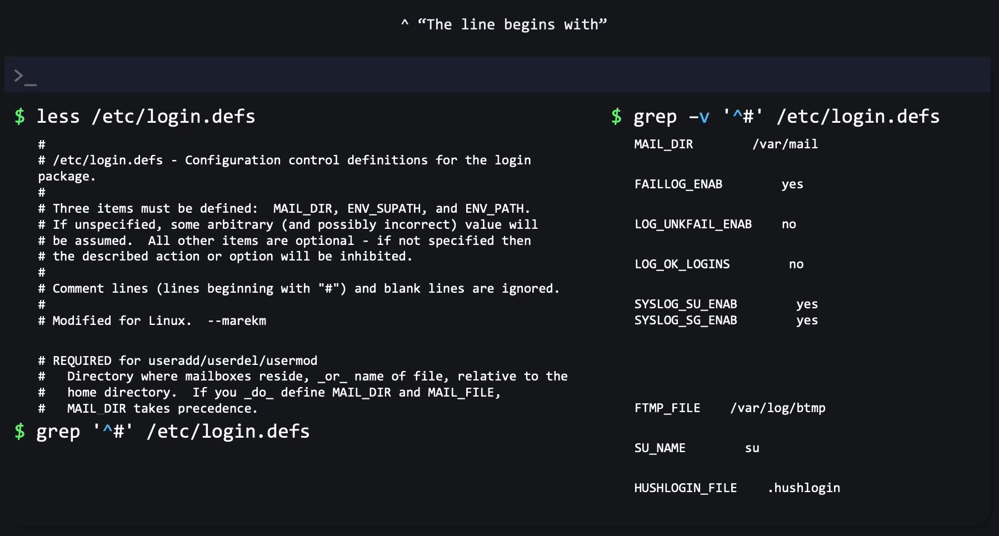
</div>

## `$`

<div align="center" style="background-color:#11171F; border-radius: 10px; border: 2px solid">
    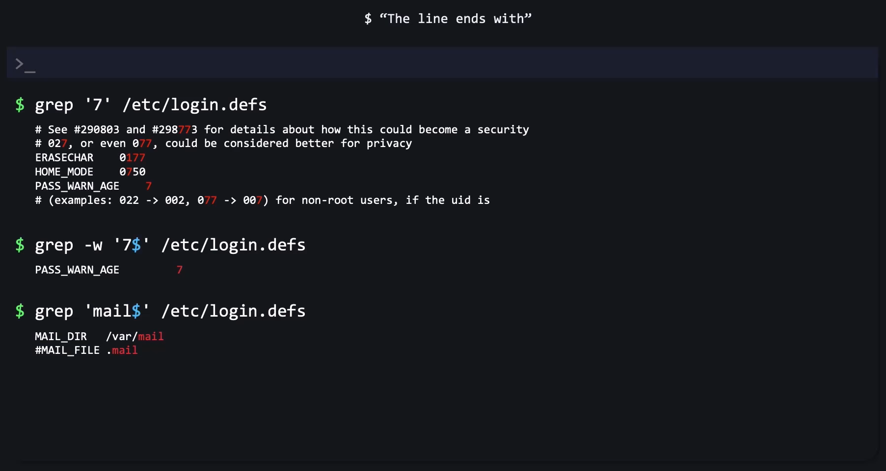
</div>

## `.`

<div align="center" style="background-color:#11171F; border-radius: 10px; border: 2px solid">
    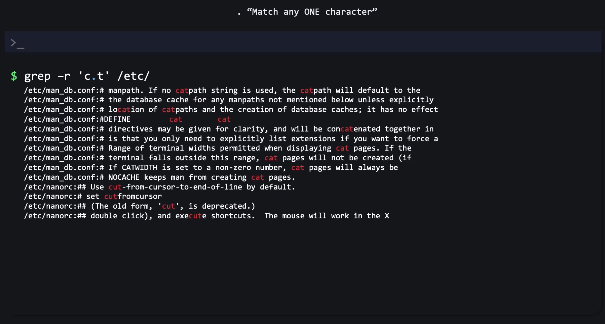
</div>

## `*`

<div align="center" style="background-color:#11171F; border-radius: 10px; border: 2px solid">
    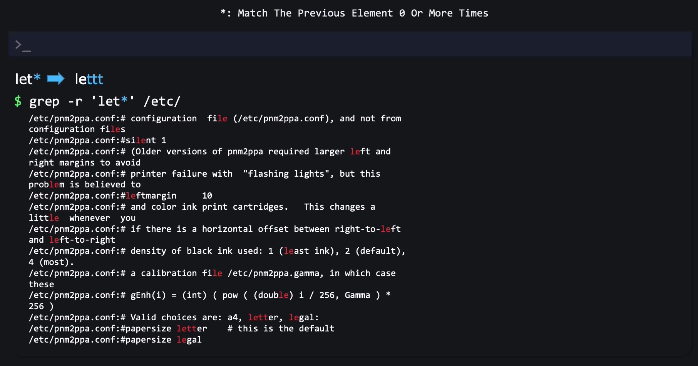
</div>

## `+`

<div align="center" style="background-color:#11171F; border-radius: 10px; border: 2px solid">
    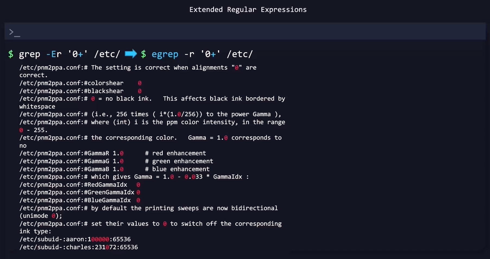
</div>

## `{min,max}`

<div align="center" style="background-color:#11171F; border-radius: 10px; border: 2px solid">
    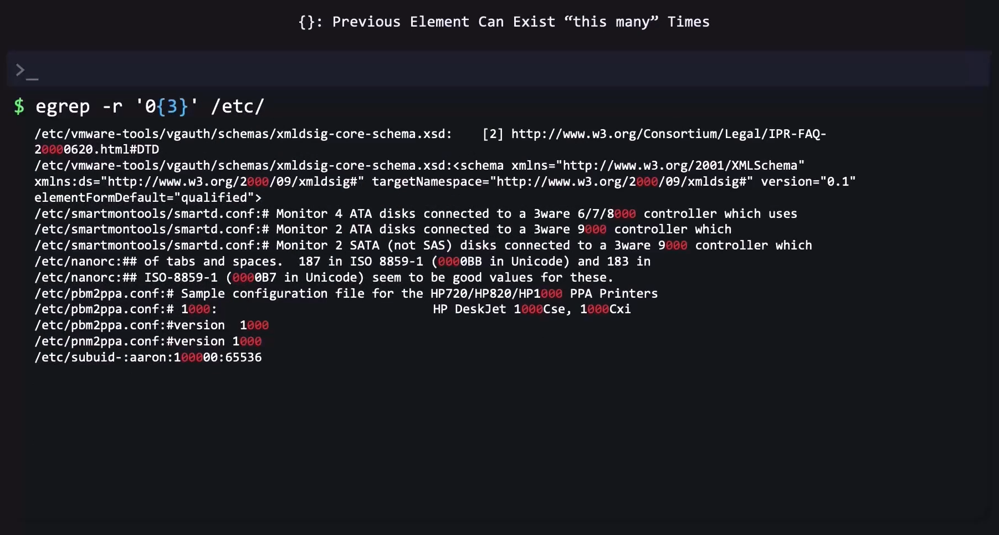
</div>

<div align="center" style="background-color:#11171F; border-radius: 10px; border: 2px solid">
    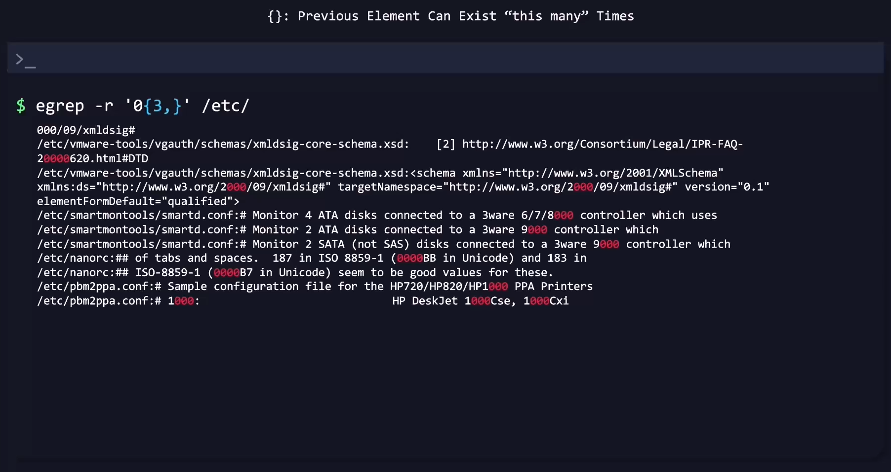
</div>

<div align="center" style="background-color:#11171F; border-radius: 10px; border: 2px solid">
    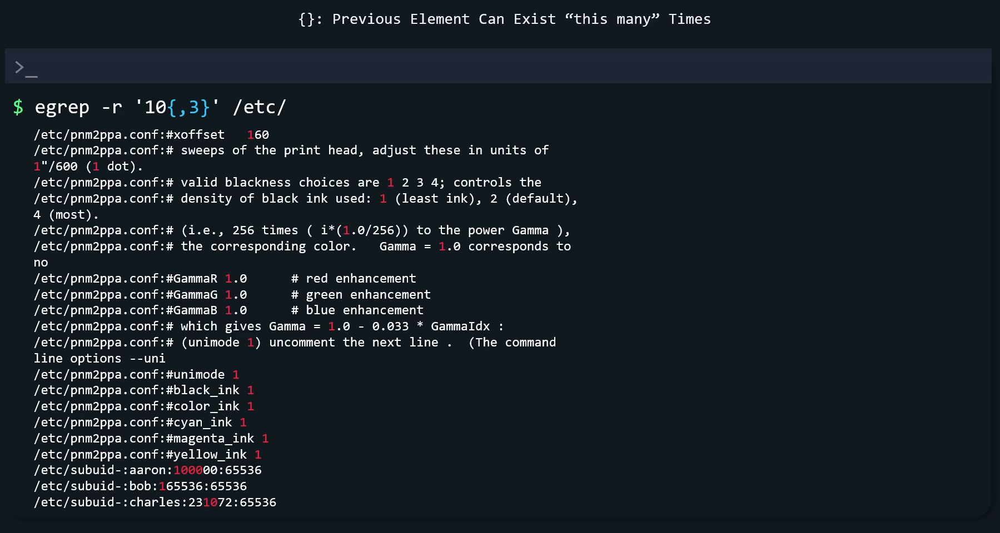
</div>

## `?`

<div align="center" style="background-color:#11171F; border-radius: 10px; border: 2px solid">
    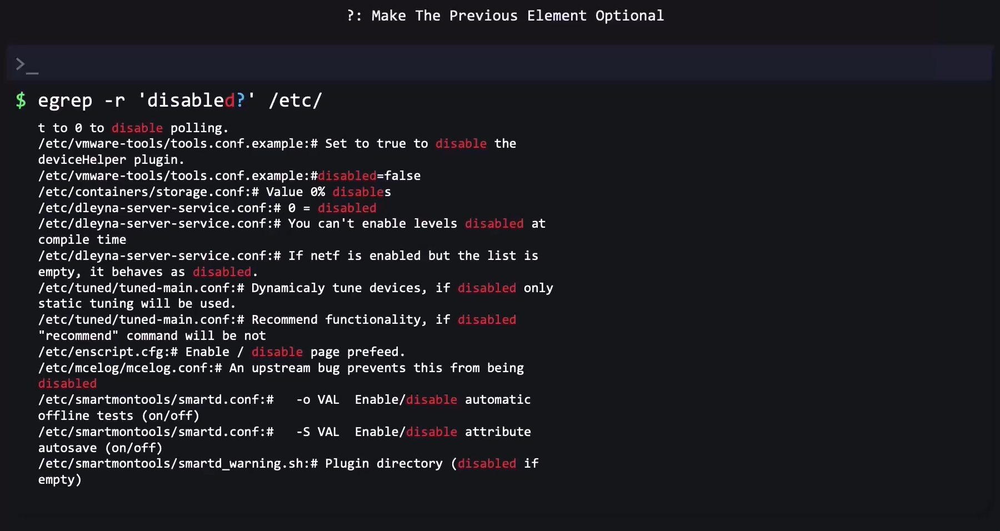
</div>

## `|`

<div align="center" style="background-color:#11171F; border-radius: 10px; border: 2px solid">
    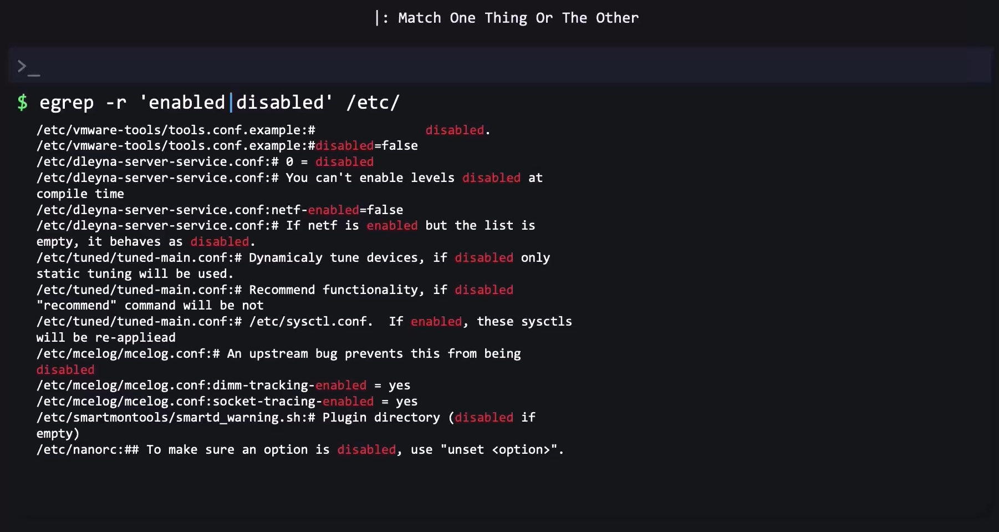
</div>

## `[]`

<div align="center" style="background-color:#11171F; border-radius: 10px; border: 2px solid">
    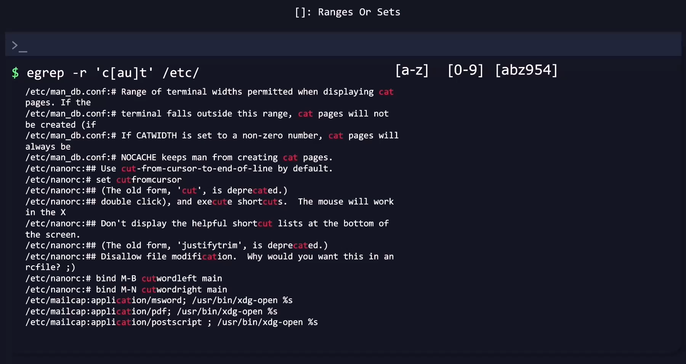
</div>

## Escape Character `\`

<div align="center" style="background-color:#11171F; border-radius: 10px; border: 2px solid">
    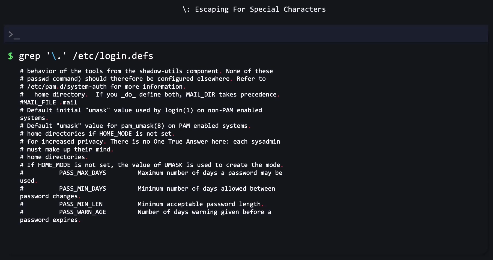
</div>

or using `egrep`
