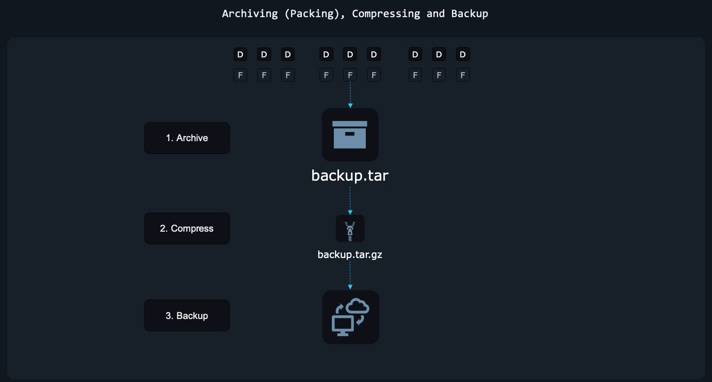
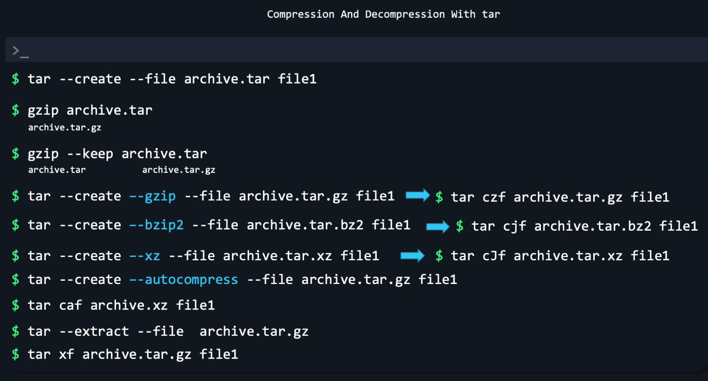

# 📦 What is `tar`?

`tar` = **Tape Archive**
Originally designed for tape backups — now used everywhere to:

- bundle files into a single archive
- compress archives (`.tar.gz`, `.tar.bz2`, `.tar.xz`)
- extract packages
- backup/restore directories

It is **THE standard** for packaging files in Linux.

---

<div align="center" style="background-color:#11171F; border-radius: 10px; border: 2px solid">
    
</div>

---

## 🧩 TAR = TWO OPERATIONS

1️⃣ **Create archive** → bundle files  
2️⃣ **Extract archive** → unpack files

Compression algorithms (gzip, bzip2, xz) are optional addons.

---

## 🟥 TAR FLAGS YOU MUST KNOW (NEVER FORGET)

| Flag | Meaning                                |
| ---- | -------------------------------------- |
| `c`  | create archive                         |
| `x`  | extract archive                        |
| `t`  | list archive contents                  |
| `f`  | specify archive file (ALWAYS included) |
| `v`  | verbose                                |
| `z`  | gzip compression                       |
| `j`  | bzip2 compression                      |
| `J`  | xz compression                         |
| `P`  | preserve ownership and permissions     |

> **Memory Trick:**  
> 👉 The order of flags doesn’t matter, but **`f` should be last** among them.  
> Example: `tar -cvf`, `tar -xvf`, `tar -czvf`, ALWAYS keep `f` last.

---

## ==========================================

## 🔥 1. CREATE ARCHIVES

## ==========================================

### 🟦 1.1 Create a simple `.tar` archive

```bash
tar -cvf archive.tar file1 file2 dir1
```

- `c` → create
- `v` → verbose
- `f` → filename

---

### 🟦 1.2 Create `.tar.gz` (gzip → fastest, common)

```bash
tar -czvf archive.tar.gz folder/
```

Output (verbose):

```ini
folder/
folder/file1.txt
folder/scripts/run.sh
```

---

### 🟦 1.3 Create `.tar.bz2` (bzip2 → better compression, slower)

```bash
tar -cjvf archive.tar.bz2 project/
```

---

### 🟦 1.4 Create `.tar.xz` (xz → best compression)

```bash
tar -cJvf archive.tar.xz logs/
```

---

### 🟦 1.5 Create archive from multiple files & folders

```bash
tar -cvf website.tar index.html css/ js/
```

---

### 🟦 1.6 Exclude files (VERY USEFUL)

```bash
tar -czvf code.tar.gz . --exclude=node_modules --exclude=*.log
```

---

## ==========================================

## 🔵 2. EXTRACT ARCHIVES

## ==========================================

### 🟩 2.1 Extract `.tar`

```bash
tar -xvf archive.tar
```

---

### 🟩 2.2 Extract `.tar.gz`

```bash
tar -xzvf archive.tar.gz
```

---

### 🟩 2.3 Extract `.tar.bz2`

```bash
tar -xjvf archive.tar.bz2
```

---

### 🟩 2.4 Extract `.tar.xz`

```bash
tar -xJvf archive.tar.xz
```

---

### 🟩 2.5 Extract to a specific directory

```bash
tar -xvf archive.tar -C /opt/myfolder
```

---

## ==========================================

## 🟣 3. LIST CONTENTS OF AN ARCHIVE

## ==========================================

See what’s inside **without extracting**:

```bash
tar -tvf archive.tar
```

Output:

```ini
-rw-r--r-- user/user  1024 config.yaml
drwxr-xr-x user/user     0 scripts/
-rwxr-xr-x user/user   512 scripts/install.sh
```

---

## ==========================================

## 🟠 4. ADD FILES TO AN EXISTING .tar (append)

## ==========================================

```bash
tar -rvf archive.tar newfile.txt
```

> ⚠️ **This works only for .tar**  
> NOT for `.tar.gz`, `.tar.bz2`, `.tar.xz`.

---

## ==========================================

## 🔻 5. DELETE FILES FROM A TAR ARCHIVE

## ==========================================

```bash
tar --delete -f archive.tar file_to_remove.txt
```

> ⚠️ Again: ONLY works for uncompressed `.tar`

---

## ==========================================

## 🔥 6. PIPE TAR (Powerful)

## ==========================================

### 🟡 6.1 Archive & compress from stdin (pipe)

Backup only `.log` files:

```bash
find /var/log -name "*.log" | tar -czvf logs.tar.gz -T -
```

---

### 🟡 6.2 Extract from a URL directly

```bash
curl -L https://example.com/app.tar.gz | tar -xz
```

---

### 🟡 6.3 Archive and copy through SSH

Backup local folder to remote server:

```bash
tar -cz folder/ | ssh user@server "tar -xz -C /backup"
```

---

## ==========================================

## 🔥 7. ADVANCED TAR FEATURES

## ==========================================

### 🟤 7.1 Show archive size before compression

```bash
tar -cvf - folder/ | wc -c
```

---

### 🟤 7.2 Compress existing tar file

```bash
gzip archive.tar
# creates archive.tar.gz
```

---

### 🟤 7.3 Extract single file from archive

```bash
tar -xvf archive.tar file1.txt
```

---

### 🟤 7.4 Extract multiple files

```bash
tar -xvf archive.tar file1.txt dir/file2.txt
```

---

### 🟤 7.5 Extract only matching patterns

```bash
tar -xvf archive.tar --wildcards "*.config"
```

---

## ==========================================

## 🔥 8. REAL DEVOPS EXAMPLES

## ==========================================

### ✔ Backup entire `/etc` folder

```bash
sudo tar -czvf etc-backup-$(date +%F).tar.gz /etc
```

---

### ✔ Archive and upload logs

```bash
tar -czvf logs.tar.gz /var/log && aws s3 cp logs.tar.gz s3://mybucket/
```

---

### ✔ Extract Kubernetes package

```bash
tar -xzvf kubernetes.tar.gz
```

---

### ✔ Backup Docker volumes

```bash
sudo tar -cvf vol.tar /var/lib/docker/volumes/myvolume
```

---

### ✔ Create lightweight CI/CD artifact

```bash
tar -czvf build.tar.gz dist/
```

---

## 🪢 Compression and Decompression with tar

<div align="center" style="background-color:#11171F; border-radius: 10px; border: 2px solid">
    
</div>

---

## ==========================================

## 🧠 9. TAR CHEAT SHEET (NEVER FORGET)

## ==========================================

| Action             | Command                                         |
| ------------------ | ----------------------------------------------- |
| Create `.tar`      | `tar -cvf file.tar stuff/`                      |
| Create `.tar.gz`   | `tar -czvf file.tar.gz stuff/`                  |
| Create `.tar.bz2`  | `tar -cjvf file.tar.bz2 stuff/`                 |
| Extract `.tar`     | `tar -xvf file.tar`                             |
| Extract `.tar.gz`  | `tar -xzvf file.tar.gz`                         |
| Extract `.tar.bz2` | `tar -xjvf file.tar.bz2`                        |
| List contents      | `tar -tvf file.tar`                             |
| Extract to folder  | `tar -xvf file.tar -C /path`                    |
| Add to tar         | `tar -rvf file.tar new.txt`                     |
| Delete from tar    | `tar --delete -f file.tar old.txt`              |
| Exclude            | `tar -czvf out.tar.gz . --exclude node_modules` |
