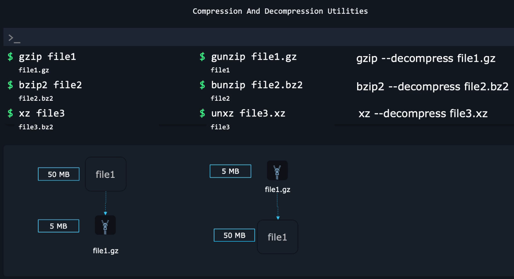

# 🗜️ Compression Tools in Linux

Compression tools reduce file size.  
In Linux, different tools offer different tradeoffs:

<div align="center" style="background-color:#11171F; border-radius: 10px; border: 2px solid">

| Tool    | Speed             | Compression          | File Extension |
| ------- | ----------------- | -------------------- | -------------- |
| `gzip`  | ⭐⭐⭐⭐⭐ (fast) | ⭐⭐ (medium)        | `.gz`          |
| `bzip2` | ⭐⭐ (slow)       | ⭐⭐⭐⭐ (high)      | `.bz2`         |
| `xz`    | ⭐ (very slow)    | ⭐⭐⭐⭐⭐ (highest) | `.xz`          |
| `zip`   | ⭐⭐⭐            | ⭐⭐                 | `.zip`         |



</div>

---

## ============================================

## 🟥 1. `gzip` — Fast Compression (Most Common)

## ============================================

`gzip` is used everywhere because it is:

- **fast**
- **simple**
- **saves good space**
- supported by most tools, servers, CI/CD pipelines

Creates files with extension `.gz`.

---

### 🧩 1.1 Compress a file

```bash
gzip file.txt
```

This replaces `file.txt` with:

```ini
file.txt.gz
```

---

### 🧩 1.2 Keep original file (`-k`)

```bash
gzip -k file.txt
```

Now you have both:

- `file.txt`
- `file.txt.gz`

---

### 🧩 1.3 Decompress (`gunzip`)

```bash
gunzip file.txt.gz
```

or using gzip:

```bash
gzip -d file.txt.gz
```

---

### 🧩 1.4 Compress multiple files

```bash
gzip *.log
```

> **Note**:  
> this `not` compressed into single file (use zip instead)  
> or archive the files/directories into single tart file and then compress it.

---

### 🧩 1.5 Test compression ratio (`-l`)

```bash
gzip -l file.txt.gz
```

Output example:

```ini
compressed   uncompressed  ratio  uncompressed_name
     345             1245  72.3%  file.txt
```

---

## ============================================

## 🟧 2. `bzip2` — Higher Compression, Slower

## ============================================

`bzip2` gives _better_ compression than gzip
but is _slower_.

Extension:

```ini
.bz2
```

---

### 🧩 2.1 Compress

```bash
bzip2 file.txt
```

Creates:

```ini
file.txt.bz2
```

---

### 🧩 2.2 Keep original file

```bash
bzip2 -k file.txt
```

---

### 🧩 2.3 Decompress (`bunzip2`)

```bash
bunzip2 file.txt.bz2
```

or:

```bash
bzip2 -d file.txt.bz2
```

---

### 🧩 2.4 Compress multiple files

```bash
bzip2 *.log
```

> **Note**:  
> this `not` compressed into single file (use zip instead)  
> or use archive the files/directories into single tart file and then compress it.

---

## ============================================

## 🟦 3. `xz` — Best Compression, Slowest

## ============================================

`xz` achieves the **highest compression ratio**
(better than gzip & bzip2).

Extension:

```ini
.xz
```

Used for:

- Linux kernels
- Large archives
- Long-term backups
- System distribution packages

---

### 🧩 3.1 Compress

```bash
xz file.txt
```

Produces:

```ini
file.txt.xz
```

Original file is removed unless `-k` is used.

---

### 🧩 3.2 Keep original

```bash
xz -k file.txt
```

---

### 🧩 3.3 Decompress (`unxz`)

```bash
unxz file.txt.xz
```

or:

```bash
xz -d file.txt.xz
```

---

### 🧩 3.4 Compression level (`-0` to `-9`)

```bash
xz -9 largefile.bin
```

- `-0` → fastest
- `-9` → highest compression

Default is `-6`.

---

## ============================================

## 🟪 4. ZIP — Cross-Platform Compression

## ============================================

`zip` is used on Linux _AND_ Windows (WinZip) _AND_ macOS.

Use `.zip` when:

- sending files to Windows users
- making cross-platform packages
- sharing through email
- compressing folders easily

---

### 🧩 4.1 Compress to ZIP

```bash
zip archive.zip file1 file2 file3
```

---

### 🧩 4.2 Compress a folder recursively (`-r`)

```bash
zip -r project.zip project/
```

---

### 🧩 4.3 Add files to existing ZIP

```bash
zip project.zip newfile.txt
```

---

### 🧩 4.4 Password-protected ZIP (`-e`)

```bash
zip -e secret.zip secret.txt
```

Prompts for password.

---

## ============================================

## 🟩 5. UNZIP — Extract ZIP Files

## ============================================

---

### 🧩 5.1 Extract ZIP

```bash
unzip archive.zip
```

---

### 🧩 5.2 Extract to a specific folder

```bash
unzip archive.zip -d /destination/path
```

---

### 🧩 5.3 List contents without extracting

```bash
unzip -l archive.zip
```

Output:

```ini
Length   Name
------   --------------------
 1024    config.yaml
 2048    src/main.py
```

---

## ============================================

## 🟫 6. Compare Tools (Never Forget This Table)

## ============================================

| Tool      | Speed  | Compression | Good For               |
| --------- | ------ | ----------- | ---------------------- |
| **gzip**  | FAST   | Medium      | logs, tar.gz, CI/CD    |
| **bzip2** | Medium | High        | backups, large data    |
| **xz**    | Slow   | Very high   | distributions, kernels |
| **zip**   | Medium | Medium      | Windows/macOS sharing  |
| **unzip** | N/A    | extract     | extracting zip files   |

---

## ============================================

## 🧠 7. Real DevOps Examples

## ============================================

### ✔ Compress entire logs directory

```bash
tar -czf logs.tar.gz /var/log
```

---

### ✔ Compress backups with best ratio

```bash
tar -cJf backup.tar.xz /var/www
```

---

### ✔ Unpack a Kubernetes package

```bash
tar -xzvf kube.tar.gz
```

---

### ✔ ZIP a website to upload it

```bash
zip -r website.zip public_html/
```

---

### ✔ Backup configs with bzip2

```bash
tar -cjf configs.tar.bz2 /etc
```

---

### ✔ Extract public data from S3 (example)

```bash
aws s3 cp s3://bucket/dump.tar.xz .
unxz dump.tar.xz
tar -xvf dump.tar
```

---

## 🎯 Final Cheat Sheet (Your Style)

| Action             | Command                 |
| ------------------ | ----------------------- |
| gzip file          | `gzip file`             |
| gzip keep original | `gzip -k file`          |
| gunzip file        | `gunzip file.gz`        |
| bzip2 file         | `bzip2 file`            |
| bunzip2 file       | `bunzip2 file.bz2`      |
| xz file            | `xz file`               |
| xz keep original   | `xz -k file`            |
| unxz file          | `unxz file.xz`          |
| zip file(s)        | `zip f.zip file1 file2` |
| zip folder         | `zip -r f.zip folder/`  |
| unzip file         | `unzip file.zip`        |
