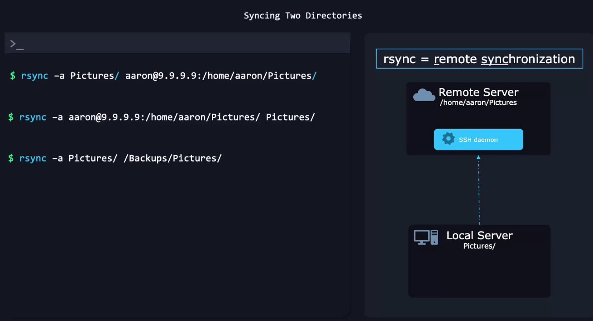
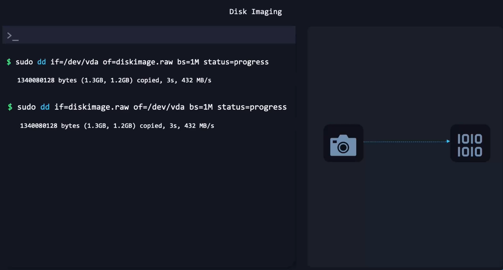

# 📦 BACKUP METHODS OVERVIEW (Never Forget This!)

<div align="center" style="background-color:#11171F; border-radius: 10px; border: 2px solid">

| Tool      | Purpose          | What it Backs Up      | Speed  | Safety | Ideal Use               |
| --------- | ---------------- | --------------------- | ------ | ------ | ----------------------- |
| **rsync** | smart copy       | files & folders       | fast   | safe   | daily backups, syncing  |
| **dd**    | raw image backup | entire partition/disk | slow   | risky  | full system cloning     |
| **cp -a** | simple copy      | files & folders       | medium | medium | basic backup            |

</div>

For today’s lesson, we focus on:

- 👉 **rsync** (recommended for real backups)
- 👉 **dd** (raw disk/image backup)

---

## 🟦 1. RSYNC — Fast, Smart, Incremental Backups

RSYNC is the **best backup tool in Linux** for folders or entire systems.

Why?

- ✔ Only copies changed files
- ✔ Can resume interrupted copies
- ✔ Preserves permissions, links, device files
- ✔ Compares checksums, timestamps
- ✔ Remote backup support via SSH
- ✔ Safe & extremely fast

---

<div align="center" style="background-color:#11171F; border-radius: 10px; border: 2px solid">
    
</div>

---

### 🧩 1.1 Basic Folder Backup

```bash
rsync -av source/ destination/
```

Meaning:

- `-a` → archive mode (keep permissions, ownership, timestamps)
- `-v` → verbose

Example:

```bash
rsync -av /home/user/ /backup/home-user/
```

---

### 🧩 1.2 Backup with Progress Bar

```bash
rsync -av --progress /home/user/ /backup/home/
```

---

### 🧩 1.3 Backup Across SSH (Remote Backup)

```bash
rsync -av /home/user/ user@server:/backups/user/
```

---

### 🧩 1.4 Remote Server → Local Backup

```bash
rsync -av user@server:/var/www/ /local-backups/www/
```

---

### 🧩 1.5 Backup but delete removed files from target (`--delete`)

Use carefully!

```bash
rsync -av --delete /home/user/ /backup/home/
```

---

### 🧩 1.6 Exclude unwanted directories

```bash
rsync -av --exclude "node_modules" --exclude "*.log" project/ backup/project/
```

---

### 🧩 1.7 Mirror a partition (file-level, not raw)

```bash
rsync -avx /mnt/source/ /mnt/backup/
```

- `-x` → stay on same filesystem (avoid crossing into /proc /sys)

---

### 🟩 Real DevOps Backup Example (Daily)

```bash
rsync -a --delete /etc/ /backup/etc-$(date +%F)/
```

Or remote:

```bash
rsync -a /etc/ user@backupserver:/snapshots/hostname/etc/
```

---

## 🟥 2. `dd` — RAW Disk/Partition Backup (Dangerous but Powerful)

`dd` copies **bit-by-bit** of an entire disk or partition.

It can:

- ✔ Clone disks
- ✔ Create full partition images
- ✔ Backup boot sectors
- ✔ Make bootable USBs
- ✔ Restore raw disk snapshots

But WARNING:

❗ One wrong `if=` or `of=` can DESTROY your system.
Always double-check devices:

```bash
lsblk
```

---

<div align="center" style="background-color:#11171F; border-radius: 10px; border: 2px solid">
    
</div>

---

### 📀 2.1 Backup Entire Disk to Image File

```bash
sudo dd if=/dev/sda of=/backup/sda.img bs=64M status=progress
```

Breakdown:

- `if=` → input file (source disk)
- `of=` → output file (destination image)
- `bs=64M` → block size (faster)
- `status=progress` → show progress

This creates a complete raw image of disk `/dev/sda`.

---

### 📀 2.2 Restore Disk from Image

```bash
sudo dd if=/backup/sda.img of=/dev/sda bs=64M status=progress
```

⚠️ This overwrites EVERYTHING on `/dev/sda`.

---

### 📀 2.3 Backup Only a Partition

```bash
dd if=/dev/sda1 of=/backup/sda1.img bs=64M status=progress
```

---

### 📀 2.4 Restore Only a Partition

```bash
dd if=/backup/sda1.img of=/dev/sda1 bs=64M status=progress
```

---

### 📀 2.5 Clone a Disk Directly to Another Disk

```bash
sudo dd if=/dev/sda of=/dev/sdb bs=64M status=progress
```

This makes `/dev/sdb` an exact clone of `/dev/sda`.

---

### 📀 2.6 Compress Backup while creating (`gzip`)

```bash
dd if=/dev/sda | gzip > sda.img.gz
```

Restore:

```bash
gunzip -c sda.img.gz | dd of=/dev/sda
```

---

### 📀 2.7 Backup MBR (Master Boot Record)

Backup first 512 bytes:

```bash
dd if=/dev/sda of=mbr_backup.bin bs=512 count=1
```

Restore:

```bash
dd if=mbr_backup.bin of=/dev/sda bs=512 count=1
```

---

## 🟦 3. Which Backup Tool Should You Use?

| Task                      | Recommended Tool           |
| ------------------------- | -------------------------- |
| Backup a folder           | **rsync**                  |
| Sync server files         | **rsync over SSH**         |
| Make system snapshots     | **rsync + hard links**     |
| Backup entire partition   | **dd**                     |
| Clone entire disk         | **dd**                     |
| Compress archive          | `tar + gzip/xz`            |
| Windows-compatible backup | `zip`                      |
| Cloud backup              | `rsync` + `aws s3 cp/sync` |

---

## 🧠 4. Rsync vs dd — EASY MEMORY FORMULA

### **`rsync` = smart backup (file-level)**

Copies only changed files.

### **`dd` = dumb backup (raw blocks)**

Copies _everything_ including empty space.

---

## 🧪 5. Real-World Examples

### ✔ Backup web server files (safe)

```bash
rsync -av /var/www/ /backup/www/
```

### ✔ Local → Remote (SSH backup)

```bash
rsync -avz /etc/ ubuntu@10.0.0.20:/backup/etc/
```

### ✔ Full disk clone (dangerous)

```bash
dd if=/dev/nvme0n1 of=/dev/sdb status=progress bs=1M
```

### ✔ Make bootable USB from ISO

```bash
dd if=ubuntu.iso of=/dev/sdb bs=4M status=progress
```

---

## 🧩 6. Bonus: Rsync + Cron = Automated Backups

Create cron entry:

```bash
crontab -e
```

Add:

```ini
0 2 * * * rsync -a --delete /home/ /backup/home/
```

Runs daily at 2 AM.

---

## 🎯 FINAL CHEAT SHEET

| Action           | rsync                       | dd                           |
| ---------------- | --------------------------- | ---------------------------- |
| Backup folder    | `rsync -av src/ dst/`       | ❌                           |
| Backup partition | ❌                          | `dd if=/dev/sda1 of=img`     |
| Clone disk       | ❌                          | `dd if=/dev/sda of=/dev/sdb` |
| Restore          | `rsync -av backup/ target/` | `dd if=img of=/dev/sda`      |
| Remote backup    | `rsync -av user@host:`      | ❌                           |
| Safe             | ✔                           | ❌ risky                     |
