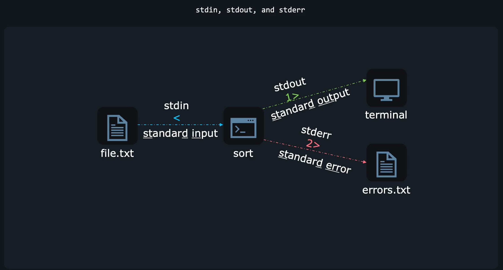

# 🟦 **What Are stdin, stdout, stderr?**

Every command in Linux automatically has **3 data streams**:

| Stream   | File Descriptor | Purpose                    |
| -------- | --------------- | -------------------------- |
| `stdin`  | **0**           | Input to the program       |
| `stdout` | **1**           | Normal output from program |
| `stderr` | **2**           | Error output from program  |

<div align="center" style="background-color:#11171F; border-radius: 10px; border: 2px solid">
    
</div>

---

> Easy memory trick:
>
> - **0 → input**
> - **1 → normal output**
> - **2 → error output**

---

## 🟩 **2. Redirecting stdout (1)**

### 🔹 Overwrite a file

```ini
command > file.txt
```

Example:

```ini
echo "hello" > out.txt
```

---

### 🔹 Append to a file

```ini
command >> file.txt
```

Example:

```ini
echo "line2" >> out.txt
```

---

## 🟥 **3. Redirecting stderr (2)**

### 🔹 Redirect only errors

```ini
command 2> errors.txt
```

Example:

```ini
ls /fakepath 2> errors.log
```

---

### 🔹 Append errors

```ini
command 2>> errors.txt
```

---

## 🟧 **4. Redirect stdout + stderr together**

### ✅ Modern and clean way:

```ini
command &> all.log
```

### Old way (still used):

```ini
command > all.log 2>&1
```

### ❗ Important ordering rule:

```ini
command 2>&1 > file.txt     # WRONG (errors still go to screen)
command > file.txt 2>&1     # CORRECT
```

Why?
➡️ **Redirections are processed from left → right**.

---

## 🟨 **5. Redirecting stdin (0)**

Instead of reading from keyboard, take input from file:

```ini
command < input.txt
```

Example:

```ini
wc -l < file.txt
```

---

## 🟪 **6. Pipes vs Redirection (Very Clean Explanation)**

Redirection:
_send command output/input to/from a file_

Pipe:

```ini
command1 | command2
```

Pipe sends **stdout of command1 to stdin of command2**.

Example:

```ini
ps aux | grep nginx
```

---

## 🟫 **HERE Document (`<<EOF`)**

This is how you give **multi-line input** to a command.

Think of it as:
“Feed the following block to the command as stdin.”

### Syntax:

```ini
command << EOF
text
text
EOF
```

- The word after `<<` is a **marker**.
- Input continues until that marker appears again on a line by itself.

### Example 1 — cat with EOF:

```ini
cat << EOF
Hello
World
This text is coming from a HERE document.
EOF
```

Output:

```ini
Hello
World
This text is coming from a HERE document.
```

---

### Example 2 — Write multi-line config to file

```ini
cat << EOF > config.txt
APP_NAME=Demo
VERSION=1.0
ENV=prod
EOF
```

Now `config.txt` contains:

```ini
APP_NAME=Demo
VERSION=1.0
ENV=prod
```

---

### Example 3 — Pass multi-line SQL to MySQL

```ini
mysql -u root << EOF
CREATE DATABASE shop;
USE shop;
CREATE TABLE items (id INT, name VARCHAR(50));
EOF
```

---

### Example 4 — Combine EOF with sudo (VERY common)

```ini
sudo tee /etc/app.conf > /dev/null << EOF
port=8080
mode=production
EOF
```

---

## 🟥 **HERE String (`<<<`) — single-line version**

```ini
grep root <<< "root:x:0:0:root:/root:/bin/bash"
```

---

## 🟦 **Summary of All Operators**

| Operator | Meaning                          |     |
| -------- | -------------------------------- | --- |
| `>`      | redirect stdout (overwrite)      |     |
| `>>`     | redirect stdout (append)         |     |
| `2>`     | redirect stderr                  |     |
| `2>>`    | append stderr                    |     |
| `&>`     | stdout + stderr                  |     |
| `<`      | redirect stdin                   |     |
| `<<EOF`  | HERE document (multi-line input) |     |
| `<<<`    | HERE string (single line)        |     |
| `2>&1`   | redirect stderr → stdout         |     |
| `|`      | pipe stdout → stdin              |

---

## 🟩 **PERFECT Understanding**

Command:

```ini
grep "ERROR" < logs.txt > out.txt 2> errors.txt
```

Meaning:

- Read input from `logs.txt` instead of keyboard
- Write matches to `out.txt`
- Send grep errors to `errors.txt`
