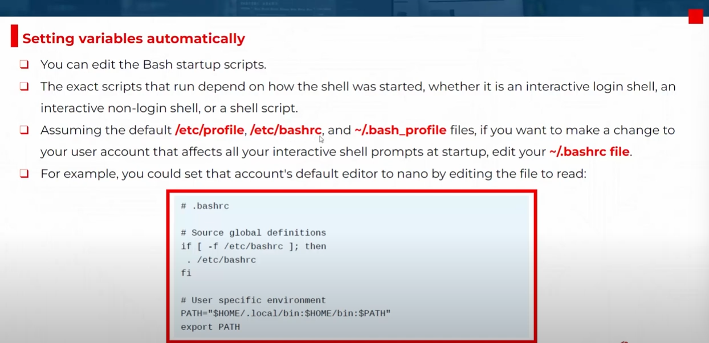

# 🧠 Shell Variables in Linux

Shell variables are **predefined or custom variables** that affect the **behavior, appearance, and environment** of your shell session.

They can be:

- **Local variables** → available only in the current shell
- **Environment variables** → available in current shell + subshells

---

## 📝 Shell Startup Files

<div style="text-align: center">
  
</div>

---

There are two important files:

### 🗂️ `~/.bashrc`

> Runs on every **interactive non-login shell** (like when you open a terminal window in GNOME or SSH into a machine and immediately get the shell).

Use it for:

- PATH modifications
- Aliases
- Prompt customization (`PS1`)
- Environment variables

📌 Example from your screenshot:

```bash
# .bashrc

# Source global definitions
if [ -f /etc/bashrc ]; then
   . /etc/bashrc
fi

# User-specific environment
PATH="$HOME/.local/bin:$HOME/bin:$PATH"
export PATH
```

This adds two local bin directories to your `$PATH` and ensures it’s available every time the terminal launches.

---

### 🔐 `~/.bash_profile`

> Runs on **login shells only**, like when you log in via a console or through `ssh`.

This is the right place to:

- Launch graphical environments (on some distros)
- Source `.bashrc`
- Set global user variables only needed at login

📌 Example typical content:

```bash
# .bash_profile

# Load .bashrc if it exists
if [ -f ~/.bashrc ]; then
   . ~/.bashrc
fi

export EDITOR=nano
```

---

## 🌐 `$PATH` – The Most Important Shell Variable

### ✅ What is `$PATH`?

`$PATH` is a colon-separated list of directories the shell searches through **to find executable commands**.

### 🔍 Example:

```bash
echo $PATH
```

You might see:

```ini
/usr/local/sbin:/usr/local/bin:/usr/sbin:/usr/bin:/root/bin
```

When you run a command like `ls`, the shell searches for it in each directory listed in `$PATH` **from left to right**.

> If it’s not found in any of them, you’ll get:
> `bash: command: command not found`

---

### 🧠 How `$PATH` Works

1. You type `somecommand`
2. Bash searches in `/usr/local/sbin`, then `/usr/local/bin`, and so on
3. First match wins
4. If no match, error is shown

---

### 🔧 Add a Directory to Your `$PATH`

```bash
export PATH=$PATH:/home/hady/scripts
```

- This appends `/home/hady/scripts` to your existing PATH.
- To make it **permanent**, add it to `~/.bashrc` or `~/.bash_profile`.

```bash
echo 'export PATH=$PATH:/home/hady/scripts' >> ~/.bashrc
source ~/.bashrc
```

---

## 🖥️ `$PS1` – The Prompt Style Variable

### 🎨 What is `$PS1`?

`$PS1` defines the **appearance of your shell prompt**.

### 🧪 Example:

```bash
echo $PS1
```

Default output might be:

```ini
[\u@\h \W]\$
```

### 🔍 Breakdown:

| Code | Meaning                               |
| ---- | ------------------------------------- |
| `\u` | Username                              |
| `\h` | Hostname                              |
| `\w` | Full current directory                |
| `\W` | Last part of current directory        |
| `\t` | Current time (HH\:MM\:SS)             |
| `\d` | Date                                  |
| `\$` | Shows `$` (normal user) or `#` (root) |

---

### 🔧 Customize Your Prompt

```bash
export PS1="\u@\h:\w $ "
```

Now your prompt looks like:

```ini
hady@localhost:/home/hady $
```

To make it **permanent**, add the `export PS1=...` line to `~/.bashrc`.

---

## 🧾 Other Common Shell Variables

| Variable   | Description                                         |
| ---------- | --------------------------------------------------- |
| `USER`     | Current logged-in user                              |
| `HOME`     | Home directory                                      |
| `PWD`      | Present working directory                           |
| `SHELL`    | Shell binary (e.g., `/bin/bash`)                    |
| `HOSTNAME` | System hostname                                     |
| `EDITOR`   | Default text editor for CLI commands like `crontab` |
| `TERM`     | Type of terminal emulator (e.g., `xterm-256color`)  |

### 🔍 Example:

```bash
echo $USER       # hady
echo $PWD        # /home/hady
echo $SHELL      # /bin/bash
```

---

## 🧪 View Shell Variables

### 🔎 View all environment variables:

```bash
printenv
```

### 🔎 View all shell variables (local + env):

```bash
set
```

### 🔎 View a specific one:

```bash
echo $HOME
```

---

## 🔐 Temporary vs Persistent

- A shell variable like `export VAR=value` **only lasts for the session**.
- To **persist it**, add to:

  - `~/.bashrc` → applies to interactive shells
  - `~/.bash_profile` → applies to login shells

### 📝 Example (in `.bashrc`):

```bash
export PATH=$PATH:/opt/tools/bin
export PS1="\u@\h:\w\$ "
export EDITOR=nano
```

Then:

```bash
source ~/.bashrc
```

---

## 📌 Summary Cheat Sheet

| Task                    | Command                               |
| ----------------------- | ------------------------------------- |
| See `$PATH`             | `echo $PATH`                          |
| Add to `$PATH`          | `export PATH=$PATH:/new/dir`          |
| Change prompt           | `export PS1="[\u@\h \W]\$ "`          |
| List env vars           | `printenv` or `env`                   |
| List all variables      | `set`                                 |
| Make variable permanent | Add `export VAR=value` to `~/.bashrc` |

---
