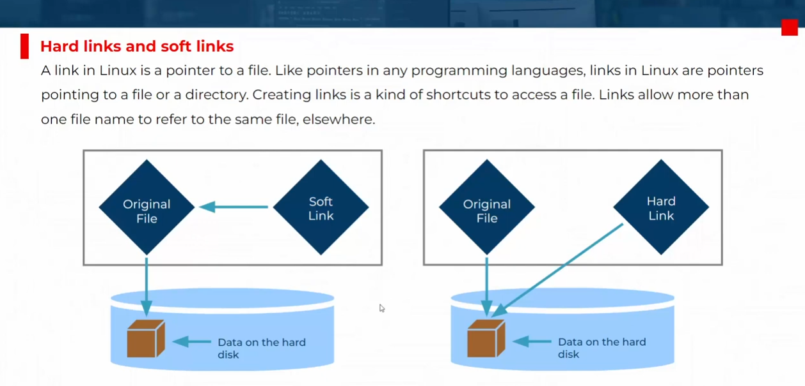
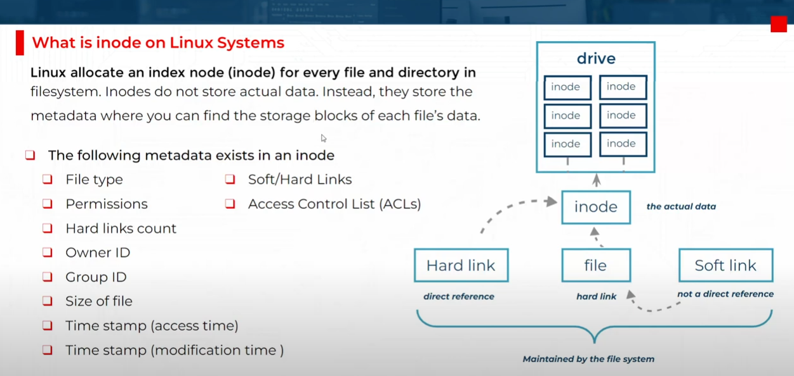

# 📂 Managing files from CLI

## 👪 File System Hierarchy

> files in linux are stored and organized into dir according its purpose.

<div style="text-align: center">
  
</div>

---

### `/usr`

> Installed software, shared libraries, include files, and read only program daa.

important subdir:

- **/usr/bin**: contains commands for user.
- **/usr/sbin**: contains commands for System administration.
- **/usr/local**: Locally customized software.

### `/etc`

> contains configuration files specific to this system.

### `/var`

> contains variable data specific to this system that should persist between boots.  
> also can contains Files that dynamically change, such as database, cache dir, logs files, printer-spooled docs and website content may be found under **/var**.

### `/run`

> contains Runtime data for processes started since the last boot, this include process ID files and lock files, among other things. the content of this directory are recreated on reboot. this dir consolidates **/var/run** and **/var/lock** from earlier versions of red hat enterprise linux.

### `/home`

> home directories for regular user accounts, each user has its own home directory, and they store their personal data and configuration files.

### `/root`

> home directory for the administrative superuser or root.

### `/tmp`

> Contains temporary files and directories that are not needed after a reboot.

- **/tmp**: Files which have not been accessed or changed for **10 days** are deleted from this directory automatically.

- **/var/tmp** in which files that have not been accessed or changed in more than **30 days** are deleted automatically.

### `/boot`

> contains the kernel and any other files needed to start the system.

### `/dev`

> contains special device files that are used by the system to access hardware.

---

## 📁 File Types

<div style="text-align: center">
  
</div>

---

<div style="text-align: center">
  
</div>

---

### Types of files

| **Symbol** | **Meaning**                     |
| ---------- | ------------------------------- |
| `-`        | Regular file                    |
| `d`        | Directory                       |
| `l`        | Link (symbolic)                 |
| `c`        | Special File (Character Device) |
| `s`        | Socket                          |
| `p`        | Named Pipe (FIFO)               |
| `b`        | Block Device                    |

> 📌 file names started with `.` are hidden

---

## 🛣️ Absolute and Relative Paths

- Absolute path: path to the file from the root directory.
- Relative path: path to the file from the current directory.

> 📌 if the path is not absolute, the path is relative to the current directory.

### Navigation Commands

```bash
# display current working directory
pwd

# change the current working directory to <dir-name>
cd <dir-name>

# change the current working directory to previous directory
cd -

# change the current working directory to home directory
cd
# or
cd ~

# change the current working directory to root directory
cd /
```

---

## `ls` Command

> Lists the contents of a directory

```bash
ls

# long format
ls -l

# -a => show hidden files
ls -la

# -h => human readable for file size
ls -lh

# -t => sorted by timestamp
ls -lt

# -r => sorted by reverse order
ls -ltr

# -R => display files recursively (include subdirectories files)
ls -lR

# older command => use ls instead
dir

dir --color
```

---

## 🗃️ File Management

### `touch`

> create a file

```bash
touch <file-name>

# create multiple files
touch file1 file2

# create a file in a specific directory
touch /path/to/file

# create multiple files in a specific directory
touch {file1,file2,file3}
```

> 📌 if the file exist, it will reset the timestamp of the file.

### `mkdir`

> create a directory

```bash
mkdir <dir-name>

# create multiple directories
mkdir dir1 dir2

# create a nested not exist directories
mkdir /path/to/dir # ❌ error
mkdir -p /path/to/dir # ✅ success

# create a directory with spaces
mkdir "dir name with spaces"

```

### `cp`

> copy files and directories

```bash
cp <source> <destination>

# copy file
cp file1 dir1

# copy a directory and its contents (-r is required if dir1 contains files)
cp -r dir1 dir2

# copy a directory contents only to another directory
cp -r dir1/* dir2
```

### `mv`

> move files and directories

```bash
mv <source> <destination>

# move file
mv file1 file2 dir1

# move a directory to level up directory
mv dir ..

# move a dir1 inside dir2 (no need to -r of dir1 not empty)
mv dir1 dir2

# rename file
mv file new-file

# rename dir (if dir3 not exist)
mv dir1 dir3
```

### `rm`

> remove files and directories

```bash
rm <file-name>

# remove multiple files
rm file1 file2

# force remove a file
rm -f file1

# remove a directory and its contents
rm -r directory

# remove all files or directories in current directory
rm -rf *
```

---

## 🔗 Hard Links vs Soft(Symbolic/Shortcut) Links

<div style="text-align: center">
  
</div>

---

| Feature                   | Hard Link                               | Soft Link (Symbolic Link)             |
| ------------------------- | --------------------------------------- | ------------------------------------- |
| 🔗 Link Type              | Direct reference to file's data (inode) | Reference to the file path            |
| 🧠 How It Works           | Creates another name for the same file  | Creates a shortcut pointing to a file |
| 💥 If Original Is Deleted | File still exists via link (same data)  | Link breaks, becomes dangling         |
| 🔍 Can Link Directories?  | No (normally)                           | Yes                                   |
| 🔄 Across File Systems?   | No                                      | Yes                                   |
| 📜 Shows in `ls -l`       | No obvious distinction (same inode)     | Displays arrow (`->`) and target path |

### 🛠️ Practical Example:

#### Hard Link:

```bash
ln <source-file> <target-file>

ln file.txt hardlink.txt
```

- `hardlink.txt` now behaves exactly like `file.txt`.
- Changes to one reflect in the other.
- They share the same inode.

#### Soft Link:

```bash
ln -s <source-file> <target-file>

ln -s file.txt softlink.txt
```

- `softlink.txt` just points to `file.txt`.
- If `file.txt` is deleted, the link breaks.

---

## 🧾 What is Inode

In Linux, an **inode** (short for _index node_) is a fundamental data structure used by the filesystem to store information about files and directories, **except their names**.

<div style="text-align: center">
  
</div>

---

### 📦 What Does an Inode Contain?

Each file or directory has a unique inode that stores metadata like:

- 📏 **File size**
- 👤 **Owner and group IDs**
- 🔐 **Permissions (read/write/execute)**
- 🕒 **Timestamps** (created, modified, accessed)
- 📍 **Pointers to data blocks** (where the actual content is stored)
- 🔗 **Number of hard links** to the file

So when you list files with `ls -i`, you’ll see their inode numbers. The filename itself is stored separately in the directory structure, which maps names to inode numbers.

### 🧠 Why Are Inodes Important?

- They allow the system to **track files independently of their names**.
- They make **hard links** possible—multiple filenames can point to the same inode.
- They help the system **efficiently manage disk space and file access**.

### 🛠️ Example: Viewing Inode Info

```bash
stat myfile.txt
```

This command shows inode number and all metadata stored in the inode.

### ⚠️ Inode Limits

Each filesystem has a fixed number of inodes. If you run out—even with free disk space—you can’t create new files. This often happens on systems with **lots of small files**, like mail servers or cache directories.

---

## Pattern Matching

| **Pattern**   | **Matches**                                                                    |
| ------------- | ------------------------------------------------------------------------------ |
| `*`           | Any string of zero or more characters.                                         |
| `?`           | Any single character.                                                          |
| `[abc...]`    | Any one character in the enclosed class (between the square brackets).         |
| `[!abc...]`   | Any one character **not** in the enclosed class.                               |
| `[^abc...]`   | Any one character **not** in the enclosed class.                               |
| `[[:alpha:]]` | Any alphabetic character.                                                      |
| `[[:lower:]]` | Any lowercase character.                                                       |
| `[[:upper:]]` | Any uppercase character.                                                       |
| `[[:alnum:]]` | Any alphabetic character or digit.                                             |
| `[[:punct:]]` | Any printable character **not a space or alphanumeric**.                       |
| `[[:digit:]]` | Any single digit from 0 to 9.                                                  |
| `[[:space:]]` | Any single whitespace character (e.g., tabs, newlines, carriage returns, etc.) |

---

### ⭐ `*` — Matches any string of zero or more characters

```bash
ls *.txt
# Matches: file.txt, notes.txt, myfile123.txt
```

```bash
ls /etc/*conf
# Matches: /etc/sysctl.conf, /etc/resolv.conf
```

---

### ❓ `?` — Matches any single character

```bash
ls ?.sh
# Matches: a.sh, b.sh, 1.sh
# Does NOT match: ab.sh or abc.sh
```

---

### 🔤 `[abc]` — Matches one character in the set (a, b, or c)

```bash
ls file[abc].log
# Matches: filea.log, fileb.log, filec.log
```

---

### 🚫 `[!abc]` — Matches one character NOT in the set (not a, b, or c)

```bash
ls file[!abc].log
# Matches: filex.log, file1.log
# Does NOT match: filea.log, fileb.log
```

---

### 🔺 `[^abc]` — Same as `[!abc]`, also means NOT a, b, or c

```bash
ls [^abc]*.txt
# Matches: xfile.txt, zlog.txt
# Does NOT match: afile.txt, bdata.txt
```

---

### 🔠 `[[:alpha:]]` — Matches any **letter** (uppercase or lowercase)

```bash
ls [[:alpha:]]*
# Matches: file, Hello.txt, Zebra123
# Does NOT match: 123file or !file
```

---

### 🔡 `[[:lower:]]` — Matches any **lowercase** letter

```bash
ls [[:lower:]]*
# Matches: apple.txt, zebra.sh
# Does NOT match: Apple.txt or Zebra.sh
```

---

### 🔠 `[[:upper:]]` — Matches any **uppercase** letter

```bash
ls [[:upper:]]*
# Matches: File.txt, Zebra.log
# Does NOT match: file.txt
```

---

### 🔢 `[[:alnum:]]` — Matches any letter or digit (A–Z, a–z, 0–9)

```bash
ls [[:alnum:]]*
# Matches: File1.txt, Zebra99.sh, A123
# Does NOT match: .hidden or #file
```

---

### ✴️ `[[:punct:]]` — Matches punctuation characters (like `.`, `!`, `@`, etc.)

```bash
ls [[:punct:]]*
# Matches: .bashrc, !temp, #important
```

---

### 🔟 `[[:digit:]]` — Matches a digit `0–9`

```bash
ls *[[:digit:]].txt
# Matches: log1.txt, result9.txt
# Does NOT match: filex.txt
```

---

### ␣ `[[:space:]]` — Matches a whitespace character (space, tab, newline)

```bash
grep '[[:space:]]' file.txt
# Finds all lines in file.txt that contain whitespace
```

---

## 🔎 `grep` command

> `grep` is a powerful text search tool that searches for patterns within files.

```bash
grep <pattern> <file>

# ignore case
grep -i pattern file

# multiple patterns
grep -e "pattern1" -e "pattern2" file
grep "pattern1\|pattern2" file
```

### ⚙️ Options

-i : Ignore case

-v : Invert search

-n : Show line numbers

-r : Recursive search

-A 3 : Show 3 lines after match

-B 2 : Show 2 lines before match

-e : Multiple patterns

-w : Exact word match

-l : Show only filenames

-m : Maximum number of matches

-c : Count the number of matches

---

## 📚 Common Regular Expression Symbols

| **Symbol** | **Description**                                               |
| ---------- | ------------------------------------------------------------- |
| `.`        | Replaces (matches) **any single character**                   |
| `^`        | Matches the **start** of a string                             |
| `$`        | Matches the **end** of a string                               |
| `*`        | Matches **zero or more** times of the **preceding character** |
| **\\**     | Used to **escape special characters**                         |
| `()`       | **Groups** regular expressions                                |
| `?`        | Matches **exactly one occurrence** of the preceding character |

> 📌 `/usr/share/dict/words` is path of a dictionary of common English words.

```bash
# Print all words that contain the word "cat"
grep cat /usr/share/dict/words

# Print all words that start with the word "cat"
grep ^cat /usr/share/dict/words

# Print all words that end with the word "cat"
grep cat$ /usr/share/dict/words

# Print all words that start and end with the word "cat"
grep ^cat$ /usr/share/dict/words

# Print all words that contain "c" and then any letter and then "t"
grep c.t /usr/share/dict/words

# Print all words that start with "c" and then any letter and then end with "t"
grep ^c.t$ /usr/share/dict/words

# Print all words that start with "c" and then with either "a" or "o" and then end with "t"
grep ^c[ao]t$ /usr/share/dict/words

# Find words that contain a literal dot character (".")
grep '\.' /usr/share/dict/words

# Find words that have either "cat" or "dog"
grep -E '(cat|dog)' /usr/share/dict/words

# Find words that contain "bat" repeated twice, like "batbat"
grep -E '(bat){2}' /usr/share/dict/words


# Find words that contain "color" or "colour"
grep -E 'colou?r' /usr/share/dict/words

# Find words that start with "re" and optionally have an extra "e"
grep -E '^ree?.*' /usr/share/dict/words
```

> 💡 Tip: In the terminal, you’ll often need double escaping (\\.) depending on the shell or scripting language. With grep, single escape usually works.  
> 📌 Use grep -E for extended regular expressions (ERE) to support () without escaping.

---

## ✂️ `cut` command

It slices text based on:

- **Characters** (`-c`)
- **Fields** (`-f`) using a **delimiter** (`-d`)

### 📌 Syntax

```bash
cut [OPTION]... [FILE]...
```

If no file is provided, it reads from **standard input** (e.g., piped output).

### 🔧 Common Options

| Option               | Description                                               |
| -------------------- | --------------------------------------------------------- |
| `-c`                 | Select specific **characters**                            |
| `-f`                 | Select specific **fields** (used with `-d`)               |
| `-d`                 | Define the **delimiter** (default is TAB)                 |
| `--complement`       | Show everything **except** the selected fields/characters |
| `--output-delimiter` | Change the **output delimiter**                           |

### 🧪 Examples

#### 1. **Cut by Character**

```bash
cut -c 1-5 filename.txt
```

Extracts characters 1 to 5 from each line.

#### 2. **Cut by Field (CSV-style)**

```bash
cut -d ',' -f 2,3 filename.csv
```

Extracts fields 2 and 3 using comma as delimiter.

#### 3. **Pipe with Other Commands**

```bash
ps aux | cut -c 1-10
```

Extracts first 10 characters from each line of `ps aux`.

#### 4. **Complement Output**

```bash
cut -d ':' -f 1,3 --complement /etc/passwd
```

Shows all fields **except** 1 and 3.

#### 5. **Custom Output Delimiter**

```bash
cut -d ',' -f 1,2 --output-delimiter=' | ' filename.csv
```

Replaces commas with `|` in output.

### 🧠 Pro Tip

If you're working with structured logs, CSVs, or even parsing command output, `cut` is a lightweight alternative to `awk` or `sed`. It’s especially handy when you know the exact position or delimiter.

---

## 🧰 `tr` command

`tr` means **translate**. It reads from **standard input** and writes to **standard output**, making it perfect for use with pipes.

### 📌 Basic Syntax

```bash
tr [OPTIONS] SET1 [SET2]
```

- `SET1`: characters to match
- `SET2`: characters to replace with (optional depending on the option)

### 🔧 Common Use Cases

#### 1. **Translate Characters**

```bash
echo "hello world" | tr 'a-z' 'A-Z'
```

🔁 Converts lowercase to uppercase: `HELLO WORLD`

#### 2. **Delete Characters**

```bash
echo "abc123" | tr -d '0-9'
```

🗑️ Removes digits: `abc`

#### 3. **Squeeze Repeated Characters**

```bash
echo "aaabbbccc" | tr -s 'a-c'
```

🔄 Converts repeated `a`, `b`, or `c` into single instances: `abc`

#### 4. **Complement a Set**

```bash
echo "abc123" | tr -cd '0-9'
```

🔍 Keeps only digits: `123`

### 🧪 Character Classes

You can use predefined sets like:

| Class       | Meaning                   |
| ----------- | ------------------------- |
| `[:lower:]` | All lowercase letters     |
| `[:upper:]` | All uppercase letters     |
| `[:digit:]` | All digits                |
| `[:space:]` | All whitespace characters |
| `[:alnum:]` | All letters and digits    |

Example:

```bash
echo "Linux123" | tr -d '[:digit:]'
```

Removes digits: `Linux`

### 🧠 Pro Tip

`tr` only works on **single characters**, not patterns. For more complex text manipulation, tools like `sed` or `awk` are better suited.
