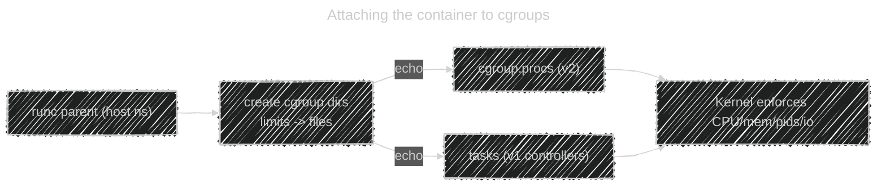

# 🐳 How `runc` + `libcontainer` actually create a container (step-by-step)

## 🧩 The actors (who does what)

- **containerd** – asks for a container to be created and invokes `runc` (one-shot).
- **runc** – **short-lived** binary that _implements the OCI runtime-spec_. It sets everything up, then `execve()` your process.
- **libcontainer (Go)** – library inside `runc`; it makes the kernel calls (namespaces, cgroups, mounts…).
- **containerd-shim** – **stays alive** to proxy stdio/signals and reap the container’s PID even if containerd dies.
- **Linux kernel** – provides **namespaces**, **cgroups**, **capabilities**, **seccomp**, **pivot_root**, etc.

**Input:** an **OCI bundle**

```ini
bundle/
  config.json  # OCI runtime-spec: process, mounts, namespaces, resources…
  rootfs/      # unpacked image filesystem
```

---

## 🔭 0) High-level flow (the 2-process dance)

```mermaid
---
config:
  theme: dark
  look: handDrawn
title: "Bird’s-eye view: from request to running process"
---
sequenceDiagram
    participant C as containerd
    participant S as containerd-shim
    participant R as runc (parent)
    participant I as runc (init in new namespaces)
    participant K as Linux Kernel

    C->>S: create container (OCI bundle path)
    S->>R: invoke runc (create/run)
    R->>K: clone() with CLONE_NEW*  -> new namespaces
    R->>I: exec "/proc/self/exe" init-stage
    Note over R,I: Synchronize via pipes (uid/gid maps, cgroups)
    R->>K: write uid_map/gid_map, setgroups (if userns)
    R->>K: configure cgroups v1/v2 for target PID
    R-->>I: "continue" signal via pipe
    I->>K: sethostname, mount(), pivot_root(), seccomp, caps
    I->>K: execve(user process)  # becomes PID 1 in its PID namespace
    R-->>S: exit (one-shot)  # shim now parents the container
    S-> K: forward signals, reap on exit
```

<div align="center" style="background:#343739; border-radius:16px; padding:8px">



</div>

**Key idea:** `runc` runs _twice_: a **parent** process (host namespaces) and an **init** process (inside new namespaces). They coordinate over pipes so the parent can finish host-side tasks (uid/gid map, cgroups, etc.) while the child pauses.

---

## 🪜 1) `runc` reads the bundle & prepares

1. **Parse `config.json`** (OCI runtime-spec): process args, env, cwd, mounts, namespaces, resources, seccomp, capabilities, SELinux/AppArmor …
2. **Open sync pipes** between parent and child.
3. **Create cgroup path(s)** (but attach the process later when PID exists).
4. **Prepare console/TTY** if requested.

> Nothing “container-y” yet; just setup.

---

## 🧪 2) Create the container’s **namespaces** (the `clone()` call)

`runc` (parent) calls **`clone()`** to spawn the **init** process with the requested namespaces from `config.json`:

Typical flags:

- `CLONE_NEWNS` (mount)
- `CLONE_NEWPID` (PID)
- `CLONE_NEWUTS` (hostname/domain)
- `CLONE_NEWIPC` (System V IPC)
- `CLONE_NEWNET` (network)
- `CLONE_NEWUSER` (user mapping, for rootless/UID isolation)

> If **user namespace** is requested, the child **must pause** immediately so the parent can write UID/GID mappings.

### What the child runs

The child executes **the same `runc` binary** but in an **“init stage”** (internal subcommand).
It blocks on a pipe until the parent finishes host-side setup.

---

## 👤 3) **User namespace** mapping (if enabled)

From the **parent** (still on the host):

1. Write `/proc/<childpid>/setgroups` (`"deny"` when needed)
2. Write `/proc/<childpid>/uid_map` and `gid_map`
   (e.g., map container root (0) → host unprivileged UID/GID)

This is how “root inside” ≠ “root outside”.

---

## 🧰 4) **cgroups**: create and attach

From the **parent**:

- **cgroups v2 (unified):** create a cgroup directory under `/sys/fs/cgroup/<...>`; write resource limits (CPU, memory, pids…) to files; then **echo child PID** into `cgroup.procs`.
- **cgroups v1 (legacy):** similar, but per-controller hierarchies; write to `tasks` files.

> After attach, the kernel enforces limits for that PID (and its descendants).

---

## 🌐 5) **Network** namespace (who configures it?)

- `runc` typically **brings up loopback**.
- **containerd (or CRI-O) + CNI plugins** set up the veth pair, bridge, IP, routes, DNS. They perform **`setns()`** into the child’s NET namespace to configure interfaces before the process starts.

> So runc’s job here is minimal; **CNI** does the heavy lifting.

---

## 🧭 6) Inside the child (“init stage”): filesystem & isolation

Once parent signals “continue”, the **child** (already inside the new namespaces) performs the **heavy setup**:

### 6a) UTS/hostname

- `sethostname(containerHostname)`

### 6b) Mount namespace setup

1. Make mount propagation **private** (`mount("", "/", NULL, MS_REC|MS_PRIVATE, NULL)`)
2. Bind-mount the bundle’s **`rootfs/`** to itself to ensure it’s a mountpoint
   `mount(rootfs, rootfs, "", MS_BIND|MS_REC, NULL)`
3. Apply **mounts** from `config.json` (bind mounts, tmpfs, ro/rw flags, nosuid/nodev/noexec…)

### 6c) **pivot_root** (switch to the new root)

The standard sequence (simplified):

```c
chdir(rootfs);
mkdir("oldroot", 0777);
pivot_root(".", "oldroot");     // new / is rootfs; old / is ./oldroot
umount2("/oldroot", MNT_DETACH);
rmdir("/oldroot");
```

Then mount essentials **inside** the new root:

- `mount("proc", "/proc", "proc", 0, NULL)`
- `mount("sysfs", "/sys", "sysfs", MS_RDONLY|..., NULL)` (often read-only)
- `mount("tmpfs", "/dev", "tmpfs", ...)` + `devpts` (`/dev/pts`) if TTY requested

> If `pivot_root` isn’t possible (rare cases), fallback to `chroot()` + tricks.

### 6d) Apply **masked/readonly** paths

- Mask e.g. `/proc/kcore`, `/sys/firmware` with bind mount to `/dev/null`, or remount read-only paths requested by policy.

### 6e) **Capabilities**, **seccomp**, **no_new_privs**

- Drop capabilities via `capset()` according to `config.json.process.capabilities`
- `prctl(PR_SET_NO_NEW_PRIVS, 1, ...)`
- Load seccomp filter: `seccomp(SECCOMP_SET_MODE_FILTER, ...)` (BPF program) to restrict syscalls

### 6f) **SELinux/AppArmor** labels (if configured)

- Set process label / profile before exec.

### 6g) **rlimits**, env, cwd, user

- `setrlimit()` for NOFILE, NPROC, etc.
- `setgid()/setuid()` (or `setresgid/setresuid`) to the target user inside the userns
- `chdir(cwd)` and `setenv()` from `config.json`

---

## 🚀 7) `execve()` your process

Finally the child calls:

```c
execve(argv[0], argv, envp);
```

- This **replaces** the runc-init process with **your process** (e.g., `/bin/sh`, `nginx`, your app).
- In a new **PID namespace**, this process becomes **PID 1** inside the container.
- **`runc` (parent) exits** (under containerd). **`containerd-shim`** remains as the parent in the host namespace to forward signals and reap the child.

---

## 🧷 What keeps the container running if runc exits?

- **`runc` is ephemeral** (it does setup then leaves).
- **`containerd-shim`** stays:

  - Holds the stdio FDs
  - Reaps the container process
  - Forwards signals (e.g., SIGTERM, SIGKILL)
  - Maintains the container lifecycle even if containerd is restarted

---

## 🧭 Visual: the two-stage init & pivot_root

```mermaid
---
config:
  theme: dark
  look: handDrawn
title: "Child init path: mounts & pivot_root"
---
flowchart TD
    A["Child: in new namespaces"] --> B["sethostname()"]
    B --> C["mount(): make / private (MS_PRIVATE)"]
    C --> D["mount(): bind rootfs -> rootfs"]
    D --> E["apply mounts from config.json"]
    E --> F["pivot_root('.', 'oldroot')"]
    F --> G["umount2('/oldroot', MNT_DETACH); rmdir('oldroot')"]
    G --> H["mount('proc','/proc','proc',...)"]
    H --> I["mount('sysfs','/sys','sysfs',...)"]
    I --> J["mount tmpfs/devpts under /dev"]
    J --> K["mask/readonly paths"]
    K --> L["capset() / seccomp() / no_new_privs"]
    L --> M["setrlimit(), set*id(), chdir(), env"]
    M --> N["execve(user process)  ← PID 1"]
```

<div align="center" style="background:#343739; border-radius:16px; padding:8px">



</div>

---

## 🧭 Visual: cgroups attach (v1 vs v2)

<div align="center" style="background:#343739; border-radius:16px; padding:8px">



</div>

> **v2** is unified; **v1** has multiple controller trees. In both, the kernel begins enforcing limits as soon as the PID is attached.

---

## 🧰 Hands-on mini-lab (optional, real Linux)

> Create a _raw_ OCI container without Docker.

```bash
# 1) Make a bundle with a rootfs
mkdir -p ~/bundle/rootfs
cid=$(docker create busybox:latest)           # only to get a rootfs quickly
docker export "$cid" | tar -C ~/bundle/rootfs -xf -
docker rm "$cid"

# 2) Generate a default OCI config
cd ~/bundle
runc spec                                            # creates config.json
# edit config.json: set "process.args": ["sh"]

# 3) Run it with runc (you'll get a BusyBox shell)
sudo runc run democtr
```

Peek under the hood while it’s running:

```bash
# Show cgroups (v2 example)
cat /sys/fs/cgroup/<some-path>/cgroup.procs

# List namespaces of the container init
lsns | grep $(runc state democtr | jq -r .init_process_pid)

# Enter its namespaces from host (careful)
sudo nsenter -t <initpid> -a sh
```

---

## 🧠 Mapping `config.json` → kernel actions

| `config.json` field                   | Effect on setup                                         |
| ------------------------------------- | ------------------------------------------------------- |
| `root.path`                           | Target **rootfs**; becomes `/` after `pivot_root`       |
| `process.args/env/cwd/rlimits/user`   | Passed to `execve`, `setrlimit`, `set*id`, `chdir`      |
| `hostname`                            | `sethostname()` in UTS namespace                        |
| `linux.namespaces[]`                  | Flags for `clone()` (`CLONE_NEW*`)                      |
| `mounts[]`                            | Series of `mount()` calls (bind, tmpfs, ro/rw, options) |
| `linux.resources`                     | **cgroups** files written before/after attach           |
| `linux.seccomp`                       | `seccomp(SECCOMP_SET_MODE_FILTER, …)`                   |
| `process.capabilities`                | `capset()` to drop/add caps                             |
| `linux.maskedPaths` / `readonlyPaths` | bind to `/dev/null` or remount RO                       |
| `linux.personality`                   | `personality()` syscall (rare)                          |
| `apparmorProfile` / `selinux`         | profile/label applied pre-exec                          |

---

## 🧩 Gotchas & SRE tips

- **PID 1 semantics**: Your app is **PID 1** inside the container; it must reap zombies and handle signals or use an init (e.g., `tini`).
- **pivot_root vs chroot**: Prefer `pivot_root()`; it’s stronger isolation (no escape via open fds to old `/`).
- **Rootless containers**: require **user namespaces** + delegated cgroups; some storage drivers differ.
- **Networking**: If nothing works, look at **CNI** logs; runc isn’t your culprit.
- **Debug quickly**:

  ```bash
  sudo ctr t exec --exec-id debug -t <ctr> sh      # jump in via containerd
  sudo runc list && sudo runc state <id>           # inspect low-level state
  sudo lsns | grep <pid>                           # namespaces
  ```

---

## ✅ TL;DR

1. `runc` reads **OCI bundle**.
2. **clone()** a child with requested **namespaces**.
3. Parent writes **uid/gid maps** (userns) and **attaches cgroups**.
4. Child sets hostname → mounts → **pivot_root** → masks paths → **caps/seccomp** → rlimits.
5. Child **`execve()`** your program → it becomes **PID 1** in the new PID namespace.
6. `runc` exits; **containerd-shim** remains to manage IO/signals.
