# ⚙️ **Docker Objects**

<div align="center" style="background: #071D28; border-radius: 20px">

</div>

---

We’ll cover:

1. 🧱 Images
1. 📦 Containers
1. 🌐 Networks
1. 💾 Volumes
1. 🏪 Registry

---

## 🧱 1. Docker Image

Think of an **image** like a **blueprint or recipe** for a container.

- It’s a **read-only template** that contains everything your app needs:

  - The base OS (like Ubuntu or Alpine)
  - App code
  - Dependencies (Python, .NET, Node.js, etc.)
  - Configuration (environment, commands)

When you run:

```bash
docker run nginx
```

Docker:

1. Downloads the **nginx image** from Docker Hub (if not already present).
2. Uses it as a **template** to create a container.

🧠 Images are **built from layers**. Each command in a Dockerfile adds a new layer:

```dockerfile
FROM python:3.9
COPY app/ /app
RUN pip install -r requirements.txt
CMD ["python", "app/main.py"]
```

Each `FROM`, `COPY`, and `RUN` creates a layer — so rebuilding is fast and storage efficient.

---

## 📦 2. Docker Container

A **container** is a **running instance of an image**.

- It’s **read/write** (unlike images).
- When you start a container, Docker adds a **thin writable layer** on top of the image’s read-only layers.
- You can run, stop, or delete containers anytime.

Example:

```bash
docker run -d -p 8080:80 nginx
```

This starts a **container** from the **nginx image**, mapping:

- Port 80 in container → Port 8080 on your machine.

When you delete the container, the writable layer is gone — the **image** remains unchanged.

🧠 Think:

> Image = class
> Container = object (instance of that class)

---

## 🌐 3. Docker Network

Containers need a way to talk to each other or to the outside world.
That’s where **Docker Networks** come in.

There are 3 common types:

| Network Type | Description                                               |
| ------------ | --------------------------------------------------------- |
| **bridge**   | Default network; containers on same host can talk by name |
| **host**     | Shares host’s network stack (no isolation)                |
| **none**     | No network at all (fully isolated)                        |

Example:

```bash
docker network create myapp-net
docker run -d --name web --network myapp-net nginx
docker run -d --name db --network myapp-net mysql
```

Now `web` can reach `db` by name (`db:3306`).

🧠 Think:

> Network = “Virtual switch” connecting containers together.

---

## 💾 4. Docker Volume

Containers are **temporary** — when you delete one, its data is gone.
To keep data safe, Docker uses **volumes**.

A **volume** is a **special directory** stored outside the container’s filesystem.

You can share it between containers or persist it even after a container is deleted.

Example:

```bash
docker volume create mydata
docker run -v mydata:/var/lib/mysql mysql
```

Even if the MySQL container is removed, your database data in `mydata` still exists.

🧠 Think:

> Volume = Hard drive for your containers.

---

## 🏪 5. Docker Registry

A **registry** is where Docker stores and shares images.

- Public registry: **Docker Hub** (`hub.docker.com`)
- Private registries: AWS ECR, Azure ACR, Google GCR, Harbor, etc.

When you:

```bash
docker pull ubuntu
```

Docker downloads the image from the **registry** to your machine.
When you:

```bash
docker push myapp:latest
```

Docker uploads your image to a **registry** so others can use it.

🧠 Think:

> Registry = “App Store” for Docker images.

---

Perfect — your image already captures the **Docker Engine Command structure** beautifully 👏

Here’s how to explain it **simply and clearly**, in words matching your visual (and yes, the **left-side form** is the preferred / modern syntax):

---

## 🧱 Docker Engine Command Structure

Every Docker command follows this structure 👇

---

<div align="center" style="background: #071D28; border-radius: 20px">

</div>

---

```ini
docker <docker-object> <sub-command> [options] [arguments]
```

### 🧩 Explanation of Each Part

| Part                 | Meaning                                                             | Example                                   |
| -------------------- | ------------------------------------------------------------------- | ----------------------------------------- |
| **docker**           | The main command-line tool that talks to the Docker Engine          | `docker`                                  |
| **\<docker-object>** | What you’re acting on (like a container, image, volume, or network) | `container`, `image`, `volume`, `network` |
| **\<sub-command>**   | The specific action you want to perform                             | `run`, `stop`, `build`, `ls`, `rm`        |
| **[options]**        | Optional flags that modify the command’s behavior                   | `-d`, `--name`, `-p 8080:80`              |
| **[arguments]**      | Target or value you’re working with                                 | `ubuntu`, `myapp`                         |

---

## ✅ Preferred / Modern Syntax

Docker now recommends the **object-oriented syntax** (the left side in your image):

```bash
docker container run -it ubuntu
docker image build .
docker container ls
docker volume create mydata
docker network inspect bridge
```

✅ **Why this form is preferred:**

- It’s more structured and readable
- Easier to remember what object you’re working with
- Consistent across all Docker objects
- Future-proof — this is how all modern Docker docs are written

---

## ⚙️ Legacy / Shortcut Syntax

Older Docker versions allowed you to skip the object name:

```bash
docker run -it ubuntu      # shortcut for docker container run
docker build .             # shortcut for docker image build
docker ps                  # shortcut for docker container ls
docker rm mycontainer      # shortcut for docker container rm
```

These still work today, but they’re just **shorthand** — the **preferred modern form** is:

> 🟢 **Use the left-side “object + sub-command” structure.**

---

## 🗺️ Quick Visual Summary

```mermaid
---
config:
  theme: dark
  look: handDrawn
title: "Docker Objects Overview"
---
flowchart LR
    A["🏪 Registry (Docker Hub)"] -->|pull image| B["🧱 Image"]
    B -->|run| C["📦 Container"]
    C -->|store data| D["💾 Volume"]
    C -->|communicate| E["🌐 Network"]
    B -->|push| A
```

<div align="center">



</div>

---

✅ **Summary Objects:**

| Object        | Description                          | Persistent?       |
| ------------- | ------------------------------------ | ----------------- |
| **Image**     | Blueprint for containers (read-only) | ✅ Yes            |
| **Container** | Running instance of an image         | ❌ No (temporary) |
| **Network**   | Connects containers together         | ✅ Yes            |
| **Volume**    | Stores persistent data               | ✅ Yes            |
| **Registry**  | Stores and distributes images        | ✅ Yes            |

✅ **Summary Commands:**

| Preferred Form                    | Shortcut                | Meaning                     |
| --------------------------------- | ----------------------- | --------------------------- |
| `docker container run -it ubuntu` | `docker run -it ubuntu` | Run a new container         |
| `docker image build .`            | `docker build .`        | Build an image              |
| `docker container attach ubuntu`  | `docker attach ubuntu`  | Attach to running container |
| `docker container kill ubuntu`    | `docker kill ubuntu`    | Kill a running container    |
