# 🧠 Understanding the Docker Daemon (dockerd)

At its heart, Docker is a **client–server** system:

```mermaid
---
config:
  theme: dark
  look: handDrawn
title: "Docker Architecture (Simplified)"
---
flowchart LR
  CLI["🐳 docker CLI"] -->|REST API| D["🧠 dockerd (Docker Daemon)"]
  D --> E["⚙️ containerd"]
  E --> R["🔩 runc"]
  R --> OS["💻 Linux Kernel (namespaces, cgroups, etc.)"]
```

<div align="center">



</div>

- **Docker CLI** (`docker`) → just a client binary.
- **Docker Daemon** (`dockerd`) → the brain that handles:

  - Pulling images
  - Starting/stopping containers
  - Managing networks, volumes, etc.

- **containerd / runc** → low-level runtime layer for container execution.

---

## ⚙️ Docker Daemon as a Systemd Service

When you install Docker on Linux, it’s registered as a **systemd service** called `docker.service`.

### 🧩 Commands

| Action         | Command                         |
| -------------- | ------------------------------- |
| Start Docker   | `sudo systemctl start docker`   |
| Stop Docker    | `sudo systemctl stop docker`    |
| Restart Docker | `sudo systemctl restart docker` |
| Check status   | `sudo systemctl status docker`  |
| Enable at boot | `sudo systemctl enable docker`  |
| Disable        | `sudo systemctl disable docker` |

You can also view logs:

```bash
sudo journalctl -u docker -f
```

This shows **dockerd logs** in real time.

---

## 🧠 Running Docker Daemon Manually

Sometimes as DevOps engineers, we need to **start Docker manually** for debugging.

Stop systemd first:

```bash
sudo systemctl stop docker
```

Then run:

```bash
sudo dockerd
```

🧩 Options:

```bash
sudo dockerd --debug
```

Runs Docker in **debug mode**, showing all internal operations (socket connections, API requests, plugin loads, etc.)

You can specify configuration flags:

```bash
sudo dockerd --host=tcp://0.0.0.0:2375 --host=unix:///var/run/docker.sock
```

---

## 🧱 Docker Sockets — Unix & TCP

Docker daemon exposes a **REST API**, and the **Docker CLI talks to it via sockets**.

There are two types:

| Type            | Example                | Use Case                                                               |
| --------------- | ---------------------- | ---------------------------------------------------------------------- |
| **Unix socket** | `/var/run/docker.sock` | Default local communication (secure, file permissions control access). |
| **TCP socket**  | `tcp://127.0.0.1:2375` | Remote access or network tools (requires TLS for security).            |

### 🧩 How It Works

- When you run `docker ps`, the CLI sends a REST API request to `dockerd` over the **Unix socket**.
- `dockerd` listens for commands, processes them, and sends back JSON responses.

You can test it:

```bash
curl --unix-socket /var/run/docker.sock http://localhost/containers/json
```

---

## 🧩 The Daemon Configuration File

Instead of passing flags manually, you configure Docker permanently using a JSON file:

📁 **Location**:
`/etc/docker/daemon.json`

### Example:

```json
{
  "debug": true,
  "log-driver": "json-file",
  "log-opts": {
    "max-size": "10m",
    "max-file": "3"
  },
  "storage-driver": "overlay2",
  "insecure-registries": ["myregistry.local:5000"],
  "hosts": ["unix:///var/run/docker.sock", "tcp://0.0.0.0:2376"],
  "tlsverify": true,
  "tlscacert": "/etc/docker/ca.pem",
  "tlscert": "/etc/docker/server-cert.pem",
  "tlskey": "/etc/docker/server-key.pem"
}
```

Then reload:

```bash
sudo systemctl daemon-reload
sudo systemctl restart docker
```

---

## 🧰 TLS Encryption for Remote Access (Secure TCP Socket)

If you want to manage Docker remotely (e.g., `docker -H tcp://server:2376 ps`),
you **must** secure it using **TLS**.

### 🛠 Steps:

1. **Generate Certificates**

   ```bash
   mkdir -p ~/certs
   cd ~/certs

   # CA key and certificate
   openssl genrsa -out ca-key.pem 4096
   openssl req -x509 -new -nodes -key ca-key.pem -days 365 -out ca.pem -subj "/CN=docker-ca"

   # Server key and cert
   openssl genrsa -out server-key.pem 4096
   openssl req -new -key server-key.pem -out server.csr -subj "/CN=$(hostname)"
   openssl x509 -req -in server.csr -CA ca.pem -CAkey ca-key.pem -CAcreateserial -out server-cert.pem -days 365

   # Client key and cert
   openssl genrsa -out key.pem 4096
   openssl req -new -key key.pem -out client.csr -subj "/CN=client"
   openssl x509 -req -in client.csr -CA ca.pem -CAkey ca-key.pem -CAcreateserial -out cert.pem -days 365
   ```

2. **Configure daemon.json**

   ```json
   {
     "hosts": ["tcp://0.0.0.0:2376", "unix:///var/run/docker.sock"],
     "tlsverify": true,
     "tlscacert": "/etc/docker/ca.pem",
     "tlscert": "/etc/docker/server-cert.pem",
     "tlskey": "/etc/docker/server-key.pem"
   }
   ```

3. **Restart Docker**

   ```bash
   sudo systemctl restart docker
   ```

4. **Connect Securely from Client**

   ```bash
   export DOCKER_HOST=tcp://<server-ip>:2376
   export DOCKER_TLS_VERIFY=1
   export DOCKER_CERT_PATH=~/certs

   docker ps
   ```

✅ Now the connection is **encrypted** and **mutually authenticated** using certificates.

---

## 🪄 Docker Daemon Flags Cheat Sheet

You can override daemon behavior temporarily:

| Option                  | Meaning                                               |
| ----------------------- | ----------------------------------------------------- |
| `--debug`               | Verbose debug output                                  |
| `--host`                | Set listening sockets                                 |
| `--config-file`         | Specify a custom config file                          |
| `--tls`, `--tlsverify`  | Enable TLS                                            |
| `--tlscert`, `--tlskey` | Set TLS certs manually                                |
| `--insecure-registry`   | Allow HTTP registry                                   |
| `--data-root`           | Directory for Docker data (default `/var/lib/docker`) |
| `--storage-driver`      | Storage backend (overlay2, aufs, etc.)                |
| `--log-level`           | Set logging level (info, debug, error, fatal)         |

Example:

```bash
sudo dockerd --host=unix:///var/run/docker.sock \
             --host=tcp://0.0.0.0:2376 \
             --storage-driver=overlay2 \
             --debug
```

---

## 🧩 How systemd Calls Docker Daemon

Docker’s systemd unit file:
📁 `/lib/systemd/system/docker.service`

Example content:

```ini
[Service]
ExecStart=/usr/bin/dockerd -H fd:// --containerd=/run/containerd/containerd.sock
ExecReload=/bin/kill -s HUP $MAINPID
LimitNOFILE=1048576
LimitNPROC=1048576
LimitCORE=infinity
TimeoutStartSec=0
Delegate=yes
KillMode=process
Restart=on-failure
```

You can override it safely:

```bash
sudo systemctl edit docker
```

Then add your custom environment variables or options:

```ini
[Service]
ExecStart=
ExecStart=/usr/bin/dockerd --debug -H tcp://0.0.0.0:2376
```

Reload systemd:

```bash
sudo systemctl daemon-reload
sudo systemctl restart docker
```

---

## 🔍 Debugging the Docker Daemon

If Docker fails to start:

```bash
sudo journalctl -u docker -xe
```

Or run manually in debug:

```bash
sudo dockerd --debug
```

If you suspect socket issues:

```bash
sudo lsof -i -P -n | grep dockerd
```

Common sockets:

- `/var/run/docker.sock` (Unix)
- `tcp://0.0.0.0:2376` (Remote)

---

## 🗺️ Visual Flow — Daemon Startup & Communication

```mermaid
---
config:
  theme: dark
  look: handDrawn
title: "Docker Daemon Lifecycle"
---
flowchart TD
  A["🔌 systemd: docker.service"] -->|ExecStart| B["🧠 dockerd process"]
  B -->|creates| C["/var/run/docker.sock (Unix socket)"]
  B -->|talks to| D["⚙️ containerd"]
  D -->|runs| E["runc"]
  E -->|spawns| F["container process"]
  G["🐳 docker CLI"] -->|REST over Unix/TCP| C
```

<div align="center">



</div>

---

## ✅ 10. Summary

| Concept               | Description                                                   |
| --------------------- | ------------------------------------------------------------- |
| **dockerd**           | Main Docker daemon process that manages containers.           |
| **docker.service**    | systemd unit that starts `dockerd`.                           |
| **Unix socket**       | Default local communication channel (`/var/run/docker.sock`). |
| **TCP socket**        | Used for remote connections (must use TLS).                   |
| **daemon.json**       | Config file for persistent Docker daemon settings.            |
| **TLS config**        | Provides encrypted & authenticated remote API access.         |
| **systemd overrides** | Used to customize daemon start options.                       |
| **Debug mode**        | `dockerd --debug` for verbose logging.                        |
