# 🧠 What is a “Socket” (in general)?

Think of a **socket** like a **door** where two programs can talk to each other.

- Programs (like `docker CLI` and `dockerd`) can’t magically share data directly.
- They use **sockets** — special communication endpoints — to send messages back and forth.

So in short:

> 🧩 **Socket = communication door between programs.**

---

## 🧱 Types of Sockets in Docker

Docker supports **two types** of sockets:

| Type            | Name           | Used for                              | Looks like | Example                    |
| --------------- | -------------- | ------------------------------------- | ---------- | -------------------------- |
| **Unix socket** | Local socket   | Communication **on the same machine** | File path  | `/var/run/docker.sock`     |
| **TCP socket**  | Network socket | Communication **over the network**    | IP + Port  | `tcp://192.168.1.100:2376` |

---

## 🧩 1. Unix Socket (Local Communication)

```mermaid
---
config:
  theme: dark
  look: handDrawn
title: "Unix Socket Communication"
---
flowchart LR
    CLI["🐳 docker CLI (client)"] -->|Unix socket file| SOCK["📁 /var/run/docker.sock"]
    SOCK -->|local messages| DAEMON["🧠 dockerd (daemon)"]
```

<div align="center">



</div>

- The **default method** Docker uses.
- It’s just a **file** on your system that behaves like a pipe between two programs.
- When you run:

  ```bash
  docker ps
  ```

  your CLI sends a REST API request through that socket file → the `dockerd` daemon receives it.

🧠 Think of `/var/run/docker.sock` as:

> “A private phone line between you (CLI) and Docker daemon — only on your computer.”

⚠️ **Security Note:**
Anyone who can access this file can control Docker fully (i.e., root privileges).
That’s why you often see:

```bash
chmod 660 /var/run/docker.sock
```

---

## 🌍 2. TCP Socket (Remote Communication)

Now, sometimes you want to manage **Docker on another machine** (like a remote server or a VM).

For that, Docker can open a **TCP socket** (network port), so other clients can connect via IP.

```mermaid
---
config:
  theme: dark
  look: handDrawn
title: "TCP Socket Communication"
---
flowchart LR
    A["🐳 docker CLI on laptop"] -->|"TCP 192.168.1.10:2376"| B["🧠 dockerd on remote server"]
    B -->|"runs containers"| C["🖥️ Containers on that host"]
```

<div align="center">



</div>

You enable this in `/etc/docker/daemon.json`:

```json
{
  "hosts": ["tcp://0.0.0.0:2376", "unix:///var/run/docker.sock"]
}
```

Then connect remotely:

```bash
docker -H tcp://192.168.1.10:2376 ps
```

That command lists **containers running on the remote server**, not your laptop.

---

## 🔒 Why TLS is Needed

If you open a TCP port **without encryption**, anyone on the network could:

- Start/stop containers on your server 😱
- Pull or delete images
- Access files in mounted volumes

So we **secure it** with TLS certificates:

```json
{
  "tlsverify": true,
  "tlscacert": "/etc/docker/ca.pem",
  "tlscert": "/etc/docker/server-cert.pem",
  "tlskey": "/etc/docker/server-key.pem"
}
```

Now clients must authenticate using certificates before talking to the daemon.

---

## 🏗️ Putting It All Together

| Case                                   | Communication Type | Example                                       | Access Scope      |
| -------------------------------------- | ------------------ | --------------------------------------------- | ----------------- |
| Local Docker CLI → local Docker daemon | Unix socket        | `/var/run/docker.sock`                        | Same machine only |
| Remote Docker CLI → remote daemon      | TCP socket         | `tcp://192.168.1.10:2376`                     | Over network      |
| Docker REST API call                   | Either socket      | `curl --unix-socket /var/run/docker.sock ...` | Both supported    |

---

## 🧭 Visual Summary

```mermaid
---
config:
  theme: dark
  look: handDrawn
title: "Unix vs TCP Socket"
---
flowchart TD
    subgraph LocalHost["🖥️ Local Machine"]
      CLI["🐳 docker CLI"]
      SOCK["📁 Unix Socket: /var/run/docker.sock"]
      D["🧠 dockerd"]
      CLI --> SOCK --> D
    end

    subgraph Remote["🌐 Remote Server"]
      D2["🧠 dockerd"]
    end

    CLI -- "TCP: 192.168.1.10:2376" --> D2
```

<div align="center">



</div>

---

## 🧩 Summary Table

| Concept           | Description                                             | Example                          |
| ----------------- | ------------------------------------------------------- | -------------------------------- |
| **Socket**        | Communication channel between programs                  | CLI ↔ Daemon                     |
| **Unix Socket**   | File-based local channel                                | `/var/run/docker.sock`           |
| **TCP Socket**    | Network-based remote channel                            | `tcp://IP:Port`                  |
| **TLS**           | Encrypts and authenticates remote access                | Certs required                   |
| **Remote Access** | You can control central server’s Docker daemon remotely | `docker -H tcp://server:2376 ps` |

---

✅ **In Simple Words:**

- Docker CLI doesn’t talk directly to Docker — it talks to the **dockerd daemon**.
- They communicate through a **socket** (local or remote).
- **Unix socket** = local file used by default.
- **TCP socket** = network access for remote control (use TLS!).
- Cloud services like ACI mimic this concept at scale — but with extra security layers.

---

Would you like me to show you **how to actually set up remote Docker access with TLS (end-to-end)** next — step-by-step like an SRE lab (with diagram and explanation of each cert)?
