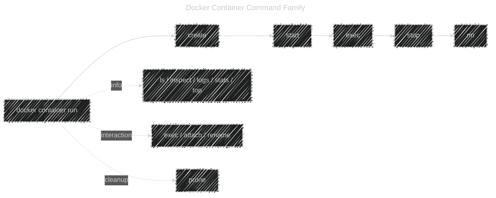

# 🧩 Docker Container Commands — Easy to Remember

Every command starts with this structure:

```bash
docker container <sub-command> [options]
```

👉 Think of **`docker container`** as a “folder” containing all actions you can do **to a container** —
create it, start it, stop it, inspect it, log it, etc.

---

## 🎯 Quick Categorization (Memory Trick)

You can group all container commands into **5 categories**:

| Category                   | Purpose                                   | Example Command                                                               | Easy to Remember As          |
| -------------------------- | ----------------------------------------- | ----------------------------------------------------------------------------- | ---------------------------- |
| 🏗️ **Lifecycle**           | Create / Start / Stop / Remove containers | `create`, `start`, `run`, `stop`, `rm`, `kill`, `pause`, `unpause`, `restart` | _“Born → Run → Sleep → Die”_ |
| 🔍 **Info & Logs**         | View details, logs, or stats              | `ls`, `inspect`, `logs`, `stats`, `top`, `port`                               | _“What’s inside?”_           |
| 🔄 **Interaction**         | Connect or execute inside containers      | `exec`, `attach`, `rename`                                                    | _“Talk to it”_               |
| 📦 **Resource Management** | Clean up, prune old stuff                 | `prune`                                                                       | _“Garbage collector”_        |
| ⚙️ **Configuration**       | Networking, volumes (via run options)     | via flags in `run`                                                            | _“How it’s built”_           |

---

## 🧱 1. 🏗️ Lifecycle Commands

These manage the **life** of your container — from birth to death 👶💀

| Command                    | Meaning                        | Example                  | Easy Tip                 |
| -------------------------- | ------------------------------ | ------------------------ | ------------------------ |
| `docker container create`  | Only create, don’t start       | `docker create nginx`    | “Born, but asleep”       |
| `docker container start`   | Start an existing one          | `docker start mynginx`   | “Wake it up”             |
| `docker container run`     | Create + start a new container | `docker run -it ubuntu`  | “Born and running”       |
| `docker container pause`   | Freeze all processes           | `docker pause mynginx`   | “Freeze frame 🧊”        |
| `docker container unpause` | Resume paused one              | `docker unpause mynginx` | “Unfreeze ❄️➡🔥”         |
| `docker container stop`    | Gracefully stop                | `docker stop mynginx`    | “Ask it to sleep”        |
| `docker container restart` | Stop → Start again             | `docker restart mynginx` | “Reboot”                 |
| `docker container kill`    | Force stop immediately         | `docker kill mynginx`    | “Yank the power cord” ⚡ |
| `docker container rm`      | Remove (delete) a container    | `docker rm mynginx`      | “Bury the body” ⚰️       |

---

## 🔍 2. 🕵️‍♂️ Information & Monitoring Commands

These are **“What’s happening?”** tools.

| Command                    | Meaning                      | Example                  | Easy Tip                 |
| -------------------------- | ---------------------------- | ------------------------ | ------------------------ |
| `docker container ls`      | List running containers      | `docker ps`              | “Who’s alive?”           |
| `docker container ls -a`   | List all (running + stopped) | `docker ps -a`           | “Even the ghosts 👻”     |
| `docker container inspect` | Detailed info (JSON)         | `docker inspect mynginx` | “Autopsy report 🧠”      |
| `docker container logs`    | View output logs             | `docker logs mynginx`    | “See what it said 🗒️”    |
| `docker container stats`   | Live resource usage          | `docker stats`           | “Vitals: CPU, RAM ❤️”    |
| `docker container top`     | Show running processes       | `docker top mynginx`     | “What’s it doing now?”   |
| `docker container port`    | Show port mappings           | `docker port mynginx`    | “Where’s the door open?” |

---

## 🧍 3. 💬 Interaction Commands

These let you **get inside** or **communicate with** containers.

| Command                   | Meaning                                     | Example                         | Easy Tip                    |
| ------------------------- | ------------------------------------------- | ------------------------------- | --------------------------- |
| `docker container exec`   | Run a command inside a running container    | `docker exec -it mynginx bash`  | “Teleport inside 🧙‍♂️”        |
| `docker container attach` | Attach your terminal to a running container | `docker attach mynginx`         | “Mind-meld connection 🧠”   |
| `docker container rename` | Rename a container                          | `docker rename oldname newname` | “Give it a new name tag 🏷️” |

---

## 🧹 4. 🧽 Cleanup Commands

Keep your Docker environment tidy 🧼

| Command                  | Meaning                       | Example                  | Easy Tip                |
| ------------------------ | ----------------------------- | ------------------------ | ----------------------- |
| `docker container prune` | Remove all stopped containers | `docker container prune` | “Clean the graveyard 🪦” |

---

## ⚙️ 5. (Bonus) Helpful Shortcuts & Aliases

| Modern                  | Legacy Shortcut | Same As           |
| ----------------------- | --------------- | ----------------- |
| `docker container ls`   | `docker ps`     | List containers   |
| `docker container rm`   | `docker rm`     | Remove containers |
| `docker container run`  | `docker run`    | Run containers    |
| `docker container exec` | `docker exec`   | Execute commands  |
| `docker container logs` | `docker logs`   | Show logs         |

💡 _You can still use the old short forms — but the `docker container <sub-command>` style is clearer and future-proof._

---

## 🧠 Memory Trick: "R.I.P.E.R."

To remember the main container actions:

> **R.I.P.E.R. → Run, Inspect, Pause, Exec, Remove**

- **R** – `run` → start new one
- **I** – `inspect` → see details
- **P** – `pause` → freeze it
- **E** – `exec` → execute inside
- **R** – `rm` → remove when done

Mnemonic meaning:

> Containers live fast and die young, but you can **R.I.P.E.R.** 😅

---

## 🧭 Visual Summary

<div align="center">



</div>

---

## 🚀 TL;DR Cheat Sheet

| Action        | Command                    | What It Does                    |
| ------------- | -------------------------- | ------------------------------- |
| Run           | `docker container run`     | Create + start a container      |
| Create        | `docker container create`  | Just create, don’t start        |
| Start         | `docker container start`   | Start a stopped container       |
| Stop          | `docker container stop`    | Graceful shutdown               |
| Kill          | `docker container kill`    | Force stop                      |
| Restart       | `docker container restart` | Stop + start again              |
| Pause/Unpause | `docker pause/unpause`     | Freeze/unfreeze                 |
| List          | `docker container ls`      | List active containers          |
| Inspect       | `docker inspect`           | Show detailed info              |
| Logs          | `docker logs`              | Show container logs             |
| Exec          | `docker exec`              | Run command inside container    |
| Attach        | `docker attach`            | Connect terminal to running one |
| Rename        | `docker rename`            | Change container name           |
| Remove        | `docker container rm`      | Delete container                |
| Prune         | `docker container prune`   | Delete all stopped ones         |

---

## 🧩 In One Sentence

> 🐳 Docker container commands let you **create, inspect, interact, and clean up containers** — think of it as your full lifecycle toolkit for managing container “lives”.
