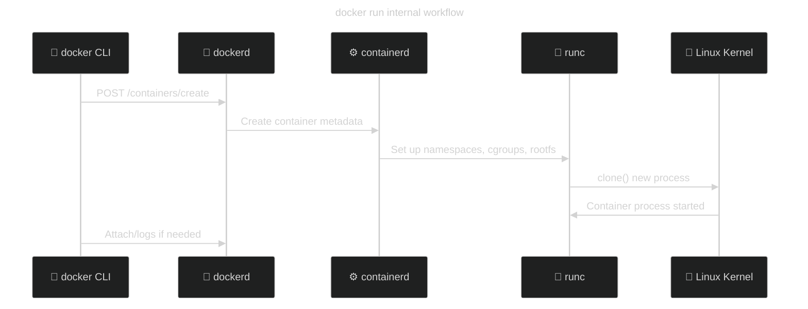

# 🧠 What `docker run` Does

When you run:

```bash
docker container run [OPTIONS] IMAGE [COMMAND] [ARG...]
```

You’re telling Docker:

> “Create a container from this image, apply these options, and start it with this command.”

Behind the scenes, `docker run` =
**`docker create` + `docker start` + (optional) `docker attach`**

---

## 🧩 Basic Command Structure

| Part                   | Description                                         |
| ---------------------- | --------------------------------------------------- |
| `docker container run` | The main command                                    |
| `[OPTIONS]`            | Configurations that control how the container runs  |
| `IMAGE`                | The image you want to run (e.g., `nginx`, `ubuntu`) |
| `[COMMAND] [ARG...]`   | Optional: the command to run inside the container   |

---

## ⚙️ Most Common & Useful Parameters (with examples)

Let’s go through the most-used flags in a friendly, simple way 👇

---

## 🧱 1. `-d` → Detached Mode (Run in Background)

```bash
docker run -d nginx
```

- Runs the container **in the background**.
- You get the container ID immediately, not logs.
- Container keeps running even after you close your terminal.

🧠 Think: _“daemon mode.”_

---

## 🖥️ 2. `-it` → Interactive + TTY (Attach to Shell)

```bash
docker run -it ubuntu bash
```

- `-i`: interactive (keeps STDIN open)
- `-t`: allocates a pseudo-TTY (makes it look like a real terminal)
- Together, this lets you open a shell inside the container.

🧠 Think: _“Give me a terminal inside the container.”_

---

## 🔌 3. `-p` → Port Mapping (Expose to Host)

```bash
docker run -d -p 8080:80 nginx
```

- Maps **host port 8080 → container port 80**.
- Format: `HOST_PORT:CONTAINER_PORT`.

🧠 Think: _“Make this container’s port visible on my computer.”_

Example:
Visit `http://localhost:8080` to access Nginx.

---

## 🏷️ 4. `--name` → Assign a Custom Container Name

```bash
docker run -d --name myweb nginx
```

- Assigns a readable name instead of random ID.
- Makes commands simpler:

  ```bash
  docker stop myweb
  docker logs myweb
  ```

🧠 Think: _“Give it a nickname.”_

---

## 💾 5. `-v` or `--volume` → Mount Storage

```bash
docker run -d -v /host/data:/container/data nginx
```

- Mounts a **host directory** or a **Docker volume** into the container.
- Format: `host_path:container_path`

🧠 Think: _“Attach this folder to the container.”_

---

## 🌐 6. `--network` → Connect to a Network

```bash
docker run -d --network mynet nginx
```

- Joins the container to a specific Docker network.
- Use `docker network ls` to list networks.

🧠 Think: _“Plug this container into a virtual LAN.”_

---

## 🌍 7. `-e` → Environment Variables

```bash
docker run -d -e MYSQL_ROOT_PASSWORD=secret mysql
```

- Sets environment variables inside the container.

🧠 Think: _“Set app configuration values.”_

---

## 🗂️ 8. `--rm` → Auto-remove After Exit

```bash
docker run --rm ubuntu echo "Hello"
```

- Container is deleted automatically when it exits.
- Useful for temporary tasks or debugging.

🧠 Think: _“Don’t leave garbage behind.”_

---

## 🧱 9. `--restart` → Restart Policy

```bash
docker run -d --restart always nginx
```

Common options:

| Policy           | Behavior                          |
| ---------------- | --------------------------------- |
| `no`             | Never restart (default)           |
| `always`         | Restart always, even after reboot |
| `on-failure`     | Restart only if exit code ≠ 0     |
| `unless-stopped` | Restart unless manually stopped   |

🧠 Think: _“Keep my service alive.”_

---

## 🔍 10. `--log-driver` → Logging Method

```bash
docker run -d --log-driver json-file nginx
```

- Control where logs go (`json-file`, `syslog`, `journald`, etc.)

---

## 🔒 11. `--privileged` → Full Access to Host

```bash
docker run -it --privileged ubuntu bash
```

- Gives container extended permissions (like mounting devices).
  ⚠️ Dangerous — use only for trusted containers.

---

## 🧍 12. `--user` → Run as Specific User

```bash
docker run -u 1000:1000 myapp
```

- Runs container processes as a non-root user.

---

## 🧾 13. `--entrypoint` → Override Default Entrypoint

```bash
docker run --entrypoint /bin/bash ubuntu
```

- Replaces the default entrypoint defined in the image.

🧠 Think: _“Start with this command instead.”_

---

## 🔁 Common Combinations

| Use Case                        | Example                                                    |
| ------------------------------- | ---------------------------------------------------------- |
| Run and connect to shell        | `docker run -it ubuntu bash`                               |
| Run background web app          | `docker run -d -p 8080:80 nginx`                           |
| Run named MySQL container       | `docker run -d --name db -e MYSQL_ROOT_PASSWORD=123 mysql` |
| Temporary container for testing | `docker run --rm -it alpine sh`                            |
| Run and attach volume           | `docker run -v /data:/var/lib/mysql mysql`                 |

---

## 🧭 Quick Summary Table

| Option      | Description            | Example                      |
| ----------- | ---------------------- | ---------------------------- |
| `-d`        | Run in background      | `docker run -d nginx`        |
| `-it`       | Interactive terminal   | `docker run -it ubuntu bash` |
| `-p`        | Port mapping           | `-p 8080:80`                 |
| `--name`    | Custom name            | `--name myapp`               |
| `-v`        | Mount volume           | `-v /data:/app/data`         |
| `-e`        | Env variables          | `-e APP_ENV=prod`            |
| `--rm`      | Auto-remove after exit | `--rm`                       |
| `--network` | Attach to network      | `--network mynet`            |
| `--restart` | Restart policy         | `--restart always`           |

---

## ⚙️ Bonus: What Happens Internally When You Run It

<div align="center">



</div>

---

## 🚀 TL;DR Summary

> `docker container run` = create + configure + start a container.

✅ Most-used flags:

```ini
-d       Run in background
-it      Interactive terminal
--name   Assign custom name
-p       Map ports
-v       Mount storage
-e       Set environment variables
--rm     Auto-remove on exit
--restart Manage restart policy
```
