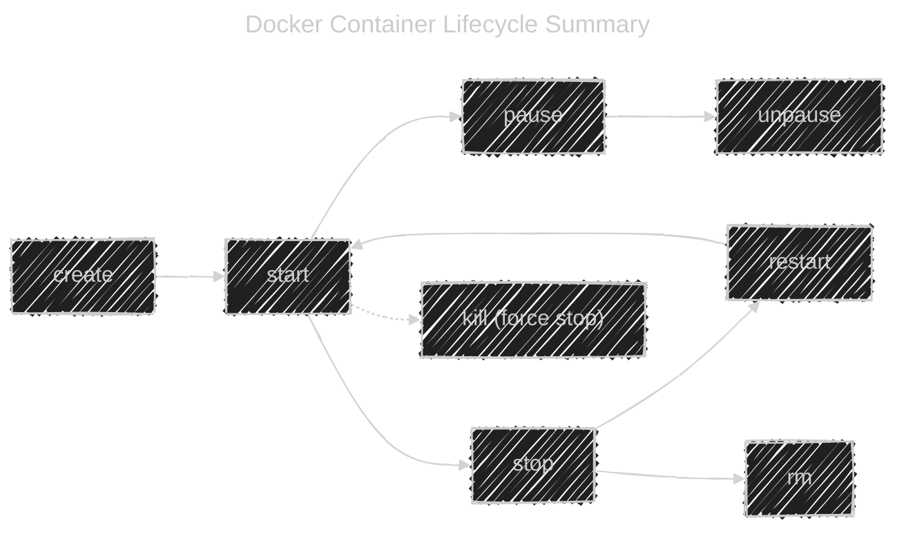

# 🧬 Docker Container Lifecycle (Overview)

Before we deep-dive into each command, here’s the big picture:

Each step = a **real Docker command**, and each one manages the **state** of a container:

- Created 🧱
- Running 🏃
- Paused 💤
- Stopped ⏹️
- Removed ❌

---

## 1️⃣ `docker container create` — Create but Don’t Start

### 🧠 What It Does

Creates a container **from an image** but **does not start it yet**.

The container gets:

- Its own **filesystem** (from image)
- A unique **Container ID**
- Metadata (env vars, ports, volumes, etc.)
- But **no process** is running yet!

---

### 🧱 Syntax

```bash
docker container create [OPTIONS] IMAGE [COMMAND] [ARG...]
```

Example:

```bash
docker container create --name myubuntu ubuntu
```

Result:

```ini
5a3b2a63e1e9a...   # ← container ID (created but not running)
```

---

### ⚙️ Common Options (Same as `docker run`)

| Option      | Description                            | Example                    |
| ----------- | -------------------------------------- | -------------------------- |
| `--name`    | Assign a custom name                   | `--name web01`             |
| `-p`        | Map port                               | `-p 8080:80`               |
| `-v`        | Mount volume                           | `-v /data:/app/data`       |
| `-e`        | Set environment variable               | `-e MODE=prod`             |
| `--network` | Connect to a network                   | `--network mynet`          |
| `--restart` | Restart policy                         | `--restart unless-stopped` |
| `--user`    | Run as a specific user                 | `--user 1000:1000`         |
| `--workdir` | Set working directory inside container | `--workdir /app`           |

---

### 📦 Example: Pre-configure a Container

```bash
docker container create \
  --name myapp \
  -p 8080:80 \
  -v /mydata:/var/www/html \
  -e ENV=prod \
  nginx
```

You now have a container ready to run:

```bash
docker start myapp
```

---

### 🧩 When to Use

| Scenario            | Why Use `create`                             |
| ------------------- | -------------------------------------------- |
| Automated systems   | You want to prepare container config first   |
| CI/CD               | Pre-define containers and start them later   |
| Volume/network prep | Attach resources before starting             |
| Testing             | Quickly duplicate config without running yet |

---

### 🧠 Note (Key Difference from `run`)

| `docker run`                                 | `docker create`           |
| -------------------------------------------- | ------------------------- |
| Creates **and** starts container immediately | Only creates it           |
| Shortcut = `create + start`                  | First step only           |
| More common for interactive work             | More common in automation |

---

### 🔍 See Created Containers

```bash
docker ps -a
```

Output:

```ini
CONTAINER ID   IMAGE    STATUS
5a3b2a63e1e9   ubuntu   Created
```

---

## 2️⃣ `docker container start` — Start a Stopped/Created Container

### 🧠 What It Does

Starts a container that was:

- Created (via `docker create`)
- Or previously stopped

> Think of it as pressing the **power button** on a virtual machine 💻

---

### 🧱 Syntax

```bash
docker container start [OPTIONS] CONTAINER [CONTAINER...]
```

Example:

```bash
docker container start myubuntu
```

---

### ⚙️ Common Options

| Option | Description                         | Example                  |
| ------ | ----------------------------------- | ------------------------ |
| `-a`   | Attach terminal to container output | `docker start -a myapp`  |
| `-i`   | Attach STDIN (interactive input)    | `docker start -ai myapp` |

---

### 📦 Example

```bash
docker container create --name test ubuntu sleep 10
docker container start -ai test
```

It will run `sleep 10` → then exit.
If you run it **without `-a`**, it runs silently in the background.

---

### 🧩 When to Use

| Case                        | Use It                            |
| --------------------------- | --------------------------------- |
| Start an existing container | ✅ Yes                            |
| Restart after crash         | ✅ Yes                            |
| Want to see output directly | Add `-a`                          |
| Multiple containers         | `docker start web01 db01 cache01` |

---

## 3️⃣ `docker container stop` — Gracefully Stop

### 🧠 What It Does

Sends **SIGTERM** signal → gives process time to clean up.
If not stopped in 10 seconds → sends **SIGKILL** to force stop.

> Think: “Politely ask it to shut down.”

---

### 🧱 Syntax

```bash
docker container stop [OPTIONS] CONTAINER [CONTAINER...]
```

Example:

```bash
docker container stop myapp
```

---

### ⚙️ Common Options

| Option | Description                                     | Example                   |
| ------ | ----------------------------------------------- | ------------------------- |
| `-t`   | Seconds to wait before force kill (default 10s) | `docker stop -t 20 myapp` |

---

### 📦 Example

```bash
docker container stop -t 5 nginx
```

Waits 5 seconds before sending SIGKILL if process doesn’t exit.

---

### 🧩 When to Use

| Situation             | Explanation                   |
| --------------------- | ----------------------------- |
| Graceful app shutdown | ✅ Yes (safest)               |
| Batch shutdowns       | `docker stop $(docker ps -q)` |
| Controlled cleanup    | Better than `kill`            |

---

## 4️⃣ `docker container kill` — Force Stop (Immediate)

### 🧠 What It Does

Sends **SIGKILL** immediately — kills the process **without cleanup**.

> Think: “Pull the plug out of the wall 💀”

---

### 🧱 Syntax

```bash
docker container kill [OPTIONS] CONTAINER [CONTAINER...]
```

Example:

```bash
docker container kill myapp
```

---

### ⚙️ Common Options

| Option     | Description                            | Example           |
| ---------- | -------------------------------------- | ----------------- |
| `--signal` | Send a specific signal instead of KILL | `--signal SIGINT` |

---

### 🧩 When to Use

| Use Case          | Why                                 |
| ----------------- | ----------------------------------- |
| Container hung    | Force terminate immediately         |
| Testing           | See how system recovers after crash |
| Emergency cleanup | Skip graceful stop                  |

---

## 5️⃣ `docker container restart` — Stop + Start Again

### 🧠 What It Does

Performs:

```ini
stop → start
```

Useful after updating configs, volumes, or debugging.

> Think: “Reboot my app.”

---

### 🧱 Syntax

```bash
docker container restart [OPTIONS] CONTAINER [CONTAINER...]
```

Example:

```bash
docker container restart -t 5 myapp
```

---

### ⚙️ Common Option

| Option | Description                                | Example |
| ------ | ------------------------------------------ | ------- |
| `-t`   | Timeout before force killing (default 10s) | `-t 3`  |

---

### 🧩 When to Use

| Scenario           | Why                   |
| ------------------ | --------------------- |
| Apply new settings | Restart picks them up |
| Recover from crash | Restart cleanly       |
| CI/CD pipelines    | Refresh environments  |

---

## 6️⃣ `docker container pause` / `unpause`

### 🧠 What It Does

- `pause` → Suspends all processes (using **cgroups freezer**)
- `unpause` → Resumes them

> Think: “Freeze time ⏸️ … then resume ▶️”

---

### 🧱 Syntax

```bash
docker container pause CONTAINER
docker container unpause CONTAINER
```

Example:

```bash
docker pause myapp
docker unpause myapp
```

---

### 🧩 When to Use

| Case                         | Reason                   |
| ---------------------------- | ------------------------ |
| Temporarily freeze CPU usage | Debugging or maintenance |
| System overload              | Free up CPU instantly    |
| Short maintenance windows    | Pause > unpause later    |

---

## 7️⃣ `docker container rm` — Remove Container

### 🧠 What It Does

Deletes a container (can’t remove if running unless `-f`).

> Think: “Delete the virtual machine.”

---

### 🧱 Syntax

```bash
docker container rm [OPTIONS] CONTAINER [CONTAINER...]
```

---

### ⚙️ Common Options

| Option | Description                     | Example              |
| ------ | ------------------------------- | -------------------- |
| `-f`   | Force remove (kills if running) | `docker rm -f nginx` |
| `-v`   | Remove anonymous volumes        | `docker rm -v nginx` |

---

### 📦 Example

```bash
docker container rm -f myapp
```

Or remove all stopped:

```bash
docker container prune
```

---

### 🧩 When to Use

| Scenario                       | Action                          |
| ------------------------------ | ------------------------------- |
| Clean old stopped containers   | ✅ `docker rm $(docker ps -aq)` |
| Force delete running container | ✅ `docker rm -f myapp`         |
| Free disk space                | ✅ `docker container prune`     |

---

## ⚙️ Lifecycle Summary Table

| Command   | Action           | Description                       | Common Options                          |
| --------- | ---------------- | --------------------------------- | --------------------------------------- |
| `create`  | Born             | Prepare container but don’t start | `--name`, `-v`, `-e`, `-p`, `--network` |
| `start`   | Wake             | Start a stopped/created container | `-a`, `-i`                              |
| `stop`    | Gracefully sleep | Send SIGTERM → SIGKILL            | `-t`                                    |
| `kill`    | Force kill       | Send SIGKILL immediately          | `--signal`                              |
| `restart` | Reboot           | Stop + Start                      | `-t`                                    |
| `pause`   | Freeze           | Suspend CPU processes             | —                                       |
| `unpause` | Resume           | Continue paused processes         | —                                       |
| `rm`      | Delete           | Remove container from system      | `-f`, `-v`                              |

---

## 🧭 Visual Recap: Lifecycle Flow

<div align="center">



</div>
