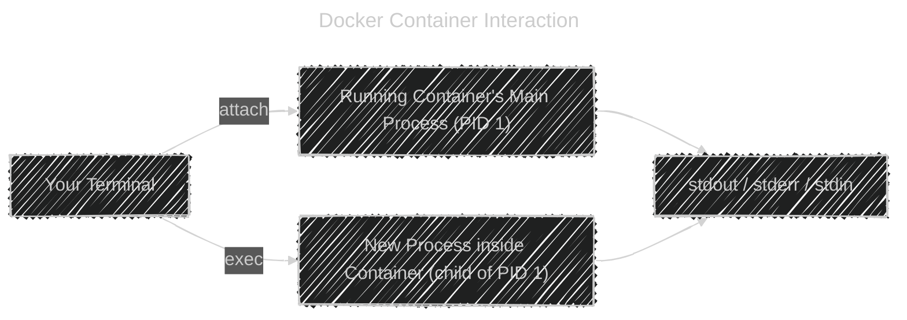
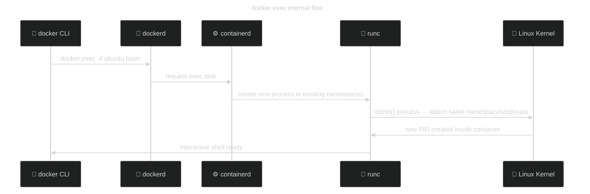
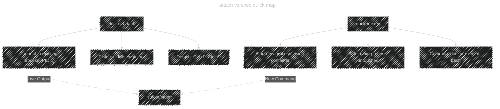

# 🧩 Docker Container Interaction Commands

Docker containers are like lightweight, isolated Linux systems.
Once they’re running, you often need to:

- **Connect** to them (see output, control processes)
- **Execute** commands inside them  
  → That’s where **`docker container attach`** and **`docker container exec`** come in.

---

## 🚦 Let’s Start with the Big Picture

### 🧭 Diagram: How You Interact with Containers

<div align="center">



</div>

**In simple terms:**

- `attach` → You connect **your terminal directly to the container’s main process**.
- `exec` → You **start a new process inside the container**, without touching the main one.

---

## 1️⃣ `docker container attach`

### 💬 What It Does

`docker attach` connects your current terminal **to the STDIN, STDOUT, and STDERR** of a **`running` container’s main process**.

Think of it as:

> “Plug my keyboard and screen into the container’s console.”

---

### 🧱 Basic Syntax

```bash
docker container attach [OPTIONS] CONTAINER
```

Example:

```bash
# 1. create a container with terminal as its main process
docker run -it --name my_ubuntu  ubuntu
# 2. exit the container without killing the main process by using (Ctrl + P, Ctrl + Q)
# 3. attach to the main process
docker container attach my_ubuntu
```

Now, whatever you type in the attached terminal goes directly into the container’s main process (like the shell inside it).

---

### ⚙️ Options

| Option                          | Description                                         |
| ------------------------------- | --------------------------------------------------- |
| `--detach-keys="ctrl-p,ctrl-q"` | Define custom keys to **detach** from container     |
| `--no-stdin`                    | Do not attach STDIN (input)                         |
| `--sig-proxy=true`              | Forward signals (e.g., Ctrl+C) to container process |

---

### 💡 How to Detach (Without Killing)

When you attach, you are _literally attached_. If you close the terminal incorrectly — you might **kill the container** unintentionally.
To safely detach:

- **Default keys:** `Ctrl + P`, then `Ctrl + Q`
  (Press one after the other — not together.)

🧠 Think: _“Pull + Quit” → P + Q_

---

### ⚠️ Important Notes

1. If you use `exit` inside an attached shell → container stops.
   (Because the main process ended.)
2. If you close the terminal without detaching correctly → same result (container dies).
3. You can only attach to **a container that’s already running** and was started with `-it` (interactive).

---

### 🧠 When to Use `attach`

| Use Case               | Description                                           |
| ---------------------- | ----------------------------------------------------- |
| Debug an app container | You want to see live output from its main process     |
| Resume work            | You detached earlier and want to return               |
| Observe logs directly  | Instead of `docker logs`, you want live stdout stream |

🧩 _Think:_ `attach` = reconnect to the **main** process.

---

## 2️⃣ `docker container exec`

### 💬 What It Does

`docker exec` lets you **run a new command** inside an already running container.
You’re not touching the main process — just creating a **new child process** inside the same Linux namespaces.

Think of it as:

> “SSH into the container and run something.”

---

### 🧱 Basic Syntax

```bash
docker container exec [OPTIONS] CONTAINER COMMAND [ARG...]
```

Example:

```bash
docker exec -it ubuntu bash
```

This opens a **new interactive shell** inside the existing container — just like SSHing into a VM.

---

### ⚙️ Common Options

| Option      | Description                            | Example                                 |
| ----------- | -------------------------------------- | --------------------------------------- |
| `-i`        | Keep STDIN open                        | `-i`                                    |
| `-t`        | Allocate pseudo-TTY (terminal screen)  | `-t`                                    |
| `-it`       | Interactive mode (most common combo)   | `docker exec -it ubuntu bash`           |
| `-d`        | Run command in background (detached)   | `docker exec -d ubuntu touch /tmp/test` |
| `--user`    | Run as specific user                   | `docker exec -u root ubuntu whoami`     |
| `--env`     | Set temporary environment variable     | `docker exec -e MODE=debug ubuntu env`  |
| `--workdir` | Set working directory inside container | `docker exec -w /app ubuntu ls`         |

---

### 🧠 When to Use `exec`

| Use Case                    | Description                                           |
| --------------------------- | ----------------------------------------------------- |
| Open shell inside container | `docker exec -it ubuntu bash`                         |
| Check logs or files         | `docker exec -it nginx cat /var/log/nginx/access.log` |
| Run admin commands          | `docker exec -it mysql mysql -u root -p`              |
| Debug running app           | `docker exec -it app ps aux`                          |
| Run one-off tasks           | `docker exec ubuntu echo "hello"`                     |

---

### 🧩 Example Comparison: `attach` vs `exec`

| Feature                     | `docker attach`                   | `docker exec`          |
| --------------------------- | --------------------------------- | ---------------------- |
| Connects to                 | Main process (PID 1)              | New process            |
| Affects container lifecycle | Yes (can stop it)                 | No (safe)              |
| Starts new shell            | ❌ No                             | ✅ Yes                 |
| Need `-it`?                 | Only if container started with it | Add `-it` yourself     |
| Best for                    | Viewing live process output       | Running extra commands |
| Detach safely               | Ctrl+P, Ctrl+Q                    | Exit shell normally    |

🧠 Think:

- `attach` → “Share the screen of the main process.”
- `exec` → “Open a new terminal inside it.”

---

## 🧬 Deep Dive (Linux Internals)

Let’s see what happens **under the hood** 👇

### When You Run `docker exec`:

1. The Docker daemon talks to **containerd**.
2. `containerd` creates a new **exec process** inside the container’s namespace (same PID, network, and filesystem isolation).
3. It **shares** the same cgroups (resource limits) as the main container.
4. The new process (like `bash` or `ls`) runs inside that environment and exits independently.

<div align="center">



</div>

So basically:

> `exec` = new process inside same Linux “box” 🧱  
> `attach` = connect to the **already-running** process inside that box.

---

## 🧠 Linux Concepts Explained (for Non-Linux Users)

### 🧩 STDIN / STDOUT / STDERR

- **STDIN** → Standard Input (keyboard)
- **STDOUT** → Standard Output (text printed)
- **STDERR** → Error Output (red text)

When you attach or exec:

- You are connecting your terminal to these input/output “pipes.”

---

### 🧩 TTY (teletype terminal)

- A **TTY** simulates an interactive terminal (like your shell).
- Without `-t`, you’d see raw output (ugly).
- With `-t`, you get colors, cursor, line editing.

🧠 Use `-it` → always safe for interactive shells.

---

### 🧩 Process & PID 1

- Inside every container, one main process runs (like `nginx`, or `/bin/bash`).
- That’s **PID 1** (Process ID 1).
- If PID 1 exits → container stops.

That’s why **`attach`** is risky — you’re directly tied to PID 1.

---

## ✅ Best Practices & Pro Tips

| Task                                 | Recommended Command                 |
| ------------------------------------ | ----------------------------------- |
| Get a shell inside running container | `docker exec -it myapp bash`        |
| View logs safely                     | `docker logs -f myapp`              |
| Reconnect to long-running app        | `docker attach myapp`               |
| Safely detach from container         | Press `Ctrl + P`, then `Ctrl + Q`   |
| Run background task                  | `docker exec -d myapp touch /tmp/x` |
| Cleanly explore file system          | `docker exec -it myapp sh`          |

---

## 🧭 Visual Summary

<div align="center">



</div>

---

## 🧾 TL;DR Summary

| Command                   | What It Does                       | Safe?                          | Common Usage                           |
| ------------------------- | ---------------------------------- | ------------------------------ | -------------------------------------- |
| `docker container attach` | Connect to the main process        | ⚠️ Risky (can stop container)  | Debug, resume                          |
| `docker container exec`   | Run a new command inside container | ✅ Safe                        | Shell, logs, debug                     |
| `-it`                     | Interactive + TTY                  | ✅ Always use for shell access | `docker exec -it ubuntu bash`          |
| `--detach-keys`           | Change detach combo for attach     | ✅ Safe                        | `docker attach --detach-keys="ctrl-c"` |

---

> 🧠 **In short:**
>
> - Use `attach` when you want to _reconnect_ to the container’s main screen.
> - Use `exec` when you want to _open a new shell or command_ inside it — **safe, isolated, flexible.**
