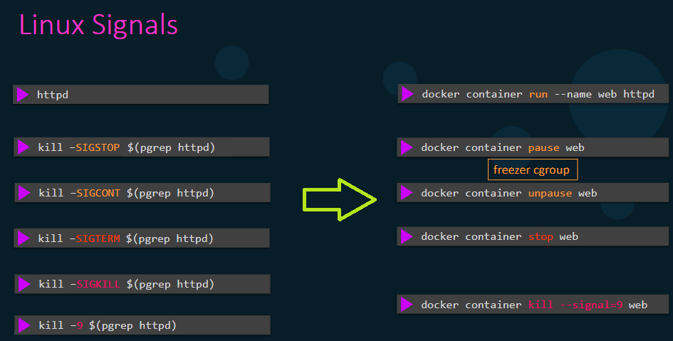

# 🧩 Mastering Docker Container Stopping & Removal

_🎯 out goal to -> Understanding Linux Signals, Pause/Stop/Kill, RM, Prune, and `--rm` flag_

---

## 🧠 1. The Foundation — Linux Signals Explained

Before understanding Docker’s lifecycle control, you must know what **Linux signals** are.

When you run any process in Linux, it has a **PID** (Process ID).
Linux allows the kernel and other processes to send **signals** to control that process.

Each signal has a number and purpose — like messages that say:
“Pause”, “Continue”, “Stop gracefully”, or “Die right now”.

---

### 🪄 Common Linux Signals Used by Docker

<div align="center" style="background-color: #071D28; border-radius: 20px;">

| Signal           | Name      | Meaning                                 | Can be Ignored? | Example               |
| ---------------- | --------- | --------------------------------------- | --------------- | --------------------- |
| **SIGSTOP (19)** | Stop      | Freezes (pauses) the process            | ❌ No           | `kill -SIGSTOP <pid>` |
| **SIGCONT (18)** | Continue  | Resumes paused process                  | ✅ Yes          | `kill -SIGCONT <pid>` |
| **SIGTERM (15)** | Terminate | Graceful shutdown request               | ✅ Yes          | `kill -SIGTERM <pid>` |
| **SIGKILL (9)**  | Kill      | Immediate termination (can’t be caught) | ❌ No           | `kill -SIGKILL <pid>` |

</div>

---

> To know the process id of service you can call
>
> ```bash
> pgrep <service_name>
> ```
>
> and then use `kill -SIGSTOP <pid>`
> or `kill -SIGKILL $(pgrep <service_name>)`

---

### 🧩 Why It Matters for Docker

Each Docker container is **just a Linux process tree**, isolated using:

- **Namespaces** → isolate filesystem, network, PID space, etc.
- **cgroups (control groups)** → manage CPU, memory, and I/O limits.

So when Docker needs to pause, stop, or kill a container, it simply sends these **Linux signals** to the container’s **main process (PID 1 inside container)**.

---

## ⚙️ 2. Docker Lifecycle Commands and Their Signals

Let’s now map these signals to Docker commands — this is the “translation layer” 👇

---

### 🟡 `docker container pause`

- **Purpose:** Freeze all processes inside a container (no CPU usage).
- **Signal Sent:** `SIGSTOP` (like pressing “Pause” on a video).
- **Mechanism:** Uses Linux’s **freezer cgroup** subsystem.

```bash
docker container pause web
```

🧊 Everything inside the container is **frozen** — memory stays allocated,
but CPU scheduling is halted.

To resume:

```bash
docker container unpause web
```

→ Sends `SIGCONT` to resume all processes.

✅ **Use Case:** Temporarily freeze heavy processes without stopping the container.

---

### 🟢 `docker container stop`

- **Purpose:** Gracefully stop the container.
- **Signals Sent:**

  1. `SIGTERM` → ask process to exit politely.
  2. Wait 10 seconds (default).
  3. If still running → `SIGKILL`.

```bash
docker container stop web
```

You can control the waiting period:

```bash
docker container stop -t 5 web
```

This gives the process time to **cleanup**, close files, or write logs before shutdown.

✅ **Use Case:** Normal controlled shutdown (default behavior when you use `docker-compose down`).

---

### 🔴 `docker container kill`

- **Purpose:** Force stop a container immediately (no cleanup).
- **Signal Sent:** `SIGKILL` by default, but you can choose.

```bash
docker container kill web
# or send a custom signal
docker container kill --signal=SIGTERM web
```

💥 This is **instant** — the process dies without executing shutdown handlers.

⚠️ **Use Case:** When `docker stop` doesn’t work or container is frozen.

---

## 🧹 3. Removing Containers

Once a container is **stopped**, its data still exists:

- Metadata (ID, name, config)
- Logs
- Mount information
  All stored under `/var/lib/docker/containers/<container_id>/`.

You can **remove** it manually or automatically.

---

### ⚪ `docker container rm`

- **Purpose:** Delete a container’s metadata and file references.
- Works **only** on stopped containers.

```bash
docker container rm web
```

If the container is still running, use `-f` (force):

```bash
docker container rm -f web
```

This performs an internal **stop → remove** sequence.

After removal:

- `/var/lib/docker/containers/<id>/` directory is deleted.
- Logs (`container.log`) and config (`config.v2.json`) are removed.

✅ **Use Case:** Clean up containers after you’re done using them.

---

### ⚙️ `--rm` Flag (Auto-Remove After Exit)

When you run a container with `--rm`, Docker automatically removes it
as soon as it stops.

```bash
docker run --rm ubuntu echo "Hello"
```

Sequence:

1. Container starts.
2. Runs command and exits.
3. Docker automatically deletes it.

✅ **Use Case:** Short-lived test containers (builds, scripts, CLI tasks).

---

### 🧾 `docker container prune`

Deletes **all stopped containers** in one go.

```bash
docker container prune
```

You’ll get a warning:

```ini
WARNING! This will remove all stopped containers.
Are you sure you want to continue? [y/N]
```

To skip confirmation:

```bash
docker container prune -f
```

✅ **Use Case:** Cleanup environment to free disk space.

---

## 🧩 4. Internal Mechanics — What Happens Under `/var/lib/docker/containers`

Whenever you run or stop containers, Docker maintains records under:

```ini
/var/lib/docker/containers/<container_id>/
```

Inside you’ll find:

```ini
config.v2.json        # Container metadata (env vars, mounts, ports)
hostconfig.json       # Host-level config (volumes, network mode, etc.)
log.json              # Container stdout/stderr logs
checkpoint/           # Used for paused or checkpointed containers
mounts/               # Info about mounted volumes
```

### When you stop a container:

- Docker sends `SIGTERM` → waits → maybe `SIGKILL`.
- Updates container state in `config.v2.json` to `"Stopped"`.
- Logs written to `log.json`.

### When you remove a container:

- Deletes the container directory entirely.
- Removes log and config files.
- Clears references from Docker’s internal metadata store.

### When you use `--rm`:

- This cleanup happens automatically after container exit.

---

## 🧭 5. Visual Summary

<div align="center" style="background-color: #071D28; border-radius: 20px;">
  
</div>

---

## 💡 6. Quick Reference Summary

| Command   | Linux Signal(s)   | Behavior                      | Common Option  | Notes                      |
| --------- | ----------------- | ----------------------------- | -------------- | -------------------------- |
| `pause`   | SIGSTOP           | Freeze processes              |                | Uses freezer cgroup        |
| `unpause` | SIGCONT           | Resume frozen processes       |                |                            |
| `stop`    | SIGTERM → SIGKILL | Graceful shutdown             | `-t <seconds>` | Waits before force killing |
| `kill`    | SIGKILL or custom | Force stop                    | `--signal=9`   | Immediate                  |
| `rm`      | —                 | Remove stopped container      | `-f`           | Deletes container dir      |
| `prune`   | —                 | Remove all stopped containers | `-f`           | Cleanup utility            |
| `--rm`    | Auto remove       | Cleanup after exit            | —              | Temporary container        |

---

## 🧠 7. Easy-to-Memorize Analogy

| Action      | Think Of It As                              |
| ----------- | ------------------------------------------- |
| **pause**   | “Freeze frame 🧊” — CPU stops, memory stays |
| **unpause** | “Continue playback ▶️”                      |
| **stop**    | “Gracefully power down 💬”                  |
| **kill**    | “Unplug the server ⚡”                      |
| **rm**      | “Delete it from history 🧹”                 |
| **prune**   | “Mass cleanup 🪦”                            |
| **--rm**    | “Self-destruct after use 🪄”                 |

---

## ✅ 8. Pro Tips

- Always prefer `stop` before `kill` (graceful shutdown).
- Use `--rm` for short tasks to avoid clutter.
- Use `prune` regularly in dev environments.
- To see paused containers: `docker ps -a --filter status=paused`
- For debugging container termination: `docker inspect <id> | grep -A5 State`
