# 🔍 Overview — Info + Logs Category

These are your **"container visibility"** tools:

| Purpose                 | Commands                   |
| ----------------------- | -------------------------- |
| See containers          | `docker container ls`      |
| Get detailed info       | `docker container inspect` |
| View logs               | `docker container logs`    |
| Check running processes | `docker container top`     |
| Check port mappings     | `docker container port`    |
| Monitor live resources  | `docker container stats`   |

> 🧠 Think of them as: **“Who, What, When, How much?”**

---

## 1️⃣ `docker container ls` — List Containers

### 💡 What It Does

Lists containers currently on the system — by default, **only running ones**.

> Like “`ps`” in Linux, but for Docker.

---

### 🧱 Syntax

```bash
docker container ls [OPTIONS]
```

Equivalent short form:

```bash
docker ps
```

---

### ⚙️ Common Options

| Option             | Description                      | Example                                        |
| ------------------ | -------------------------------- | ---------------------------------------------- |
| `-a`               | Show all (running + stopped)     | `docker container ls -a`                                 |
| `-q`               | Show only container IDs          | `docker container ls -q`                                 |
| `-s`               | Show container size (disk usage) | `docker container ls -s`                                 |
| `--filter`         | Filter results                   | `docker container ls --filter status=exited`             |
| `--format`         | Custom output                    | `docker container ls --format "{{.Names}}: {{.Status}}"` |
| `--latest` or `-l` | Show most recently created       | `docker container ls -l`                                 |
| `--no-trunc`       | Don’t shorten output             | `docker container ls --no-trunc`                         |

---

### 📦 Example

```bash
docker container ls -a
```

Output:

```ini
CONTAINER ID   IMAGE     COMMAND      STATUS         PORTS      NAMES
c1d34c2b9d8e   nginx     "/docker-entrypoint.…"   Up 10m   80/tcp   web01
```

---

### 🧠 Tips

- `docker container ls` → “Who’s alive?”
- `docker container ls -a` → “Who ever lived?”
- `docker container ls -q` → “Just give me IDs (for scripting)”

Example automation:

```bash
docker stop $(docker ps -q)
```

---

## 2️⃣ `docker container inspect` — See Everything (JSON Detail)

### 💡 What It Does

Displays **low-level JSON metadata** about a container or image:

- Mounts
- Network settings
- Environment variables
- IP address
- Process config
- Cgroups info

> Think of it as “`docker describe`” or “`kubectl describe`”.

---

### 🧱 Syntax

```bash
docker container inspect [OPTIONS] CONTAINER [CONTAINER...]
```

Example:

```bash
docker container inspect web01
```

---

### ⚙️ Common Options

| Option     | Description                             | Example                                     |
| ---------- | --------------------------------------- | ------------------------------------------- |
| `--format` | Format the output using Go templates    | `--format "{{.NetworkSettings.IPAddress}}"` |
| `--type`   | Type of object (container, image, etc.) | `--type container`                          |

---

### 📦 Example

Get container’s internal IP:

```bash
docker container inspect --format '{{ .NetworkSettings.IPAddress }}' web01
```

Output:

```ini
172.17.0.2
```

---

### 🧠 Tip

You can query **any field**:

```bash
docker container inspect --format '{{ .Config.Env }}' web01
```

This returns all environment variables.

---

### ⚙️ Real-world Usage

| Task               | Command                                                            |
| ------------------ | ------------------------------------------------------------------ |
| Get IP             | `docker container inspect -f '{{.NetworkSettings.IPAddress}}' <container_id/container_name>`     |
| Get Mounts         | `docker container inspect -f '{{json .Mounts}}' <container_id/container_name>`                   |
| Get Restart Policy | `docker container inspect -f '{{.HostConfig.RestartPolicy.Name}}' <container_id/container_name>` |

---

## 3️⃣ `docker container logs` — See Logs from STDOUT/STDERR

### 💡 What It Does

Fetches logs (standard output + error) `produced by a container’s main process`.

> Think: “`tail -f` for containers.”

---

### 🧱 Syntax

```bash
docker container logs [OPTIONS] CONTAINER
```

Example:

```bash
docker container logs web01
```

---

### ⚙️ Common Options

| Option               | Description                                | Example                       |
| -------------------- | ------------------------------------------ | ----------------------------- |
| `-f`, `--follow`     | Stream live logs                           | `docker logs -f web01`        |
| `--since`            | Show logs since timestamp or relative time | `--since 10m`                 |
| `--until`            | Show logs before timestamp                 | `--until 2025-10-11T12:00:00` |
| `-t`, `--timestamps` | Show timestamps                            | `docker logs -t web01`        |
| `--tail`             | Number of last lines                       | `--tail 20`                   |

---

### 📦 Example

```bash
docker container logs -f --tail 20 web01
```

→ Shows last 20 log lines and follows new ones (like `tail -f`).

---

### 🧠 Tip

- Works only for logs from **container’s stdout/stderr** (not internal app logs).
- If your app writes to `/var/log/app.log`, use:

  ```bash
  docker exec -it web01 cat /var/log/app.log
  ```

---

## 4️⃣ `docker container top` — See Running Processes

### 💡 What It Does

Displays **active processes** inside the container, similar to Linux `ps aux`.

> Think: “What’s happening inside right now?”

---

### 🧱 Syntax

```bash
docker container top CONTAINER [ps-options]
```

Example:

```bash
docker container top web01
```

Output:

```ini
UID   PID   PPID   C   STIME   TTY   TIME   CMD
root  1523  1501   0   10:12   ?     00:00  nginx: master process nginx -g daemon off;
```

---

### 📦 Example with Custom ps options

```bash
docker container top web01 aux
```

Shows the same output as `ps aux` inside that container.

---

### 🧠 Tip

Useful when debugging:

- Check if your process actually started.
- Identify zombie or hung processes.
- Combine with `docker exec` to kill specific PIDs.

---

## 5️⃣ `docker container port` — Show Port Mappings

### 💡 What It Does

Lists which **host ports** map to which **container ports**.

> Like “show me the open doors 🚪 between host ↔ container.”

---

### 🧱 Syntax

```bash
docker container port CONTAINER [PRIVATE_PORT[/PROTO]]
```

Example:

```bash
docker container port web01
```

Output:

```ini
80/tcp -> 0.0.0.0:8080
```

---

### 📦 Example with Specific Port

```bash
docker port web01 80
```

Output:

```ini
0.0.0.0:8080
```

---

### 🧠 Tip

- Use in combination with `docker inspect` for more detailed network info.
- Good for debugging if container isn’t reachable from host.

---

## 6️⃣ `docker container stats` — Live Resource Monitor

### 💡 What It Does

Displays **live resource usage** (CPU, memory, I/O, network) of containers — like Linux `top`.

> Think: “htop for containers 🧮”

---

### 🧱 Syntax

```bash
docker container stats [OPTIONS] [CONTAINER...]
```

Example:

```bash
docker container stats
```

Output:

```ini
CONTAINER ID   NAME     CPU %   MEM USAGE / LIMIT   NET I/O     BLOCK I/O
f2ab13b4c2f6   web01    1.23%   45MiB / 512MiB      2.3kB/1.1kB 0B/0B
```

---

### ⚙️ Common Options

| Option        | Description                                         | Example                              |
| ------------- | --------------------------------------------------- | ------------------------------------ |
| `--no-stream` | Show one-time snapshot instead of continuous stream | `docker stats --no-stream`           |
| `--format`    | Custom output                                       | `--format "{{.Name}}: {{.CPUPerc}}"` |
| `--all`, `-a` | Show all containers (including stopped)             | `docker stats -a`                    |

---

### 🧠 Tip

- Great for quick performance troubleshooting.
- Use `--no-stream` for scripts:

  ```bash
  docker stats --no-stream --format "{{.Name}} {{.CPUPerc}}"
  ```

---

## 🧠 Summary Table

| Command   | Purpose                 | Example                | Key Options                        |
| --------- | ----------------------- | ---------------------- | ---------------------------------- |
| `ls`      | List containers         | `docker ps -a`         | `-a`, `-q`, `--filter`, `--format` |
| `inspect` | Show JSON metadata      | `docker inspect nginx` | `--format`                         |
| `logs`    | Show container logs     | `docker logs -f nginx` | `-f`, `--tail`, `--since`, `-t`    |
| `top`     | Show processes          | `docker top nginx`     | `ps-options`                       |
| `port`    | Show port mappings      | `docker port nginx`    | N/A                                |
| `stats`   | Show live CPU/mem usage | `docker stats`         | `--no-stream`, `--format`          |

---

## 🧭 Visual Map

```mermaid
---
config:
  theme: dark
  look: handDrawn
title: "Docker Info + Logs Command Map"
---
flowchart LR
    A["docker container ls"] --> B["List containers"]
    A --> C["inspect → detailed info"]
    A --> D["logs → stdout/stderr"]
    A --> E["top → running processes"]
    A --> F["port → network mappings"]
    A --> G["stats → live performance"]
```

<div align="center">



</div>

---

## 🧩 Pro Tips (Especially for SREs & DevOps Engineers)

| Situation                    | Best Command                                                     |
| ---------------------------- | ---------------------------------------------------------------- |
| App not responding           | `docker logs -f <container>`                                     |
| Container using too much CPU | `docker stats`                                                   |
| Need container IP            | `docker inspect -f '{{.NetworkSettings.IPAddress}}' <container>` |
| Verify port mapping          | `docker port <container>`                                        |
| Check app crashed            | `docker ps -a` (look for “Exited”)                               |
| Debug process inside         | `docker top <container>`                                         |

---

## 🧾 TL;DR Summary

> 🐳 **You can’t manage what you can’t see.**

- Use `ls` to **find** containers
- Use `inspect` to **understand** them
- Use `logs` to **watch** them
- Use `top` to **see processes**
- Use `stats` to **monitor usage**
- Use `port` to **trace connectivity**
