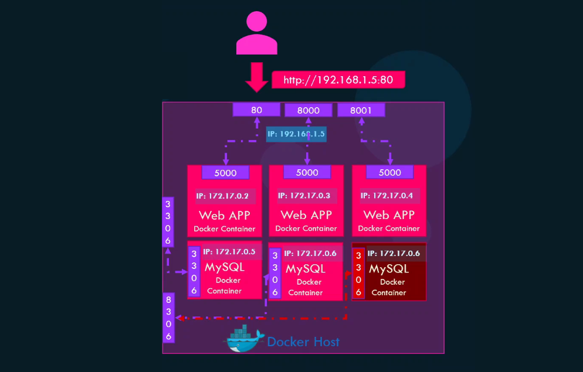
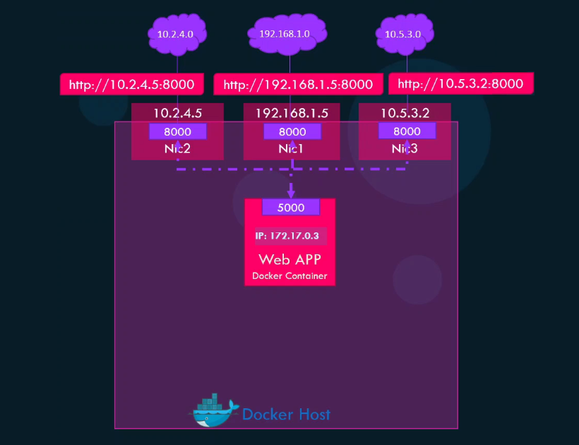
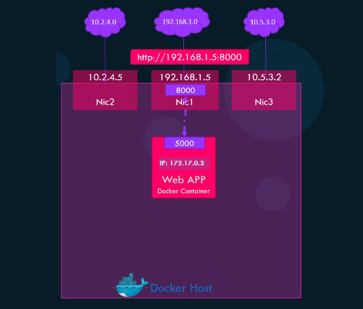
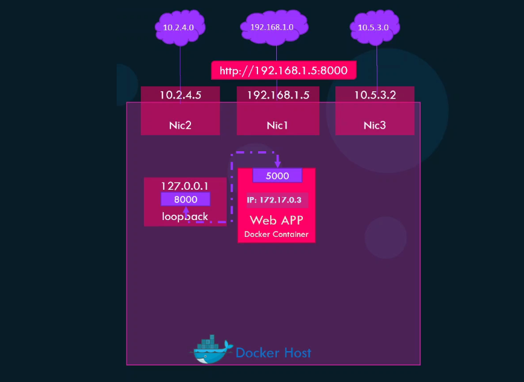
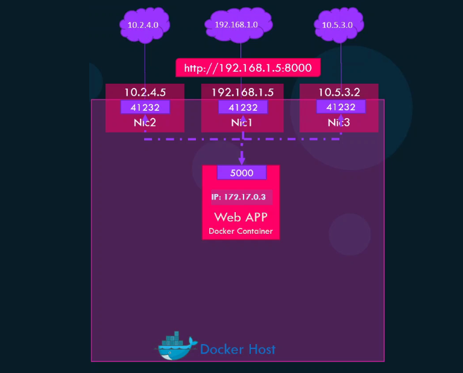

# 🌐 Mastering Docker Port Publishing

_How Containers Expose Ports to the Host and the World!_

---

## 🧠 1. The Core Concept

When you run a Docker container, it has its **own private network namespace** —
meaning it has its own:

- IP address
- Network stack (like a mini isolated computer)
- Firewall rules

So by default, **you can’t reach a container’s port** from your host or browser.
It’s isolated inside the **Docker bridge network**.

Example:

```bash
docker run -d --name web nginx
```

Inside the container, NGINX listens on **port 80**,  
but if you open `http://localhost`, it won’t work ❌  
Because the container’s port is **not published** to the host.

---

## 🚪 2. What "Publishing a Port" Means

**Publishing** is the process of making a container’s port accessible **outside** its private network —
either to your **host machine** or to the **external world**.

It’s like opening a hole in Docker’s firewall and mapping:

```ini
HostPort → ContainerPort
```

---

### 🔹 Syntax

```bash
docker run -p <host_port>:<container_port>
```

Example:

```bash
docker run -d -p 8080:80 nginx
```

This means:

- NGINX inside the container listens on **port 80**.
- Docker binds the host’s **port 8080** to the container’s **port 80**.

Now you can open:

```ini
http://localhost:8080
```

✅ and reach the NGINX running _inside the container_.

---

```bash
# 🔏 no port mapping - only accessible from other containers in the same network
docker run nginx

# ✅ port mapping
docker run -P 80:5000 nginx
docker run -P 8000:5000 nginx
docker run -P 8001:5000 nginx
docker run -P 3306:3306 mysql
docker run -P 8306:3306 mysql

# ❌ error
docker run -P 8306:3306 mysql
```

<div align="center" style="background-color: #081C25; border-radius: 20px">
  
</div>

---

## ⚙️ 3. Publishing Variations (All Possible Formats)

Let’s go through all forms of the `-p` / `--publish` flag 👇

---

### 📌 **Simple Host → Container Mapping**

```bash
-p 8080:80
```

→ Host port 8080 → Container port 80
on **all** host interfaces (`0.0.0.0`).

<div align="center" style="background-color: #081C25; border-radius: 20px">
  
</div>

---

### 📌 **Specify Host IP**

```bash
-p 127.0.0.1:8080:80
```

→ Only accessible from localhost.
Not available to external machines.

<div align="center" style="background-color: #081C25; border-radius: 20px">
  
</div>

---

> 💡 Use case: Secure local testing.

---

> ```bash
> docker run -p 127.0.0.1:8080:80 nginx # ❌ loopback
> ```
>
> <div align="center" style="background-color: #081C25; border-radius: 20px">
>   
> </div>

---

### 📌 **Specify Protocol (TCP or UDP)**

```bash
-p 8080:80/tcp
-p 9090:90/udp
```

By default, Docker publishes **TCP** ports,
so adding `/tcp` is optional unless you need UDP.

---

### 📌 **Multiple Ports**

```bash
-p 8080:80 -p 443:443
```

You can expose as many ports as you like using multiple `-p` flags.

---

### 📌 **Dynamic Host Port Mapping (Ephemeral)**

```bash
-p 5000
```

Docker chooses a **random high-numbered host port** automatically
and maps it to port 5000 inside the container.

<div align="center" style="background-color: #081C25; border-radius: 20px">
  
</div>

---

You can find the assigned port with:

```bash
docker port <container_name>
```

Example output:

```ini
5000/tcp -> 0.0.0.0:41232
```

✅ **Use Case:** For testing multiple containers exposing same internal port (e.g., several NGINX containers).

> 💡 Ephemeral port range are from:
>
> ```bash
> cat /proc/sys/net/ipv4/ip_local_port_range
> ```
>
> Output:
>
> 32768 - 60999

---

### 📌 **Automatic Host Port Mapping (`-P` flag)**

```bash
docker run -P nginx
```

This publishes **all exposed ports** from the image to random available ports on the host.  
Docker automatically maps each `EXPOSE`d port in the container to a high-numbered port on the host.

**Example:**  
If the image has `EXPOSE 80 443` in its Dockerfile, running `docker run -P nginx` might result in:

```Dockerfile
FROM ubuntu
RUN apt-get update && apt-get install -y python3 python3-pip
RUN pip3 install flask
COPY . /app
WORKDIR /app
EXPOSE 80
EXPOSE 443
CMD ["python3", "app.py"]
```

```ini
80/tcp -> 0.0.0.0:32768
443/tcp -> 0.0.0.0:32769
```

You can check the actual mappings with:

```bash
docker port <container_name>
```

**Use Case:**  
Quickly test containers without manually specifying host ports.

```bash
docker run -P nginx
```

> 💡 To Know exposed ports from image
>
> ```bash
> docker image inspect nginx
> ```
>
> Output:
>
> ```json
> [
>   {
>     "Config": {
>       "ExposedPorts": {
>         "80/tcp": {},
>         "443/tcp": {}
>       }
>     }
>   }
> ]
> ```

---

## 🌉 4. How Docker Publishes Ports Internally

This is where things get cool 😎 — let’s peek under the hood.

When you publish a port, Docker configures:

- **iptables (Linux firewall rules)**
- **NAT (Network Address Translation)**

to route traffic from the **host port → container port**.

---

### 🔍 Example (on Linux)

When you run:

```bash
docker run -d -p 8080:80 nginx
```

Docker:

1. Creates a virtual **bridge interface** (`docker0`).
2. Assigns the container an internal IP, e.g. `172.17.0.2`.
3. Adds an **iptables NAT rule** like:

```bash
-A DOCKER ! -i docker0 -p tcp --dport 8080 -j DNAT --to-destination 172.17.0.2:80
```

Meaning:

> When traffic hits host port 8080, send it to 172.17.0.2:80 (container).

---

### 🧭 Default Network: `bridge`

By default, containers run in the **bridge network**.

You can check it with:

```bash
docker network inspect bridge
```

It shows internal IPs like:

```ini
"Containers": {
    "web": {
        "IPv4Address": "172.17.0.2/16"
    }
}
```

Docker acts as a **router** and **firewall**, forwarding traffic into this private network.

---

## 🧰 5. Inspecting Published Ports

### 📋 List ports for a specific container

```bash
docker port web
```

Example output:

```ini
80/tcp -> 0.0.0.0:8080
```

### 📊 Inspect full network info

```bash
docker inspect web | grep -A5 "Ports"
```

Output:

```json
"Ports": {
    "80/tcp": [
        {
            "HostIp": "0.0.0.0",
            "HostPort": "8080"
        }
    ]
}
```

---

## 🧱 6. Exposing Ports vs Publishing Ports (Important Distinction)

| Term        | Command                         | Meaning                                                                                     |
| ----------- | ------------------------------- | ------------------------------------------------------------------------------------------- |
| **Expose**  | `EXPOSE <port>` (in Dockerfile) | Documents which port the container listens on. Does **not** make it reachable from outside. |
| **Publish** | `-p` or `--publish` at runtime  | Actually opens host port and maps it to container.                                          |

Example:

```dockerfile
# Dockerfile
EXPOSE 80
```

Then run:

```bash
docker run nginx
```

→ Not accessible externally ❌

But:

```bash
docker run -p 8080:80 nginx
```

→ Now published ✅

🧠 **Rule:**
`EXPOSE` = declare intent.
`-p` = actually open the door.

---

## 🧮 7. Working With Docker Compose

In **docker-compose.yml**, port publishing is done via `ports:` key.

Example:

```yaml
services:
  web:
    image: nginx
    ports:
      - "8080:80"
      - "127.0.0.1:9090:90"
```

Same rules apply.

---

## 🔐 8. Security and Best Practices

- Only publish ports you **need**.
- Use `127.0.0.1:<port>` to **limit access** to localhost.
- Avoid using the same host port for multiple containers.
- Use **reverse proxies** (like NGINX or Traefik) to manage public ports.
- For internal container-to-container communication,
  use Docker **networks**, not published ports.

---

## 🧭 9. Visualization


---

## 🧩 10. Summary Table

| Syntax                 | Description                              | Accessible From   |
| ---------------------- | ---------------------------------------- | ----------------- |
| `-p 8080:80`           | Host port 8080 → Container port 80 (TCP) | All interfaces    |
| `-p 127.0.0.1:8080:80` | Localhost only                           | Host machine only |
| `-p 8080:80/udp`       | UDP protocol                             | All interfaces    |
| `-p 80`                | Random host port → Container port 80     | All interfaces    |
| `--publish 8080:80`    | Same as `-p`                             | All interfaces    |

---

## ⚡ 11. Common Mistakes & Fixes

| Problem                           | Cause              | Fix                                                   |
| --------------------------------- | ------------------ | ----------------------------------------------------- |
| Browser can’t access container    | Port not published | Add `-p <host>:<container>`                           |
| Address already in use            | Port conflict      | Change host port                                      |
| Can’t access from another machine | Bound to localhost | Use `-p 0.0.0.0:<port>:<port>`                        |
| UDP app not working               | Default is TCP     | Add `/udp`                                            |
| Two containers need same port     | Host port conflict | Use different host ports (e.g., `8081:80`, `8082:80`) |

---

## 🧠 12. Pro Tips

- Check all mappings:

  ```bash
  docker ps --format "table {{.Names}}\t{{.Ports}}"
  ```

- Use `docker network ls` and `docker network inspect` to see container IPs.
- In Docker Desktop (Windows/macOS), port publishing is handled by the **VM engine**, not native iptables — but conceptually the same.

---

## ✅ 13. Mental Analogy

| Concept          | Analogy                                  |
| ---------------- | ---------------------------------------- |
| Container port   | A service running inside a room          |
| Host port        | A door in the building                   |
| `-p` flag        | Opening a door to the street             |
| `EXPOSE`         | Label on the door (“here’s the service”) |
| `docker0 bridge` | The hallway connecting rooms             |
| `iptables`       | The doorman directing traffic            |

---

## 🧭 TL;DR Summary

| Layer         | What Happens                                   |
| ------------- | ---------------------------------------------- |
| Container     | App listens on port (e.g., 80)                 |
| Docker Daemon | Sets up NAT & firewall rules                   |
| Host          | Routes traffic from host port → container port |
| User          | Accesses via `localhost:<host_port>`           |
