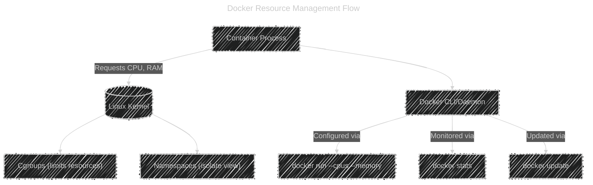

# ⚙️ Docker Resource Management — Overview

> 🧠 Think of this as: “How much power does this container get from my machine?”

These controls protect your system from one container **hogging all resources** (like CPU or memory).

Docker uses **Linux cgroups (control groups)** under the hood to manage limits.

---

## 🗂️ Key Resource Management Commands

| Purpose                               | Command                                                  |
| ------------------------------------- | -------------------------------------------------------- |
| Limit CPU/memory/disk at runtime      | `docker container run` (with `--cpus`, `--memory`, etc.) |
| Update resource limits dynamically    | `docker container update`                                |
| View live usage (CPU, RAM, I/O, etc.) | `docker container stats`                                 |
| Clean up unused stuff to free space   | `docker system prune`, `docker volume prune`             |

---

## 1️⃣ Setting Resource Limits (at container creation)

The **most common and preferred way** to apply limits is during container creation — using flags in `docker run`.

---

### 🧱 Syntax

```bash
docker run [OPTIONS] IMAGE
```

---

### ⚙️ Common Resource Options

| Flag             | Meaning                            | Example               |
| ---------------- | ---------------------------------- | --------------------- |
| `--cpus`         | Limit number of CPU cores          | `--cpus=1.5`          |
| `--cpu-shares`   | Set CPU weight (relative priority) | `--cpu-shares=512`    |
| `--memory`       | Max RAM usage                      | `--memory=512m`       |
| `--memory-swap`  | Memory + swap space                | `--memory-swap=1g`    |
| `--pids-limit`   | Limit number of processes          | `--pids-limit=100`    |
| `--blkio-weight` | Disk I/O priority                  | `--blkio-weight=500`  |
| `--cpuset-cpus`  | Bind to specific CPU cores         | `--cpuset-cpus="0,2"` |

---

### 📦 Example

```bash
docker run -d --name web \
  --cpus=1 \
  --memory=512m \
  nginx
```

✅ This means:

- Container gets max **1 CPU core**
- **512MB** of RAM
- If it exceeds, Linux OOM (Out-Of-Memory) killer may stop it

---

## 2️⃣ Updating Limits on Running Containers

Use `docker update` if you forgot to set limits before.

```bash
docker update --cpus 2 --memory 1g web
```

✅ The container continues running, but now with new limits.

---

## 3️⃣ Monitoring Resource Usage

---

### Command:

```bash
docker stats
```

Displays live usage metrics per container.

Example output:

```ini
CONTAINER ID   NAME   CPU %   MEM USAGE / LIMIT   NET I/O   BLOCK I/O
1ab34d56fe78   web    5.2%    120MiB / 512MiB     1kB/2kB   0B/0B
```

---

### Options

| Option        | Description                             |
| ------------- | --------------------------------------- |
| `--no-stream` | Show one-time snapshot (not continuous) |
| `--all`, `-a` | Show all containers                     |
| `--format`    | Custom output (for scripting)           |

Example:

```bash
docker stats --no-stream --format "{{.Name}}: {{.CPUPerc}}"
```

Output:

```ini
web: 5.23%
db: 12.44%
```

---

## 4️⃣ Freeing Resources (Cleanup Commands)

These help remove unused objects to save disk space.

| Command                | Description                                |
| ---------------------- | ------------------------------------------ |
| `docker system prune`  | Remove unused containers, images, networks |
| `docker image prune`   | Remove unused images                       |
| `docker volume prune`  | Remove unused volumes                      |
| `docker network prune` | Remove unused networks                     |

---

### Example:

```bash
docker system prune -a
```

✅ Deletes all:

- stopped containers
- dangling images
- unused networks
- build cache

---

⚠️ Be careful — this can remove images you still need later.

---

## 🧠 Concept Recap — Linux cgroups in simple terms

- Docker **doesn’t reinvent resource control** — it uses Linux features.
- **cgroups** = control groups = limit how much CPU, memory, etc. a process (container) can use.
- **namespaces** = isolation (each container gets its own "view" of system resources)
- Together they make containers feel like mini virtual machines 💡

---

## 🧩 Visual Diagram

<div align="center">



</div>

---

## 💡 Practical Summary

| Task               | Command               | Example                                 |
| ------------------ | --------------------- | --------------------------------------- |
| Limit CPU & memory | `docker run`          | `docker run --cpus=2 --memory=1g nginx` |
| Update limits      | `docker update`       | `docker update --memory 2g nginx`       |
| See live usage     | `docker stats`        | `docker stats --no-stream`              |
| Free space         | `docker system prune` | `docker system prune -a`                |

---

## 🧠 Quick Mnemonics

| Mnemonic                     | Meaning                        |
| ---------------------------- | ------------------------------ |
| **RUSC**                     | Run → Update → Stats → Cleanup |
| “**Resource USage Control**” |                                |
