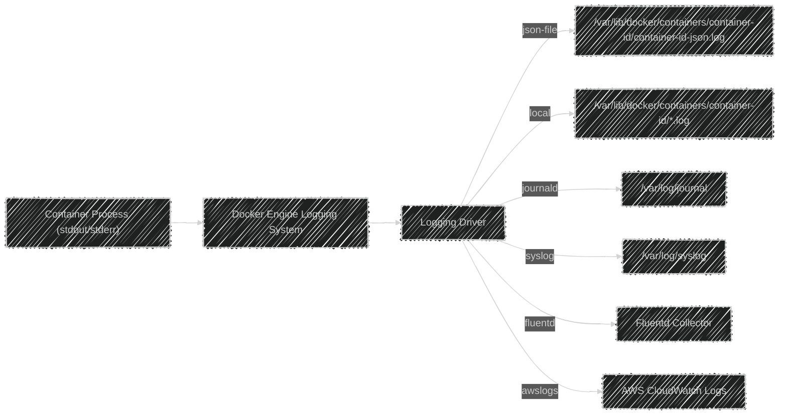
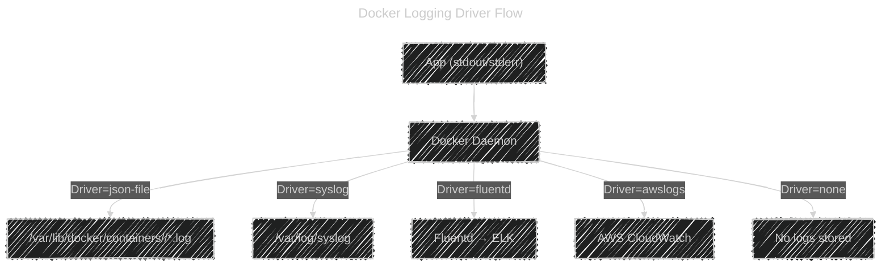

# 🧠 Mastering Docker Logging Drivers

_(How Docker Captures, Stores, and Routes Container Logs)!_

---

## 🔍 1. What Are Container Logs?

Every process running inside a container (like Nginx, Node.js, or Python) writes messages to **stdout** (standard output) and **stderr** (standard error).

💡 Example:

```bash
print("Hello world")   # → stdout
raise Exception("Oops!")  # → stderr
```

In Linux, both these “streams” normally appear on your terminal.
Docker **captures these two streams** for each container and sends them to a **logging driver**.

---

## ⚙️ 2. What Is a Logging Driver?

A **logging driver** decides **where and how** Docker stores or forwards the container logs.

Each container can have:

- Its own logging driver
- Custom configuration options for that driver

By default, Docker uses the **`json-file`** driver.

---

### 🧩 The Flow



---

## 📦 3. Default Behavior — `json-file` Driver

When you run a container without specifying any logging driver, Docker uses:

```json
"log-driver": "json-file"
```

It saves logs as structured JSON objects at:

```ini
/var/lib/docker/containers/<container_id>/<container_id>-json.log
```

---

### 🧾 Example Log Entry:

```json
{
  "log": "GET /index.html 200 OK\n",
  "stream": "stdout",
  "time": "2025-10-13T10:30:05.241Z"
}
```

You can view these logs using:

```bash
docker logs <container_id>
```

💡 Behind the scenes, this command just reads the JSON file and formats it nicely.

---

## 🧰 4. List of Docker Logging Drivers

| Logging Driver | Description                                  | Where Logs Go                                   |
| -------------- | -------------------------------------------- | ----------------------------------------------- |
| **json-file**  | Default; saves logs as JSON locally          | `/var/lib/docker/containers/<id>/<id>-json.log` |
| **local**      | Optimized local format; faster & smaller     | `/var/lib/docker/containers/`                   |
| **syslog**     | Sends logs to system’s syslog daemon         | `/var/log/syslog`                               |
| **journald**   | Integrates with systemd journal              | `journalctl -u docker`                          |
| **fluentd**    | Sends logs to Fluentd service                | Fluentd endpoint                                |
| **gelf**       | Sends logs using Graylog Extended Log Format | Graylog/Logstash                                |
| **awslogs**    | Sends logs to AWS CloudWatch Logs            | CloudWatch console                              |
| **splunk**     | Sends logs to Splunk HTTP Event Collector    | Splunk server                                   |
| **etwlogs**    | Windows Event Tracing (Windows only)         | Event Viewer                                    |
| **gcplogs**    | Sends logs to Google Cloud Logging           | Google Cloud console                            |
| **none**       | Disables logging                             | No logs                                         |

---

## 🧮 5. Setting Logging Driver

You can set the logging driver at:

### ✅ (A) **Container level**

Use the `--log-driver` flag when running a container:

```bash
docker run -d --log-driver=syslog nginx
```

To add custom driver options:

```bash
docker run -d \
  --log-driver=json-file \
  --log-opt max-size=10m \
  --log-opt max-file=3 \
  nginx
```

---

### ✅ (B) **Daemon level (default for all containers)**

Edit Docker’s service configuration file (usually at `/etc/docker/daemon.json`):

```json
{
  "log-driver": "json-file",
  "log-opts": {
    "max-size": "10m",
    "max-file": "5"
  }
}
```

Then restart Docker:

```bash
sudo systemctl restart docker
```

Now all new containers will use this logging config by default.

---

## 📚 6. `json-file` vs `local` Driver

These two are often confused — let’s compare them:

| Feature                   | json-file         | local                |
| ------------------------- | ----------------- | -------------------- |
| Format                    | JSON objects      | Compact binary       |
| Readable by `docker logs` | ✅ Yes            | ✅ Yes               |
| Disk space usage          | High              | Lower                |
| Speed                     | Slower            | Faster               |
| Rotation support          | Yes (via log-opt) | Yes                  |
| Default                   | ✅ Default        | Optional alternative |

💡 **Best practice:** Use `local` driver for better performance if logs are not needed outside the host.

---

## 🪵 7. Log Rotation and Size Limits

Without rotation, `json-file` logs can grow endlessly.
You can control this using **log options** (`--log-opt`):

| Option     | Description                     | Example                   |
| ---------- | ------------------------------- | ------------------------- |
| `max-size` | Max size of a single log file   | `--log-opt max-size=10m`  |
| `max-file` | Number of rotated files to keep | `--log-opt max-file=3`    |
| `compress` | Compress rotated files          | `--log-opt compress=true` |

Example:

```bash
docker run -d \
  --log-opt max-size=10m \
  --log-opt max-file=3 \
  nginx
```

Docker will:

- Rotate the log when it exceeds 10 MB
- Keep only 3 old files
- Delete older ones automatically

---

## 🔗 8. External Logging Drivers (Integrations)

These are used when you want centralized log collection for multiple containers or hosts.

---

### 🧱 **Syslog**

Send logs to Linux system log service.

```bash
docker run -d \
  --log-driver=syslog \
  --log-opt syslog-address=udp://192.168.1.10:514 \
  nginx
```

✅ Useful for sending logs to:

- `/var/log/syslog`
- Remote syslog servers

---

### 💬 **Fluentd**

```bash
docker run -d \
  --log-driver=fluentd \
  --log-opt fluentd-address=127.0.0.1:24224 \
  nginx
```

✅ Great for Elastic Stack (ELK) or centralized pipelines.

---

### ☁️ **AWS CloudWatch Logs**

```bash
docker run -d \
  --log-driver=awslogs \
  --log-opt awslogs-region=us-east-1 \
  --log-opt awslogs-group=my-app \
  nginx
```

✅ Sends logs directly to CloudWatch, visible in AWS Console.

---

### 🪶 **Splunk**

```bash
docker run -d \
  --log-driver=splunk \
  --log-opt splunk-token=YOUR_TOKEN \
  --log-opt splunk-url=https://splunk-server:8088 \
  nginx
```

---

### 🧩 **GELF (Graylog / Logstash)**

```bash
docker run -d \
  --log-driver=gelf \
  --log-opt gelf-address=udp://192.168.1.50:12201 \
  nginx
```

---

## 🚫 9. Disabling Logging

You can disable logging completely for lightweight or ephemeral containers:

```bash
docker run -d --log-driver=none nginx
```

⚠️ Means:

- `docker logs` won’t show anything
- No local files under `/var/lib/docker/containers`

✅ Use this for high-frequency, temporary jobs that produce huge logs you don’t need.

---

## 🧭 10. Viewing and Managing Logs

| Command                                                           | Description                         |
| ----------------------------------------------------------------- | ----------------------------------- |
| `docker logs <container>`                                         | Show container logs (stdout/stderr) |
| `docker logs -f <container>`                                      | Follow live logs                    |
| `docker inspect --format '{{.HostConfig.LogConfig}}' <container>` | See container’s logging driver      |
| `docker system df --format '{{.LogSpaceUsed}}'`                   | Check log disk usage                |
| `sudo ls /var/lib/docker/containers/<id>/`                        | Inspect raw log files               |

---

## 🧩 11. Example: Combining All Concepts

```bash
docker run -d \
  --name web \
  --log-driver=json-file \
  --log-opt max-size=20m \
  --log-opt max-file=5 \
  -p 8080:80 \
  nginx
```

➡️ Here’s what happens:

1. Container writes logs to stdout/stderr.
2. Docker captures them via `json-file` driver.
3. Files saved under `/var/lib/docker/containers/<id>`.
4. Log rotation kicks in when >20MB.
5. You can read them with `docker logs web`.

---

## 🔍 12. Internal Structure in `/var/lib/docker/containers/<id>`

When using `json-file` or `local` driver, you’ll find:

```ini
/var/lib/docker/containers/<id>/
├── config.v2.json
├── hostconfig.json
├── <id>-json.log        ← container log file
├── checkpoints/
├── mounts/
└── resolv.conf
```

Docker keeps a single file `<id>-json.log` where it continuously appends JSON entries.

If you rotate logs, you’ll also see:

```ini
<id>-json.log.1
<id>-json.log.2
```

---

## 🧠 13. Best Practices Summary

✅ Use `json-file` or `local` for single-host setups.
✅ Always configure log rotation (max-size, max-file).
✅ For production → forward logs to centralized system (Fluentd, CloudWatch, etc).
✅ Disable logs (`--log-driver=none`) for heavy short-lived jobs.
✅ Use `docker logs` for short-term debugging, not long-term monitoring.

---

## 🧭 14. Visual Recap



---

## 🧩 15. Quick Reference Table

| Driver        | Location / Destination      | Rotation Support | Works with `docker logs` | Notes                         |
| ------------- | --------------------------- | ---------------- | ------------------------ | ----------------------------- |
| **json-file** | Local JSON file             | ✅               | ✅                       | Default                       |
| **local**     | Compact local file          | ✅               | ✅                       | Faster alternative            |
| **syslog**    | System log daemon           | ❌               | ❌                       | Good for host log aggregation |
| **journald**  | systemd journal             | ❌               | ❌                       | For systemd environments      |
| **fluentd**   | Fluentd endpoint            | ❌               | ❌                       | For ELK / log pipeline        |
| **awslogs**   | CloudWatch Logs             | ❌               | ❌                       | Cloud logging                 |
| **splunk**    | Splunk HTTP Event Collector | ❌               | ❌                       | Enterprise                    |
| **gcplogs**   | Google Cloud Logging        | ❌               | ❌                       | GCP                           |
| **none**      | No logging                  | —                | ❌                       | Disable logs                  |

---

## 🧠 TL;DR: Mental Model

| Action                | Think Of It As                            |
| --------------------- | ----------------------------------------- |
| Container writes logs | “App speaks out loud 🎙️”                  |
| Docker logging driver | “Microphone 🎧 choosing where to send it” |
| json-file             | “Save logs as local diary 📘”             |
| fluentd/awslogs       | “Stream logs to a data center 🌐”         |
| none                  | “Mute the container 🔇”                   |
