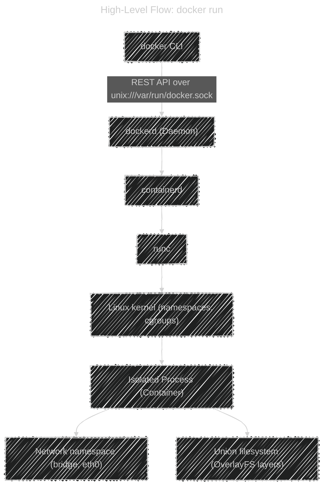

# 🧩 What Happens When You Run a Docker Container

> Example command:
>
> ```bash
> docker run -d -p 8080:80 nginx
> ```

---

## 🧠 High-level idea

This one command triggers a **multi-step internal workflow** involving:

1. Docker CLI → Daemon communication
2. Image retrieval and unpacking
3. Container filesystem creation (layers + union mount)
4. Namespace and cgroup setup
5. Container process start (via containerd + runc)
6. Network and port binding
7. Lifecycle management

Let’s unpack these one by one.

---

<div align="center">



</div>

---

Let’s go step by step 👇

---

## 1️⃣ Docker CLI Talks to the Daemon

When you run `docker run`, the **CLI** (client) sends a **REST API request** to the **Docker Daemon** (`dockerd`) via the Unix socket:

```bash
/var/run/docker.sock
```

So technically:

```bash
docker run ...  →  dockerd (API listener)
```

---

## 2️⃣ Daemon Delegates to containerd

`dockerd` delegates actual container lifecycle management to **containerd**,
which manages:

- Image pull/unpack
- Snapshot filesystem creation
- Container creation & execution (via `runc`)

---

## 3️⃣ Image Is Pulled and Layers Are Prepared

If `nginx` doesn’t exist locally:

1. Docker contacts Docker Hub
2. Downloads image layers
3. Stores them in:

   ```ini
   /var/lib/docker/overlay2/
   ```

   Each layer is a tarball representing filesystem changes.

These layers form the **read-only base filesystem** for containers.

---

## 4️⃣ Writable Container Filesystem (OverlayFS)

Docker creates a **new writable layer** on top of image layers using **OverlayFS**.

📂 Mounted at:

```ini
/var/lib/docker/overlay2/<random-id>/merged
```

That becomes `/` **inside the container**.

So if you run:

```bash
docker exec -it nginx /bin/bash
ls /
```

— you’re actually looking at that merged filesystem.

---

## 5️⃣ Daemon Creates a Metadata Directory

Now here’s the **hidden step most tutorials miss** 👇

For every new container, Docker creates a dedicated metadata directory:

```ini
/var/lib/docker/containers/<container-id>/
```

This directory holds everything needed to manage, restart, or inspect that container later.

**Example structure:**

```ini
/var/lib/docker/containers/3f7b4a8e12c7a8d3f1b7df5a9a5a9c0b2b4b47bb7c43b7/
├── config.v2.json        # Full container config (env, cmd, ports)
├── hostconfig.json       # Host runtime settings (restart policy, mounts)
├── log.json              # Container stdout/stderr logs
├── hostname              # Container hostname
├── hosts                 # /etc/hosts mapping
├── resolv.conf           # DNS settings
└── mounts/               # Volume links
```

🧩 **Why this matters:**

- `docker inspect` reads `config.v2.json`
- `docker logs` reads `log.json`
- Restart policies use `hostconfig.json`
- Docker rebuilds all containers from this folder on restart

So if you delete this folder → Docker **forgets** the container even existed.

---

## 6️⃣ containerd Calls runc to Start the Process

Next, **containerd** passes the container configuration to **runc**,
which does the actual low-level Linux magic:

- Creates **namespaces** (PID, NET, MNT, etc.)
- Applies **cgroups**
- Uses `pivot_root()` to switch into the container’s root filesystem
- Executes the main process (`/usr/sbin/nginx`)

This is where isolation really begins.

---

## 7️⃣ Linux Namespaces = Isolation

Each container runs in its own isolated system world:

| Namespace | What It Isolates   | Example                     |
| --------- | ------------------ | --------------------------- |
| PID       | Process IDs        | Container starts with PID 1 |
| NET       | Network interfaces | Has its own `eth0`          |
| MNT       | Mount points       | Own `/` root                |
| UTS       | Hostname           | Separate name               |
| IPC       | Message queues     | Own communication space     |
| USER      | UID mapping        | Root inside != root outside |

---

## 8️⃣ Cgroups = Resource Control

Docker applies **cgroups** to limit CPU, memory, I/O, and processes.

These are stored in:

```ini
# Example:
/sys/fs/cgroup/system.slice/docker-<id>.scope/memory.current
```

If a container exceeds limits → Linux kills it via the **OOM Killer**.

---

## 9️⃣ Network Setup

By default, Docker connects containers to a **bridge network (`docker0`)**.

- Creates a veth pair (`eth0` inside, `vethXXXX` on host)
- Assigns container IP via internal DHCP
- Adds NAT rules for port mappings (`-p 8080:80`)

So, host:8080 → container:80.

---

## 🔟 Container Process Starts

Finally:

- runc replaces itself with the container process (e.g. `nginx`)
- That process runs inside its namespaces
- Docker daemon starts monitoring it and writing logs to `log.json`

You can check:

```bash
docker inspect <container> | jq '.State.Pid'
sudo lsns -p <PID>
```

You’ll see namespace isolation live.

---

## 🧾 Lifecycle Tracking

Once running:

- Docker monitors the process
- Handles restart policies
- Stores all updates under `/var/lib/docker/containers/<id>/`
- Rebuilds container state from it after daemon restart

If the container is removed:

```bash
docker rm <id>
```

➡️ Docker deletes that directory.

---

## 🧠 Final Internal Summary

| Step | What Happens               | Key Storage                       |
| ---- | -------------------------- | --------------------------------- |
| 1    | CLI → Daemon               | `/var/run/docker.sock`            |
| 2    | Image prepared             | `/var/lib/docker/overlay2`        |
| 3    | Metadata created           | `/var/lib/docker/containers/<id>` |
| 4    | Namespaces + cgroups setup | Kernel                            |
| 5    | runc executes process      | `/usr/sbin/nginx`                 |
| 6    | Logs + state persisted     | `log.json`, `config.v2.json`      |

---

## 🧾 TL;DR Summary

| Concept                             | Description                |
| ----------------------------------- | -------------------------- |
| **CLI → dockerd**                   | Sends REST API             |
| **containerd + runc**               | Creates isolated process   |
| **OverlayFS**                       | Filesystem layers          |
| **Namespaces**                      | Isolation                  |
| **Cgroups**                         | Resource limits            |
| **Bridge Network**                  | Default networking         |
| **/var/lib/docker/containers/<id>** | Metadata, logs, and config |
| **/var/lib/docker/overlay2/**       | Layered image storage      |

---

✅ **Key mental picture:**

> When you run a container, Docker builds a _mini Linux system_ with its own root filesystem, process tree, hostname, IP, and DNS —
> all tracked and persisted in `/var/lib/docker/containers/<container-id>/`.
