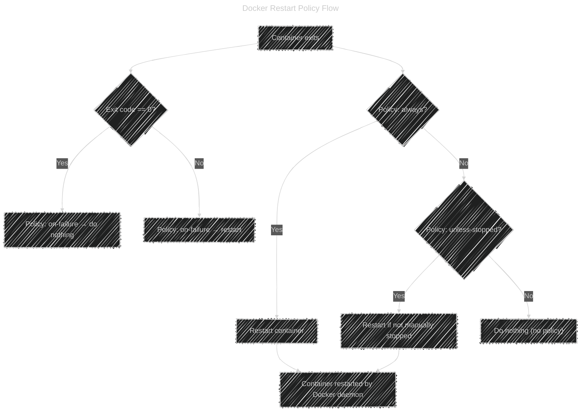

# 🔁 Docker Container Restart Policy

> 🧠 Think of it as: **“What should Docker do if this container dies?”**

---

## 🧩 Why Restart Policies Exist

In Linux, when a process dies — it’s gone.
But in production, we don’t want to SSH in and manually restart it.

So Docker introduces **Restart Policies** to:

- Auto-recover crashed containers 🏥
- Keep critical services running (like Nginx, Redis)
- Simplify self-healing behavior (without external orchestrators like Kubernetes)

---

## ⚙️ How It Works Internally

Each container’s restart policy is tracked by the **Docker daemon** (`dockerd`).

When a container exits, Docker checks:

1. What was the container’s **exit code**?

   - `0` = exited cleanly
   - non-zero = crashed or failed

2. What **policy** was configured (`--restart`)?
3. Based on the above, Docker decides whether to restart it.

If `dockerd` itself restarts (for example, system reboot):

- It reads stored metadata from `/var/lib/docker/containers/<id>/hostconfig.json`
- Applies the same restart policy automatically

---

## ⚙️ Setting Restart Policies

You configure it at container creation with:

```bash
docker run --restart <policy> <image>
```

Example:

```bash
docker run -d --restart always nginx
```

---

## 🧱 Available Policies

Here’s the full list (simple table 👇):

| Policy                     | Meaning                                                      | Restarts on daemon start?    | Example                    |
| -------------------------- | ------------------------------------------------------------ | ---------------------------- | -------------------------- |
| `no` _(default)_           | Never restart                                                | ❌                           | `--restart no`             |
| `on-failure[:max-retries]` | Restart only if container exits with a non-zero code (error) | ✅                           | `--restart on-failure:3`   |
| `always`                   | Always restart, no matter why it stopped                     | ✅                           | `--restart always`         |
| `unless-stopped`           | Restart unless user manually stopped it                      | ✅ (if not stopped manually) | `--restart unless-stopped` |

---

## 🔍 Policy Behavior Examples

| Situation                   | `no` | `on-failure` | `always`               | `unless-stopped` |
| --------------------------- | ---- | ------------ | ---------------------- | ---------------- |
| Container exits normally    | ❌   | ❌           | ✅                     | ✅               |
| Container crashes           | ❌   | ✅           | ✅                     | ✅               |
| Docker daemon restarts      | ❌   | ✅           | ✅                     | ✅               |
| You manually stop container | ❌   | ❌           | ✅ (on daemon restart) | ❌               |

---

🧠 **Tip:**
The difference between `always` and `unless-stopped` is subtle but important:

- `always`: even if _you_ stop the container manually, it comes back after reboot.
- `unless-stopped`: if _you_ stopped it manually, it stays stopped until you start it again.

---

## 🧩 Example Scenarios

### Example 1 — Production Web Server

You want it to **always run**, even after reboots.

```bash
docker run -d --name web --restart always nginx
```

✅ Auto-restarts:

- If it crashes
- If Docker restarts
- If host reboots

---

### Example 2 — Background Job Processor

You want it to retry up to 5 times if it crashes, but not forever.

```bash
docker run -d --restart on-failure:5 worker-app
```

✅ Restarts on crash (exit code ≠ 0), up to 5 retries.
❌ Does _not_ restart on normal exit (`exit 0`).

---

### Example 3 — Manual-Control Container

You want full manual control.

```bash
docker run -d --restart no debug-bash
```

✅ Never restarts automatically, even if it fails.
Used for one-time tasks or debugging.

---

## 🔍 Check Current Restart Policy

You can check it anytime using:

```bash
docker inspect -f '{{ .HostConfig.RestartPolicy.Name }}' <container>
```

Example:

```bash
docker inspect -f '{{ .HostConfig.RestartPolicy.Name }}' web
```

Output:

```هىه
always
```

---

## ⚙️ Change Restart Policy (after creation)

You can update it later:

```bash
docker update --restart unless-stopped web
```

---

## 🧩 Visual Flow — Restart Policy Decision Logic

<div align="center">



</div>

---

## 🧠 Real-World Tips (DevOps / SRE Perspective)

| Tip                                                  | Explanation                                                 |
| ---------------------------------------------------- | ----------------------------------------------------------- |
| ✅ Always set a restart policy for critical services | Otherwise, one crash can kill your app                      |
| 🕵️ Use logs + exit codes                             | Run `docker logs` + `docker inspect` to see why it stopped  |
| 🚫 Avoid `always` for one-time jobs                  | They’ll loop forever if they keep failing                   |
| 🔁 Use `on-failure` for workers                      | Great for background scripts that might fail intermittently |
| 🧰 Combine with health checks                        | Restart only when container becomes unhealthy               |

---

## 💡 Bonus: Combine with Health Checks

You can make restarts **smarter** using health checks:

```bash
docker run -d \
  --restart always \
  --health-cmd="curl -f http://localhost/ || exit 1" \
  --health-interval=10s \
  nginx
```

Docker marks the container **unhealthy** if the command fails, and your monitoring system (or orchestrator like Swarm/K8s) can restart it.

---

## 🧾 TL;DR Summary

| Policy           | Behavior                              | When to Use                                          |
| ---------------- | ------------------------------------- | ---------------------------------------------------- |
| `no`             | Never restart                         | One-time or debug containers                         |
| `on-failure[:N]` | Restart on crash only                 | Batch jobs, workers                                  |
| `always`         | Always restart                        | Critical services                                    |
| `unless-stopped` | Always restart unless stopped by user | Long-running services you sometimes disable manually |

---

## 🧠 Mnemonic to Remember

> **N.O.A.U. → "No One Always Understands"** 😄

| Letter | Policy         | Meaning                         |
| ------ | -------------- | ------------------------------- |
| **N**  | no             | never restart                   |
| **O**  | on-failure     | restart on error                |
| **A**  | always         | restart always                  |
| **U**  | unless-stopped | restart unless manually stopped |
