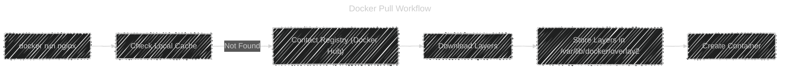

# 📷 **Container Image Fundamentals**

_Understanding the Building Blocks Behind Containers!_

---

## 📖 **What Is a Docker Image?**

A **Docker Image** is a **read-only template** that contains:

- Your application’s **code**
- Its **dependencies** (libraries, runtimes)
- Its **environment configuration**
- And a **filesystem snapshot**

Think of it like a **snapshot** of a pre-installed OS, but much smaller and faster.

Each image acts as a **blueprint** used to create containers.

---

<div align="center" style="background-color:#000; border-radius: 10px; border: 2px solid">
  
</div>

---

## ⚙️ **What’s Inside a Docker Image?**

Docker images are made of **layers** stacked on top of each other using **UnionFS (Union File System)**.
Each layer represents a filesystem change — like “add this file”, “install that library”, etc.

Every image has:

1. A **base layer** (like Ubuntu or Alpine)
2. Several **intermediate layers** (added by instructions in Dockerfile)
3. A **top read-only layer** used by containers

---

### 🧬 Example Structure

```bash
docker image pull nginx
```

Internally:

```ini
nginx:latest
 ├─ Layer 1: Base OS (Debian)
 ├─ Layer 2: Install dependencies
 ├─ Layer 3: Copy nginx binaries
 ├─ Layer 4: Add configuration
 └─ Layer 5: Final metadata layer
```

Each layer is cached, content-addressed, and identified by a **SHA256 hash**.

---

### 🪞 Diagram: Image Layers

<div align="center" style="background-color:#fff; border-radius: 10px; border: 2px solid">
  
</div>

---

## 📂 **Where Images Are Stored**

On Linux, images are stored inside:

```ini
/var/lib/docker/
├── overlay2/     ← filesystem layers
├── image/
│   └── overlay2/
│       ├── repositories.json  ← image metadata
│       └── imagedb/
└── containers/   ← running containers
```

Each layer is a directory inside `overlay2/` with its hash as name:

```ini
/var/lib/docker/overlay2/<layer-id>/
```

---

### View Images on Your System

```bash
docker image ls
```

Example output:

```ini
REPOSITORY   TAG       IMAGE ID       CREATED        SIZE
nginx        latest    08b152afcfae   2 weeks ago    187MB
ubuntu       20.04     f643c72bc252   3 months ago   72.9MB
```

| Column     | Meaning                               |
| ---------- | ------------------------------------- |
| REPOSITORY | Image name                            |
| TAG        | Version label (like “latest”, “1.0”)  |
| IMAGE ID   | Unique identifier (SHA256 short form) |
| CREATED    | When it was built/pulled              |
| SIZE       | Total image size on disk              |

---

## 🕵🏻 **Inspecting Images**

### View image details

```bash
docker image inspect nginx
```

Shows a JSON with metadata:

- OS type
- Layers used
- Environment variables
- Entrypoint / CMD
- Config info

You can filter with `--format`:

```bash
docker inspect --format='{{.Config.Cmd}}' nginx
```

---

<div align="center" style="background-color:#071D28; border-radius: 10px; border: 2px solid">
  
</div>

---

### Show image history

```bash
docker image history nginx
```

Output:

```ini
IMAGE          CREATED BY                                     SIZE
08b152afcfae   /bin/sh -c # (nop)  CMD ["nginx" ...]           0B
<missing>      /bin/sh -c apt-get install -y nginx            55MB
<missing>      /bin/sh -c apt-get update                      30MB
```

Each row = layer created by a Dockerfile instruction.

---

## 🏷️ **Image Naming and Hierarchy**

 <div align="center" style="background-color:#071D28; border-radius: 10px; border: 2px solid">
  
</div>

An image is identified as:

```ini
<registry>/<user-account>/<image-repository>:<tag>
```

Example:

```ini
docker.io/httpd/httpd:1.25
```

Example:

```bash
docker pull ubuntu          # pulls ubuntu:latest
docker pull ubuntu:22.04    # pulls specific version
```

Images can come from:

1. **Official repositories** (like `nginx`, `ubuntu`)
2. **User repositories** (like `username/app`)
3. **Private registries** (like `myregistry.com/app:1.0`)

Examples:

```bash
docker pull nginx
docker pull myuser/myapp:latest
docker pull registry.example.com/team/app:v1
```

---

> 📒 Notes:
>
> - **Registry default**:  
>   Docker does not support changing the default registry (docker.io) globally. You must explicitly specify your private registry (e.g., `my_registry.com/my_repo/my_image:my_tag`) in each command or use workarounds like aliases, scripts, or private proxies.
>
> - **Account name shortcut**:  
>   You can ignore the account name in a Docker image reference only when pulling official images from Docker Hub.  
>   The official image is under `library` namespace.
>   Example: `docker.io/library/ubuntu` → just use `ubuntu`
>
> - **Tag default**:  
>   If you omit the tag, Docker assumes `latest`.  
>   Example: `ubuntu` → interpreted as `ubuntu:latest`

---

## ☁️ **Image Registry Overview**

Registries are like “GitHub for Docker images.”

| Registry                               | Description                    |
| -------------------------------------- | ------------------------------ |
| **Docker Hub**                         | Default public registry        |
| **Amazon ECR**                         | AWS Elastic Container Registry |
| **Azure ACR**                          | Azure Container Registry       |
| **Google GCR/Artifact Registry**       | Google Cloud                   |
| **Harbor / Nexus / JFrog Artifactory** | Private registries             |

---

### 🧭 Image Pull Workflow

```bash
docker run nginx
```

Behind the scenes:

1. Docker checks local cache (`/var/lib/docker/image/`)
2. If image not found → pulls from registry
3. Registry sends each layer (by digest)
4. Docker stores each layer locally
5. Creates container using those layers

---

### 💡 Diagram: Image Pull Flow

<div align="center">



</div>

---

## 🎭 **Image vs Container**

| Feature    | Image                 | Container                          |
| ---------- | --------------------- | ---------------------------------- |
| Type       | Blueprint (read-only) | Runtime instance (read-write)      |
| Mutability | Immutable             | Mutable (can change while running) |
| Location   | Stored in local cache | Running in memory / on disk        |
| Example    | `nginx:latest`        | `my-nginx-container`               |
| Command    | `docker image ls`     | `docker container ls`              |

When you **start a container**, Docker:

- Takes the image’s layers (read-only)
- Adds a **thin writable layer** on top
- That writable layer disappears when container is deleted (unless persisted with volumes)

---

### 📊 Visual: Container vs Image Layers

<div align="center" style="background-color:#fff; border-radius: 10px; border: 2px solid">
  
</div>

---

## 🏁 **Summary Table**

| Concept        | Description                 | Example                              |
| -------------- | --------------------------- | ------------------------------------ |
| **Image**      | Read-only layered template  | `nginx:latest`                       |
| **Container**  | Running instance of image   | `my-nginx`                           |
| **Dockerfile** | Recipe to build image       | Contains instructions like RUN, COPY |
| **Registry**   | Storage server for images   | Docker Hub, ACR, ECR                 |
| **Layer**      | Incremental filesystem diff | Created by Dockerfile instructions   |

---

## 🧑🏻‍💻 **Quick Commands Reference**

| Action            | Command                                 |
| ----------------- | --------------------------------------- |
| List images       | `docker image ls`                       |
| Inspect image     | `docker image inspect <image>`          |
| View image layers | `docker image history <image>`          |
| Remove image      | `docker image rm <image>`               |
| Pull image        | `docker image pull <repo>:<tag>`        |
| Save to tar       | `docker image save -o file.tar <image>` |
| Load from tar     | `docker image load -i file.tar`         |
