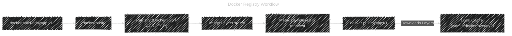

# ☁️ **Docker Image Registries**

_How Docker Stores, Shares, and Secures Images!_

---

## 📖 **What Is a Docker Registry?**

A **Docker registry** is a **server-side application** that stores and distributes Docker images.
Think of it as:

- A **GitHub for Docker images**
- Where developers **push** (upload) and **pull** (download) images

---

### 🧩 **Components**

| Component      | Description                            | Example                        |
| -------------- | -------------------------------------- | ------------------------------ |
| **Registry**   | The actual storage server for images   | Docker Hub, AWS ECR, Azure ACR |
| **Repository** | A collection of related image versions | `nginx`, `myapp`               |
| **Image Tag**  | Version label for a specific image     | `nginx:1.25`, `myapp:v2`       |

---

### 🏷️ **Registry Hierarchy**

```ini
registry/repository:tag
```

Examples:

| Example                                                   | Description                    |
| --------------------------------------------------------- | ------------------------------ |
| `nginx:latest`                                            | Docker Hub public image        |
| `myregistry.com/myapp:v1`                                 | Private registry               |
| `123456789012.dkr.ecr.us-east-1.amazonaws.com/api:latest` | AWS ECR image                  |
| `myacr.azurecr.io/webapp:v2`                              | Azure Container Registry image |

---

## ⚙️ **How Registries Work**

When you run or build containers, Docker interacts with the registry using **HTTP API v2** (OCI-compliant).

Let’s visualize 👇



---

## 🧩 **1. Docker Hub — Default Registry**

Docker Hub is the **default public registry** used by the Docker CLI.  
If you don’t specify a registry name, Docker assumes Docker Hub.

---

### 📥 Pull from Docker Hub

```bash
docker pull nginx
# equivalent to
docker pull docker.io/library/nginx:latest
```

---

### 📤 Push to Docker Hub

**1️⃣ Create an account:**

- 👉 [hub.docker.com](https://hub.docker.com)

**2️⃣ Login via CLI:**

```bash
docker login
```

You’ll be prompted for:

```ini
Username: myuser
Password: ********
```

This stores a token at:

```ini
~/.docker/config.json
```

**3️⃣ Tag your image:**

```bash
docker tag myapp myuser/myapp:v1
```

**4️⃣ Push the image:**

```bash
docker push myuser/myapp:v1
```

Now it’s available at:

```ini
https://hub.docker.com/r/myuser/myapp
```

---

### 🔐 Authentication Behind the Scenes

When you `docker login`, Docker saves a JSON file:

```json
{
  "auths": {
    "https://index.docker.io/v1/": {
      "auth": "bXl1c2VyOm15cGFzc3dvcmQ="
    }
  }
}
```

This Base64 string (`auth`) encodes your username:password.
Docker then exchanges it for a **token** used for all authenticated pulls/pushes.

✅ When you `docker push`, Docker adds this token to the HTTP header:

```ini
Authorization: Bearer <token>
```

---

## ☁️ **2. AWS Elastic Container Registry (ECR)**

AWS ECR is a **fully managed private container registry** integrated with IAM.

---

### ⚙️ Setup Overview

**1️⃣ Create Repository:**

```bash
aws ecr create-repository --repository-name myapp
```

**2️⃣ Authenticate Docker CLI with ECR:**

ECR uses short-lived tokens, so you must re-authenticate every 12 hours.

```bash
aws ecr get-login-password --region us-east-1 | \
docker login --username AWS \
--password-stdin 123456789012.dkr.ecr.us-east-1.amazonaws.com
```

✅ This stores a temporary credential in your Docker config.

---

**3️⃣ Tag the image:**

```bash
docker tag myapp:latest 123456789012.dkr.ecr.us-east-1.amazonaws.com/myapp:latest
```

---

**4️⃣ Push the image:**

```bash
docker push 123456789012.dkr.ecr.us-east-1.amazonaws.com/myapp:latest
```

---

**5️⃣ Pull the image from ECR:**

```bash
docker pull 123456789012.dkr.ecr.us-east-1.amazonaws.com/myapp:latest
```

---

### 💡 ECR Access Control

ECR integrates with **IAM policies** for fine-grained control:

- `ecr:GetDownloadUrlForLayer`
- `ecr:BatchGetImage`
- `ecr:PutImage`
- `ecr:GetAuthorizationToken`

---

## ☁️ **3. Azure Container Registry (ACR)**

Azure ACR is Microsoft’s private OCI-compliant registry.
It integrates with Azure AD for authentication (more secure than passwords).

---

### ⚙️ Setup Overview

**1️⃣ Create ACR:**

```bash
az acr create --name myacr --resource-group myRG --sku Basic
```

The login server will be:

```ini
myacr.azurecr.io
```

---

**2️⃣ Login to ACR:**

You can log in using Azure CLI credentials:

```bash
az acr login --name myacr
```

Or directly with Docker:

```bash
docker login myacr.azurecr.io
```

If you’re already signed in with Azure CLI, it uses your **Azure AD token** automatically.

---

**3️⃣ Tag and Push:**

```bash
docker tag myapp myacr.azurecr.io/myapp:v1
docker push myacr.azurecr.io/myapp:v1
```

---

**4️⃣ Pull from ACR:**

```bash
docker pull myacr.azurecr.io/myapp:v1
```

---

### 🧠 ACR Authentication Options

| Method                             | Description                               |
| ---------------------------------- | ----------------------------------------- |
| **Admin User (username/password)** | Simplest; can be enabled via portal       |
| **Azure CLI login (az acr login)** | Uses Azure AD token                       |
| **Service Principal**              | For CI/CD pipelines                       |
| **Managed Identity**               | Best for Azure VMs, AKS, and App Services |

---

### ✍🏻 Example: Using Managed Identity in Azure VM

If your VM or container app has a system-assigned identity:

```bash
az acr login --name myacr --identity
```

This allows access **without storing passwords** — ideal for secure automation.

---

## 🧰 **4. Private Registry (Self-Hosted)**

Docker lets you run your **own registry** inside your data center:

```bash
docker run -d \
  -p 5000:5000 \
  --name registry \
  registry:2
```

Now you have a local registry at:

```ini
http://localhost:5000
```

### Push to local registry

```bash
docker tag myapp localhost:5000/myapp:v1
docker push localhost:5000/myapp:v1
```

### Pull it back

```bash
docker pull localhost:5000/myapp:v1
```

---

### 🧩 With HTTPS + Authentication

Create a config directory:

```bash
mkdir auth && htpasswd -Bc auth/htpasswd user1
```

Then run registry with basic auth:

```bash
docker run -d \
  -p 5000:5000 \
  -v $(pwd)/auth:/auth \
  -e REGISTRY_AUTH=htpasswd \
  -e REGISTRY_AUTH_HTPASSWD_REALM="Registry Realm" \
  -e REGISTRY_AUTH_HTPASSWD_PATH=/auth/htpasswd \
  registry:2
```

Now your local registry requires username/password authentication.

---

## 🛡️ Registry Security Layers

| Layer                  | Role                                | Example                       |
| ---------------------- | ----------------------------------- | ----------------------------- |
| **Transport Security** | TLS encryption for registry traffic | HTTPS                         |
| **Authentication**     | Verify who you are                  | `docker login`                |
| **Authorization**      | Define what you can do              | IAM roles, ACR RBAC           |
| **Image Signing**      | Validate image integrity            | Docker Content Trust / Notary |
| **Scanning**           | Detect vulnerabilities              | ACR Tasks, ECR Scan           |

---

## 🔐 Docker Content Trust (DCT)

Used to verify image signatures and ensure authenticity.

Enable it:

```bash
export DOCKER_CONTENT_TRUST=1
```

Now Docker will:

- Sign images when pushing
- Verify signatures when pulling

If image is tampered, pull fails:

```ini
Error: remote trust data does not match local data
```

---

## ⚖️ Registry Comparison Table

| Feature             | Docker Hub        | AWS ECR                      | Azure ACR                    | Private Registry |
| ------------------- | ----------------- | ---------------------------- | ---------------------------- | ---------------- |
| **Public access**   | ✅ Yes            | ❌ No                        | ❌ No                        | Optional         |
| **Authentication**  | Username / Token  | IAM / CLI token              | Azure AD / Service Principal | Basic Auth       |
| **Scanning**        | ✅ Free (limited) | ✅ Built-in                  | ✅ ACR Tasks                 | ❌ Manual        |
| **Access Control**  | Repo visibility   | IAM policies                 | RBAC roles                   | N/A              |
| **Encryption**      | HTTPS             | AWS KMS                      | Azure Managed Keys           | Custom           |
| **CLI Integration** | `docker login`    | `aws ecr get-login-password` | `az acr login`               | `docker login`   |
| **Ideal For**       | Public sharing    | AWS ecosystem                | Azure DevOps                 | On-prem setups   |

---

## ♾️ Typical CI/CD Example (Multi-Cloud)

```mermaid
---
config:
  look: handDrawn
  theme: dark
title: "Image Push Flow in CI/CD"
---
flowchart LR
    A["🧱 Build Stage (Jenkins/Azure DevOps)"]
    A --> B["docker build -t myapp:$(BUILD_ID)"]
    B --> C["docker login to ECR / ACR"]
    C --> D["docker push <registry>/myapp:$(BUILD_ID)"]
    D --> E["🚀 Deploy Stage (Kubernetes / ECS / AKS)"]
```



---

## 🧠 Best Practices

- ✅ Always use **versioned tags** (avoid `latest` in production).
- ✅ Use **private registries** for enterprise images.
- ✅ Enable **TLS and authentication** for custom registries.
- ✅ Use **IAM roles / managed identities** instead of storing passwords.
- ✅ Regularly **scan and sign** your images.
- ✅ Automate **push/pull** in your CI/CD pipelines securely.

---

## 🏁 Quick Command Cheatsheet

| Task                 | Command                                       |
| -------------------- | --------------------------------------------- |
| Login to registry    | `docker login <registry>`                     |
| Logout               | `docker logout <registry>`                    |
| Tag image            | `docker tag app:1.0 myacr.azurecr.io/app:1.0` |
| Push image           | `docker push myacr.azurecr.io/app:1.0`        |
| Pull image           | `docker pull myacr.azurecr.io/app:1.0`        |
| Show current auth    | `cat ~/.docker/config.json`                   |
| Run private registry | `docker run -d -p 5000:5000 registry:2`       |
