# 🧑🏻‍💻 **Docker Image Commands**

Before diving in, remember:  
📦 A **Docker image** is just a **set of read-only filesystem layers** stored under:

```ini
/var/lib/docker/overlay2/
```

Each image also has metadata in:

```ini
/var/lib/docker/image/overlay2/imagedb/
```

So, when we **tag**, **save**, or **delete** images — we’re just manipulating these layer references and metadata.

---

## 🏷️ **1. Tagging and Retagging Images**

Tagging simply **assigns a new name (alias)** to an existing image ID.
It doesn’t duplicate the image on disk — just creates a new reference.

### Example:

```bash
docker tag nginx:latest myrepo/nginx:v1
```

Now you can push:

```bash
docker push myrepo/nginx:v1
```

### Verify:

```bash
docker images
```

You’ll see both names, but **same IMAGE ID**.

🧠 **Internally:**

- A tag is just a **pointer** stored in `repositories.json`.
- The actual image layers remain the same — no re-copying or new space.

---

## 📦 **2. Save and Load Images** (for Backup or Transfer)

When you want to move images between machines _without_ using a registry,
you can **save** and **load** them manually.

---

### 🔸 Save an Image to a Tar File

```bash
docker image save nginx:latest -o nginx.tar
```

This exports:

- All filesystem layers
- Config files
- Manifest data

✅ The resulting `.tar` file can be moved anywhere.

---

### 🔸 Load an Image from a Tar File

```bash
docker image load -i nginx.tar
```

This imports the tar archive into local Docker storage.

🧠 **Internally:**

- The tar is unpacked to `/var/lib/docker/overlay2/`
- Layer IDs and metadata are re-registered

---

## 📦 **3. Export and Import** (Container to Image)

If you want to capture the **current state** of a container (even after modifications), use `export`.

---

### 🔸 Export Container Filesystem

```bash
docker container export mycontainer > mycontainer.tar
```

This exports the _final flattened_ filesystem of the container —
no history, no layers, just the full snapshot.

---

### 🔸 Import as New Image

```bash
docker image import mycontainer.tar mynewimage:v1
```

✅ Now `mynewimage:v1` can be used as a new image base.

---

### ⚠️ Important Difference

- `export/import` loses Dockerfile history (RUN, ENV, etc.)
- `save/load` preserves it.

Use `export/import` only for **emergency backups** or **snapshot cloning**.

---

### ⚖️ Save vs Export (Important Distinction)

| Feature       | `docker save`               | `docker export`                     |
| ------------- | --------------------------- | ----------------------------------- |
| Works on      | **Image**                   | **Container**                       |
| Includes      | All image layers + metadata | Flattened container filesystem only |
| Keeps history | ✅ Yes                      | ❌ No                               |
| Used for      | Backup / transfer           | Snapshot of container state         |
| Import with   | `docker load`               | `docker import`                     |

---

## 🗑️ **4. Removing Images**

### 🔸 Remove One Image

```bash
docker image rm nginx:latest
```

Or shorthand:

```bash
docker rmi nginx:latest
```

If the image is **used by a running container**, you’ll see:

```ini
🔴 Error response from daemon: conflict: unable to remove repository reference
```

You must stop and remove the container first.

---

### 🔸 Remove Unused (Dangling) Images

```bash
docker image prune
```

Removes images that:

- Have no tags (`<none>:<none>`)
- Aren’t used by any container

---

### 🔸 Remove All Unused Images, Containers, Networks, Volumes

```bash
docker system prune -a
```

🚨 Warning: this removes **everything** not actively in use.

---

### 🧠 Internally (What Happens When Removing an Image)

1. Docker checks if any **containers reference** that image ID.

   - If yes → can’t delete.
   - If no → proceed.

2. Docker removes **tag references** from `repositories.json`.

3. Docker checks if **any layers are still used** by other images.

   - Shared layers (common base images) are kept.

4. Unreferenced layers are deleted from `/var/lib/docker/overlay2/`.

---

### 🧩 Visual Flow

```mermaid
---
config:
  look: handDrawn
  theme: dark
title: "Image Removal Internals"
---
flowchart TD
    A["docker image rm nginx:latest"] --> B{"Used by container?"}
    B -->|Yes| C["Abort ❌ (Conflict)"]
    B -->|No| D["Remove tag reference"]
    D --> E{"Shared layer in use?"}
    E -->|Yes| F["Keep shared layer"]
    E -->|No| G["Delete layer from /overlay2/"]
    G --> H["Free up disk space ✅"]
```

<div align="center" style="background-color: #1f1e1eff;border-radius: 20px">

<div style="width:40%;">



</div>

</div>

---

## 🧹 **5. Cleaning Up & Inspecting Space**

### See Disk Usage

```bash
docker system df
```

Example output:

```ini
TYPE            TOTAL     ACTIVE    SIZE      RECLAIMABLE
Images          8         2         3.2GB     1.4GB (43%)
Containers      3         1         800MB     400MB (50%)
```

### Clean Up Dangling Images

```bash
docker image prune -f
```

### Clean Everything

```bash
docker system prune -a --volumes
```

---

## 🎁 Bonus: Difference Between Layered Images and Containers

| Concept             | Read/Write | Stored Where                       | Deleted When              |
| ------------------- | ---------- | ---------------------------------- | ------------------------- |
| **Image Layer**     | Read-only  | `/var/lib/docker/overlay2/`        | When no longer referenced |
| **Container Layer** | Read/Write | `/var/lib/docker/containers/<id>/` | When container removed    |

When you remove a container, its writable layer (`diff/`) is deleted, but **base image layers** remain until image removal.

---

## 🧭 Common Image Commands Summary

| Purpose     | Command                                   | Description              |
| ----------- | ----------------------------------------- | ------------------------ |
| List images | `docker images`                           | Show all local images    |
| Inspect     | `docker image inspect`                    | Show metadata            |
| Tag         | `docker tag src dest`                     | Create new tag reference |
| Push        | `docker push repo/image:tag`              | Upload to registry       |
| Pull        | `docker pull repo/image:tag`              | Download from registry   |
| Save        | `docker image save -o file.tar image:tag` | Export full image        |
| Load        | `docker image load -i file.tar`           | Import image tar         |
| Export      | `docker container export name > file.tar` | Export container fs      |
| Import      | `docker image import file.tar image:tag`  | Create image from fs     |
| Remove      | `docker image rm image:tag`               | Delete image             |
| Prune       | `docker image prune`                      | Clean unused images      |
| Disk Usage  | `docker system df`                        | Show space usage         |

---

## ✍🏻 Example Workflow: Moving Image Between Servers Without Registry

```bash
# On Server A
docker build -t myapp:v1 .
docker image save -o myapp.tar myapp:v1
scp myapp.tar user@serverB:/tmp/

# On Server B
docker image load -i /tmp/myapp.tar
docker run -d -p 80:80 myapp:v1
```

✅ No registry required, full image transferred.

---

## 🏁 Summary

| Action    | Concept                      | Command                   |
| --------- | ---------------------------- | ------------------------- |
| 🏷️ Retag  | Rename or version image      | `docker image tag`        |
| 💾 Save   | Backup image to file         | `docker image save -o`    |
| 📤 Load   | Restore image from file      | `docker image load -i`    |
| 📦 Export | Flatten container filesystem | `docker container export` |
| 📥 Import | Turn FS into image           | `docker image import`     |
| 🧹 Clean  | Remove unused                | `docker image prune`      |
| 🗑️ Remove | Delete image completely      | `docker image rm`         |
