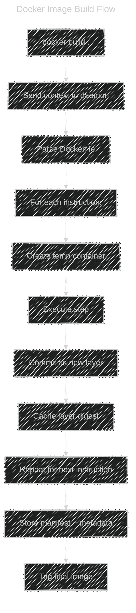

# 🧩 Docker Image Build — The Complete Guide

## 🕰️ **Why Image Building Exists?**

Before Docker, deploying an app looked like this:

- Install dependencies manually
- Set up runtime (e.g., Python, Node, .NET)
- Copy source code
- Configure environment variables manually

This caused:

- 💥 “works on my machine” problems
- 💥 inconsistent dependencies
- 💥 hard-to-reproduce environments

Docker solved this by introducing:

> A **reproducible image build system**, where your app and environment live together.

---

## 🎯 **Image Build Overview — Flask App Example**

Before diving into image building, let’s start with a foundational example: building a Docker image for a simple Python web application using Flask.

---

<div align="center" style="background-color:#071A28; border-radius: 10px; border: 2px solid">
  
</div>

---

**📦 Dockerfile Breakdown:**

```dockerfile
FROM Ubuntu

RUN apt-get update && apt-get -y install python

RUN pip install flask flask-mysq1

COPY ./opt/source-code

ENTRYPOINT FLASK_APP=/opt/source-code/app.py flask run
```

| Step                                              | Purpose                                                                              |
| ------------------------------------------------- | ------------------------------------------------------------------------------------ |
| `FROM Ubuntu`                                     | Starts from a minimal Ubuntu base image                                              |
| `RUN apt-get update && apt-get -y install python` | Installs Python after updating package repositories                                  |
| `RUN pip install flask flask-mysq1`               | Adds Flask and MySQL connector (note: `flask-mysq1` may be a typo for `flask-mysql`) |
| `COPY ./opt/source-code`                          | Copies application code into the container                                           |
| `ENTRYPOINT ...`                                  | Launches the Flask app using the specified entrypoint                                |

**🛠️ Build & Push Commands:**

```bash
docker build . -f Dockerfile -t mumshad/my-custom-app
docker push mumshad/my-custom-app
```

- `docker build`: Constructs the image using the Dockerfile
- `-t`: Tags the image for Docker Hub
- `docker push`: Publishes the image to a remote registry

**🚀 Runtime Behavior:**

When the container starts:

- It sets `FLASK_APP=/opt/source-code/app.py`
- Executes `flask run` to start the web server
- Serves the app from the copied source code

---

Excellent 👑 — now we’re entering one of the most **fundamental and powerful** parts of Docker:
👉 **Image Building** — the process that turns your code and a `Dockerfile` into a layered, immutable, versioned image.

We’ll go step-by-step — from the **historical context**, to **how Docker actually builds images internally**, to **how caching and intermediate containers work**, and we’ll visualize it all 🧱⚙️

---

## 📜 **The Dockerfile**

The **Dockerfile** defines how to build the image — step-by-step.

Example:

```dockerfile
FROM python:3.11
WORKDIR /app
COPY . .
RUN pip install -r requirements.txt
EXPOSE 8080
CMD ["python", "app.py"]
```

Each instruction adds a **new read-only layer** to the image.

---

## ⚙️ **The Build Command**

The command to build an image is:

```bash
docker build -t myapp:1.0 .
```

### Breakdown:

| Part           | Meaning                                                       |
| -------------- | ------------------------------------------------------------- |
| `docker build` | Tells Docker to build an image                                |
| `-t myapp:1.0` | Tags the image (name:version)                                 |
| `.`            | Build context (current directory) — sent to the Docker daemon |

---

## 🗂️ **Build Context**

The **build context** is everything inside the directory you pass (`.`).

- Docker **sends** this entire context (all files) to the **Docker daemon**.
- It’s stored temporarily under `/var/lib/docker/tmp/docker-builder*`.
- So files can be from current host or remote host.

---

<div align="center" style="background-color:#081C27; border-radius: 10px; border: 2px solid">
  
</div>

---

⚠️ So never pass `.` if your folder has too many unnecessary files — use `.dockerignore`.

Example `.dockerignore`:

```ini
node_modules
.git
*.log
```

> 📒 **Notes:**
>
> - you can build code from git repository
>
>   ```bash
>   docker build https://github.com/myaccount/myapp
>   # or
>   docker build https://github.com/myaccount/myapp#<branch>
>   # or
>   docker build https://github.com/myaccount/myapp:<folder>
>   ```
>
> - Docker file can be from any path with any name
>
>   ```bash
>   docker build -f ./config/Dockerfile.dev https://github.com/myaccount/myapp
>   ```
>
> ---

## 🧠 **Internal Build Process** (Under the Hood)

Let’s visualize what happens when you run `docker build` 👇

```mermaid
---
config:
  <!-- look: handDrawn -->
  theme: dark
title: "Docker Build Internals"
---

flowchart TB
    %% Nodes
    A["🧑‍💻 **1.Client**"]
    B["📦 **2.Send build context to Docker Daemon**"]
    C["📜 **3.Daemon parses Dockerfile line by line**"]
    D["🧱 **4.Each instruction → Create container layer**"]
    E["🧊 **5.Commit container → New read-only image layer**"]
    F["🗂️ **6.Store metadata in** _**/var/lib/docker/image/**_"]
    G["🏷️ **7.Final image tagged as myapp:latest**"]

    %% Flow
    A --> |docker build -t myapp| B --> C --> D --> E --> F --> G

    %% Styling
    classDef client fill:#ffcc99,stroke:#333,stroke-width:2px,color:#000,font-size:14px;
    classDef daemon fill:#99ccff,stroke:#333,stroke-width:2px,color:#000,font-size:14px;
    classDef layer fill:#ccffcc,stroke:#333,stroke-width:2px,color:#000,font-size:14px;
    classDef meta fill:#ff99cc,stroke:#333,stroke-width:2px,color:#000,font-size:14px;
    classDef tag fill:#ffff99,stroke:#333,stroke-width:2px,color:#000,font-size:14px;

    %% Assign classes
    class A client
    class B,C daemon
    class D,E layer
    class F meta
    class G tag
```

<div align="center" style="background-color:#071A28; border-radius: 10px; border: 2px solid">



</div>

---

**🧩 Step-by-Step: What Actually Happens:**

Let’s take a simple Dockerfile:

```dockerfile
FROM ubuntu:22.04
RUN apt-get update && apt-get install -y python3
COPY app.py /usr/src/app/
CMD ["python3", "/usr/src/app/app.py"]
```

Here’s what Docker does internally 👇

- 1️⃣ Pulls the base image (`ubuntu:22.04`)
- 2️⃣ Starts a **temporary container** from that base
- 3️⃣ Executes the `RUN` command inside the container
- 4️⃣ Docker **commits** those filesystem changes as a **new read-only layer**
- 5️⃣ Next instruction (`COPY`) repeats process — new temp container on top of last layer
- 6️⃣ When all layers are built, Docker creates the **final image manifest**
- 7️⃣ The image is saved in `/var/lib/docker/overlay2` and tagged

---

## 🍰 **Build Layers and Caching**

Each instruction in the Dockerfile → creates one **immutable layer**.

Docker caches each step so next builds are faster.

Example:

```dockerfile
FROM node:18
COPY package*.json ./
RUN npm install
COPY . .
CMD ["node", "server.js"]
```

If only the last line changes, Docker **reuses** earlier cached layers.

---

### ⚡ Caching Flow

```mermaid
---
config:
  look: handDrawn
  theme: dark
title: "Layer Cache Reuse"
---
flowchart TD
    A["COPY package*.json ./"] --> B["RUN npm install"]
    B --> C["COPY . ."]
    C --> D["CMD node server.js"]

    A -->|Unchanged| A1["Use cached layer ✅"]
    B -->|Unchanged| B1["Use cached layer ✅"]
    C -->|Changed| C1["Rebuild layer ❌"]
```

<div align="center" style="background-color:#071A28; border-radius: 10px; border: 2px solid">



</div>

Docker uses **layer digests (SHA hashes)** to detect changes,  
if the instruction or any file it depends on changed → cache invalidates.

> 💡 Just like Git, each layer is immutable and stacked, you end up with something like 7 commits/layers, each with its own hash tree.

---

## 🧠 Temporary Containers and `commit`

During build:

- Each step runs in a temporary container.
- Once the step succeeds, Docker commits that container into a new image layer.

You can actually see those temp containers:

```bash
docker ps -a
```

They look like:

```ini
<missing>  "/bin/sh -c 'apt-g…"  Exited (0)  2 seconds ago
```

---

## 🗂️ **Where Are Layers Stored?**

All layers live inside:

```ini
/var/lib/docker/overlay2/
```

Each layer has:

```ini
diff/       # The actual filesystem diff
lower/      # References to parent layers
merged/     # Runtime merge view
work/       # Temporary files during build
```

---

## ⚙️ **Multi-Stage Builds** (for Optimization)

Multi-stage builds let you create **smaller images** by separating build and runtime.

Example:

```dockerfile
# Stage 1: Build
FROM golang:1.22 AS builder
WORKDIR /src
COPY . .
RUN go build -o app main.go

# Stage 2: Runtime
FROM debian:12
COPY --from=builder /src/app /usr/local/bin/app
CMD ["app"]
```

✅ Only the compiled binary is kept
✅ No Go compiler or build dependencies in the final image

---

## 🧩 **Build Flags** You Should Know

| Flag               | Description               | Example                                  |
| ------------------ | ------------------------- | ---------------------------------------- |
| `-t`               | Tag the image             | `docker build -t myapp:v1 .`             |
| `-f`               | Specify Dockerfile path   | `docker build -f Dockerfile.dev .`       |
| `--no-cache`       | Ignore cache              | `docker build --no-cache -t myapp .`     |
| `--pull`           | Always pull base image    | `docker build --pull .`                  |
| `--build-arg`      | Pass build-time variables | `docker build --build-arg VERSION=1.2 .` |
| `--progress=plain` | Show detailed output      | `docker build --progress=plain .`        |

---

## ⚔️ **Build Arguments** vs **Environment Variables**

| Type       | Keyword | Available            | Use Case                               |
| ---------- | ------- | -------------------- | -------------------------------------- |
| Build-time | `ARG`   | Only during build    | Inject versions or secrets temporarily |
| Run-time   | `ENV`   | In container runtime | Used by running app                    |

Example:

```dockerfile
ARG APP_VERSION
ENV VERSION=$APP_VERSION
```

Usage:

```bash
docker build --build-arg APP_VERSION=1.0 .
```

---

## 🧠 **Docker BuildKit** (Modern Builder)

`BuildKit` is Docker’s new build engine — faster, secure, and supports parallelism.

Enable it:

```bash
export DOCKER_BUILDKIT=1
```

Benefits:

- Parallel build steps
- Better cache handling
- Secret mounting (`--secret`)
- Remote caching (`--cache-to`, `--cache-from`)

Example:

```bash
docker build --secret id=awscreds,src=~/.aws/credentials .
```

---

## 🔍 **Debugging Builds**

### 👉🏻 See intermediate containers

```bash
docker ps -a | grep build
```

### 👉🏻 Keep intermediate containers (don’t auto-remove)

```bash
docker build --rm=false .
```

### 👉🏻 Verbose output

```bash
docker build --progress=plain .
```

---

## 📋 **Common Dockerfile Instructions Summary**

| Instruction  | Description              | Example                       |
| ------------ | ------------------------ | ----------------------------- |
| `FROM`       | Base image               | `FROM ubuntu:22.04`           |
| `RUN`        | Execute shell commands   | `RUN apt-get install -y curl` |
| `COPY`       | Copy files from context  | `COPY . /app`                 |
| `ADD`        | Copy with tar extraction | `ADD app.tar.gz /app`         |
| `WORKDIR`    | Change working dir       | `WORKDIR /app`                |
| `ENV`        | Set environment var      | `ENV PORT=8080`               |
| `EXPOSE`     | Document port            | `EXPOSE 8080`                 |
| `CMD`        | Default command          | `CMD ["node", "app.js"]`      |
| `ENTRYPOINT` | Main binary              | `ENTRYPOINT ["python"]`       |
| `ARG`        | Build-time var           | `ARG VERSION=1.0`             |
| `LABEL`      | Metadata                 | `LABEL maintainer="Ali"`      |

---

## 🔍 **Internal Flow Summary**

<div align="center" style="background-color:#071A28; border-radius: 10px; border: 2px solid">



</div>

---

## 💡 **Practical Tips** & **Best Practices**

- ✅ Use **multi-stage builds** to keep images small
- ✅ Always start from **minimal base** (`alpine`, `distroless`)
- ✅ Put frequently changing steps **at the bottom** of Dockerfile
- ✅ Use `.dockerignore` to shrink context size
- ✅ Avoid `apt-get upgrade` or large unnecessary packages
- ✅ Use `--build-arg` for secrets only with `BuildKit + --secret`
- ✅ Label your images (`LABEL maintainer=... version=...`)

---

## 📄 **Quick Cheatsheet**

| Task                  | Command                                |
| --------------------- | -------------------------------------- |
| Build image           | `docker build -t app:v1 .`             |
| No cache build        | `docker build --no-cache .`            |
| Use custom Dockerfile | `docker build -f Dockerfile.dev .`     |
| Pass argument         | `docker build --build-arg KEY=value .` |
| Inspect built image   | `docker image inspect app:v1`          |
| Show image history    | `docker history app:v1`                |
