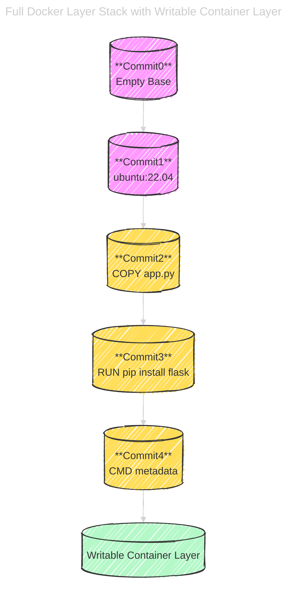

# 🍰 **Docker Image Layers Internals** — Like Git Commits for Filesystem Snapshots

_Each Docker **layer** is like a **Git commit**, representing a **filesystem diff** (snapshot of changes since previous layer)._

---

## 💭 **Dockerfile Example**

```dockerfile
FROM ubuntu:22.04
COPY app.py /app/
RUN pip install flask
CMD ["python3", "/app/app.py"]
```

---

## 1️⃣ Step 1: `FROM ubuntu:22.04`

**Starts from a base image** that already has its own layered filesystem.

Each layer in `ubuntu:22.04` represents a set of filesystem changes applied during Ubuntu’s original build.

### 🔹 What Happens

- Docker **pulls** the base image from the registry.
- Each Ubuntu layer (tarball) is unpacked and stacked together.
- The top layer’s merged view becomes your **starting filesystem**.

### 🔹 Conceptual Analogy

- Like checking out someone else’s repo at a specific **commit (C1)**.

### 🔹 Git Analogy Mapping

| Git Term | Docker Equivalent   |
| -------- | ------------------- |
| Commit   | Image Layer         |
| Tree     | Filesystem snapshot |
| Blob     | File contents       |

### 📊 Diagram

<div align="center" style="background: #578198ff; border-radius: 20px">

<div style="width:60%">



</div>

</div>

```mermaid
---
config:
  look: handDrawn
  theme: dark
title: "Step 1 — FROM ubuntu:22.04"
---
flowchart TD
    L0[(**Commit0** </br>Empty Base)]
    L1[(**Commit1** </br>ubuntu:22.04)]
    T1{"Tree1"}
    F1([Ubuntu core binaries])
    F2([Ubuntu libraries])
    F3([Ubuntu configs])

    L0 --> L1 --> T1
    T1 --> F1
    T1 --> F2
    T1 --> F3

    classDef green fill:#99ffa5,stroke:#333,color:#333,font-size:12pt;
    classDef base fill:#f9f,stroke:#333,color:#333,font-size:12pt;
    class F1,F2,F3 green
    class L0,L1 base
```

🧠 You can think of this as **Git cloning Ubuntu’s repo up to commit C1**.

---

## 2️⃣ Step 2: `COPY app.py /app/`

**Adds a new file** into the filesystem snapshot.

### 🔹 What Happens

- Docker launches a temporary container from the Ubuntu FS.
- Copies `app.py` from your local context into `/app/`.
- Captures only the diff (`/app/app.py` is new).
- Stores it as **Layer5**.

### 🔹 Internals

- **New blob** for `/app/app.py`.
- **New tree** mapping `/app` → `Blob_app.py`.
- **Parent** = Ubuntu’s top layer.

### 📊 Diagram

<div align="center" style="background: #578198ff; border-radius: 20px">

<div style="width:40%">



</div>

</div>

```mermaid
---
config:
  look: handDrawn
  theme: dark
title: "Step 2 — COPY app.py /app/"
---
flowchart TD
    C1[(**Commit1** </br>ubuntu:22.04)]
    C2[(**Commit2** </br>COPY app.py)]
    C2 --> T2{"Tree2 (root FS)"}
    T2 --> B1(["Reused Blobs (Ubuntu FS)"])
    T2 --> B2(["New Blob: app.py"])
    B2 --> F2["/app/app.py → 'print(Hello Flask)'"]
    C1 --> C2

    classDef orange fill:#ffdd57,stroke:#333,color:#333,font-size:12pt;
    classDef green fill:#99ffa5,stroke:#333,color:#333,font-size:12pt;
    class C1,C2 orange
    class B1,B2 green
```

🧠 Only the **new file diff** becomes part of the new layer; all base OS files are **reused** (like Git reusing old blobs).

---

## 3️⃣ Step 3: `RUN pip install flask`

**Executes a command** in a temporary container and commits the resulting changes.

### 🔹 What Happens

1. Docker starts a container from the previous layer (`COPY` result).
2. Runs the shell command `pip install flask`.
3. Files added/modified (e.g., `/usr/local/lib/python3.10/site-packages/flask/...`).
4. Captures those diffs into **Layer6**.

### 🔹 Internals

- Reuses previous filesystem blobs (`/app`, `/bin`, etc.).
- Adds **new blobs** for installed Python packages.
- Saves the delta as a new **compressed layer**.

### 📊 Diagram

<div align="center" style="background: #578198ff; border-radius: 20px">

<div style="width:50%">



</div>

</div>

```mermaid
---
config:
  look: handDrawn
  theme: dark
title: "Step 3 — RUN pip install flask"
---
flowchart TD
    C2[(**Commit2** </br>COPY app.py)]
    C3[(**Commit3** </br>RUN pip install flask)]

    C3 --> T3{"Tree3 (root FS)"}
    T3 --> B1(["Reused: OS"])
    T3 --> B2(["Reused: app.py"])
    T3 --> B3(["New Blob: Flask packages"])
    B3 --> F3["/usr/local/lib/..."]

    C2 --> C3

    classDef orange fill:#ffdd57,stroke:#333,color:#333,font-size:12pt;
    classDef green fill:#99ffa5,stroke:#333,color:#333,font-size:12pt;
    class C2,C3 orange
    class B1,B2,B3 green
```

🧠 Each `RUN` instruction commits a **snapshot** of the filesystem after command execution — like `git commit -a` capturing all modifications.

---

## 4️⃣ Step 4: `CMD ["python3", "/app/app.py"]`

**Adds runtime configuration** (metadata layer).

### 🔹 What Happens

- Docker records command, entrypoint, environment vars, etc.
- No new filesystem content — metadata only.
- Produces **Layer7** with a new manifest/config JSON.

### 📊 Diagram

<div align="center" style="background: #578198ff; border-radius: 20px">

<div style="width:25%">



</div>

</div>

```mermaid
---
config:
  look: handDrawn
  theme: dark
title: "Step 4 — CMD python3 /app/app.py"
---
flowchart TD
    C3[(**Commit3** </br>RUN pip install flask)]
    C4[(**Commit4** </br>CMD metadata)]
    C3 --> C4

    classDef orange fill:#ffdd57,stroke:#333,color:#333,font-size:12pt;
    class C3,C4 orange
```

🧠 This is like adding a **commit message** or Git tag — same tree, new metadata.

---

## 5️⃣ Step 5: Running the Container

When you run:

```bash
docker run myapp:latest
```

Docker **adds one more layer** — the **container writable layer**.

### 🔹 What Happens

- Docker overlays a **thin writable layer** (UnionFS or overlayfs) on top of all read-only layers.
- All writes (logs, temp files, DB changes) go there.
- When the container stops, that layer is **discarded**.

### 📊 Diagram (Full Lifecycle)

<div align="center" style="background: #578198ff; border-radius: 20px">

<div style="width:45%">



</div>

</div>

---

> 🧠 The final runtime container is like a **Git working directory** sitting on top of immutable commits.

---

## 🔁 **Rebuilds & Cache = Reusing Old Commits**

If you rebuild and nothing changed before a certain step:

- Docker reuses cached layers (same parent + same command + same inputs).
- Just like Git doesn’t re-store old blobs — it reuses them by SHA.

That’s why build cache is lightning fast ⚡

---

## 🏁 Summary Table

| Step | Docker Action           | Creates                       | Reuses               | Analogy                |
| ---- | ----------------------- | ----------------------------- | -------------------- | ---------------------- |
| 1️⃣   | `FROM ubuntu:22.04`     | Base Layers                   | —                    | Clone repo from Ubuntu |
| 2️⃣   | `COPY app.py`           | New layer with `/app/app.py`  | All OS files         | Commit new file        |
| 3️⃣   | `RUN pip install flask` | New layer with Flask packages | `/app`, OS           | Commit modified files  |
| 4️⃣   | `CMD ...`               | Metadata layer                | All FS               | Commit message/config  |
| 5️⃣   | `docker run`            | Writable container layer      | All read-only layers | Working directory      |

---

## 💭 Conceptual Summary

| Concept           | Git                      | Docker                       |
| ----------------- | ------------------------ | ---------------------------- |
| Commit            | Image Layer              | Immutable filesystem diff    |
| Parent Commit     | Parent Layer             | Previous layer FS            |
| HEAD              | Image Tag                | Pointer to latest layer      |
| Clone             | Pull Image               | Copy all layers              |
| Checkout          | Run Container            | Create working FS from image |
| Working Directory | Writable Container Layer | Ephemeral file changes       |
| git diff          | docker diff              | Compare filesystem state     |

---

### 🧠 **TL;DR**

> 🧬 Docker images are **Git for filesystems**  
> Each instruction = **new commit (layer)**  
> The final container adds a **temporary writable layer**  
> Unchanged data = **reused by hash (like blobs in Git)**

---

Would you like me to extend this with a **Mermaid flow showing the caching mechanism** — how Docker rebuild skips identical layer hashes (similar to Git reusing unchanged trees/blobs)? It’s the perfect continuation of this analogy.
