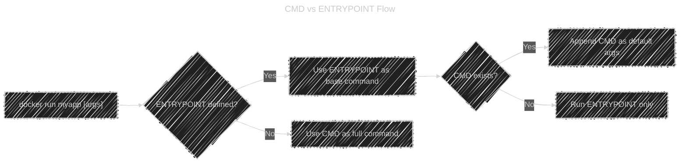
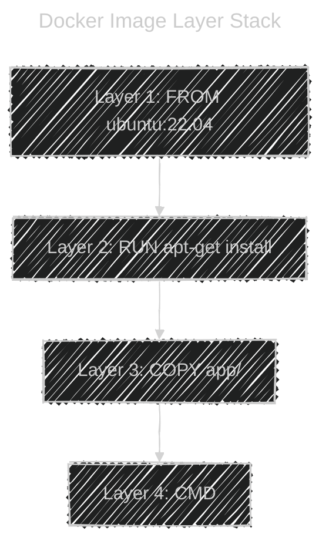

# 📜 **Dockerfile Instructions**

> “Every Dockerfile instruction = one layer of behavior.”

---

## 📌 `FROM` — Base Image

### 👉🏻 Purpose

- Defines the **starting point** (base image) of your build.
- It’s the **first instruction** in every Dockerfile (except multistage `COPY --from`).

### 📝 Example

```dockerfile
FROM ubuntu:22.04
```

This means:

- Docker will **pull `ubuntu:22.04`** (if not cached)
- All next instructions apply _on top of_ that base filesystem

You can also chain multiple stages:

```dockerfile
FROM golang:1.22 AS builder
FROM alpine:latest
COPY --from=builder /app /usr/local/bin/
```

### 🧠 Internally

- Each `FROM` creates a **new build stage** → previous one’s layers are finalized.

---

## 📌 `LABEL` — Metadata for Images

### 👉🏻 Purpose

- Add key–value metadata to image for documentation or automation.

### 📝 Example

```dockerfile
LABEL maintainer="Ali <ali@example.com>" \
      version="1.0" \
      description="Flask web app"
```

### 💡 Tips

Visible in:

```bash
docker inspect myapp | grep Label
```

Used by:

- Docker Hub
- CI/CD metadata scanners
- Kubernetes image labels

---

## 📌 `ARG` — Build-Time Variables

### 👉🏻 Purpose

- Pass build-time variables to customize builds (not available at runtime).

### 📝 Example

```dockerfile
ARG APP_VERSION=1.0
RUN echo "Building version $APP_VERSION"
```

At build:

```bash
docker build --build-arg APP_VERSION=2.0 .
```

### 💡 Tips

- After the build finishes, ARG values **disappear** — they are **not kept in the image**.

---

## 📌 `ENV` — Set Environment Variables

### 👉🏻 Purpose

- Defines environment variables in the image (available at runtime).

### 📝 Example

```dockerfile
ENV APP_ENV=production
ENV PATH="/custom/bin:$PATH"
```

At runtime, you can verify:

```bash
docker run myapp env
```

### 💡 Tips

- those **Available during container runtime**, but not in build unless explicitly referenced later in same Dockerfile.

---

## ⚔️ **ARG vs ENV**

| Feature                     | `ARG`           | `ENV`                   |
| --------------------------- | --------------- | ----------------------- |
| Availability                | Build-time only | Runtime                 |
| Default in Dockerfile       | ✅ Yes          | ✅ Yes                  |
| Can override at runtime     | ❌ No           | ✅ Yes (`-e VAR=value`) |
| Visible in `docker inspect` | ❌ No           | ✅ Yes                  |

---

## 📌 `WORKDIR` — Set the Working Directory

### 👉🏻 Purpose

- Sets the default directory for all subsequent instructions (`RUN`, `CMD`, `COPY`).

### 📝 Example

```dockerfile
WORKDIR /app
COPY . .
RUN npm install
```

### 💡 Tips

- If directory doesn’t exist → Docker automatically creates it.
- Safer than `RUN cd /app` — because `RUN` doesn’t persist across layers.

---

## 📌 `COPY` — Copy Files into Image (Build Time)

### 👉🏻 Purpose

- Copies files/folders from your **build context** → image filesystem.

### 📝 Example

```dockerfile
COPY app.py /usr/src/app/
```

### 🧠 Internally

Docker:

- Takes file from context (the directory you passed to `docker build`)
- Adds it as a new layer inside `/usr/src/app/`

### 💡 Tips

- Only works within the **build context**
- Use `.dockerignore` to avoid copying unnecessary files

- **Common Pitfall:**

  - If you modify a single file → Docker invalidates all later cached layers.
  - To optimize:

    ```dockerfile
    COPY requirements.txt .
    RUN pip install -r requirements.txt
    COPY . .
    ```

---

## 📌 `ADD` — Copy with Superpowers

### 👉🏻 Purpose

- Like `COPY`, but with **extra features**:

  - Can extract compressed files (like `.tar.gz`)
  - Can copy directly from a **URL**

### 📝 Example

```dockerfile
ADD app.tar.gz /usr/src/app/
ADD https://example.com/app.zip /tmp/
```

### 💡 Tips

⚠️ Recommended:

> Use `COPY` unless you **really need** auto-extraction or URL.

---

## ⚔️ **COPY vs ADD**

| Feature                 | `COPY`                 | `ADD`                                |
| ----------------------- | ---------------------- | ------------------------------------ |
| **Purpose**             | Copy files/directories | Copy + extra features                |
| **Source types**        | Local files only       | Local files + remote URLs + archives |
| **Extracts archives?**  | ❌ No                  | ✅ Yes (`.tar`, `.gz`, etc.)         |
| **Downloads from URL?** | ❌ No                  | ✅ Yes (e.g., `ADD http://...`)      |
| **Preferred for**       | Simplicity, clarity    | Special cases (auto-extract, remote) |

---

**✅ Best Practice:**

> Use `COPY` by default — it’s cleaner and more predictable.  
> Use `ADD` **only** when you need archive extraction or remote downloads.

---

## 📌 `RUN` — Execute Shell Commands (Build Time)

### 👉🏻 Purpose

- Runs commands in a temporary container **during image build**, and commits the filesystem changes as a **new image layer**.

### 📝 Example

```dockerfile
RUN apt-get update && apt-get install -y curl
```

### 🧠 Internally

- Docker creates a **temp container** from the current image
- Runs `/bin/sh -c "apt-get update..."` inside it
- Commits changes into a new read-only layer
- Removes the container

---

### 💡 Tips

- ✅ Combine related commands in one line to minimize layers:

  ```dockerfile
  RUN apt-get update && apt-get install -y python3 && rm -rf /var/lib/apt/lists/*
  ```

- ✅ Use `\` for readability:

  ```dockerfile
  RUN apt-get update && \
      apt-get install -y curl git && \
      rm -rf /var/lib/apt/lists/*
  ```

---

## 📌 `EXPOSE` — Document Container Ports

### 👉🏻 Purpose

- Declares which port the container _intends_ to listen on.

  ```dockerfile
  EXPOSE 8080
  ```

### 💡 Tips

- This does **not** actually publish the port; it’s just metadata.
- You must still run:

  ```bash
  docker run -p 8080:8080 myapp
  ```

- Useful for documentation and automatic port mapping in Compose or Kubernetes.

---

## 📌 `USER` — Change Running User

### 👉🏻 Purpose

- Specifies which user the container runs as.

### 📝 Example

```dockerfile
USER appuser
```

### 💡 Tips

- By default, containers run as `root` (inside container level, not host level).
- For security, create and switch user:

  ```dockerfile
  RUN useradd -m appuser
  USER appuser
  ```

---

## 📌 `VOLUME` — Declare Storage Mount Points

### 👉🏻 Purpose

- Specifies directories in the container meant to persist or be shared.

### 📝 Example

```dockerfile
VOLUME ["/data"]
```

When container runs:

- Docker automatically creates `/data` as a volume.
- Data written here is stored under:

  ```ini
  /var/lib/docker/volumes/<volume-id>/_data
  ```

✅ Protects data from deletion when container removed.

---

## 📌 `SHELL` — Default Shell for RUN, CMD, ENTRYPOINT

### 👉🏻 Purpose

- Change the default shell used to interpret commands.

### 📝 Example

- Default on Linux:

  ```dockerfile
  SHELL ["/bin/sh", "-c"]
  ```

- To use Bash:

  ```dockerfile
  SHELL ["/bin/bash", "-c"]
  ```

- Useful in Windows containers:

  ```dockerfile
  SHELL ["powershell", "-Command"]
  ```

---

## 📌 `ENTRYPOINT` — Main Container Command (Runtime)

### 👉🏻 Purpose

- Defines the **main executable** of the container — cannot be overridden easily.

### 📝 Example

```dockerfile
ENTRYPOINT ["python3", "app.py"]
```

### 💡 Tips

- If you pass extra args, they’re **appended** to ENTRYPOINT:

  ```bash
  docker run myapp --port 8080
  ```

- Result executed inside container:

  ```ini
  python3 app.py --port 8080
  ```

---

## 📌 `CMD` — Default Command (Runtime)

### 👉🏻 Purpose

- Defines the **default command** to run when the container starts.

### 📝 Example

```dockerfile
CMD ["python3", "app.py"]
```

### 💡 Tips

- If you provide another command at runtime, it **overrides CMD**:

  ```bash
  docker run myapp echo "Hello"
  ```

- Then CMD is ignored.

---

## ⚔️ **CMD vs ENTRYPOINT**

This is one of the **most misunderstood** pairs.
Let’s break it down clearly:

| Behavior                            | `CMD`                                | `ENTRYPOINT`           |
| ----------------------------------- | ------------------------------------ | ---------------------- |
| Purpose                             | Default arguments / command          | Fixed main process     |
| Overridden by `docker run` command? | ✅ Yes                               | ❌ No (args appended)  |
| Common usage                        | Default behavior                     | Always-run binary      |
| Example                             | `CMD ["nginx", "-g", "daemon off;"]` | `ENTRYPOINT ["nginx"]` |

---

**🧩 Combine ENTRYPOINT + CMD:**

The best practice:

```dockerfile
ENTRYPOINT ["python3", "app.py"]
CMD ["--port", "8080"]
```

If you run:

```bash
docker run myapp --debug
```

It executes:

```ini
python3 app.py --debug
```

✅ CMD acts as **default args**  
✅ ENTRYPOINT acts as **core executable**

---

**🔬 Visual Summary:**



---

## 🍰 **Image Layering Recap**

Each instruction (except `FROM`, `ARG`, `LABEL`) creates a **new immutable layer**.  
Layers are **stacked** to form your final image.

<div align="center">



</div>

- ✅ Docker reuses unchanged layers via cache
- ✅ Each layer is read-only
- ✅ Container adds a final **read-write layer** when run

---

## 📄 **Quick Dockerfile Instruction Reference**

| Instruction  | Time        | Creates Layer | Notes                               |
| ------------ | ----------- | ------------- | ----------------------------------- |
| `FROM`       | Build start | ✅            | Defines base image                  |
| `LABEL`      | Build       | ✅            | Metadata                            |
| `ARG`        | Build       | ❌            | Build-time only                     |
| `ENV`        | Build+Run   | ✅            | Persists in runtime                 |
| `WORKDIR`    | Build       | ✅            | Sets working directory              |
| `COPY`       | Build       | ✅            | Copies files into image             |
| `ADD`        | Build       | ✅            | Like COPY but can extract URLs/tars |
| `RUN`        | Build       | ✔️            | Executes shell command              |
| `EXPOSE`     | Build       | ✅            | Documentation                       |
| `USER`       | Build+Run   | ✅            | Sets user context                   |
| `VOLUME`     | Runtime     | ✅            | Mount points                        |
| `SHELL`      | Build       | ✅            | Changes shell interpreter           |
| `ENTRYPOINT` | Runtime     | ✅            | Primary executable                  |
| `CMD`        | Runtime     | ✅            | Default runtime command             |

---

## 💡 **Pro Best Practices**

- ✅ Use one `RUN` per logical operation (for cache efficiency).
- ✅ Put least changing instructions **at the top**.
- ✅ Use `COPY` not `ADD`, unless extracting archives.
- ✅ Always specify explicit versions in `FROM`.
- ✅ Combine `ENTRYPOINT` + `CMD` for flexibility.
- ✅ Create non-root users with `USER` for security.
- ✅ Always use `.dockerignore` to minimize context.

---

Would you like me next to explain **Docker Image History and Layer Caching Internals** — showing how each Dockerfile instruction translates into actual filesystem layers (`diff`, `lower`, `merged`) and how Docker optimizes builds via content hashes?
