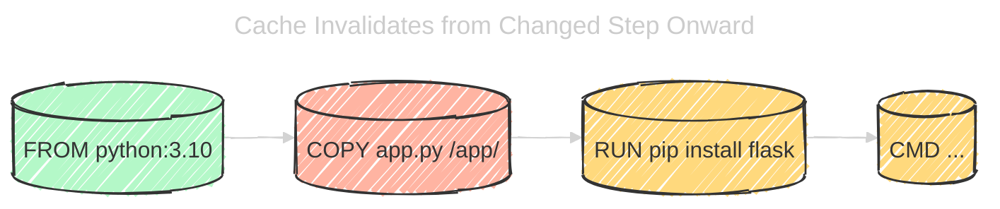
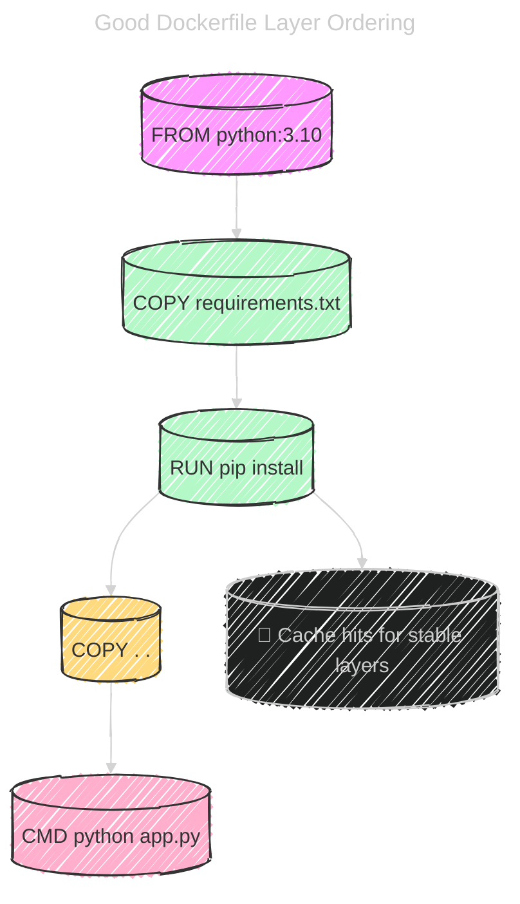

# ⚡ Docker Build Cache — Explained Like a Filesystem Time Machine

## 📖 **What Is Docker Build Cache?**

When Docker builds an image, it goes **instruction by instruction** through your `Dockerfile`.  
After each step, it creates a **layer** (an immutable filesystem diff)
and **stores it in cache** with a **unique hash**.

### 🔹 The Cache Key = Hash of:

```ini
[parent layer’s hash] + [instruction text] + [all input file contents]
```

If Docker sees **the same instruction** with **the same inputs**,  
it **reuses the cached layer** instead of rebuilding.

✅ Result: **Faster builds**  
❌ Cache miss: Docker rebuilds from that step onward

---

## 📝 **Example** — Basic Dockerfile

```dockerfile
FROM python:3.10

COPY app.py /app/
RUN pip install flask
CMD ["python3", "/app/app.py"]
```

### ⚙️ Build Flow:

1. `FROM python:3.10` — uses cached base image if unchanged
2. `COPY app.py /app/` — cache valid _only if_ app.py content is the same
3. `RUN pip install flask` — cache valid _only if_ parent layer and command are same
4. `CMD` — always cached (metadata only)

---

### 💿 How Cache Invalidates

Docker builds linearly.
If one layer’s hash changes → all layers **below it** must rebuild.

<div align="center">



</div>

> If you modify `app.py`, Docker must **rebuild everything below** `COPY app.py`.

---

## 🚨 **Common Bad Practices**

Let’s go through _real-world mistakes_ that developers make.

---

### ❌ Bad Example 1 — Copying Everything Too Early

```dockerfile
FROM python:3.10
COPY . /app/
RUN pip install -r /app/requirements.txt
CMD ["python3", "/app/app.py"]
```

🔥 Problem:

- You copied **all source files first** (including app.py, configs, assets, etc.).
- Even a _minor file change_ (like README.md) invalidates the entire layer.
- Docker must rerun `pip install` — even though dependencies didn’t change.

💀 Result:

Every tiny edit causes a full rebuild of dependencies.

---

### ✅ Good Example 1 — Copy Dependency Files First

```dockerfile
FROM python:3.10

WORKDIR /app
COPY requirements.txt ./
RUN pip install -r requirements.txt

COPY . .
CMD ["python3", "app.py"]
```

🧠 Why It’s Better:

- `requirements.txt` rarely changes → `pip install` layer cached!
- Code changes only affect final `COPY . .` layer.
- Rebuilds become **fast and incremental**.

---

🧩 Example in Practice

First build:

```ini
Step 1/5: FROM python:3.10
 ---> Using cache
Step 2/5: COPY requirements.txt .
 ---> Using cache
Step 3/5: RUN pip install -r requirements.txt
 ---> Building new layer
Step 4/5: COPY . .
 ---> Building new layer
```

Second build (after only editing app.py):

```ini
Step 1/5: FROM python:3.10
 ---> Using cache
Step 2/5: COPY requirements.txt .
 ---> Using cache
Step 3/5: RUN pip install -r requirements.txt
 ---> Using cache
Step 4/5: COPY . .
 ---> Building new layer
```

✅ **Only the final layer is rebuilt.**

---

### ❌ Bad Example 2 — Using Wild COPY Contexts

```dockerfile
COPY . .
```

🔥 Problem:

Copies _everything_ in your build context (even `.git`, test data, logs).
Even one hidden file change breaks cache.

### ✅ Good Example 2:

Use a `.dockerignore` file!

```dockerignore
.git
__pycache__
node_modules
tests
*.log
```

🧠 Think of `.dockerignore` like `.gitignore` for Docker caching.

---

### ❌ Bad Example 3 — Combining Unrelated Commands in One RUN

```dockerfile
RUN apt-get update && apt-get install -y \
    curl \
    vim && \
    pip install flask && \
    pip install requests
```

🔥 Problem:

- Any minor change (like adding/removing a pip package) invalidates the _entire_ step.
- You lose caching granularity.

---

### ✅ Good Example 3 — Split Stable and Volatile Layers

```dockerfile
RUN apt-get update && apt-get install -y curl vim
RUN pip install flask
RUN pip install requests
```

🧠 Why:

- OS packages rarely change → cached longer.
- Changing Python deps only rebuilds their layer, not system tools.

---

### ❌ Bad Example 4 — Using `ADD` for Remote URLs or Tarballs

```dockerfile
ADD https://example.com/app.tar.gz /app/
```

🔥 Problem:

- Docker can’t predict remote URL changes → cache **always invalidates**.
- Worse: downloads new data every build.

### ✅ Good Example 4:

Use `curl` inside a `RUN` step and version-lock the file.

```dockerfile
RUN curl -sSL https://example.com/app-v1.0.tar.gz -o /app/app.tar.gz
```

---

### ❌ Bad Example 5 — Environment Variables That Change Often

```dockerfile
ARG BUILD_DATE
RUN echo "Build date: $BUILD_DATE"
```

🔥 Problem:

- `ARG` affects cache key.
- Every rebuild with a new date invalidates that layer.

### ✅ Good Example 5:

Use `LABEL` for metadata instead:

```dockerfile
LABEL build_date=$BUILD_DATE
```

Labels don’t affect build cache for filesystem steps.

---

## ✅ Best Practices Summary

| Rule                                                 | Why                                     |
| ---------------------------------------------------- | --------------------------------------- |
| 📂 **Copy dependency files first**                   | Keeps `pip/npm install` cached          |
| 🧹 **Use .dockerignore**                             | Prevents noise invalidating cache       |
| 🔪 **Split RUN commands logically**                  | Smaller rebuild surface                 |
| 🧱 **Order instructions from least → most volatile** | Maximizes reuse                         |
| 🌍 **Avoid ADD for remote URLs**                     | Prevents random cache busts             |
| 🧭 **Use ARG sparingly**                             | They’re cache keys                      |
| 💾 **Pin dependencies (requirements.txt)**           | Stable hashes for consistent cache hits |

---

## 🧠 Visual Recap

<div align="center">



</div>

---

## 🧩 TL;DR — Think Like a Compiler

| Goal                       | Analogy                                    |
| -------------------------- | ------------------------------------------ |
| Stable base layers         | Compiler precompiled headers               |
| COPY dependencies first    | Caching object files                       |
| Avoid volatile steps early | Don’t recompile whole project for one line |
| .dockerignore              | `.gitignore` for Docker                    |
| Split RUN commands         | Smaller “rebuild modules”                  |
