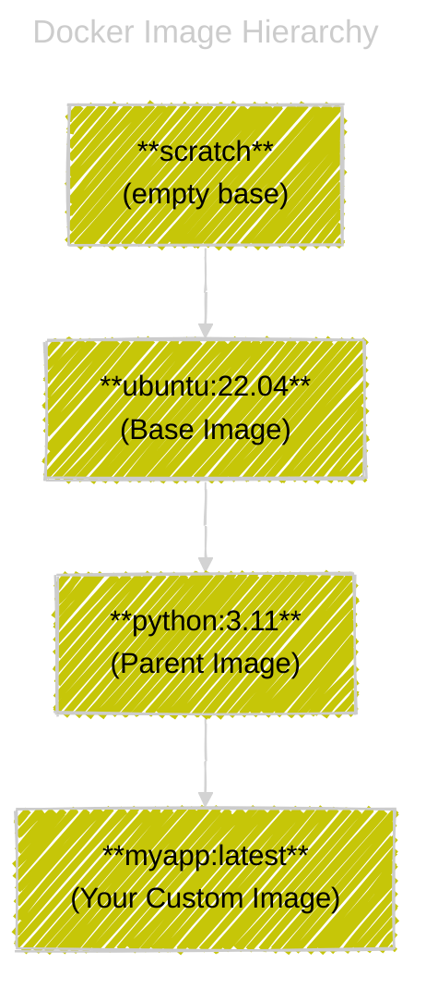

# 🗻 Docker Image Hierarchy — Scratch, Base & Parent Images

## 📌 Definitions

<div align="center" style="background: #314752ff; border-radius: 20px;color:#fff">

| Term             | Meaning                                             | Example                                |
| ---------------- | --------------------------------------------------- | -------------------------------------- |
| **scratch**      | Empty image (no filesystem, no libraries, no shell) | `FROM scratch`                         |
| **Base image**   | Image built _directly from scratch_                 | `ubuntu`, `alpine`, `busybox`          |
| **Parent image** | Any image you build _FROM_ another existing one     | `python:3.11`, `node:18`, `dotnet:8.0` |

</div>

---

<div align="center" style="background-color:#081C27; border-radius: 10px; border: 2px solid">
  
</div>

---

## 🖼️ The Big Picture

Every Docker image is built _on top of another image_, except one special case:  
→ **`scratch`**, the _empty root_ of all images.

Think of it like this 👇

<div align="center" style="background: #578198ff; border-radius: 20px">



</div>

---

## 🪣 **1. scratch Image** — The True Empty Base

### 📖 Definition

`scratch` is a **pseudo-image** — it doesn’t actually exist as a file on disk or on Docker Hub.
It simply represents **“nothing”** — an empty root filesystem.

```dockerfile
FROM scratch
```

When you use this, you’re saying:

> “I want to build a container completely from zero — no OS, no libraries, no shell.”

---

### ⚙️ Use Cases

- Minimal containers (like static Go or C binaries)
- Security-sensitive apps (no shell = no attack surface)
- Foundation for your own **base images**

---

### 💡 Example: Tiny Go Binary from Scratch

```dockerfile
# Build Stage
FROM golang:1.22 AS builder
WORKDIR /src
COPY main.go .
RUN go build -ldflags="-s -w" -o app main.go

# Final Image
FROM scratch
COPY --from=builder /src/app /app
ENTRYPOINT ["/app"]
```

✅ Result:

- Image size = ~5–10 MB
- No bash, no apt, no libc
- Runs only your Go binary directly

---

### 🔬 Internally

When Docker sees `FROM scratch`, it skips pulling any filesystem layers.
It just starts with an empty rootfs and adds your files as the **first layer**.

Filesystem structure inside:

```ini
/app
```

That’s it. No `/bin`, `/etc`, `/usr`, nothing.

---

## 🏛️**2. Base Image** — Built Directly from scratch

A **base image** is the _first image_ built **from scratch** and then published for others to use.

These are the **foundation layers** for common OSes or languages.

Examples:

- `ubuntu:22.04`
- `alpine:3.20`
- `debian:bookworm`
- `busybox`
- `centos:9`

Each one was originally built **FROM scratch**, then filled with minimal packages.

---

### 📦 Example (simplified idea of how Ubuntu image was made)

```dockerfile
FROM scratch
ADD ubuntu-22.04-rootfs.tar.xz /
CMD ["/bin/bash"]
```

Here, `ubuntu-22.04-rootfs.tar.xz` is an official tarball exported from the Ubuntu root filesystem.

When you `docker run -it ubuntu`, that’s what you get — an OS inside a container.

---

### 🧠 You can make your own base image like that too!

Let’s see how 👇

---

### ✍🏻 Creating Your Own Base Image (from scratch)

Imagine you want to create a custom base for your company — lightweight, secure, and minimal.

#### 🔹 Step 1: Prepare Root Filesystem

You can use any method:

- Export an existing container rootfs
- Use `debootstrap` (for Debian/Ubuntu)
- Use `dnf --installroot` (for Fedora/RHEL)
- Or even build from your own compiled tools

Example using Alpine:

```bash
docker run --name temp alpine:3.20
docker export temp -o alpine-rootfs.tar
docker rm temp
```

Now you have a clean root filesystem tarball.

---

#### 🔹 Step 2: Create a Dockerfile

```dockerfile
FROM scratch
ADD alpine-rootfs.tar /
CMD ["/bin/sh"]
```

---

#### 🔹 Step 3: Build Your Base Image

```bash
docker build -t mybase:1.0 .
```

✅ You now have your own **base image** built from scratch.

Check it:

```bash
docker run -it mybase:1.0
```

Output:

```ini
/ # uname -a
Linux <container-id> ...
```

You just booted a working Linux environment from your own rootfs!

---

#### 🔹 Step 4: Use it as a Parent Image

Now you can build other images FROM it:

```dockerfile
FROM mybase:1.0
RUN apk add --no-cache python3
COPY app.py /app/
CMD ["python3", "/app/app.py"]
```

You’ve effectively created your own **internal OS base image**.

---

## 🏡 **3. Parent Image** — Layer Built on Top of Another

When you write:

```dockerfile
FROM python:3.11
```

`python:3.11` is your **parent image**.
It already has:

- `FROM debian` as its base
- Pre-installed Python binaries

So your image will inherit all of that.

Then your layers stack on top:

```dockerfile
COPY app.py .
CMD ["python3", "app.py"]
```

Result:

```ini
scratch → debian → python → your app
```

---

## ⁉️ When Should You Use Each?

<div align="center" style="background: #314752ff; border-radius: 20px;color:#fff">

| Image Type       | When to Use                                                          | Example                              |
| ---------------- | -------------------------------------------------------------------- | ------------------------------------ |
| **scratch**      | You have a single static binary; want max security and smallest size | Go, C apps                           |
| **base image**   | You want to create your own company OS base                          | Alpine-like or custom rootfs         |
| **parent image** | You’re building on top of an existing image                          | `FROM python:3.11` or `FROM node:18` |

</div>

---

## 🔴 Common Misconception

> ❌ “scratch is an empty Ubuntu”

Nope 😅
`scratch` literally has **no**:

- Shell (`/bin/sh`)
- Package manager (`apt`, `yum`, `apk`)
- Users or groups
- System libraries

If your binary dynamically links to libc, you must include that manually.

That’s why it’s common to use **alpine** instead — it’s a real OS but only ~5 MB.

---

## ⚖️ Example Comparison

<div align="center" style="background: #314752ff; border-radius: 20px;color:#fff">

| Image          | FROM    | Size    | Includes             |
| -------------- | ------- | ------- | -------------------- |
| `scratch`      | none    | 0 MB    | nothing              |
| `alpine:3.20`  | scratch | ~5 MB   | busybox shell, apk   |
| `ubuntu:22.04` | scratch | ~80 MB  | bash, apt, coreutils |
| `python:3.11`  | debian  | ~150 MB | Python, pip, libs    |
| `myapp:1.0`    | python  | ~160 MB | your app code        |

</div>

---

<div align="center" style="background-color:#081C27; border-radius: 10px; border: 2px solid">
  
</div>

---

## 📒 Pro Tip — Build a Minimal Image Manually

If you compile a Go app statically:

```bash
go build -ldflags="-s -w" -o myapp
```

Then create Dockerfile:

```dockerfile
FROM scratch
COPY myapp /app
ENTRYPOINT ["/app"]
```

Build & run:

```bash
docker build -t minimal:1.0 .
docker run --rm minimal:1.0
```

✅ Size: only a few MB  
✅ Boot time: almost instant  
✅ Perfect for serverless or microservice builds

---

## 🏁 Summary Table

<div align="center" style="background: #314752ff; border-radius: 20px;color:#fff">

| Type             | Built FROM    | Contains           | Common Use            | Example               |
| ---------------- | ------------- | ------------------ | --------------------- | --------------------- |
| **scratch**      | none          | nothing            | Minimal static binary | `FROM scratch`        |
| **Base Image**   | scratch       | OS + utilities     | Foundation for others | `FROM alpine`         |
| **Parent Image** | another image | Language/runtime   | App environments      | `FROM python:3.11`    |
| **Child Image**  | parent        | Your code + config | Deployable app        | `FROM mycompany/base` |

</div>
