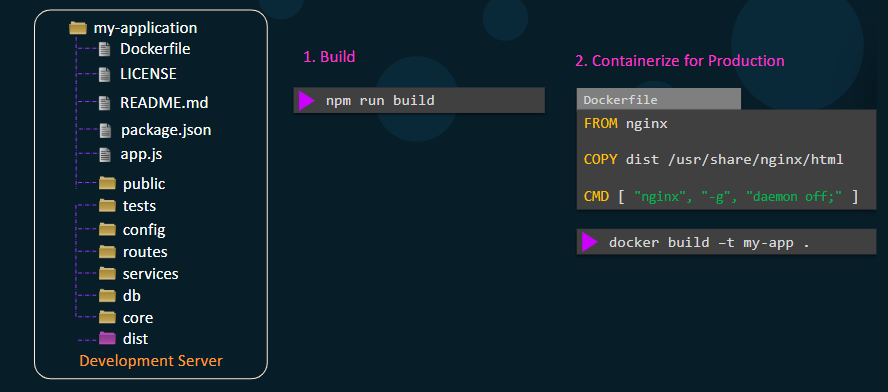
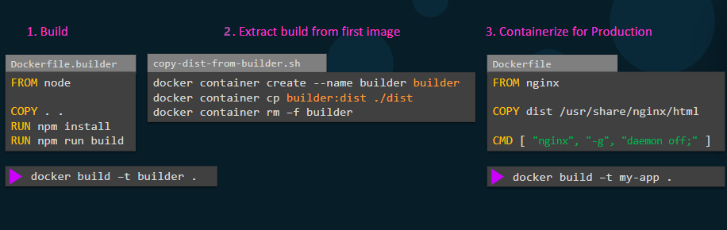
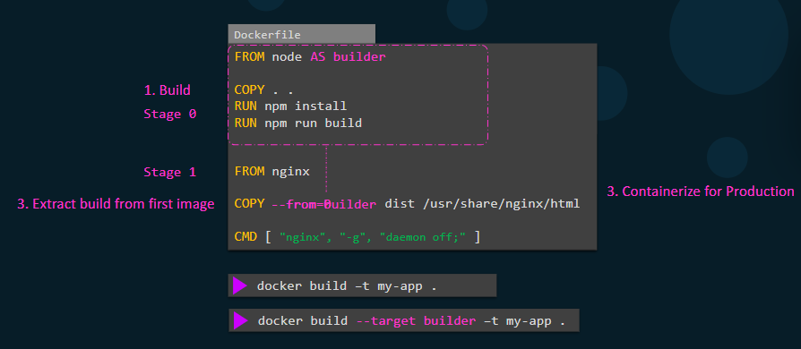

# ⛓️ **Multi-Stage Docker Builds**

Before multi-stage builds, developers had to:

- Use **Node.js** or **Go** or **.NET SDK** images to build their app (heavy)
- Then use **Nginx** or **Alpine** to serve it (light)

But the problem:

> The **final image** still included all the build tools and dependencies!

---

## 🔴 **Example of the Problem**

Let’s say you have a React or Vue frontend app.

Your source folder:

```ini
my-application/
├── app.js
├── package.json
├── public/
├── src/
└── dist/   # generated build output
```

---

### 📌 Option 1: Build with Node

You run:

```bash
npm run build
```

That creates the `/dist` folder (your final static site).

Then you run:

```dockerfile
FROM node
WORKDIR /app
COPY ./dist .
CMD ["npm", "start"]
```

✅ easy to setup…  
❌ you need to instaal npm in your host (or in build agent)

- it can cause you conflict of versions
- need space
- not secure

---

### 📌Option2: Dockerize It — The Old Way

You might try this simple Dockerfile:

```dockerfile
FROM node
WORKDIR /app
COPY . .
RUN npm install
RUN npm run build
CMD ["npm", "start"]
```

✅ Works perfectly…  
❌ But your image is **huge** (~1 GB+)!  
Because:

- It includes Node compiler tools
- It includes dev dependencies
- You don’t even need Node.js to _serve_ your static `/dist` folder

---

## 💡 **What Developers Did Before Multi-Stage Builds**

They tried **two separate Dockerfiles**:

### `Dockerfile.builder`

```dockerfile
FROM node
WORKDIR /app
COPY . .
RUN npm install
RUN npm run build
```

Then build it:

```bash
docker build -t builder -f Dockerfile.builder .
```

Now manually copy the build:

```bash
docker container create --name builder builder
docker container cp builder:/app/dist ./dist
docker container rm builder
```

Then create a **second Dockerfile** for production:

```dockerfile
FROM nginx
COPY dist /usr/share/nginx/html
CMD ["nginx", "-g", "daemon off;"]
```

And build it again:

```bash
docker build -t my-app .
```

✅ It worked.  
❌ But it was painful:

- 2 Dockerfiles
- manual container copy scripts
- lots of wasted time

---

## ✅ **Enter Multi-Stage Builds** (Docker 17.05+)

Now, you can combine everything in **one Dockerfile** 🎉

---

### 🏗️ Example: Node + Nginx Multi-Stage Build

```dockerfile
# Stage 1 — Build App
FROM node AS builder
WORKDIR /app
COPY . .
RUN npm install
RUN npm run build

# Stage 2 — Production Image
FROM nginx
COPY --from=builder /app/dist /usr/share/nginx/html
CMD ["nginx", "-g", "daemon off;"]
```

---

### 🚀 Build & Run

```bash
docker build -t my-app .
docker run -p 8080:80 my-app
```

✅ Result:

- Final image only has **Nginx** and the **built HTML/CSS/JS**
- Node runtime & npm dependencies never enter the final image

---

## ⚙️ **How It Works Internally**

Docker builds stage 1, **keeps its layers in cache**,
then copies only `/app/dist` into the next image.

All other intermediate layers are **discarded** unless explicitly referenced.

---

## 📍 **Advanced Multi-Stage Concepts**

### 📌 1. Named Stages

You can name each build stage:

```dockerfile
FROM node:22 AS build
FROM nginx AS production
COPY --from=build /app/dist /usr/share/nginx/html
```

Helps readability and reuse.

---

### 📌 2. Target Builds

You can build only a specific stage (for testing):

```bash
docker build --target build -t temp-build .
```

✅ Useful if you want to check if your build compiles before finalizing.

---

### 📌 3. Using Build Arguments Across Stages

```dockerfile
ARG NODE_VERSION=22
FROM node:${NODE_VERSION} AS builder
```

Then build with:

```bash
docker build --build-arg NODE_VERSION=20 -t my-app .
```

---

### 📌 4. Sharing Caches Across Stages

Each stage caches separately.
But when using the same base (e.g. `node`), Docker can reuse layers intelligently.

To speed builds:

```bash
docker build --cache-from=my-app:latest .
```

---

### 📌 5. Copying Selective Artifacts Between Stages

You can copy only what’s needed:

```dockerfile
COPY --from=builder /app/dist /usr/share/nginx/html
COPY --from=builder /app/package.json /app/
```

---

### 📌 6. Using Multi-Stage for Other Languages

| Language | Builder Stage                      | Final Stage                           |
| -------- | ---------------------------------- | ------------------------------------- |
| Go       | `golang:1.22`                      | `scratch`                             |
| Java     | `maven:3.9`                        | `openjdk:21-jre`                      |
| .NET     | `mcr.microsoft.com/dotnet/sdk:8.0` | `mcr.microsoft.com/dotnet/aspnet:8.0` |
| Python   | `python:3.11`                      | `python:slim`                         |

---

## 📝 **Example:** Go Multi-Stage

```dockerfile
# Build binary
FROM golang:1.22 AS builder
WORKDIR /app
COPY . .
RUN go build -o app .

# Final lightweight image
FROM scratch
COPY --from=builder /app/app /app
ENTRYPOINT ["/app"]
```

✅ Final size: a few MB only.

---

## ⚖️ **Without vs With Multi-Stage**

- **Without Multi-Stage**

  - Option 1

    <div align="left">
    
    </div>

  - Option 2

    <div align="left">
    
    </div>

- **With Multi-Stage**

    <div align="left">
    
    </div>

---

## 🧠 **Why Multi-Stage Builds Matter**

| Problem (Before)              | Solution (Now)              |
| ----------------------------- | --------------------------- |
| Multiple Dockerfiles          | One clean file              |
| Huge final image              | Small, production-optimized |
| Manual artifact copy          | Automatic `COPY --from`     |
| Insecure (dev tools included) | Only runtime tools stay     |
| Slow builds                   | Cached intermediate layers  |

---

## 🧭 **Summary**

| Stage                  | Purpose                        | Base Image                      | Output                  |
| ---------------------- | ------------------------------ | ------------------------------- | ----------------------- |
| **Builder**            | Compiles, installs, builds app | `node`, `golang`, `maven`, etc. | `/app/dist`, `/app/bin` |
| **Final (Production)** | Serves or runs app             | `nginx`, `scratch`, `alpine`    | Minimal runtime only    |

---

## 🧠 **TL;DR**

✅ Multi-stage builds let you:

- Build → Copy → Discard
- Keep **one clean Dockerfile**
- Produce **tiny, secure** production images
- Reuse build stages for **testing**, **CI/CD**, or **custom layers**
