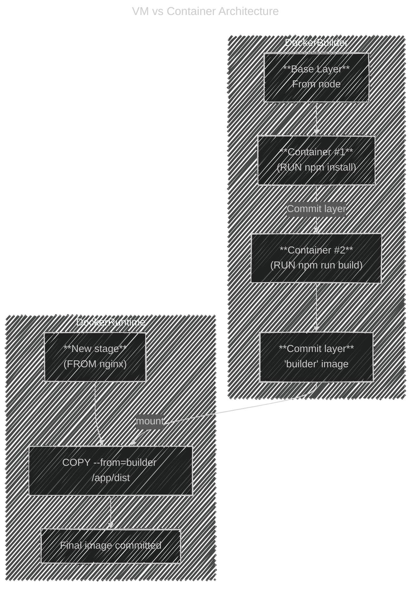

# ⚙️ What Really Happens During Multi-Stage Build

```dockerfile
# Stage 1 — Build App
FROM node AS builder
WORKDIR /app
COPY . .
RUN npm install
RUN npm run build

# Stage 2 — Production Image
FROM nginx
COPY --from=builder /app/dist /usr/share/nginx/html
CMD ["nginx", "-g", "daemon off;"]
```

---

## 📌 Stage 1

### 1️⃣ 1. Every `FROM` creates a _temporary intermediate image_

When Docker runs:

```dockerfile
FROM node AS builder
```

It creates a **new temporary image context** (not a container yet).
Each instruction (`RUN`, `COPY`, etc.) adds new _layers_ on top of this base image — exactly like a normal Docker build.

Docker actually **spins up short-lived containers** to execute `RUN` commands (like `npm install`), but then it **commits** their resulting filesystem changes into a new image layer, and **deletes the container immediately**.

So during the build:

- 🧱 `builder` stage = an image-in-progress with many layers
- 🧩 Each `RUN` = temporary container → new layer → then discarded

---

### 2️⃣ 2. When Stage 1 finishes

At the end of Stage 1 (the builder):

- Docker has an **intermediate image** representing the complete filesystem of that stage.
  (Think: snapshot of `/app` after `npm run build`)
- It tags that snapshot internally (like `builder=<imageID>`).
- The actual **container** used to execute build commands is already deleted — only the image snapshot remains.

You can even see them if you interrupt the build midway:

```bash
docker images -a
```

You’ll see something like:

```ini
<none>     <none>     123abc456def   5 minutes ago   900MB
```

That’s an **intermediate image** layer Docker created and cached.

---

## 📌 Stage 2

### 3️⃣ 3. Stage 2 uses the previous image _by reference_

When it reaches:

```dockerfile
COPY --from=builder /app/dist /usr/share/nginx/html
```

Docker doesn’t “run” the builder container.
It simply mounts the **final filesystem snapshot** of that stage (`builder` image layers) and copies the files directly from that virtual filesystem tree into the new image (`nginx`).

No container startup, no runtime dependency — just a layer-to-layer copy inside the build engine.

---

### 4️⃣ 4. After the final stage

At the end of the build:

- Docker commits the **final image** (last stage, here the Nginx one).
- All **intermediate images** from previous stages are:

  - ✅ kept in your local Docker cache (for faster rebuilds)
  - ❌ not part of the final pushed image
    (they won’t go to Docker Hub or your registry)

You can see them using:

```bash
docker image ls --filter dangling=true
```

They appear as `<none>` images.
You can clean them up with:

```bash
docker builder prune
```

---

## 🖼️ Summary of What’s Actually Created

| Phase                         | What Exists                           | Lifetime                          | Example                                           |
| ----------------------------- | ------------------------------------- | --------------------------------- | ------------------------------------------------- |
| During each `RUN`             | Temporary container                   | Deleted immediately after command | `docker run node npm install` (behind the scenes) |
| After each instruction        | Intermediate image (layer)            | Kept in cache                     | `<none>` image for caching                        |
| After first stage (`builder`) | Snapshot image of `/app/dist`         | Kept until prune                  | used by `COPY --from=builder`                     |
| During second stage           | Temporary containers for `RUN`/`COPY` | Deleted                           | same behavior                                     |
| After build ends              | Final image (only last stage)         | Persisted                         | `nginx` image with built app                      |

---

<div align="center" style="background: #2f424dff; border-radius: 20px">



</div>

---

## 🧹 TL;DR

| Concept                   | Happens During Build? | Persists After Build? | Description                   |
| ------------------------- | --------------------- | --------------------- | ----------------------------- |
| Containers for RUN        | ✅ yes                | ❌ no                 | Used only to execute commands |
| Intermediate image layers | ✅ yes                | ✅ in cache           | Used for future caching       |
| Builder stage image       | ✅ yes                | ✅ in cache           | Referenced by later stages    |
| Final stage image         | ✅ yes                | ✅ pushed to registry | Only this one is shipped      |

---

**So to answer directly:**

> 🧠 Docker _creates temporary containers_ during build steps, but commits only images (layers).
> The builder stage image stays in the **local cache**, not in the final image, and gets reused until you prune it.
