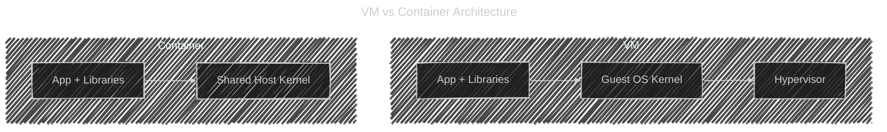
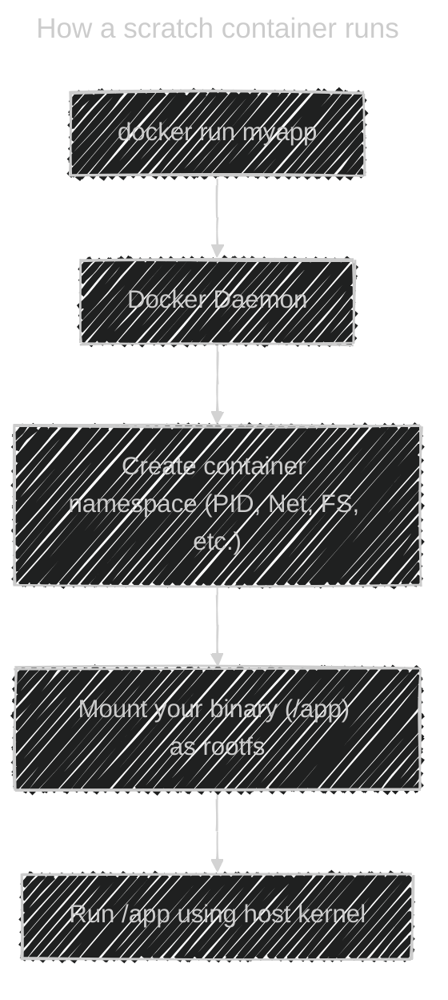

# 🪣 **“FROM scratch” In Depth**

> “How can a container run a program _without an OS_, if `FROM scratch` has nothing inside it?”

That’s exactly the right question — and once you truly understand this, you’ll _see how containers work under the hood_.

Let’s unpack it carefully, layer by layer. 👇

---

## ⁉️ **What “FROM scratch” Actually Means**

When you say

```dockerfile
FROM scratch
```

in

```dockerfile
# Build Stage
FROM golang:1.22 AS builder
WORKDIR /src
COPY main.go .
RUN go build -ldflags="-s -w" -o app main.go

# Final Image
FROM scratch
COPY --from=builder /src/app /app
ENTRYPOINT ["/app"]
```

you are **not removing the OS** — you’re removing the **user-space filesystem** inside the container image.

There’s still an **OS running underneath** — it’s your **host OS kernel**.
Containers **share the host kernel** instead of booting their own one.

---

## 📌 **Containers Don’t Include Kernels**

Unlike a virtual machine (VM), which runs:

- its own **guest OS kernel**
- on top of a **hypervisor**

Containers run:

- only **user-space processes**
- directly on the **host kernel**

Here’s the mental picture:



So your Go binary from `scratch` _doesn’t need its own OS_, because:

- It calls syscalls (like open, read, write)
- Those syscalls go straight to the **Linux kernel** running on the host
- Docker namespaces and cgroups just _isolate_ your process

---

## 📂 **What the Go Binary Contains**

When you compile your Go code with:

```bash
go build -ldflags="-s -w" -o app main.go
```

You’re producing a **statically linked binary** — meaning:

- All dependencies (like libc, net, fmt, etc.) are **compiled inside the binary**
- It does **not depend** on shared libraries like `/lib/x86_64-linux-gnu/libc.so.6`

🧱 So your binary already contains:

- The Go runtime
- The standard library
- All code paths it needs

It just needs a **Linux kernel** to execute syscalls — which it already has, because Docker shares the host kernel.

---

## 🧠 **Minimal Containers** — Why This Is Useful

Because `scratch` = empty,
your image only contains your binary — nothing else.

✅ Benefits:

| Benefit             | Description                        |
| ------------------- | ---------------------------------- |
| ⚡ Ultra-small size | Often <10 MB                       |
| 🔒 Secure           | No bash, no apt, no shell exploits |
| 🚀 Fast startup     | Just one binary process            |
| 🧰 Portable         | Works anywhere with Linux kernel   |

So it’s perfect for:

- Microservices
- Serverless workloads (e.g., AWS Lambda container)
- Sidecar utilities
- Embedded systems

---

## 💡 **Real-World Example**

The **official `scratch`-based images** exist — e.g.:

- [`hello-world`](https://hub.docker.com/_/hello-world)
- Many **Go-based system daemons** (like Prometheus exporters)
- Distroless base images by Google (same concept)

Example from Docker’s `hello-world` image:

```dockerfile
FROM scratch
COPY hello /
CMD ["/hello"]
```

When you `docker run hello-world`, Docker runs `/hello` directly under your host kernel.

---

## 🤔 **What Actually Happens When You Run It**

Let’s visualize:



Internally:

- Docker sets up **namespaces** (isolation)
- Mounts your single binary into a minimal rootfs
- Starts your binary as **PID 1** inside that isolated environment
- The process calls syscalls → handled by **host kernel**

So the binary runs like:

```ini
host kernel + container isolation = minimal OS illusion
```

---

## 🔴 **If You Used a Dynamically Linked Binary Instead**

If you compile a C or Go binary _without_ static linking,  
it will fail inside `scratch` because there are no `/lib` or `/usr/lib` files.

Example failure:

```ini
/app: error while loading shared libraries: libc.so.6: cannot open shared object file
```

You’d then need to:

- Use a base image like `alpine` (has musl libc)
- Or copy required libraries manually

---

## ⚙️ **Demonstration**

```bash
# Build a statically linked Go binary
cat <<EOF > main.go
package main
import "fmt"
func main() {
    fmt.Println("Hello from scratch!")
}
EOF

# Compile static
CGO_ENABLED=0 go build -ldflags="-s -w" -o app main.go

# Dockerfile
cat <<EOF > Dockerfile
FROM scratch
COPY app /app
ENTRYPOINT ["/app"]
EOF

# Build and run
docker build -t go-scratch-demo .
docker run --rm go-scratch-demo
```

Output:

```ini
Hello from scratch!
```

✅ It worked — because your binary runs directly on the host kernel.

---

## 🤔 **So, What Is the “OS” Inside a Container?**

It’s a **filesystem illusion** — not a kernel.

For example, when you use:

```dockerfile
FROM ubuntu
```

you’re getting Ubuntu _user-space_:

- `/bin/bash`
- `/usr/lib/*`
- `/etc/*`

But **the kernel is still your host’s**.

So whether you `FROM ubuntu` or `FROM scratch`, both share the **same kernel**:

```ini
$ uname -r
6.8.0-45-generic
```

→ Same result inside and outside the container.

---

## ✅ **In short:**

> A `scratch` container works because the binary talks directly to the host kernel, not to an OS inside the container.

That’s why statically linked binaries (like Go, Rust, C with musl) are perfect for it.
