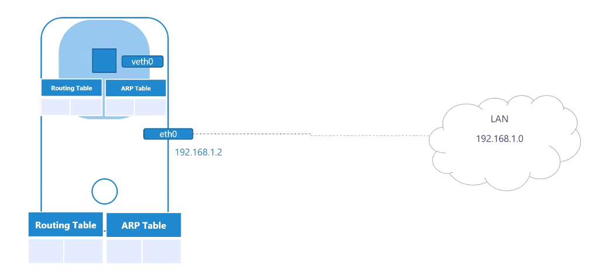
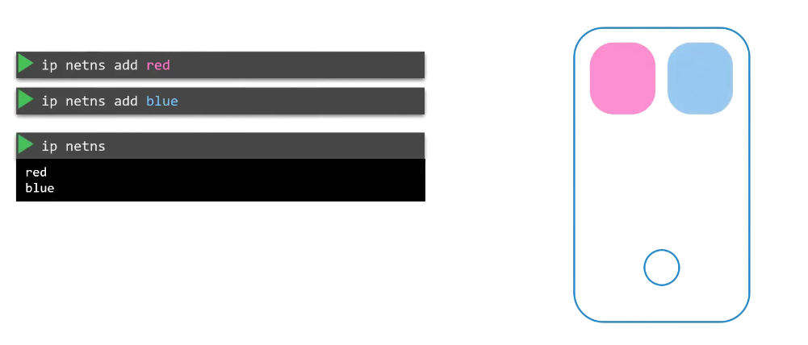
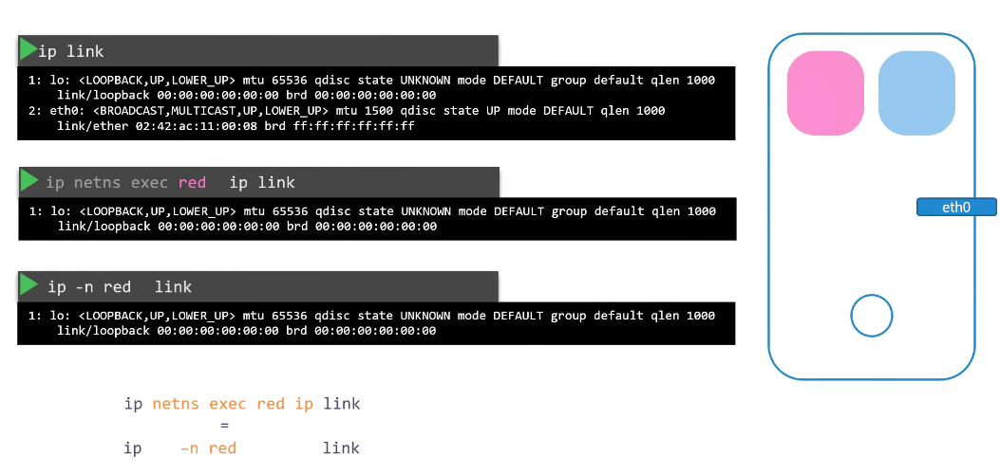
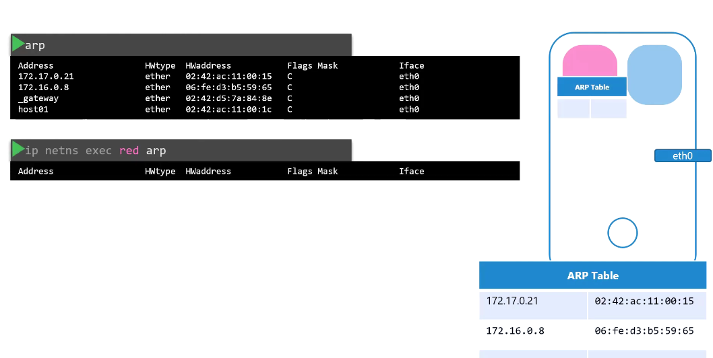
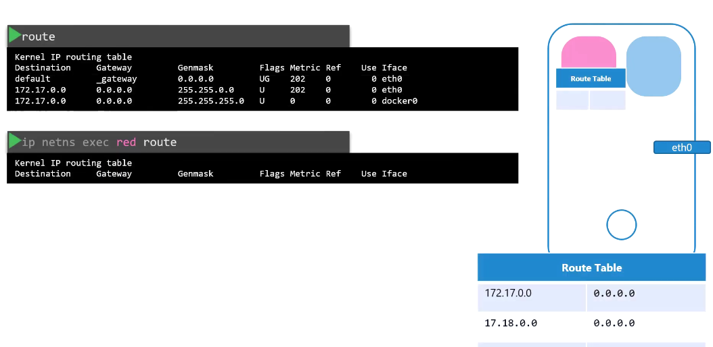
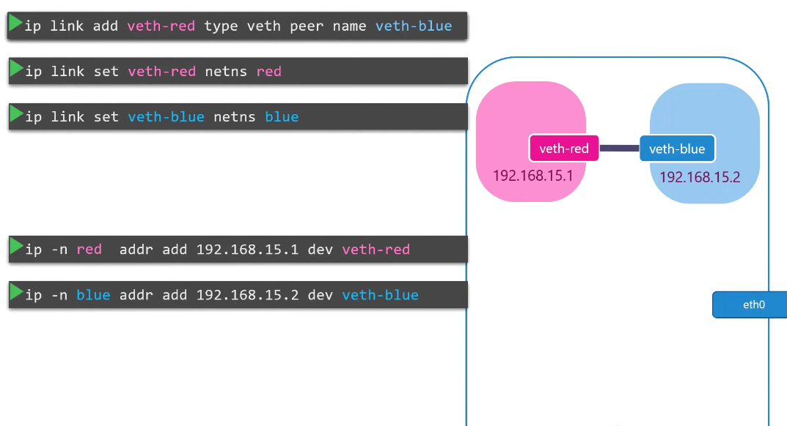
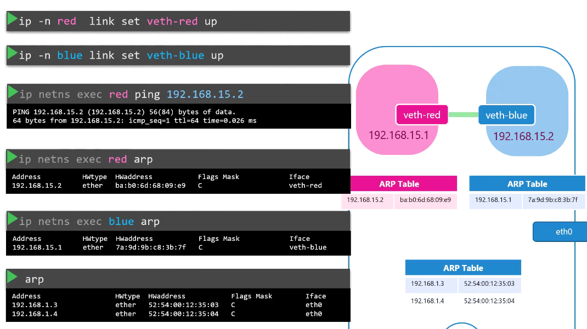
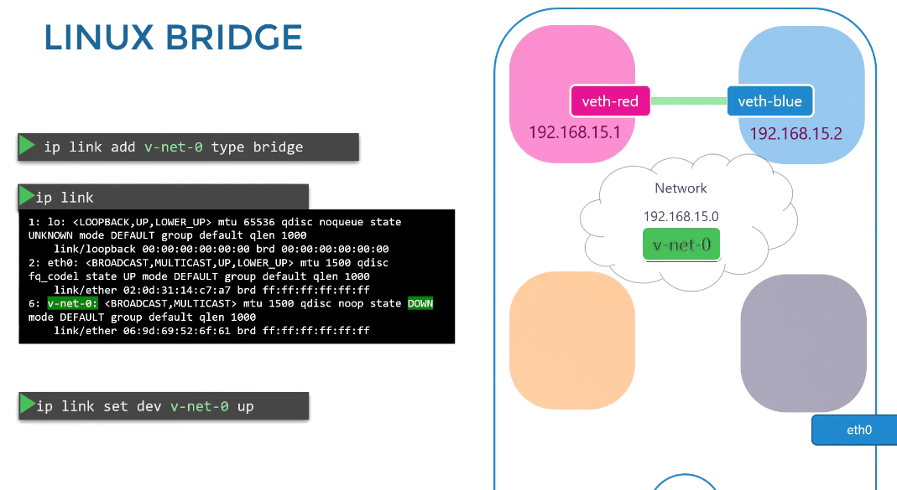
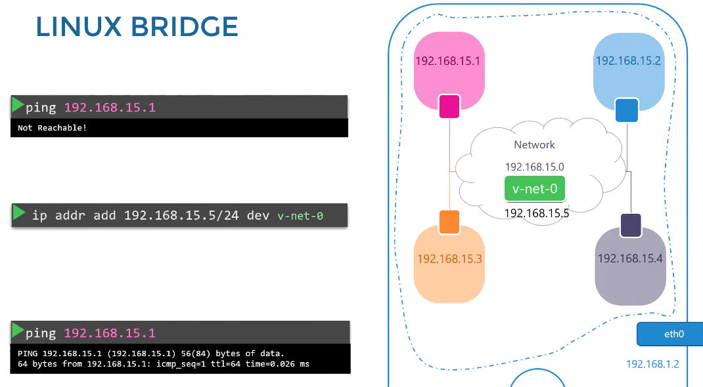

Bridge:





# 🌐 Deep Dive: Docker & Linux Network Namespaces

---

## 1️⃣ What Is a Network Namespace?

- A **network namespace** is an isolated copy of all network-related constructs:

  - Interfaces (`eth0`, `lo`)
  - IP addresses and routing tables
  - Network stack (TCP/UDP ports)
  - Sockets, ARP tables, firewall rules

Each container gets its own network namespace by default — it “thinks” it’s running its own network.

You can have multiple network namespaces side by side on one host.

---

## 2️⃣ veth Pairs — The Tunnel Between Namespaces

To connect the container’s network namespace to the host’s or bridge namespace, Docker uses a **virtual Ethernet pair (veth pair)**:

- A veth pair acts like two ends of a virtual cable:

  - End A in container namespace (e.g. `eth0`)
  - End B in host namespace (e.g. `vethXYZ`)

- Packets entering one end come out the other.

So when container `eth0` sends a packet, it travels via the host-side veth and then onward (bridge, IP routing, nat, etc.)

Visual:

```
[Container Namespace]       [Host Namespace]
     eth0 ───> veth0        veth1 ───> bridge/docker0
```

---

## 3️⃣ Docker’s Default Bridge Network

By default, Docker uses a **bridge network** called `docker0`:

- A Linux bridge acts like a virtual switch.
- The host attaches veth ends from containers to `docker0`.
- IP forwarding and NAT allow containers to talk out to external networks.

Flow:

1. Container sends packet (source IP = container IP) via `eth0`.
2. Packet via veth to host.
3. Host sees the packet on bridge `docker0`.
4. Host’s iptables NAT MASQUERADE changes source IP to host’s interface IP.
5. Packet goes out to the external network.
6. Return traffic is NATed back and delivered to container.

---

## 4️⃣ Port Mapping / NAT (Host ↔ Container)

When you do:

```bash
docker run -p 8080:80 nginx
```

This sets up forwarding:

- Host listens on port 8080 (on all/selected interfaces).
- Through iptables `PREROUTING` rules, incoming traffic to host:8080 is redirected to container’s `:80` inside container namespace.
- The container sees the connection as local to it on port 80.

Packet path:

1. Client → Host:8080
2. iptables DNAT (destination NAT) → container-ip:80
3. Packet delivered inside container
4. Container responds (source = container ip) → host
5. iptables SNAT / MASQUERADE rewrites source to host IP
6. Response delivered to client

---

## 5️⃣ Network Modes in Docker & Their Differences

Docker supports multiple network drivers / modes — each builds on namespace concepts:

| Mode                                   | Behavior                                                                           | Use Cases                               |
| -------------------------------------- | ---------------------------------------------------------------------------------- | --------------------------------------- |
| **bridge** (default)                   | Each container in its own net namespace, connected via host bridge, NAT to outside | General use, isolation                  |
| **host**                               | Container shares **host network namespace** (no veth, no NAT)                      | High-performance (no NAT latency)       |
| **none**                               | Container has network namespace but no interfaces except loopback                  | Pure isolation, no connectivity         |
| **overlay / swarm / macvlan / ipvlan** | Over multiple hosts, or direct access to host NIC                                  | Clusters, high performance, L2 networks |

---

## 6️⃣ Walkthrough: Packet Journey (Host → Container)

Let’s step through a full flow when someone from outside reaches a container running `-p`:

```mermaid
sequenceDiagram
    participant Client as External Client
    participant Hostnet as Host Network Stack
    participant Iptables as NAT / iptables
    participant Bridge as docker0 bridge
    participant Veth as veth pair
    participant ContNet as Container’s Namespace
    Client->>Hostnet: TCP connect Host:8080
    Hostnet->>Iptables: PREROUTING rule matched → DNAT to container IP:80
    Iptables->>Bridge: packet appears on `docker0`
    Bridge->>Veth: packet forwarded to the veth interface linked to container
    Veth->>ContNet: arrives at container’s `eth0`
    ContNet->>Container: delivered to process listening on port 80
    Container->>ContNet: Response packet from port 80
    ContNet->>Veth: leaves via container’s veth
    Veth->>Bridge: enters host bridge
    Bridge->>Hostnet: into host stack
    Hostnet->>Iptables: SNAT / MASQUERADE applied
    Hostnet->>Client: response delivered
```

At each hop:

- Outside → Host’s network stack
- NAT translation on arrival
- Bridge switching inside the host
- veth connects into container
- Response goes reverse path

---

## 7️⃣ DNS & Container Name Resolution

- Each container gets an `/etc/hosts` and `/etc/resolv.conf` to control name lookup.
- Docker injects entries for container names in same network.
- DNS requests from container go via container’s DNS settings configured by Docker (e.g., embedded DNS in Docker daemon or upstream).

---

## 8️⃣ Advanced: iptables Chains for Docker Networking

Docker configures these iptables chains automatically:

- `DOCKER-USER` — allows user to insert custom rules before Docker’s rules
- `DOCKER` — main chain for NAT forwarding
- `DOCKER-ISOLATION-STAGE-1` / `-2` — isolate multiple bridge networks
- `DOCKER-INGRESS` / `DOCKER-ROUTER` — used in swarm / overlay mode

Specifically:

- `nat` table:

  - `PREROUTING` for incoming traffic
  - `POSTROUTING` for outgoing NAT / MASQUERADE

- `filter` table:

  - `FORWARD` to allow forwarding between interfaces

You can see rules with:

```bash
iptables -t nat -L
iptables -L FORWARD
```

---

## 9️⃣ Overlay / Multi-Host Networking (Brief)

In Swarm or Kubernetes, containers across hosts connect using **overlay networks**:

- Docker or orchestration tool runs a **vxlan** or **Geneve** overlay.
- Each host has a **bridge / veth** inside namespace, and overlay encapsulates container traffic across hosts.
- Traffic between containers on different hosts is encrypted (or optionally so) and de/encapsulated at edges.

This extends network namespaces across hosts.

---

## 1️⃣0️⃣ Summary — Key Concepts

| Concept                  | Description                                        |
| ------------------------ | -------------------------------------------------- |
| **Net Namespace**        | Isolated network view per container                |
| **veth Pair**            | Virtual cable between container and host           |
| **Bridge**               | Virtual switch inside host (docker0)               |
| **NAT / DNAT / SNAT**    | Mapping external ports to internal container ports |
| **Docker Network Modes** | bridge, host, none, overlay, macvlan               |
| **iptables Chains**      | Docker’s automatic NAT / forwarding rules          |
| **Overlay Networking**   | Multi-host container networking with encapsulation |

---

Would you like me to turn this into a **step-by-step lab** (commands + diagrams) where you can try creating your own net namespaces and veth pairs manually — and then compare with what Docker does under the hood?
