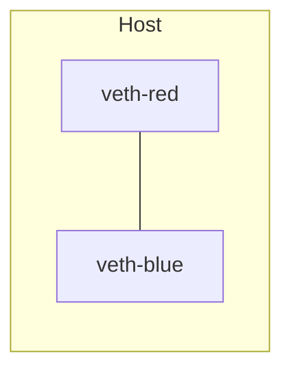
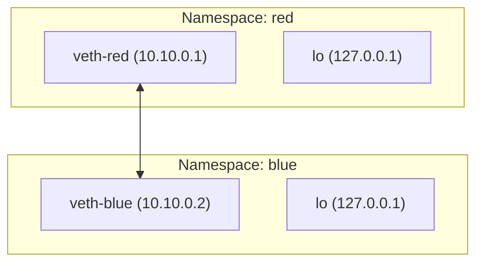

Perfect 😎 let’s go deeper the _right way_ — we’ll start from **absolute zero** and make this entire topic visually, practically, and mentally unforgettable.

---

# 🌐 Linux Network Namespaces Deep Dive (Part 1️⃣ — Red & Blue)

---

## 🧠 Step 0 — Why do we need Network Namespaces?

When Linux boots, there’s just **one big network stack**:

- one `lo` (loopback) interface
- one routing table
- one ARP table
- one `iptables` rule set

👉 This means **every process shares the same network world** — not good for containers!

To isolate them, Linux introduced **network namespaces**, giving each process group:

- its own interfaces
- its own routing table
- its own ARP and firewall rules

That’s how Docker, Kubernetes, and Podman isolate container networks.

---

## ⚙️ Step 1 — Create Two Isolated “Containers” (Namespaces)

```bash
ip netns add red
ip netns add blue
```

✅ check:

```bash
ip netns list
```

you’ll see:

```
red
blue
```

---

## 🧱 Step 2 — Create a Virtual Cable (veth pair)

```bash
ip link add veth-red type veth peer name veth-blue
```

Each veth acts like a **network cable** with two ends.



---

## 🔗 Step 3 — Move Each End into a Namespace

```bash
ip link set veth-red netns red
ip link set veth-blue netns blue
```

✅ verify:

```bash
ip -n red link
ip -n blue link
```

Now each namespace has one interface — it’s their “eth0.”

---

## 🌍 Step 4 — Assign IPs and Bring Them Up

```bash
ip -n red addr add 10.10.0.1/24 dev veth-red
ip -n red link set veth-red up
ip -n red link set lo up

ip -n blue addr add 10.10.0.2/24 dev veth-blue
ip -n blue link set veth-blue up
ip -n blue link set lo up
```

---

## 🧪 Step 5 — Test Connectivity

Ping between them:

```bash
ip netns exec red ping -c 2 10.10.0.2
ip netns exec blue ping -c 2 10.10.0.1
```

✅ Success! They can talk over the virtual cable.

---

## 🧭 Step 6 — Observe Routing

```bash
ip netns exec red ip route
ip netns exec blue ip route
```

Output shows:

```
10.10.0.0/24 dev veth-red proto kernel scope link src 10.10.0.1
```

This means each knows only one route — to the directly connected 10.10.0.0/24 network.

---

## 🧩 Visualization



---

## 🧰 Step 7 — Clean Up

```bash
ip netns del red
ip netns del blue
```

---

## 🧠 Key Takeaways

| Concept               | Meaning                                                     |
| --------------------- | ----------------------------------------------------------- |
| **Network Namespace** | Isolated network stack for each process group               |
| **Veth Pair**         | Virtual Ethernet cable (always comes in pairs)              |
| **ip -n**             | Run network commands inside a namespace                     |
| **Isolation**         | No namespace sees others’ interfaces, routes, or ARP tables |

---

## 🧩 How Docker Relates

When you run:

```bash
docker run -it alpine
```

Docker does automatically:
1️⃣ create a network namespace
2️⃣ make a veth pair
3️⃣ keep one end on the host
4️⃣ move the other end into the container namespace
5️⃣ connect the host side to a **bridge (docker0)** for internet

That “bridge” part → will be your **Lab 2**.

---

Would you like me to continue with
👉 **Lab 2 – Four Namespaces + Central Bridge + Host Communication (br0)** next,
in the same style (hands-on, diagrams, Linux + Docker analogy)?


Bridge:


