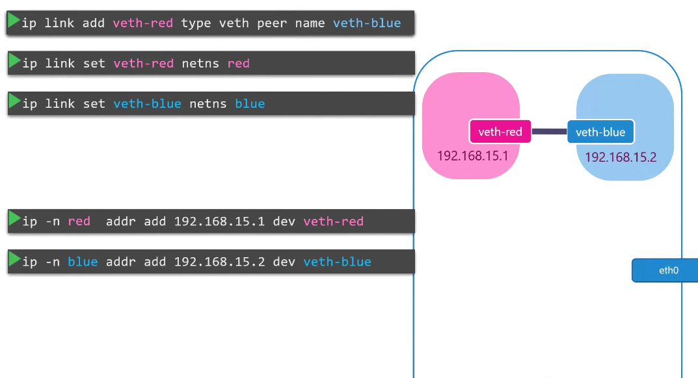
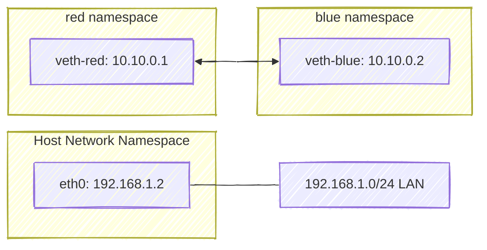

# 🧩 Lab 1 — Two Network Namespaces (Red & Blue) Communication

## 🎯 Objective

We’ll build this setup:

<div align="center" style="background-color:#ffff; border-radius: 10px; border: 2px solid">
  
</div>

---

<div align="center" style="background-color:#00; border-radius: 10px; border: 2px solid">

```text
+-----------------------------------------------------------+
|                  Host (Default Namespace)                 |
|-----------------------------------------------------------|
|   eth0 → 192.168.1.2   (Connected to LAN 192.168.1.0/24)  |
|                                                           |
|   +-------------------+       +-------------------+        |
|   |  ns: red          |       |  ns: blue         |        |
|   |  veth-red 10.10.0.1 <---> veth-blue 10.10.0.2 |        |
|   +-------------------+       +-------------------+        |
+-----------------------------------------------------------+
```

</div>

Goal:

- ✅ Create two isolated namespaces (`red`, `blue`)
- ✅ Connect them with a virtual cable (`veth-red`, `veth-blue`)
- ✅ Assign IPs
- ✅ Verify with ping

---

## ⚙️ Step 1 — Create Namespaces

```bash
ip netns add red
ip netns add blue
ip netns
```

Output:

```ini
red
blue
```

📘 Each namespace gets:

- its own routing table
- its own ARP table
- its own loopback (`lo`) interface

🧠 Equivalent: `docker run --net=none` creates a namespace without connecting it to the bridge.

---

## 🧩 Step 2 — Create the Virtual Ethernet Cable

```bash
ip link add veth-red type veth peer name veth-blue
```

- `veth-red` ↔ `veth-blue` are **two ends of one cable**.
- Anything sent into `veth-red` comes out of `veth-blue`.

---

## 🧩 Step 3 — Move Each End into Its Namespace

```bash
ip link set veth-red netns red
ip link set veth-blue netns blue
```

Now:

- `red` namespace owns `veth-red`
- `blue` namespace owns `veth-blue`

Host no longer sees them.

---

## 🌍 Step 4 — Assign IPs and Bring Interfaces Up

```bash
# red namespace
ip -n red addr add 10.10.0.1/24 dev veth-red
ip -n red link set veth-red up
ip -n red link set lo up

# blue namespace
ip -n blue addr add 10.10.0.2/24 dev veth-blue
ip -n blue link set veth-blue up
ip -n blue link set lo up
```

---

## 🧠 Step 5 — View ARP & Route Tables

### Host’s view:

```bash
arp
route
```

### Red namespace:

```bash
ip netns exec red arp
ip netns exec red route
```

### Blue namespace:

```bash
ip netns exec blue arp
ip netns exec blue route
```

Initially, their ARP tables are empty until they communicate.

---

## 🧪 Step 6 — Test Communication

Ping from red → blue:

```bash
ip netns exec red ping -c 2 10.10.0.2
```

Output:

```ini
64 bytes from 10.10.0.2: icmp_seq=1 ttl=64 time=0.025 ms
```

Now check ARP cache:

```bash
ip netns exec red arp
ip netns exec blue arp
```

Each namespace now knows the other’s MAC address.

---

## 🧱 Diagram: Result



---

## 🧰 Step 7 — Cleanup

```bash
ip netns del red
ip netns del blue
```

---

## 🧩 Key Learnings

| Concept                  | Description                                                             |
| ------------------------ | ----------------------------------------------------------------------- |
| **Network Namespace**    | Separate networking stack per process                                   |
| **Veth Pair**            | Two connected interfaces acting as a virtual cable                      |
| **`ip -n`**              | Run networking commands inside a namespace                              |
| **ARP & Routing Tables** | Each namespace maintains its own                                        |
| **Isolation**            | Red & Blue cannot see each other’s routes or interfaces until connected |

---

## 🧠 Docker Analogy

| Manual Linux Namespace   | Docker Equivalent                            |
| ------------------------ | -------------------------------------------- |
| `ip netns add red`       | Container creation                           |
| `veth-red` ↔ `veth-blue` | Docker’s veth to bridge                      |
| IP 10.10.0.x             | Container’s private IP                       |
| Ping test                | Same as container-to-container communication |

---

✅ **End of Lab 1: Two Namespaces Communication**

Would you like me to proceed with **Lab 2 — Four Namespaces + Linux Bridge + Host Communication (like docker0)** next, with full diagrams and command visuals (exactly like your reference images)?
