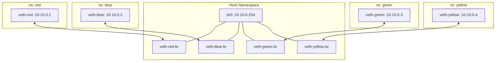

# 🧩 Lab 2 — Four Namespaces + Central Linux Bridge (br0) + Host Communication

## 🎯 Objective

We’ll create 4 isolated namespaces (like 4 containers), all connected to a **bridge (br0)**.
That bridge will let:  
✅ All namespaces communicate with each other  
✅ The host communicate with all namespaces

---

## 🧱 Topology Overview

<div align="center" style="background-color:#00; border-radius: 10px; border: 2px solid">

```text
                   +-----------------------+
                   |   Host (default ns)   |
                   |-----------------------|
                   | br0: 10.10.0.254/24   |
                   |                       |
                   +----------+------------+
                              |
          --------------------------------------------------
          |            |            |            |
       veth-red     veth-blue   veth-green   veth-yellow
          |            |            |            |
    +-----------+ +-----------+ +-----------+ +-----------+
    | red ns    | | blue ns   | | green ns  | | yellow ns |
    | 10.10.0.1 | | 10.10.0.2 | | 10.10.0.3 | | 10.10.0.4 |
    +-----------+ +-----------+ +-----------+ +-----------+
```

</div>

All 4 “containers” are in the **10.10.0.0/24** network.

---

## 🧠 What’s a Linux Bridge?

A **bridge** is like a **virtual switch**:

- It forwards packets between interfaces in the same broadcast domain (Layer 2)
- The kernel maintains an internal MAC address table (like a switch)
- Docker creates one by default (`docker0`)

We’ll make our own bridge: `br0`.

---

## ⚙️ Step 1 — Create the Bridge on Host

```bash
ip link add name br0 type bridge
ip addr add 10.10.0.254/24 dev br0
ip link set br0 up
```

✅ Check:

```bash
ip addr show br0
```

Output should show:

```ini
3: br0: <BROADCAST,MULTICAST,UP,LOWER_UP> ...
    inet 10.10.0.254/24 scope global br0
```

---

## ⚙️ Step 2 — Create Four Network Namespaces

```bash
for ns in red blue green yellow; do
  ip netns add $ns
done

ip netns
```

Output:

```ini
red
blue
green
yellow
```

---

## ⚙️ Step 3 — Create veth Pairs (Cables) for Each Namespace

Each namespace gets one end of a veth pair; the other end goes into the bridge.

```bash
ip link add veth-red type veth peer name veth-red-br
ip link add veth-blue type veth peer name veth-blue-br
ip link add veth-green type veth peer name veth-green-br
ip link add veth-yellow type veth peer name veth-yellow-br
```

---

## ⚙️ Step 4 — Move One End into Each Namespace

```bash
ip link set veth-red netns red
ip link set veth-blue netns blue
ip link set veth-green netns green
ip link set veth-yellow netns yellow
```

✅ Host still has `veth-*-br` ends, which we’ll now attach to the bridge.

---

## ⚙️ Step 5 — Connect Host Ends to the Bridge

```bash
ip link set veth-red-br master br0
ip link set veth-blue-br master br0
ip link set veth-green-br master br0
ip link set veth-yellow-br master br0
```

Bring them all up:

```bash
for i in red blue green yellow; do
  ip link set veth-${i}-br up
done
```

---

## ⚙️ Step 6 — Assign IPs Inside Each Namespace

```bash
ip -n red addr add 10.10.0.1/24 dev veth-red
ip -n blue addr add 10.10.0.2/24 dev veth-blue
ip -n green addr add 10.10.0.3/24 dev veth-green
ip -n yellow addr add 10.10.0.4/24 dev veth-yellow

for ns in red blue green yellow; do
  ip -n $ns link set lo up
  ip -n $ns link set veth-$ns up
done
```

---

## 🧠 Step 7 — Test Connectivity

Ping from host → namespaces:

```bash
ping -c 1 10.10.0.1
ping -c 1 10.10.0.4
```

Ping from red → blue:

```bash
ip netns exec red ping -c 2 10.10.0.2
```

✅ They all can communicate because the bridge connects them at Layer 2.

---

## 🧱 Visual Diagram



---

## 🧩 Step 8 — Verify Bridge Connections

```bash
bridge link
```

Output will show all `veth-*-br` interfaces attached to `br0`.

---

## 🧠 Step 9 — Enable Host ↔ Namespace Communication

The host is already in the same subnet (`10.10.0.254/24`), so it can talk directly with all namespaces.

Example:

```bash
ping -c 2 10.10.0.1  # Host → red
ping -c 2 10.10.0.3  # Host → green
```

---

## 🧰 Step 10 — Cleanup

```bash
ip link del br0
for ns in red blue green yellow; do
  ip netns del $ns
done
```

---

## 🧠 Key Concepts Recap

| Concept                | Description                                       |
| ---------------------- | ------------------------------------------------- |
| **Bridge (br0)**       | Virtual Layer 2 switch connecting interfaces      |
| **Veth Pair**          | Cable between namespace and bridge                |
| **Host Participation** | Assign IP to `br0` so host joins the same network |
| **Communication**      | All namespaces + host share same subnet           |

---

## 🧩 Analogy to Docker Networking

| Manual Setup            | Docker Equivalent                         |
| ----------------------- | ----------------------------------------- |
| br0                     | docker0                                   |
| veth-\*-br              | veth created by Docker for each container |
| Namespace (red/blue)    | Container network namespace               |
| 10.10.0.x IPs           | Container IPs                             |
| Ping between containers | Container inter-communication             |

---

✅ **End of Lab 2: Multi-Namespace Bridge Network**

Would you like to continue with **Lab 3 — Another Host (192.168.1.3) communicating with this 10.10.x network** next (we’ll add routing and NAT between two hosts)?
