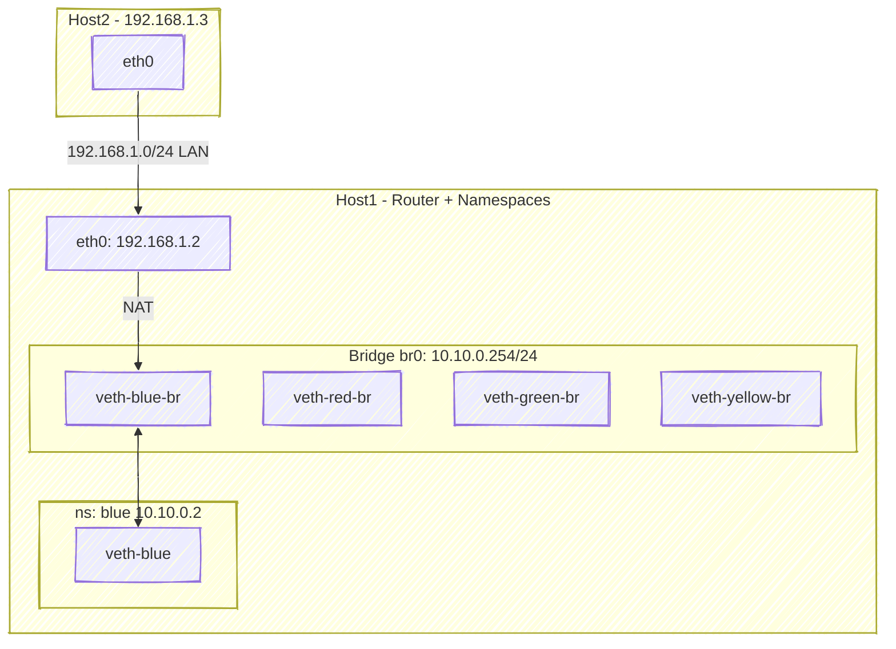

# 🧩 Lab 3 — Connecting Namespace Network (10.10.0.0/24) to External Host (192.168.1.3)

## 🎯 Objective

We want two-way communication:

| Direction    | Description                                                              | Example            |
| ------------ | ------------------------------------------------------------------------ | ------------------ |
| **Outbound** | From namespace (e.g., blue: `10.10.0.2`) → external host (`192.168.1.3`) | `ping 192.168.1.3` |
| **Inbound**  | From external host (`192.168.1.3`) → namespace (`10.10.0.2`)             | `ping 10.10.0.2`   |

---

## 🧱 Network Topology

```text
        +----------------------------------------------------------+
        |                      Host1 (Docker Host)                 |
        |----------------------------------------------------------|
        | eth0: 192.168.1.2/24  (LAN interface)                    |
        | br0: 10.10.0.254/24 (Bridge)                             |
        | NAT: 10.10.0.0/24 -> 192.168.1.2                         |
        +-----------+----------------------------------------------+
                    |
      -----------------------------(LAN)------------------------------
                    |
        +-------------------------------------------+
        |         Host2 (Client / External)         |
        | eth0: 192.168.1.3/24                      |
        +-------------------------------------------+

Namespaces under Host1:
  red:   10.10.0.1
  blue:  10.10.0.2
  green: 10.10.0.3
  yellow:10.10.0.4
```

---

## 🧠 Conceptual Flow

| Case                        | What Happens                                           | Requires                        |
| --------------------------- | ------------------------------------------------------ | ------------------------------- |
| **Outbound (Blue → Host2)** | Blue sends packet via bridge → Host1 → eth0 → Host2    | Host1 does NAT (masquerade)     |
| **Inbound (Host2 → Blue)**  | Host2 sends to 192.168.1.2 → Host1 routes to 10.10.0.2 | Requires port forwarding (DNAT) |

---

## ⚙️ Step 1 — Confirm Host1’s Interface IPs

```bash
ip addr show eth0
ip addr show br0
```

Expected:

```ini
eth0: 192.168.1.2/24
br0:  10.10.0.254/24
```

---

## ⚙️ Step 2 — Enable IP Forwarding on Host1

This allows packets to _pass through_ Host1 (just like a router).

```bash
sysctl -w net.ipv4.ip_forward=1
```

Make it permanent:

```bash
echo "net.ipv4.ip_forward = 1" >> /etc/sysctl.conf
```

---

## ⚙️ Step 3 — Configure Default Route in Each Namespace

Tell namespaces that their gateway is the bridge (`10.10.0.254`).

```bash
ip -n red route add default via 10.10.0.254
ip -n blue route add default via 10.10.0.254
ip -n green route add default via 10.10.0.254
ip -n yellow route add default via 10.10.0.254
```

✅ Test:

```bash
ip netns exec blue ip route
```

Should show:

```ini
default via 10.10.0.254 dev veth-blue
10.10.0.0/24 dev veth-blue proto kernel scope link src 10.10.0.2
```

---

## 🧠 Step 4 — Outbound Communication (Blue → Host2)

We’ll use **NAT (masquerading)** on Host1 so packets from 10.10.0.x can go out via eth0.

### 4.1 Add iptables NAT Rule on Host1

```bash
iptables -t nat -A POSTROUTING -s 10.10.0.0/24 -o eth0 -j MASQUERADE
```

✅ This hides the internal IP (10.10.0.2) and replaces it with Host1’s public IP (192.168.1.2).

So when Blue pings Host2:

1. Blue (10.10.0.2) → sends packet to 10.10.0.254 (gateway)
2. Host1 NATs it → source becomes 192.168.1.2
3. Host2 replies to 192.168.1.2
4. Host1 un-NATs and forwards reply to Blue

### 4.2 Test Outbound

From inside blue namespace:

```bash
ip netns exec blue ping -c 2 192.168.1.3
```

✅ Expected: Successful reply!

---

## 🧩 Step 5 — Inbound Communication (Host2 → Blue Namespace)

Outbound worked because of NAT — but **inbound requires DNAT** (port forwarding).

Let’s forward packets from Host1’s IP:Port → Blue’s internal IP.

Example: allow SSH (port 2222 external → 22 internal)

```bash
iptables -t nat -A PREROUTING -p tcp -d 192.168.1.2 --dport 2222 \
  -j DNAT --to-destination 10.10.0.2:22
iptables -A FORWARD -p tcp -d 10.10.0.2 --dport 22 -j ACCEPT
```

Now from **Host2 (192.168.1.3)**:

```bash
ssh -p 2222 user@192.168.1.2
```

✅ You’ll connect to SSH server running inside Blue namespace (10.10.0.2:22).

---

## ⚙️ Step 6 — Test Inbound Ping (Optional with Static Route)

For ICMP (ping), DNAT is trickier.
You can either:

- Add a static route in Host2, or
- Keep using NAT for TCP/UDP access

To allow raw ping **without NAT**, you’d need Host2 to know 10.10.0.0/24 exists behind Host1.

On Host2:

```bash
ip route add 10.10.0.0/24 via 192.168.1.2
```

✅ Now, direct pings work both ways:

```bash
ping -c 2 10.10.0.2  # From Host2
```

---

## 🧠 Deep Dive: Packet Flow

### 🔹 Outbound (Blue → Host2)

```text
[10.10.0.2] ──► [br0 10.10.0.254] ──► NAT (to 192.168.1.2) ──► [Host2 192.168.1.3]
```

Return path:

```ini
[Host2 192.168.1.3] ──► [192.168.1.2] ──► Un-NAT → [10.10.0.2]
```

### 🔹 Inbound (Host2 → Blue)

If DNAT rule added:

```text
192.168.1.3:2222 → 192.168.1.2:2222 (PREROUTING)
     ↓
DNAT → 10.10.0.2:22 → Blue namespace
```

---

## 🧩 Diagram — Full Setup



---

## 🧩 Step 7 — Verify Everything

| Test               | Command                               | Expected    |
| ------------------ | ------------------------------------- | ----------- |
| Outbound from Blue | `ip netns exec blue ping 192.168.1.3` | ✅ replies  |
| Inbound via NAT    | `ssh -p 2222 user@192.168.1.2`        | ✅ connects |
| Inbound via route  | `ping 10.10.0.2` (after static route) | ✅ replies  |

---

## 💡 Summary Table

| Action                        | Mechanism                      | Tool                                        |
| ----------------------------- | ------------------------------ | ------------------------------------------- |
| Namespaces → Host → LAN       | Source NAT (MASQUERADE)        | `iptables -t nat -A POSTROUTING`            |
| Host → Namespace              | Destination NAT (Port forward) | `iptables -t nat -A PREROUTING`             |
| Host2 → Namespace (direct IP) | Static route                   | `ip route add 10.10.0.0/24 via 192.168.1.2` |
| Routing between br0 ↔ eth0    | IP forwarding                  | `sysctl -w net.ipv4.ip_forward=1`           |

---

## 🔥 Key Takeaways

- **Namespaces are isolated**, but you can “connect” them using Linux networking primitives.
- **Bridge acts as Layer 2 switch**.
- **IP forwarding** turns the host into a router.
- **NAT (MASQUERADE)** enables outbound traffic.
- **DNAT + Forwarding** enables inbound traffic.
- **Static routes** allow direct reachability without NAT.

---

Would you like me to continue with **Lab 4 — Connecting Internet (External WAN) to namespaces via NAT (real outbound Internet access)** next?
