awesome — here’s your **Enhanced Structured Topic** on container networking with a **Full Deep Dive**: we’ll learn concepts, then build the whole thing by hand (like Docker does), observe packets, and map each step to Docker’s behavior. one clear tune throughout.

---

# 🌐 Docker Networking Deep Dive: Linux Network Namespaces

> goal: understand and *feel* how containers get isolated networks, IPs, DNS, internet access, and published ports — by creating all of it manually with `ip netns`, `veth`, a bridge, and NAT — then map to Docker.

---

## 🧠 Concept (what & why)

* **Network Namespace (netns)**: an isolated network stack: its own interfaces (`eth0`, `lo`), routes, ARP table, iptables/nft rules, and socket space. Each container runs in its own netns.
* **veth pair**: virtual Ethernet cable with two ends. Frames entering one end emerge from the other.
* **Bridge** (like `docker0`): a virtual L2 switch in the host that interconnects container veths.
* **Routing + NAT**:

  * **SNAT/MASQUERADE**: lets private container IPs reach the internet using the host’s public IP.
  * **DNAT/port-publish**: maps `host:port` → `container_ip:port` (what `-p` does).

---

## 🧱 Topology We’ll Build (by hand)

```mermaid
---
config:
  look: handDrawn
  theme: dark
---
flowchart LR
  subgraph Host
    BR[br0 172.18.0.1/16]
    V1[veth-ct1]
    V2[veth-ct2]
    UPLINK[(ethX -> internet)]
  end
  subgraph ct1(netns)
    E1[eth0 172.18.0.11/16]
    LO1[lo]
  end
  subgraph ct2(netns)
    E2[eth0 172.18.0.12/16]
    LO2[lo]
  end

  V1 --- BR
  V2 --- BR
  E1 --- V1
  E2 --- V2
  BR --- UPLINK
```

* **ct1** and **ct2** are our “containers” (just net namespaces).
* both connect to host bridge **br0** via **veth**.
* **br0** routes out via host uplink **ethX** (your real NIC) using **NAT**.

---

## ⚙️ Hands-On Lab (do it yourself)

> run as root or prefix `sudo`. replace `ethX` with your real uplink (e.g., `eth0`, `enp0s3`, …).

### 1) Create namespaces

```bash
ip netns add ct1
ip netns add ct2
ip netns list      # verify
```

### 2) Create a host bridge (like docker0)

```bash
ip link add name br0 type bridge
ip addr add 172.18.0.1/16 dev br0
ip link set br0 up
```

### 3) Create veth pairs & attach to bridge / namespaces

```bash
# ct1
ip link add veth-ct1 type veth peer name veth-ct1-ns
ip link set veth-ct1 up
ip link set veth-ct1 master br0
ip link set veth-ct1-ns netns ct1

# ct2
ip link add veth-ct2 type veth peer name veth-ct2-ns
ip link set veth-ct2 up
ip link set veth-ct2 master br0
ip link set veth-ct2-ns netns ct2
```

### 4) Configure interfaces inside each namespace

```bash
# ct1
ip -n ct1 link set lo up
ip -n ct1 link set veth-ct1-ns name eth0
ip -n ct1 addr add 172.18.0.11/16 dev eth0
ip -n ct1 link set eth0 up
ip -n ct1 route add default via 172.18.0.1

# ct2
ip -n ct2 link set lo up
ip -n ct2 link set veth-ct2-ns name eth0
ip -n ct2 addr add 172.18.0.12/16 dev eth0
ip -n ct2 link set eth0 up
ip -n ct2 route add default via 172.18.0.1
```

### 5) Verify L2/L3 connectivity (container ↔ container)

```bash
ip netns exec ct1 ping -c2 172.18.0.12
ip netns exec ct2 ping -c2 172.18.0.11
```

### 6) Enable internet egress (SNAT/MASQUERADE)

```bash
# enable IP forwarding
sysctl -w net.ipv4.ip_forward=1

# NAT out of your uplink (replace ethX)
iptables -t nat -A POSTROUTING -s 172.18.0.0/16 -o ethX -j MASQUERADE
iptables -A FORWARD -i ethX -o br0 -m state --state RELATED,ESTABLISHED -j ACCEPT
iptables -A FORWARD -i br0 -o ethX -j ACCEPT
```

test from ct1:

```bash
ip netns exec ct1 ping -c2 8.8.8.8
ip netns exec ct1 curl -I https://example.com
```

> nftables users: set equivalent `masquerade` and `forward` rules in the `nat` and `forward` chains.

### 7) DNS inside namespaces

```bash
ip netns exec ct1 bash -lc 'printf "nameserver 1.1.1.1\n" > /etc/resolv.conf'
ip netns exec ct2 bash -lc 'printf "nameserver 1.1.1.1\n" > /etc/resolv.conf'

ip netns exec ct1 dig +short example.com
```

### 8) Publish a port: host:8080 → ct1:80 (DNAT + FORWARD)

run a tiny server in ct1:

```bash
ip netns exec ct1 python3 -m http.server 80 >/dev/null 2>&1 &
```

port-publish on host (DNAT):

```bash
iptables -t nat -A PREROUTING -p tcp --dport 8080 -j DNAT --to-destination 172.18.0.11:80
iptables -A FORWARD -p tcp -d 172.18.0.11 --dport 80 -j ACCEPT
iptables -A FORWARD -p tcp -s 172.18.0.11 --sport 80 -j ACCEPT
```

test:

```bash
curl -i http://127.0.0.1:8080/
```

---

## 🧩 Packet Flow (visuals you can picture)

### a) container → internet (SNAT/MASQUERADE)


### b) host:8080 → container:80 (DNAT/publish)

```mermaid
sequenceDiagram
  autonumber
  participant Client as external client
  participant Host as host:8080
  participant DNAT as iptables PREROUTING DNAT
  participant Br as br0
  participant C as ct1:80
  Client->>Host: TCP SYN host:8080
  Host->>DNAT: DNAT → 172.18.0.11:80
  DNAT->>Br: forward via bridge
  Br->>C: deliver to ct1 eth0:80
  C-->>Client: SYN/ACK (reverse path, SNAT on egress)
```



---

## 🔬 Observe It Live (tcpdump)

* on the bridge:

```bash
tcpdump -i br0 -nn "tcp port 80 or port 8080"
```

* inside ct1:

```bash
ip netns exec ct1 tcpdump -i eth0 -nn tcp port 80
```

you’ll see DNAT’d arrivals at `172.18.0.11:80` and SNAT on replies.

---

## 🧱 Behind the Scenes (how Docker mirrors this)

| our manual step                     | what Docker does automatically                                  |
| ----------------------------------- | --------------------------------------------------------------- |
| `ip netns add`                      | creates a network namespace per container                       |
| `ip link add veth …` + move into ns | creates veth pair and moves one end into container ns           |
| `bridge br0` 172.18.0.1/16          | creates `docker0` (usually 172.17.0.1/16)                       |
| set IPs/routes in ns                | configures `eth0` via libnetwork                                |
| enable IP forwarding + MASQUERADE   | writes iptables/nft rules (chains like `DOCKER`, `DOCKER-USER`) |
| DNAT 8080→80                        | `docker run -p 8080:80 image`                                   |
| resolv.conf in netns                | injects resolver entries / embedded DNS                         |

inspect docker’s rules any time:

```bash
iptables -t nat -L DOCKER -n --line-numbers
iptables -L FORWARD -n
docker network inspect bridge
```

---

## 🧭 Troubleshooting (common gotchas)

* **no internet from containers**

  * `sysctl net.ipv4.ip_forward` must be `1`.
  * MASQUERADE must target correct **uplink** (`-o ethX`).
  * check `FORWARD` policy and rules allow `br0`↔`ethX`.

* **published port not reachable**

  * DNAT rule correct? correct container IP & port?
  * check `FORWARD` rules and container service is listening on `0.0.0.0` inside.

* **nftables vs iptables**

  * if system uses nft, prefer `nft list ruleset` and write equivalent NAT rules.
  * mixing can work via iptables-nft, but be consistent.

* **firewalld/ufw interference**

  * ensure they allow forwarding and don’t override Docker chains.

---

## 🧹 Cleanup (return host to original state)

```bash
# kill server in ct1
ip netns pids ct1 | xargs -r kill

# remove DNAT/NAT rules (repeat if multiple)
iptables -t nat -D PREROUTING -p tcp --dport 8080 -j DNAT --to-destination 172.18.0.11:80
iptables -D FORWARD -p tcp -d 172.18.0.11 --dport 80 -j ACCEPT
iptables -D FORWARD -p tcp -s 172.18.0.11 --sport 80 -j ACCEPT
iptables -t nat -D POSTROUTING -s 172.18.0.0/16 -o ethX -j MASQUERADE

# delete namespaces
ip netns del ct1
ip netns del ct2

# delete bridge (removes attached veths)
ip link set br0 down
ip link del br0
```

---

## 🧠 Summary (one-screen memory)

* **netns** = isolated network stack per container
* **veth** = tunnel between host and container ns
* **bridge** = L2 switch (like `docker0`) for container segments
* **SNAT (MASQUERADE)** = container → internet
* **DNAT (publish)** = host:port → container:port
* Docker builds all of this for you; we recreated it to *truly* understand it.

---

## 🛠️ Bonus: map to Docker CLI quickly

```bash
# default bridge (like our br0)
docker network inspect bridge

# one container with published port
docker run -d --name web -p 8080:80 nginx
docker exec web ip a s eth0
iptables -t nat -L DOCKER -n

# host networking (no veth/bridge/NAT)
docker run --network host -d nginx
```

want me to turn this into a **single runnable bash lab script** (with sanity checks, auto-detection of `ethX`, and an automatic cleanup trap) so you can practice on any VM quickly?
