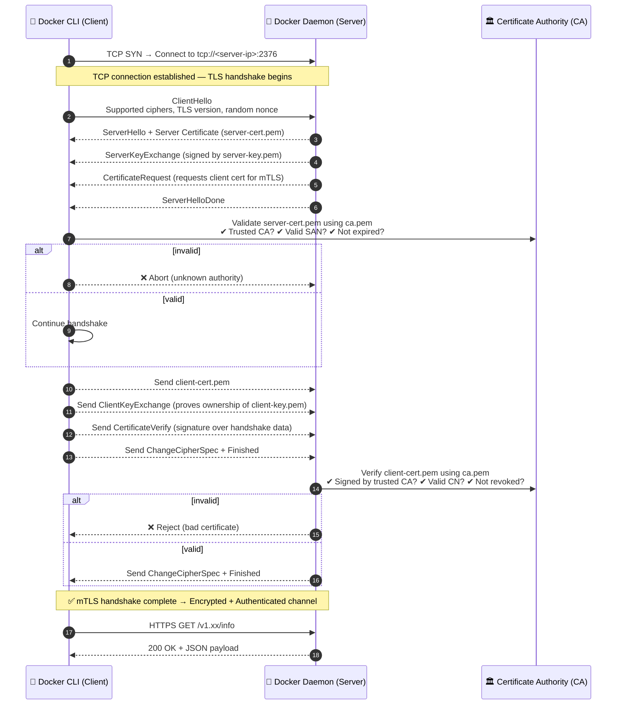
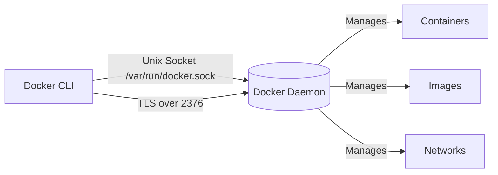

# 🛡️ Docker Daemon Security – The Core of Docker Protection

## 📖 What Is the Docker Daemon?

The **Docker Daemon (`dockerd`)** is the **brain** of Docker — it manages:

- Images
- Containers
- Networks
- Volumes

It listens for Docker API requests and performs actions on the host.

### 🔥 Why it’s risky

The daemon runs as **root**.
So anyone who can talk to it — through the **Docker CLI**, **REST API**, or **Unix socket** — can effectively become root on the host.

```bash
# The default socket location
/var/run/docker.sock
```

If you give a container or user access to that socket → you gave them **root on your host**.

---

## 🕵️‍♂️ **Docker Daemon Communication Channels**

Docker Daemon listens on two possible interfaces:

| Interface                                | Description                                      | Default                |
| ---------------------------------------- | ------------------------------------------------ | ---------------------- |
| **Unix Socket** (`/var/run/docker.sock`) | Local communication                              | ✅ Enabled by default  |
| **TCP Socket** (`tcp://HOST:PORT`)       | Remote access (used for remote management or CI) | ❌ Disabled by default |

You can check what the daemon is listening on:

```bash
ps aux | grep dockerd
```

Example:

```ini
dockerd --host=fd:// --host=tcp://0.0.0.0:2376
```

> 🧨 If you ever see `tcp://0.0.0.0:2375` with no TLS, it means the Docker API is exposed **unauthenticated** — total root compromise risk.

---

## 📁 **Default Daemon Location and Config Files**

| File                                                 | Purpose                         |
| ---------------------------------------------------- | ------------------------------- |
| `/usr/bin/dockerd`                                   | Daemon executable               |
| `/etc/docker/daemon.json`                            | Main daemon configuration       |
| `/var/run/docker.sock`                               | Unix socket (client <-> daemon) |
| `/etc/systemd/system/docker.service.d/override.conf` | Systemd service overrides       |
| `/etc/docker/key.json`                               | Daemon identity key             |
| `/etc/docker/certs.d/`                               | Directory for TLS certs         |

---

## 🛡️ **Secure Access to the Docker Daemon**

## 📍 1. **Use the Unix Socket (Local-Only Access)**

By default, the daemon only listens on:

```ini
unix:///var/run/docker.sock
```

That’s good — it means **only local users with permission** to that socket can control Docker.

Check permissions:

```bash
ls -l /var/run/docker.sock
```

Output:

```ini
srw-rw---- 1 root docker 0 Oct 14 09:10 /var/run/docker.sock
```

Only `root` and users in the **docker** group can access it.

### ⚠️ Danger:

Adding a user to the `docker` group gives them **root privileges** indirectly.

```bash
sudo usermod -aG docker <username>
```

🧠 So don’t add random users or CI agents here. Instead, use:

- `sudo docker <cmd>`
- Or **rootless Docker** (explained below)

---

## 📍 2. **Use Rootless Docker (Best for Developers)**

Rootless Docker runs the daemon as a **non-root user**.
It removes the biggest risk — daemon running as root.

```bash
curl -fsSL https://get.docker.com/rootless | sh
```

Then follow the setup instructions, e.g.:

```bash
export PATH=$HOME/bin:$PATH
systemctl --user enable --now docker
```

Check:

```bash
docker context ls
```

You’ll see:

```ini
rootless
```

🧠 Benefits:

- No root privileges required
- No access to `/var/run/docker.sock`
- Completely isolated from system daemon

📉 Limitations:

- No low-number ports (<1024)
- Some advanced networking modes (macvlan, host) may not work

---

## 📍 3. **Use `userns-remap` for Privilege Isolation**

This feature **maps the container’s root user** to a **non-root user** on the host.

In `/etc/docker/daemon.json`:

```json
{
  "userns-remap": "default"
}
```

Create subordinate ID mappings:

```bash
echo "dockremap:165536:65536" | sudo tee -a /etc/subuid /etc/subgid
sudo systemctl restart docker
```

✅ Now, even if a container breaks out, it runs as UID 165536 on the host — not real root.

---

## 📍 4. **Protect Remote Access (TCP Socket) with TLS (Updated Deep Version)**

When you expose the Docker Daemon over TCP (for remote management), you must protect it using **mutual TLS authentication**.
This ensures:

- 🔑 Only clients with valid certificates can connect.
- 🔒 All traffic between Docker CLI and Daemon is encrypted.
- 🧾 Both sides verify each other’s identity.

---

### ⚙️ Key Files Involved

| File              | Side   | Purpose                                          |
| ----------------- | ------ | ------------------------------------------------ |
| `ca.pem`          | Both   | Root CA that signed both client and server certs |
| `server-cert.pem` | Server | Public certificate for dockerd                   |
| `server-key.pem`  | Server | Private key for dockerd                          |
| `client-cert.pem` | Client | Public certificate for Docker CLI                |
| `client-key.pem`  | Client | Private key for Docker CLI                       |

---

### 🔹 Step 1 — Create a Certificate Authority (CA)

First, generate your **own CA**.
This CA will be used to sign both **server** and **client** certificates.

```bash
mkdir -p ~/docker-certs
cd ~/docker-certs

# Generate CA private key
openssl genrsa -out ca-key.pem 4096

# Generate CA certificate
openssl req -new -x509 -days 365 -key ca-key.pem -sha256 -subj "/CN=docker-CA" -out ca.pem
```

✅ Files created:

- `ca-key.pem` — private key (keep it secret)
- `ca.pem` — public certificate (shared with server and clients)

---

### 🔹 Step 2 — Create and Sign the **Server Certificate**

This certificate is used by the **Docker Daemon** (`dockerd`) itself.

```bash
# Generate server private key
openssl genrsa -out server-key.pem 4096

# Create a certificate signing request (CSR)
openssl req -subj "/CN=<server-hostname>" -new -key server-key.pem -out server.csr

# Sign the server certificate using the CA
openssl x509 -req -days 365 -sha256 \
    -in server.csr -CA ca.pem -CAkey ca-key.pem -CAcreateserial \
    -out server-cert.pem \
    -extfile <(echo subjectAltName = DNS:<server-hostname>,IP:<server-ip>)
```

✅ Files created:

- `server-key.pem`
- `server-cert.pem`

📍Move these to the daemon host:

```bash
sudo mkdir -p /etc/docker/pki
sudo mv ca.pem server-cert.pem server-key.pem /etc/docker/pki/
```

---

### 🔹 Step 5 — Configure the Docker Daemon for TLS

Edit `/etc/docker/daemon.json`:

```json
{
  "hosts": ["fd://", "tcp://0.0.0.0:2376"],
  "tlsverify": true,
  "tlscacert": "/etc/docker/pki/ca.pem",
  "tlscert": "/etc/docker/pki/server-cert.pem",
  "tlskey": "/etc/docker/pki/server-key.pem"
}
```

Then reload and restart Docker:

```bash
sudo systemctl daemon-reload
sudo systemctl restart docker
```

You can verify:

```bash
sudo netstat -tulpn | grep dockerd
```

✅ Should show:

```ini
tcp6  0  0 :::2376  :::*  LISTEN  /usr/bin/dockerd
```

---

### 🔹 Step 4 — Create and Sign the **Client Certificate**

This is what every **authorized client** (CLI, Jenkins, etc.) will use to authenticate.

```bash
# Generate client private key
openssl genrsa -out client-key.pem 4096

# Create CSR for the client
openssl req -subj "/CN=docker-client" -new -key client-key.pem -out client.csr

# Add extended key usage for client authentication
echo extendedKeyUsage = clientAuth > extfile-client.cnf

# Sign client certificate using the same CA
openssl x509 -req -days 365 -sha256 \
    -in client.csr -CA ca.pem -CAkey ca-key.pem -CAcreateserial \
    -out client-cert.pem -extfile extfile-client.cnf
```

✅ Files created:

- `client-key.pem`
- `client-cert.pem`

Move these to each authorized client (e.g. your laptop):

```ini
~/.docker/
  ├── ca.pem
  ├── client-cert.pem
  └── client-key.pem
```

---

### 🔹 Step 5 — Connect from the Client (Securely)

From your workstation or CI agent, run:

```bash
docker --tlsverify \
  --tlscacert=~/.docker/ca.pem \
  --tlscert=~/.docker/client-cert.pem \
  --tlskey=~/.docker/client-key.pem \
  -H tcp://<server-ip>:2376 info
```

If everything is configured properly:  
✅ You’ll see `Server Version`, `Storage Driver`, and other info.  
❌ If you misconfigure, you’ll see “certificate signed by unknown authority” or “bad certificate”.

---

### 🖼️ The TLS Handshake: Step-by-Step Flow

<div align="center" style="background-color:#071D28; border-radius: 10px; border: 2px solid">



</div>

---

### 🧩 What Each Side Verifies

| Verification           | Done By | Using                                             | Checks                                                     |
| ---------------------- | ------- | ------------------------------------------------- | ---------------------------------------------------------- |
| **Server Identity**    | Client  | `server-cert.pem` signed by `ca.pem`              | Validity, hostname (SAN), trusted CA                       |
| **Client Identity**    | Server  | `client-cert.pem` signed by `ca.pem`              | Validity, CN, trusted CA                                   |
| **Proof of Ownership** | Both    | Private keys (`server-key.pem`, `client-key.pem`) | Demonstrated via cryptographic signatures                  |
| **Session Security**   | Both    | TLS symmetric key                                 | Generated during handshake; ensures encryption & integrity |

---

### 🧠 Key Takeaways

✅ **Both sides verify each other:**

- This is **mutual TLS (mTLS)** — not just HTTPS-style one-way trust.
- The client refuses to talk unless it trusts the daemon’s certificate.
- The daemon refuses to talk unless the client’s cert is signed by its trusted CA.

✅ **No passwords or tokens are exchanged.**

- Trust is purely certificate-based, verified by the CA chain.

✅ **Everything after handshake is encrypted.**

- The Docker API traffic (`GET /info`, `GET /containers/json`, etc.) travels over an HTTPS channel secured by the negotiated symmetric key.

✅ **Revocation/rotation:**

- If you regenerate the CA or revoke a client cert, that client can no longer connect — this is how you control who can access your Docker daemon.

---

## 📝 **Example**: Hardened Daemon Configuration

Here’s a secure `/etc/docker/daemon.json` you can safely use in production:

```json
{
  "icc": false, // prevent inter-container communication on default bridge
  "userns-remap": "default", // isolate container users
  "tlsverify": true, // if TCP enabled
  "tlscacert": "/etc/docker/pki/ca.pem",
  "tlscert": "/etc/docker/pki/server-cert.pem",
  "tlskey": "/etc/docker/pki/server-key.pem",
  "log-driver": "local", // prevent log overflow
  "log-opts": { "max-size": "10m", "max-file": "3" },
  "live-restore": true, // containers keep running if daemon restarts
  "no-new-privileges": true // apply to supported containers
}
```

---

## ✅ **Verifying Daemon Security**

| Check                 | Command                              |     |
| --------------------- | ------------------------------------ | --- |
| TLS enabled           | `sudo netstat -tulpn | grep dockerd` |
| User namespace active | `docker info | grep -i userns`       |
| Rootless mode active  | `docker info | grep -i rootless`     |
| Socket permissions    | `ls -l /var/run/docker.sock`         |     |

---

## 🔴 **Common Security Pitfalls**

| ❌ Bad Practice                               | ✅ Secure Alternative                        |
| --------------------------------------------- | -------------------------------------------- |
| Exposing port 2375 without TLS                | Use port 2376 with TLS mutual auth           |
| Adding many users to `docker` group           | Keep minimal, or use rootless                |
| Mounting `/var/run/docker.sock` in containers | Never do this; use a scoped API proxy        |
| Running daemon as root                        | Use rootless Docker or userns-remap          |
| Forgetting log rotation                       | Add `"log-driver": "local"` and `"max-size"` |

---

## 🧭 8. Quick Diagram

<div align="center" style="background-color:#071D28; border-radius: 10px; border: 2px solid">



</div>

---

## 🔚 **Summary**

| Feature                  | Purpose                  | Best For                                   |
| ------------------------ | ------------------------ | ------------------------------------------ |
| **Unix Socket**          | Local CLI access         | Developers                                 |
| **TLS + TCP**            | Secure remote management | CI/CD or remote control                    |
| **Rootless Mode**        | No root privileges       | Dev/test or secure multi-user environments |
| **User Namespace Remap** | UID isolation            | Production hardened setups                 |
| **`daemon.json`**        | Central config           | Security + performance                     |
