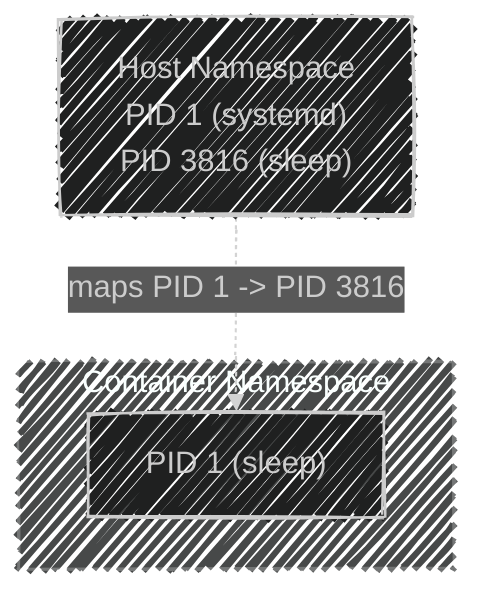
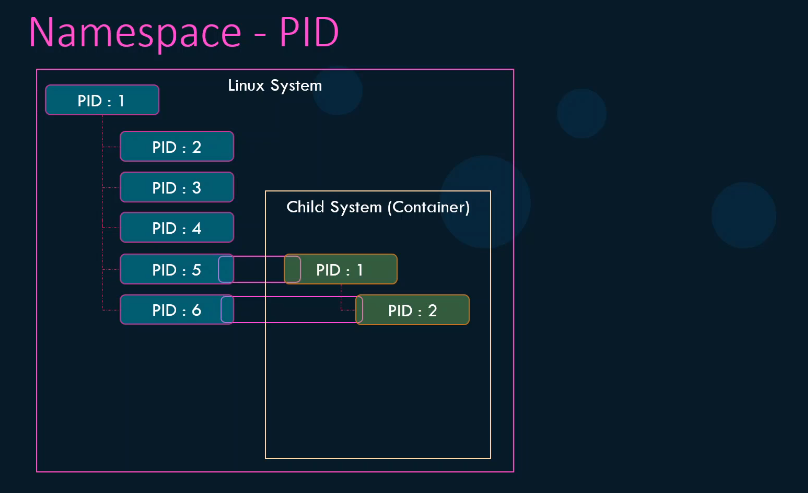
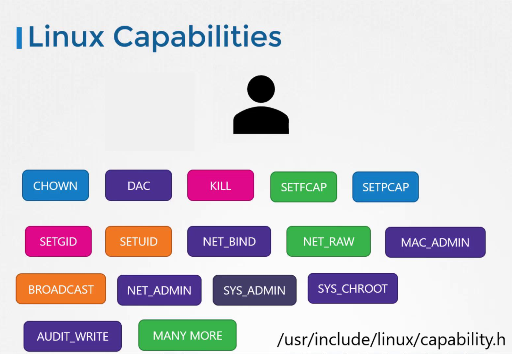
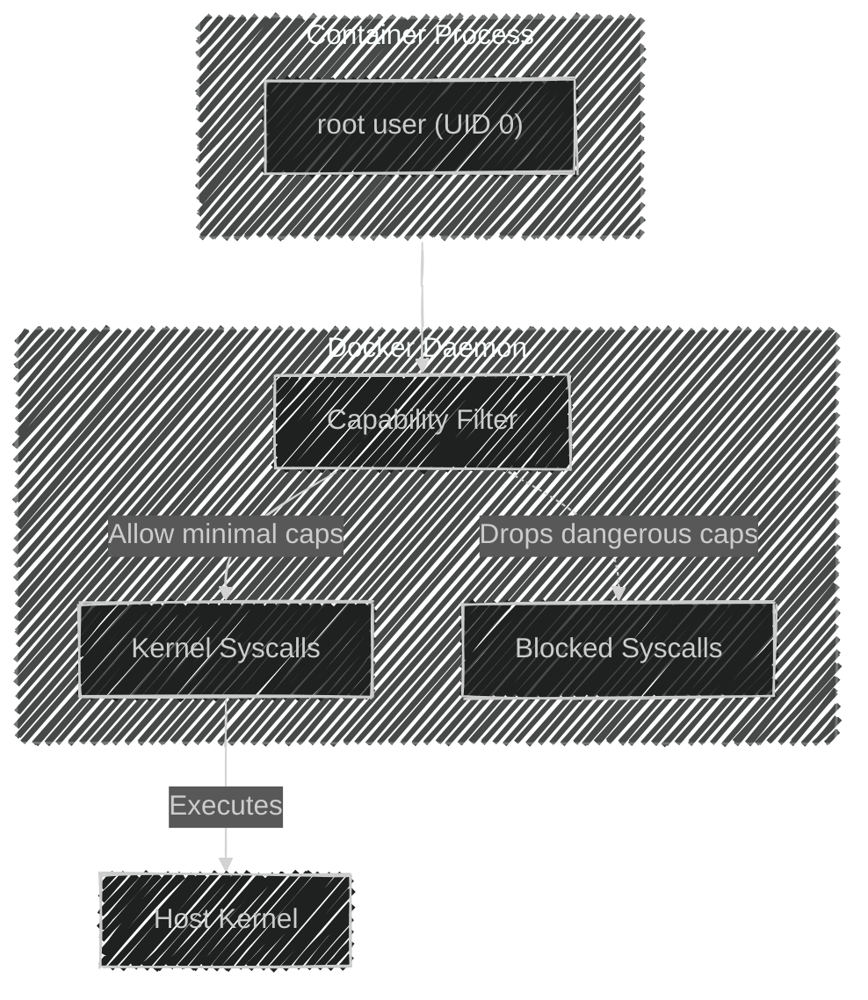
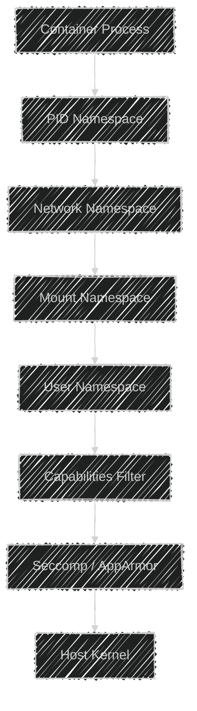

# 🛡️ Docker Security — Namespaces & Capabilities

> 🔐 _How Docker builds isolation using Linux kernel features — explained clearly, visually, and practically._

---

## ⁉️ **Why We Even Need Isolation**

When you run `docker run ubuntu`, it **feels** like you’ve got a full Linux system — with its own `ps`, `/bin/bash`, network, and processes.

But… surprise! 😲  
That container is actually sharing the **same Linux kernel** with your host.  
So, Docker had to invent a way to **trick each process** into believing it’s alone in the world.

Enter **Namespaces** (what you can _see_) and **Capabilities** (what you can _do_).  
Together, they make up the “sandbox walls” of a container.

---

## ⚙️ **Linux Namespaces** — "You Live in Your Own Universe"

When Linux boots, it creates the first process:

```ini
PID 1 → systemd (init)
```

Every other process (nginx, bash, etc.) is a child of that first process.
So all PIDs must be globally unique.

Docker containers can’t use those same PIDs, so Linux introduces **namespaces**,
which are **isolated copies** of global resources — like PIDs, networks, mounts, and more.

---

### 🧠 Think of a Namespace Like a “Private Lens”

Every container looks through its own “lens” and sees only its resources,
even though everything runs on the same kernel.

---

### 🧩 Types of Namespaces Docker Uses

| Namespace | What It Isolates          | Linux Flag      | Real Example                         |
| --------- | ------------------------- | --------------- | ------------------------------------ |
| `pid`     | Process IDs               | `CLONE_NEWPID`  | Each container has its own PID 1     |
| `net`     | Network interfaces        | `CLONE_NEWNET`  | Separate `eth0`, IP, routes          |
| `mnt`     | Mount points              | `CLONE_NEWNS`   | Container has its own `/` filesystem |
| `ipc`     | Shared memory, semaphores | `CLONE_NEWIPC`  | Apps can’t talk via host IPC         |
| `uts`     | Hostname & domain         | `CLONE_NEWUTS`  | Container hostname ≠ host hostname   |
| `user`    | UID/GID mapping           | `CLONE_NEWUSER` | Root inside ≠ root outside           |

---

<div align="center" style="background-color:#071A28; border-radius: 10px; border: 2px solid">
  
</div>

---

### 🧩 How PID Namespace Works

#### 🔸 When you run:

```bash
docker run -d --name pid-test ubuntu sleep 3600
```

Docker creates:

- A new **PID namespace**
- A process `sleep 3600` inside it

Inside container:

```bash
docker exec -it pid-test ps -ef
```

Output:

```ini
UID  PID  CMD
root   1  sleep 3600
```

On host:

```bash
ps aux | grep sleep
```

Output:

```ini
root  3816  sleep 3600
```

> So inside, it’s PID 1.
> On host, it’s PID 3816.
> Linux maps the container’s PID 1 → host PID 3816.

---

### 🔍 Visualizing PID Namespaces

<div align="center" style="background-color:#071A28; border-radius: 10px; border: 2px solid">



</div>

---

<div align="center" style="background-color:#071A28; border-radius: 10px; border: 2px solid">
  
</div>

---

> 📒 Note:
>
> - Each container gets its **own PID tree** starting from 1.
> - The host can see all processes, but containers can only see theirs.

---

## 🌐 **1. Network Namespace** — “Your Own Ethernet Card”

Every container gets a **separate network stack**:

- Its own `eth0`
- Its own IP (usually in Docker bridge network)
- Its own routing table and firewall rules

Behind the scenes, Docker uses **veth pairs**:

- One end inside the container → `eth0`
- One end on the host → `vethXXXX`
- Connected through a bridge → `docker0`

You can inspect it:

```bash
ip link show
```

---

## 📂 **2. Mount Namespace** — “Your Own Filesystem Tree”

Each container sees its own `/` (root directory).  
Underneath, Docker actually mounts it from:

```ini
/var/lib/docker/overlay2/<layer_id>/merged
```

So container `/bin/bash` → `/var/lib/docker/overlay2/.../merged/bin/bash` on the host.

That’s why deleting `/` inside container doesn’t wipe your host 😅

---

## 🧍 **3. User Namespace** — “Root, But Not Really”

Without user namespaces, the container’s root (UID 0) = host root 😨.  
That’s why user namespaces exist — to map container users to **different host UIDs**.

Example mapping:

| Inside Container | Host UID |
| ---------------- | -------- |
| root (0)         | 100000   |
| user (1000)      | 101000   |

> So even if the container is “root”, the host sees it as UID 100000 — unprivileged!

---

### 🧩 Run as a Non-root User

```bash
docker run --user 1000 ubuntu id
```

Output:

```ini
uid=1000 gid=1000 groups=1000
```

Or set it permanently in Dockerfile:

```dockerfile
FROM ubuntu
USER 1000
```

---

## 💪🏻 **Linux Capabilities** — “Superpowers with Boundaries”

Historically, `root` = **all powerful**.
But Linux divided root’s powers into **capabilities** — small permission sets like Lego blocks 🧱.

---

### 🧩 Common Linux Capabilities

| Capability             | Description                     | Example                                 |
| ---------------------- | ------------------------------- | --------------------------------------- |
| `CAP_CHOWN`            | Change file ownership           | `chown file.txt`                        |
| `CAP_NET_BIND_SERVICE` | Bind ports <1024                | Run web servers                         |
| `CAP_SYS_ADMIN`        | Perform system admin ops        | Mount filesystems, modify kernel params |
| `CAP_NET_ADMIN`        | Change network config           | `iptables`, `ifconfig`                  |
| `CAP_SYS_TIME`         | Change system clock             | Set date/time                           |
| `CAP_KILL`             | Send signals to other processes | `kill -9`                               |

---

<div align="center" style="background-color:#EFEFEF; border-radius: 10px; border: 2px solid">
  
</div>

---

### 🧩 Docker’s Default Capability Set

Docker automatically:

- **Drops dangerous ones** (e.g., `CAP_SYS_ADMIN`, `CAP_SYS_MODULE`)
- **Keeps minimal safe ones** (e.g., `CHOWN`, `SETUID`, `SETGID`, `NET_BIND_SERVICE`)

So containers can run servers, manage files, and change ownership,
but can’t reboot the host or reconfigure the kernel.

---

### ⚙️ Control Capabilities at Runtime

| Option                | What It Does             | Example                                 |
| --------------------- | ------------------------ | --------------------------------------- |
| `--cap-add=NET_ADMIN` | Add a capability         | `docker run --cap-add=NET_ADMIN ubuntu` |
| `--cap-drop=CHOWN`    | Remove a capability      | `docker run --cap-drop=CHOWN ubuntu`    |
| `--privileged`        | Add **all** capabilities | `docker run --privileged ubuntu`        |

> 🚨 Warning: `--privileged` = full host access (breaks all isolation).
> Use it **only** in controlled lab environments.

---

### 🧩 Diagram: Capability Filtering Flow

<div align="center">



</div>

When you run a process as root in Docker:

- The **Docker daemon** mediates which capabilities are passed to the kernel.
- The **kernel** executes only permitted syscalls.

---

## 🚨 **Checking Capabilities Inside a Container**

You can use:

```bash
apt install libcap2-bin -y
capsh --print
```

Output:

```ini
Current: = cap_chown,cap_setgid,cap_setuid,cap_net_bind_service,cap_dac_override+i
```

That’s your active “superpower list.” ✨

---

## ⚖️ **Real-Life Examples**

### ✅ Add minimal capabilities

Allow a container to open privileged ports (<1024) but nothing else:

```bash
docker run --cap-drop=ALL --cap-add=NET_BIND_SERVICE nginx
```

### 🚫 Drop all capabilities (safe sandbox)

```bash
docker run --cap-drop=ALL alpine
```

### 💣 Full host control (dangerous)

```bash
docker run --privileged ubuntu
```

---

## 🧬 **Namespaces + Capabilities**

Docker layers both features:

| Layer                  | Role                   | Example                    |
| ---------------------- | ---------------------- | -------------------------- |
| **Namespaces**         | Isolation (visibility) | PID, Network, Mount        |
| **User Namespace**     | Privilege boundary     | Root inside ≠ Root outside |
| **Capabilities**       | Power control          | Drop dangerous privileges  |
| **Seccomp / AppArmor** | Syscall filtering      | Block kernel-level actions |

They work together like Russian dolls 🪆 —
each layer adds another boundary around the process.

---

## 🖼️ **Diagram:** Full Container Isolation Model

<div align="center">



</div>

Each layer ensures:

- You only **see** what’s inside your namespace
- You only **do** what your capabilities allow
- You only **call** safe syscalls the kernel permits

---

## ✅ **Best Practices** for DevOps / SREs

| Category                         | Recommendation                              | Command / Config                            |
| -------------------------------- | ------------------------------------------- | ------------------------------------------- |
| 🔒 Run as non-root               | Avoid UID 0 in containers                   | `--user 1000` or `USER 1000`                |
| 🧱 Drop all unneeded caps        | Keep only what you need                     | `--cap-drop=ALL --cap-add=NET_BIND_SERVICE` |
| 🚫 Avoid privileged mode         | Never use `--privileged`                    | Use per-capability addition                 |
| 🧍 Enable user namespaces        | Map container root → unprivileged host user | `/etc/docker/daemon.json`                   |
| 🔐 Add `no-new-privileges`       | Prevent escalation inside container         | `--security-opt no-new-privileges`          |
| 🔍 Audit with `capsh`            | Check capabilities                          | `capsh --print`                             |
| 🧰 Combine with AppArmor/Seccomp | Final syscall filter                        | `/etc/docker/default.json`                  |

---

## 📝 **Example:** Hardened NGINX Run Command

```bash
docker run \
  --read-only \
  --user 1000 \
  --cap-drop=ALL \
  --cap-add=NET_BIND_SERVICE \
  --security-opt no-new-privileges \
  --security-opt seccomp=default.json \
  nginx
```

This runs NGINX as:

- Non-root user
- Minimal capabilities
- No filesystem writes
- Kernel syscall filtering enabled

✅ That’s how real SREs run production containers securely.

---

## 🏁 **Summary**

| Concept              | Analogy                | Key Purpose                    |
| -------------------- | ---------------------- | ------------------------------ |
| **Namespaces**       | Your own private room  | Isolate what containers _see_  |
| **User Namespace**   | Fake identity          | Prevent real host root access  |
| **Capabilities**     | Small Lego permissions | Limit what containers _can do_ |
| **Seccomp/AppArmor** | Kernel firewall        | Block dangerous syscalls       |
| **Privileged Mode**  | God mode               | Never use in production 🚫     |
